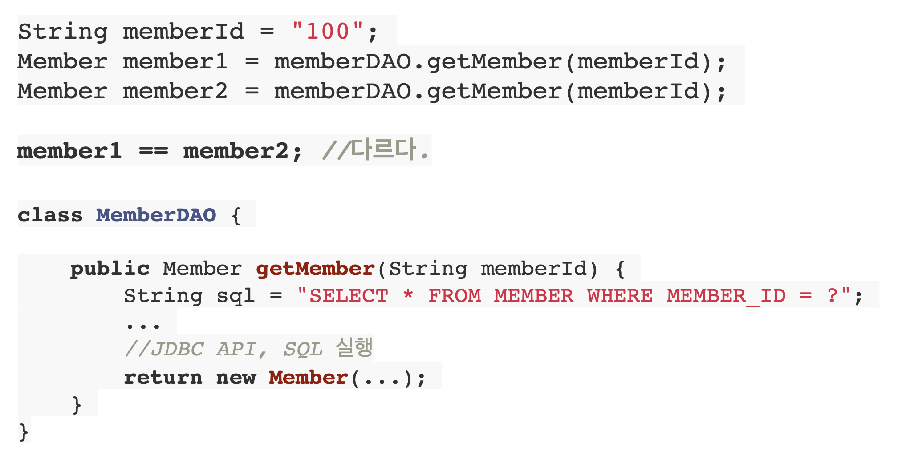
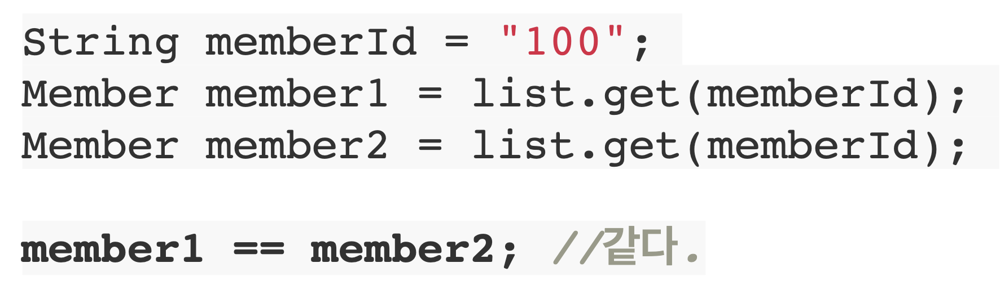

# 01. SQL 중심적인 개발의 문제점

지금 시대는 객체를 관계형 DB에 관리하는 시대이다.

## 무한 반복, 지루한 코드

SQL 중심적인 개발을 하다보면 CRUD를 무한 반복하고 지루한 코드의 연속이다.


## 패러다임의 불일치

또한 패러다임의 불일치가 발생한다. 

객체 VS 관계형 데이터베이스

객체를 관계형 데이터베이스에 저장하기 위해 SQL로 변환하는 작업 필요하다. 따라서 개발자는 SQL 매퍼가 되고 만다.

객체와 관계형 데이터베이스의 차이

1. 상속
2. 연관관계
3. 데이터 타입
4. 데이터 식별 방법


### 상속


Album을 저장하기 위해서 ITEM과 ALBUM에 각각 삽입을 해야한다. 조회도 마찬가지로 복잡하다.

하지만 이를 자바 컬렉션에서 조회한다고 하면 훨씬 쉬워진다.

``` java
Album album = list.get(albumId);
Item item = list.get(albumId);
```


### 연관관계

객체는 참조를 사용 : member.getTeam()

테이블은 외래 키를 사용 : JOIN ON M.TEAM_ID = T.TEAM_ID


## 처음 실행하는 SQL에 따라 탐색 범위 결정


## 엔티티 신뢰 문제


## 비교하기

### DB에서 조회




### 자바 컬렉션에서 조회




## 결론

객체답게 모델링 할수록 매핑 작업만 늘어난다.

객체를 자바 컬렉션에 저장 하듯이 DB에 저장할 수는 없을까?

그래서 나온게 JPA다. 

Java Persistence API


# JPA 소개

## JPA

* Java Persistence API
* 자바 진영의 ORM 기술 표준


## ORM

* Object-relational mapping(객체 관계 매핑)
* 객체는 객체대로 설계
* 관계형 데이터베이스는 관계형 데이터베이스대로 설계 - ORM 프레임워크가 중간에서 매핑
* 대중적인 언어에는 대부분 ORM 기술이 존재


## JPA는 애플리케이션과 JDBC 사이에서 동작


## JPA 소개

* EJB - 엔티티 빈 (자바 표준)
* 하이버네이트 
    * 오픈소스
    * EJB의 사용성이 너무 안좋아 탄생
* JPA
    * java 진영에서 하이버네이트를 토대로 자바 표준을 재 정립


## JPA는 표준 명세

* JPA는 인터페이스의 모음


## JPA 버전

* JPA 1.0(JSR 220) 2006년 : 초기 버전. 복합 키와 연관관계 기능이 부족
* JPA 2.0(JSR 317) 2009년 : 대부분의 ORM 기능을 포함, JPA Criteria 추가
* JPA 2.1(JSR 338) 2013년 : 스토어드 프로시저 접근, 컨버터(Converter), 엔티 티 그래프 기능이 추가


## JPA를 왜 사용해야 하는가

* SQL 중심적인 개발에서 객체 중심으로 개발 
* 생산성
* 유지보수
* 패러다임의 불일치 해결
* 성능
* 데이터 접근 추상화와 벤더 독립성
* 표준


### 생산성

* 저장: **jpa.persist**(member)
* 조회: Member member = **jpa.find**(memberId) 
* 수정: **member.setName**(“변경할 이름”)
* 삭제: **jpa.remove**(member)


### 유지보수

기존에는 새로운 필드가 추가되면 모든 쿼리를 수정해야 했지만 JPA를 사용하면 JPA가 알아서 필드를 추가


### JPA와 패러다임의 불일치 해결

* JPA와 상속
* JPA와 연관관계
* JPA와 객체 그래프 탐색
* JPA와 비교하기


#### JPA와 상속


JPA를 통해 `jpa.persist(album)` 을 하면 JPA가 알아서 ITEM, ALBUM에 대한 두 개의 insert문을 만들어준다. 조회도 이와 마찬가지로 동작한다.


#### JPA와 연관관계, 객체 그래프 탐색


#### JPA와 비교하기

동일한 트랜잭션에서 조회한 엔티티는 같음을 보장

``` java
String memberId = "100";
Member member1 = jpa.find(Member.class, memberId);
Member member2 = jpa.find(Member.class, memberId);
member1 == member2; //같다.
```


### 성능

* 1차 캐시와 동일성 보장
* 트랜잭션을 지원하는 쓰기 지연
* 지연 로딩


#### 1차 캐시와 동일성 보장

* 같은 트랜잭션 안에서는 같은 엔티티를 반환 - 약간의 조회 성능 향상
* DB Isolation Level이 Read Commit이어도 애플리케이션에서 Repeatable Read 보장

``` java
String memberId = "100";
Member m1 = jpa.find(Member.class, memberId); //SQL
Member m2 = jpa.find(Member.class, memberId); //캐시
println(m1 == m2) //true
```


#### 트랜잭션을 지원하는 쓰기 지연 - INSERT

* 트랜잭션을 커밋할 때까지 INSERT SQL을 모음

* JDBC BATCH SQL 기능을 사용해서 한번에 SQL 전송

```java
transaction.begin(); // [트랜잭션] 시작
 
em.persist(memberA);
em.persist(memberB);
em.persist(memberC);
//여기까지 INSERT SQL을 데이터베이스에 보내지 않는다.

//커밋하는 순간 데이터베이스에 INSERT SQL을 모아서 보낸다.
transaction.commit(); // [트랜잭션] 커밋
```


#### 트랜잭션을 지원하는 쓰기 지연 - UPDATE

* UPDATE, DELETE로 인한 로우(ROW)락 시간 최소화

* 트랜잭션 커밋 시 UPDATE, DELETE SQL 실행하고, 바로 커밋

```java
transaction.begin(); // [트랜잭션] 시작
 
changeMember(memberA);
deleteMember(memberB);
비즈니스_로직_수행(); //비즈니스 로직 수행 동안 DB 로우 락이 걸리지 않는다.

//커밋하는 순간 데이터베이스에 UPDATE, DELETE SQL을 보낸다.
transaction.commit(); // [트랜잭션] 커밋
```


#### 지연 로딩

* 지연로딩:객체가실제사용될때로딩
* 즉시 로딩: JOIN SQL로 한번에 연관된 객체까지 미리 조회

``` java
// 지연 로딩
Member member = memberDAO.find(memberId);
Team team = member.getTeam();
String teamName = team.getName();
SELECT * FROM MEMBER
SELECT * FROM TEAM

// 즉시 로딩
Member member = memberDAO.find(memberId);
Team team = member.getTeam();
String teamName = team.getName();
SELECT M.*, T.*
FROM MEMBER
```

