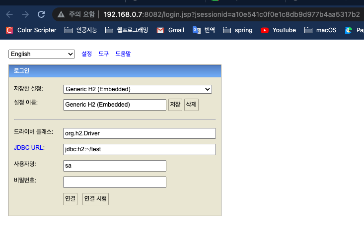
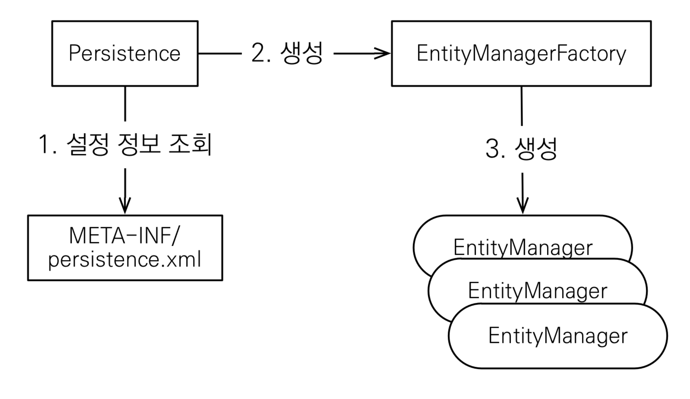

# 01. Hello JPA - 프로젝트 생성

## H2 DB

### 설치

http://www.h2database.com/

h2/bin/h2.sh 실행



## 메이븐

* 자바 라이브러리, 빌드 관리
* 라이브러리 자동 다운로드 및 의존성 관리
* 최근에는 gradle을 많이 사용하나 여기서는 maven을 사용

## 프로젝트 생성

* **자바 8 이상(8 권장)**

* **메이븐 설정**
    * groupId**: jpa-basic **
    * artifactId**: ex1-hello-jpa **
    * version: 1.0.0


* 라이브러리 추가 - pom.xml

    ```xml
    <?xml version="1.0" encoding="UTF-8"?>
    <project xmlns="http://maven.apache.org/POM/4.0.0" xmlns:xsi="http://www.w3.org/2001/XMLSchema-instance"
             xsi:schemaLocation="http://maven.apache.org/POM/4.0.0 https://maven.apache.org/xsd/maven-4.0.0.xsd">
      <modelVersion>4.0.0</modelVersion>
      <parent>
        <groupId>org.springframework.boot</groupId>
        <artifactId>spring-boot-starter-parent</artifactId>
        <version>2.6.7</version>
        <relativePath /> <!-- lookup parent from repository -->
      </parent>
      <groupId>jpa-basic</groupId>
      <artifactId>ex1-hello-jpa</artifactId>
      <version>0.0.1-SNAPSHOT</version>
      <name>ex1-hello-jpa</name>
      <description>ex1-hello-jpa</description>
      <properties>
        <java.version>11</java.version>
      </properties>
      <dependencies>
        <!-- JPA 하이버네이트 -->
        <dependency>
          <groupId>org.hibernate</groupId>
          <artifactId>hibernate-entitymanager</artifactId>
          <version>5.3.10.Final</version>
        </dependency>
        <!-- H2 데이터베이스 -->
        <dependency>
          <groupId>com.h2database</groupId>
          <artifactId>h2</artifactId>
          <version>2.1.210</version>
        </dependency>
      </dependencies>
    
      <build>
        <plugins>
          <plugin>
            <groupId>org.springframework.boot</groupId>
            <artifactId>spring-boot-maven-plugin</artifactId>
          </plugin>
        </plugins>
      </build>
    
    </project>
    ```

* JPA 설정하기 - persistence.xml
    * JPA 설정 파일
    * /META-INF/persistence.xml 위치
    * persistence-unit name으로 이름 지정
    * javax.persistence로 시작: JPA 표준 속성
    * hibernate로 시작: 하이버네이트 전용 속성

``` xml
<?xml version="1.0" encoding="UTF-8"?>
<persistence version="2.2"
             xmlns="http://xmlns.jcp.org/xml/ns/persistence" xmlns:xsi="http://www.w3.org/2001/XMLSchema-instance"
             xsi:schemaLocation="http://xmlns.jcp.org/xml/ns/persistence http://xmlns.jcp.org/xml/ns/persistence/persistence_2_2.xsd">
  <persistence-unit name="hello">
    <properties>
      <!-- 필수 속성 -->
      <property name="javax.persistence.jdbc.driver" value="org.h2.Driver"/>
      <property name="javax.persistence.jdbc.user" value="sa"/>
      <property name="javax.persistence.jdbc.password" value=""/>
      <property name="javax.persistence.jdbc.url" value="jdbc:h2:tcp://localhost/~/test"/>
      <property name="hibernate.dialect" value="org.hibernate.dialect.H2Dialect"/>
      <!-- 옵션 -->
      <property name="hibernate.show_sql" value="true"/>
      <property name="hibernate.format_sql" value="true"/>
      <property name="hibernate.use_sql_comments" value="true"/>
      <!--<property name="hibernate.hbm2ddl.auto" value="create" />-->
    </properties>
  </persistence-unit>
</persistence>
```

* dialect : DB마다 문법이 조금씩 다르기 때문에 이를 지정해주면 orm에 맞춰 raw sql을 지정한 dialect에 맞게 매핑해준다.

# 02. Hello JPA - 애플리케이션 개발

## JPA 구동 방식



## 객체와 테이블을 생성하고 매핑하기

``` java
package hellojpa;

import javax.persistence.Entity;
import javax.persistence.Id;

@Entity
public class Member {

    @Id
    private Long id;
    private String name;

    public Long getId() {
        return id;
    }

    public void setId(Long id) {
        this.id = id;
    }

    public String getName() {
        return name;
    }

    public void setName(String name) {
        this.name = name;
    }
}
```

* @Entity : JPA가 관리할 객체
* @Id : 데이터베이스 PK와 매핑

```sql
create table Member ( 
    id bigint not null,
    name varchar(255),
    primary key (id)
);
```

### 테스트

``` java
package hellojpa;

import javax.persistence.EntityManager;
import javax.persistence.EntityManagerFactory;
import javax.persistence.EntityTransaction;
import javax.persistence.Persistence;

public class JpaMain {
    public static void main(String[] args) {
        EntityManagerFactory emf = Persistence.createEntityManagerFactory("hello");

        EntityManager em = emf.createEntityManager();

        EntityTransaction tx = em.getTransaction();
        tx.begin();

        Member member = new Member();
        member.setId(1L);
        member.setName("helloA");

        em.persist(member);

        tx.commit();

        em.close();
        emf.close();
    }
}
```

## 주의

* 엔티티 매니저 팩토리는 하나만 생성해서 애플리케이션 전체에서 공유
* 엔티티 매니저는 쓰레드간에 공유 X
* JPA의 모든 데이터 변경은 트랜잭션 안에서 실행

## JPQL

* JPA를 사용하면 엔티티 객체를 중심으로 개발
* 검색을 할 때도 테이블이 아닌 엔티티 객체를 대상으로 검색
* 모든 DB 데이터를 객체로 변환해서 검색하는 것은 불가능
* 애플리케이션이 필요한 데이터만 DB에서 불러오려면 결국 검 색 조건이 포함된 SQL이 필요

* JPA는 SQL을 추상화한 JPQL이라는 객체 지향 쿼리 언어 제공

* SQL과 문법 유사, SELECT, FROM, WHERE, GROUP BY, HAVING, JOIN 지원
* JPQL은 엔티티 객체를 대상으로 쿼리
* SQL은 데이터베이스 테이블을 대상으로 쿼리

``` java
package hellojpa;

import java.util.List;

import javax.persistence.EntityManager;
import javax.persistence.EntityManagerFactory;
import javax.persistence.EntityTransaction;
import javax.persistence.Persistence;

public class JpaMain {
    public static void main(String[] args) {
        EntityManagerFactory emf = Persistence.createEntityManagerFactory("hello");

        EntityManager em = emf.createEntityManager();

        EntityTransaction tx = em.getTransaction();
        tx.begin();

        List<Member> resultList = em.createQuery("select m from Member as m", Member.class)
                                    .getResultList();

        for (Member member : resultList) {
            System.out.println("member.name = " + member.getName());
        }

        tx.commit();

        em.close();
        emf.close();
    }
}
```

