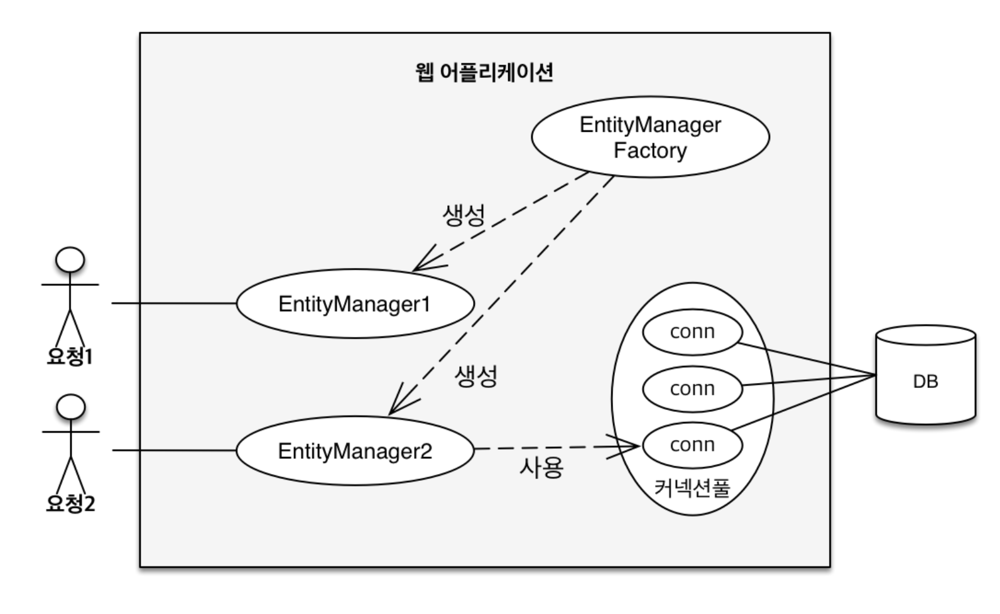
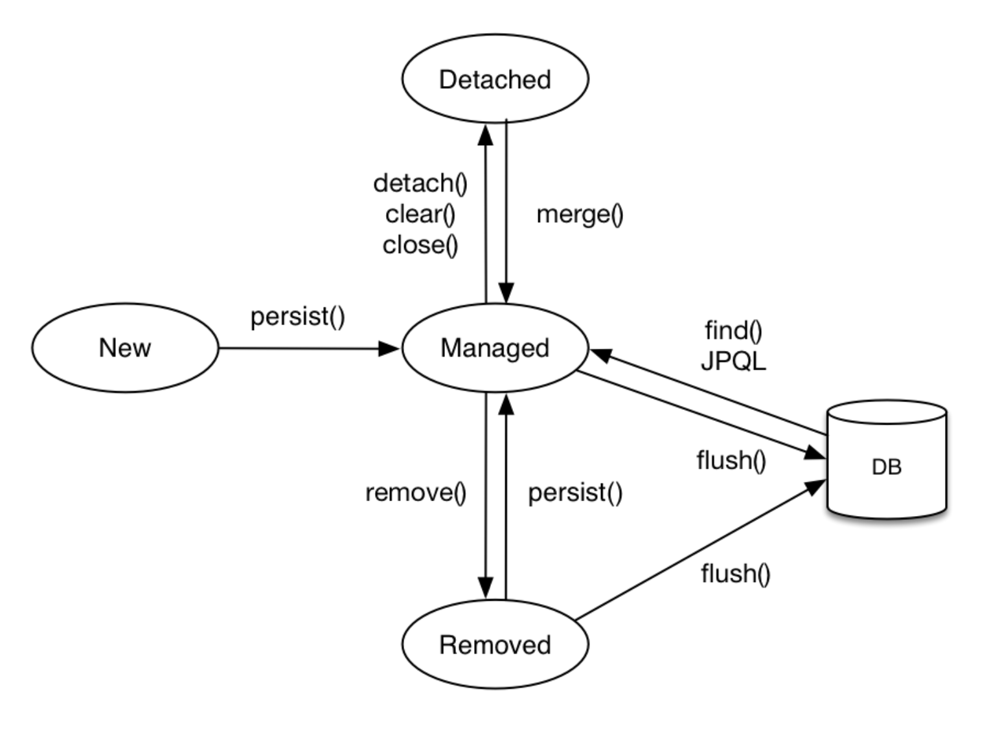
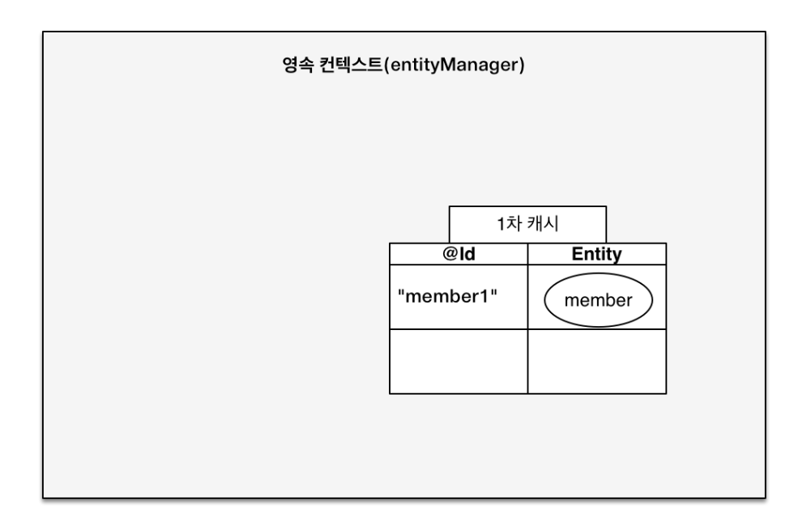
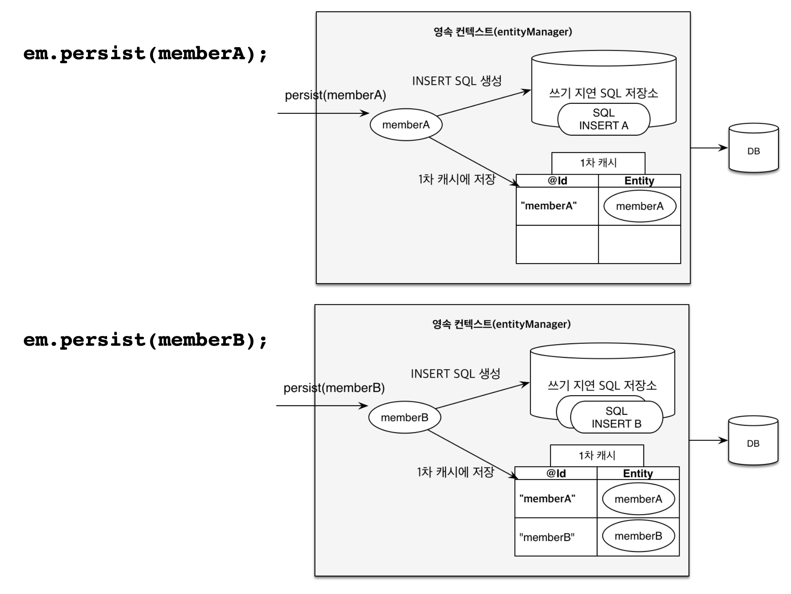
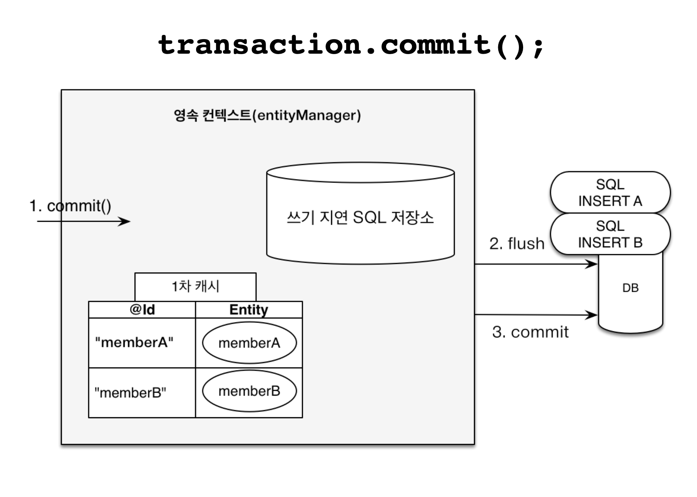
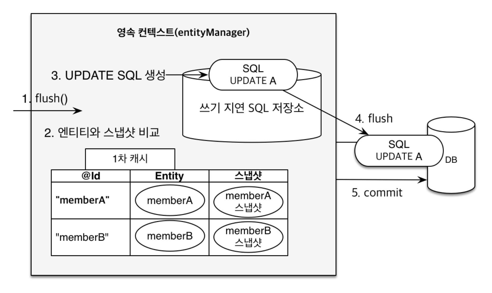

# 01. 영속성 컨텍스트 1

## 엔티티 매니저 팩토리와 엔티티 매니저




## 영속성 컨텍스트

* JPA를 이해하는데 가장 중요한 용어
* 엔티티를 영구 저장하는 환경 이라는 뜻
* 영속성 컨텍스트는 논리적인 개념
* 엔티티 매니저를 통해서 영속성 컨텍스트에 접근


## 엔티티의 생명주기

* **비영속 (new/transient)**
 : 영속성 컨텍스트와 전혀 관계가 없는 **새로운** 상태
* **영속 (managed)**
 : 영속성 컨텍스트에 **관리**되는 상태
* **준영속 (detached)**
 :  영속성 컨텍스트에 저장되었다가 **분리**된 상태
* **삭제 (removed)** 
: **삭제**된 상태



## 영속성 컨텍스트의 이점

* 1차 캐시
* 동일성 보장
* 트랜잭션을 지원하는 쓰기 지연
* 변경 감지
* 지연 로딩


# 02. 영속성 컨텍스트 2

## 1차 캐시

영속 컨텍스트 안에 1차 캐시가 존재한다.

조회 시 1차 캐시에 있으면 DB 접근이 일어나지 않고 캐시에 없으면 DB에 접근한다.

하지만 엔티티 매니저는 요청마다 생성되기 때문에 서로 다른 요청 간의 캐시는 의미가 없다.

따라서 다이나믹한 성능 향상은 어렵다.



## 영속 엔티티의 동일성 보장

``` java
Member a = em.find(Member.class, "member1");
Member b = em.find(Member.class, "member1");
System.out.println(a == b); //동일성 비교 true
```

1차 캐시로 반복 가능한 읽기(REPEATABLE READ) 등급의 트랜잭션 격리 수준을 데이터베이스가 아닌 애플리케이션 차원에서 제공


## 트랜잭션을 지원하는 쓰기 지연

``` java
EntityManager em = emf.createEntityManager();
EntityTransaction transaction = em.getTransaction();
//엔티티 매니저는 데이터 변경시 트랜잭션을 시작해야 한다.
transaction.begin(); // [트랜잭션] 시작

em.persist(memberA);
em.persist(memberB);
//여기까지 INSERT SQL을 데이터베이스에 보내지 않는다.

//커밋하는 순간 데이터베이스에 INSERT SQL을 보낸다.
transaction.commit(); // [트랜잭션] 커밋
```





## 변경 감지

``` java
EntityManager em = emf.createEntityManager();
EntityTransaction transaction = em.getTransaction();
transaction.begin(); // [트랜잭션] 시작

// 영속 엔티티 조회
Member memberA = em.find(Member.class, "memberA");

// 영속 엔티티 데이터 수정
memberA.setUsername("hi");
memberA.setAge(10);

//em.update(member) 이런 코드가 있어야 하지 않을까?
transaction.commit(); // [트랜잭션] 커밋
```

내부에 캐시할 때 스냅샷이 존재한다. 스냅샷은 데이터를 처음 읽어오는 순간의 값이고, Entity는 최신화된 데이터이다. 이를 비교하여 다르면 쓰기 지연 SQL 저장소에 update 쿼리를 추가한다.




# 03. 플러시

## 플러시

플러시란 영속성 컨텍스트의 변경 내용을 데이터베이스에 반영하는 것을 말한다.

플러시가 발생하면

* 변경 감지
* 수정된 엔티티를 쓰기 지연 SQL 저장소에 등록
* 쓰기 지연 SQL 저장소의 쿼리를 데이터베이스에 전송


## 영속성 컨테스트를 플러시하는 방법

* em.flush() : 직접 호출
* 트랜잭션 커밋 : 플러시 자동 호출
* JPQL 쿼리 실행 : 플러시 자동 호출


## 플러시 모드 옵션

* FlushModeType.AUTO : 커밋이나 쿼리를 실행할 때 플러시 (기본값)
* FlushModeType.COMMIT : 커밋할 때만 플러시


## 플러시 정리

* 플러시는 영속성 컨텍스트의 변경내용을 데이터베이스에 동기화하는 작업이다.
* 플러시를 한다고 해서 영속성 컨텍스트를 비우지 않는다.
* 트랜잭션이라는 작업 단위가 중요 -> 커밋 직전에만 동기화하면 된다.


# 04. 준영속 상태

## 준영속 상태

* 영속 상태의 엔티티가 영속성 컨텍스트에서 분리
* 영속성 컨텍스트가 제공하는 기능을 사용 못함


## 준영속 상태로 만드는 방법

* em.detach(entity) : 특정 엔티티만 준영속 상태로 전환
* em.clear() : 영속성 컨텍스트를 완전히 초기화
* em.close() : 영속성 컨텍스트를 종료