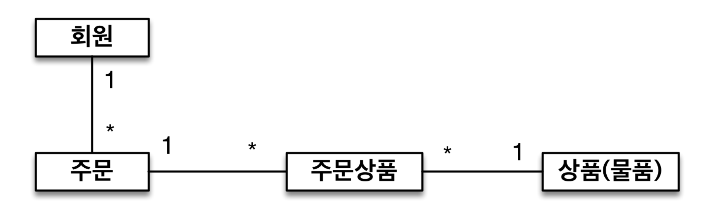
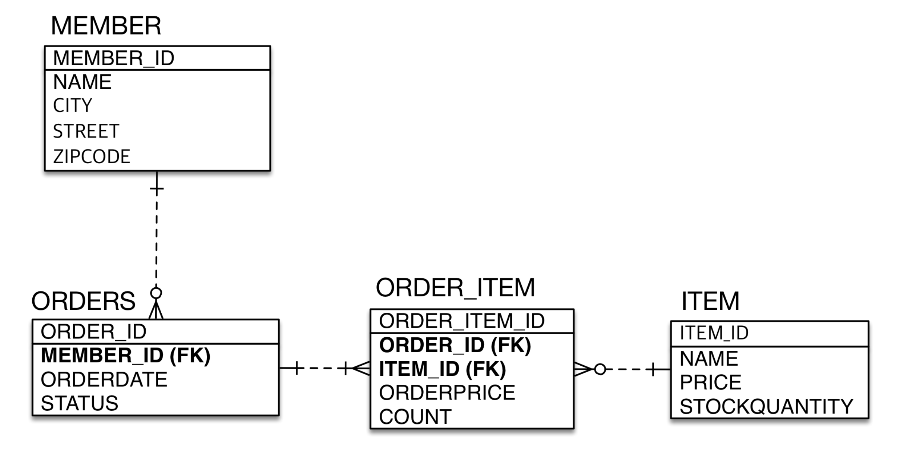
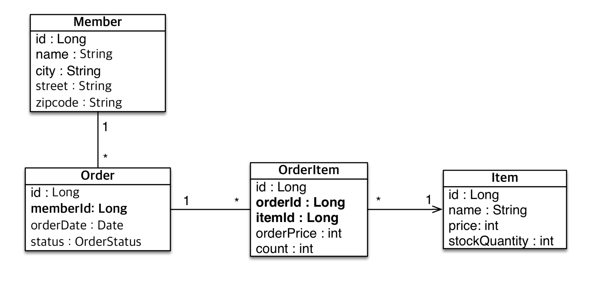

# 01. 객체와 테이블 매핑

## 엔티티 매핑 소개

* 객체와 테이블 매핑 : @Entity, @Table
* 필드와 칼럼 매핑 : @Column
* 기본 키 매핑 : @Id
* 연관관계 매핑 : @ManyToOne, @JoinColumn

## @Entity

* @Entity가 붙은 클래스는 JPA가 관리
* JPA를 사용해서 테이블과 매핑할 클래스는 @Entity 필수
* 주의사항
    * 기본 생성자 필수 (파라미터가 없는 public 또는 protected 생성자)
    * final 클래스, enum, interface, inner 클래스 사용 X
    * 저장할 필드에 final 사용 X
* 속성 name
    * JPA에서 사용할 엔티티 이름을 지정
    * 기본값 : 클래스 이름을 그대로 사용
    * 같은 클래스 이름이 없으면 가급적 기본값을 사용

## @Table

* 엔티티와 매핑할 테이블 지정

* name : 매핑할 이름
* catalog : 데이터베이스 catalog 매핑
* schema : 데이터베이스 schema 매핑
* uniqueConstraints : DDL 생성 시에 유니크 제약 조건 생성

# 02. 데이터베이스 스키마 자동 생성

## 데이터베이스 스키마 자동 생성

* DDL을 애플리케이션 실행 시점에 자동 생성
* 테이블 중심 -> 객체 중심
* 데이터베이스 방언을 활용해 데이터베이스에 맞는 적절한 DDL 생성
* 이렇게 생성된 DDL은 개발 장비에서만 사용
* 생성된 DDL은 운영서버에서는 사용하지 않거나, 적절히 다듬은 후 사용

## 속성

``` xml
<property name="hibernate.hbm2ddl.auto" value="create" />
```

* create : 기존테이블 삭제 후 다시 생성
* create-drop : create와 같으나 종료시점에 테이블 DROP
* update : 변경분만 반영(운영DB에는 사용하면 안됨)
* validate : 엔티티와 테이블이 정상 매핑되었는지만 확인
* none : 사용하지 않음

## 주의

* 운영 장비에는 절대 create, create-drop, update 사용하면 안된다.
* 개발 초기 단계는 create 또는 update
* 테스트 서버는 update 또는 validate
* 스테이징과 운영 서버는 validate 또는 none

## DDL 생성 기능

* 제약조건 추가
    * @Column(nullable = false, length = 10) : 회원 이름은 **필수**, 10자 초과X
    * @Table(uniqueConstraints = {@UniqueConstraint( name = "NAME_AGE_UNIQUE", columnNames = {"NAME", "AGE"} )}) : 유니크 제약조건 추가

# 03. 필드와 컬럼 매핑

## 매핑 어노테이션 정리

* @Column : 컬럼 매핑
* @Temporal : 날짜 타입 매핑
* @Enumerated : enum 타입 매핑
* @Lob : BLOB, CLOB 매핑
* @Transient : 특정 필드를 컬럼에 매핑하지 않음(매핑 무시)

## 예제

``` java
package hellojpa;

import java.util.Date;

import javax.persistence.Column;
import javax.persistence.Entity;
import javax.persistence.EnumType;
import javax.persistence.Enumerated;
import javax.persistence.Id;
import javax.persistence.Lob;
import javax.persistence.Temporal;
import javax.persistence.TemporalType;

@Entity
public class Member {

    @Id
    private Long id;

    @Column(name = "name")
    private String username;

    private Integer age;

    @Enumerated(EnumType.STRING)
    private RoleType roleType;

    @Temporal(TemporalType.TIMESTAMP)
    private Date createdDate;

    @Temporal(TemporalType.TIMESTAMP)
    private Date lastModifiedDate;

    @Lob
    private String description;
}
```

``` sql
create table Member (
    id bigint not null,
    age integer,
    createdDate timestamp,
    description clob,
    lastModifiedDate timestamp,
    roleType varchar(255),
    name varchar(255),
    primary key (id)
)
```

## @Column

| 속성                   | 설명                                                         | 기본값                |
| ---------------------- | ------------------------------------------------------------ | --------------------- |
| name                   | 필드와 매핑할 테이블의 컬럼 이름                             | 객체의 필드 이름      |
| insertable, updatable  | 등록, 변경 가능 여부                                         | TRUE                  |
| nullable(DDL)          | null 값의 허용 여부를 설정한다. false로 설정하면 DDL 생성 시에 not null 제약조건이 붙는다. |                       |
| unique(DDL)            | @Table의 uniqueConstraints와 같지만 한 컬럼에 간단히 유니크 제약조건을 걸 때 사용한다. 이 때 생성되는 unique key의 이름이 식별하기 어려워 @Table의 uniqueConstraints을 더 많이 사용한다. |                       |
| columnDefinition (DDL) | 데이터베이스 컬럼 정보를 직접 줄 수 있다. ex) varchar(100) default ‘EMPTY' |                       |
| length(DDL)            | 문자 길이 제약조건, String 타입에만 사용한다.                | 255                   |
| precision, scale(DDL)  | BigDecimal 타입에서 사용한다(BigInteger도 사용할 수 있다). precision은 소수점을 포함한 전체 자 릿수를, scale은 소수의 자릿수 다. 참고로 double, float 타입에는 적용되지 않는다. 아주 큰 숫자나 정 밀한 소수를 다루어야 할 때만 사용한다. | precision=19, scale=2 |

## @Enumerated

* 자바 enum 타입을 매핑할 때 사용
* value
    * EnumType.ORDINAL: enum 순서를 데이터베이스에 저장 (기본값)
    * EnumType.STRING: enum 이름을 데이터베이스에 저장
* ORDINAL을 사용하면 STRING보다 메모리는 약간 더 아낄 수 있지만 이후 enum의 순서가 바꼈을 때 문제가 될 수 있다.

## @Temporal

* 날짜 타입을 매핑할 때 사용
* value
    * TemporalType.DATE : 날짜, 데이터베이스 date 타입과 매핑  (예: 2013–10–11)
    * TemporalType.TIME : 시간, 데이터베이스 time 타입과 매핑  (예: 11:11:11)
    * TemporalType.TIMESTAMP : 날짜와 시간, 데이터베이스 timestamp 타입과 매핑(예: 2013–10–11 11:11:11)

* 하이버네이트에서 지원하는 LocalDate나 LocalDateTime을 사용할 때는 생략 가능

## @Lob

* 데이터베이스 BLOB, CLOB 타입과 매핑
* @Lob에는 지정할 수 있는 속성이 없다.
* 매핑하는 필드 타입이 문자면 CLOB 매핑, 나머지는 BLOB 매핑

## @Transient

* 필드를 데이터베이스와 매핑하지 않을 때 사용
* 메모리 상에서만 임시로 어떤 값을 보관하고 싶을 때 사용

# 04. 기본 키 매핑

## 기본 키 매핑 어노테이션

* @Id
* @GeneratedValue

``` java
@Id @GeneratedValue(strategy = GenerationType.AUTO) 
private Long id;
```

## 기본 키 매핑 방법

* 직접 할당 : @Id만 사용, application에서 id값을 넣어줘야 한다.
* 자동 생성 : @GeneratedValue 사용
    * **IDENTITY**
    * **SEQUENCE**
    * **TABLE**
    * **AUTO**

### IDENTITY

* 기본 키 생성을 데이터베이스에 위임 ex) MySQL의 AUTO_INCREMENT
* em.persist() 시점에 즉시 INSERT SQL 실행하고 DB에서 식별자를 조회

``` java
@Entity
public class Member {
    @Id
    @GeneratedValue(strategy = GenerationType.IDENTITY)
    private Long id;
}
```

### SEQUENCE

* 데이터베이스 시퀀스는 유일한 값을 순서대로 생성하는 특별한 데이터베이스 오브젝트 ex) Oracle의 스퀀스

``` java
@Entity
@SequenceGenerator(
    name = “MEMBER_SEQ_GENERATOR",
    sequenceName = “MEMBER_SEQ", //매핑할 데이터베이스 시퀀스 이름
    initialValue = 1, allocationSize = 1)
public class Member {
    @Id
    @GeneratedValue(strategy = GenerationType.SEQUENCE, generator =     "MEMBER_SEQ_GENERATOR")
    private Long id;
```

* @SequenceGenerator의 속성
    * name : 식별자 생성기 이름 (필수)
    * sequenceName : 데이터베이스에 등록되어 있는 시퀀스 이름
    * initialValue : DDL 생성 시에만 사용됨, 시퀀스 DDL을 생성할 때 처음 1 시작하는 수를 지정한다. (기본값 : 1)
    * allocationSize : 시퀀스 한 번 호출에 증가하는 수 (성능 최적화에 사용됨, 기본값 : 50)
    * catalog, schema : 데이터베이스 catalog, schema 이름

> allocationSize의 기본값이 50인 이유
>
> SEQUENCE를 사용할 경우, persist를 하는 시점에 SEQUENCE를 조회해서 PK값을 확보해야한다. 만약 allocationSize가 1일 경우 persist때 마다 SEQUENCE를 조회하기 위한 쿼리가 날라간다. 따라서 이러한 성능을 최적화하기 위해 allocationSize의 기본값을 50으로 사용하고, 여러 번 persist가 발생해도 첫 번째에서만 DB에서 50을 증가시키고 메모리에서 값을 올릴 수 있게 하여 쿼리의 수를 줄인다.

### TABLE

* 키 생성 전용 테이블을 하나 만들어서 데이터베이스 시퀀스를 흉내내는 전략
* 장점 : 모든 데이터베이스에 적용 가능
* 단점 : 성능 이슈

## 권장하는 식별자 전략

* 기본 키 제약 조건 : null 아님, 유일, 변하면 안되는 값
* 미래까지 이 조건을 만족하는 자연키를 찾기 어렵다.
* 권장 : Long 형 + 대체키 + 키 생성전략 사용

# 05. 실전 예제 1 - 요구사항 분석과 기본 매핑

## 요구사항 분석

* 회원은 상품을 주문할 수 있다.
* 주문 시 여러 종류의 상품을 선택할 수 있다.



## 테이블 설계




## 엔티티 설계와 매핑




## 데이터 중심 설계의 문제점

* 현재 방식은 객체 설계를 테이블 설계에 맞춘 방식
* 테이블의 외래키를 객체에 그래도 가져옴
* 객체 그래프 탐색이 불가능

현재 설계에선 주문한 유저를 조회하기 위해 아래와 같다.

``` java
Order order = em.find(Order.class, 1L);
Long memberId = order.getMemberId();

Member member = em.find(Member.class, memberId);
```


하지만 memberId: Long 대신 member: Member로 바꾼다면 아래와 같이 조회할 수 있다.

``` java
Order order = em.find(Order.class, 1L);
Member member = order.getMember();
```

