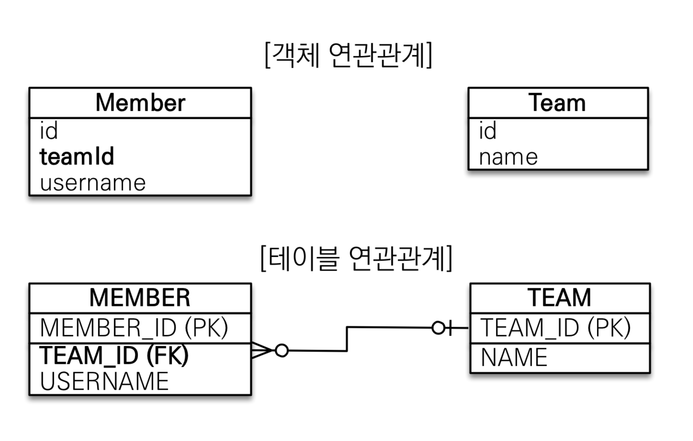
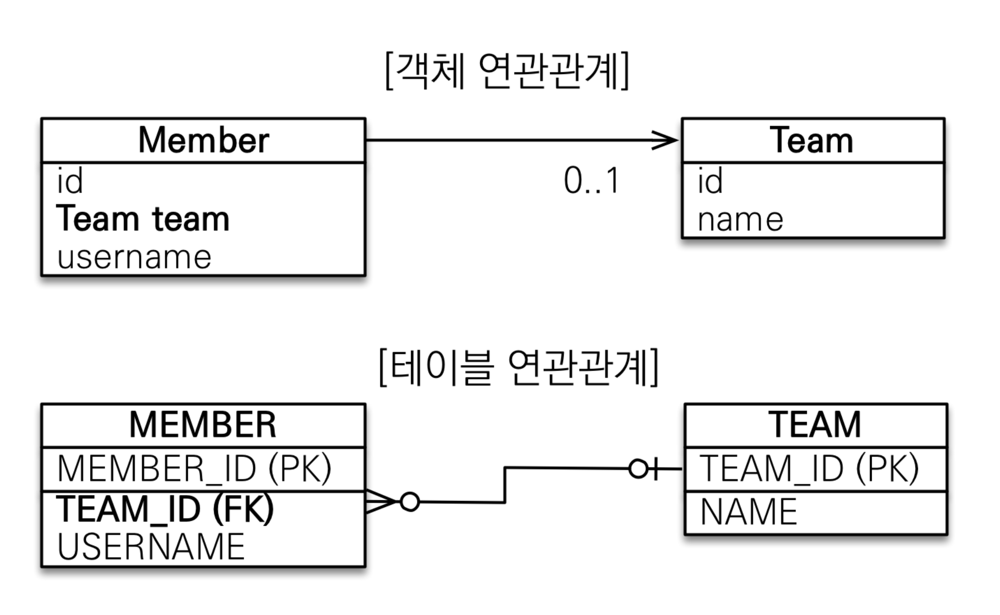
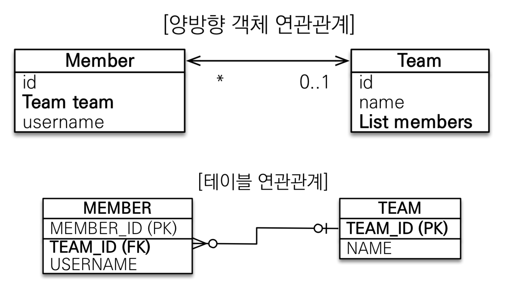
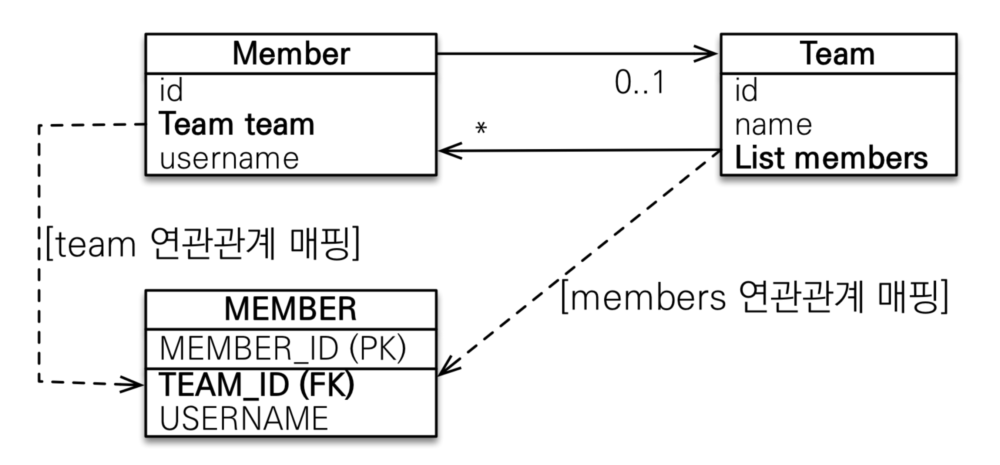

# 01. 단방향 연관관계

## 연관관계가 필요한 이유

### 예제 시나리오

* 회원과 팀이 있다.
* 회원은 하나의 팀에만 소속될 수 있다.
* 회원과 팀은 다대일 관계다.


### 객체를 테이블에 맞추어 모델링



``` java
//팀 저장
Team team = new Team();
team.setName("TeamA"); 
em.persist(team);

//회원 저장
Member member = new Member();
member.setName("member1");
member.setTeamId(team.getId());
em.persist(member);
```

``` java
//조회
Member findMember = em.find(Member.class, member.getId());

//연관관계가 없음
Team findTeam = em.find(Team.class, team.getId());
```


객체를 테이블에 맞추어 테이터 중심으로 모델링하면, 협력 관계를 만들 수 없다.

* **테이블은 외래 키로 조인**을 사용해서 연관된 테이블을 찾는다.
* **객체는 참조**를 사용해서 연관된 객체를 찾는다.
* 테이블과 객체 사이에는 이런 큰 간격이 있다.


## 단방향 연관관계



``` java
@ManyToOne
@JoinColumn(name = "TEAM_ID")
private Team team;
```

``` java
//팀 저장
Team team = new Team();
team.setName("TeamA");
em.persist(team);

//회원 저장
Member member = new Member();
member.setName("member1");
member.setTeam(team); //단방향 연관관계 설정, 참조 저장
em.persist(member);
```

``` java
//조회
Member findMember = em.find(Member.class, member.getId());
//참조를 사용해서 연관관계 조회
Team findTeam = findMember.getTeam();
```

``` java
// 새로운 팀B
Team teamB = new Team();
teamB.setName("TeamB");
em.persist(teamB);

// 회원1에 새로운 팀B 설정
member.setTeam(teamB);
```


# 02. 양방향 연관관계와 연관관계의 주인 1 - 기본

## 양방향 매핑



``` java
@Entity
public class Team {
    @OneToMany(mappedBy = "team")
    List<Member> members = new ArrayList<Member>();
}
```

``` java
//조회
Team findTeam = em.find(Team.class, team.getId());
int memberSize = findTeam.getMembers().size(); //역방향 조회
```


## 연관관계의 주인과 mappedBy

mappedBy를 이해하기 위해서는 객체와 테이블간에 연관관계를 맺는 차이를 이해해야 한다.

객체 연관관계 = 2개

* 회원 -> 팀 
* 팀 -> 회원

테이블 연관관계 = 1개

* 회원 <-> 팀

객체의 양방향 관계는 사실 양방향 관계가 아니라 서로 다른 단방향 관계 2개다.


### 연관관계의 주인

테이블의 TEAM_ID의 주인은 Member.team이어야할까, Team.members 이어야할까?




### 양방향 매핑 규칙

* 객체의 두 관계 중 하나를 연관관계의 주인으로 지정
* 연관관계의 주인만이 외래 키를 관리(등록, 수정)

* 주인이 아닌 쪽은 읽기만 가능
* 주인은 mappedBy 속성 사용 X
* 주인이 아니면 mappedBy


### 누구를 주인으로?

* 외래 키가 있는 곳을 주인으로 정해라
* 위 예제에서는 Member.team


# 03. 양방향 연관관계와 연관관계의 주인 2 - 주의점, 정리


# 04. 실전 예제  - 연관관계 매핑 시작
