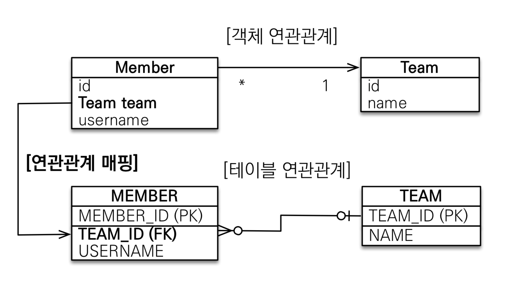
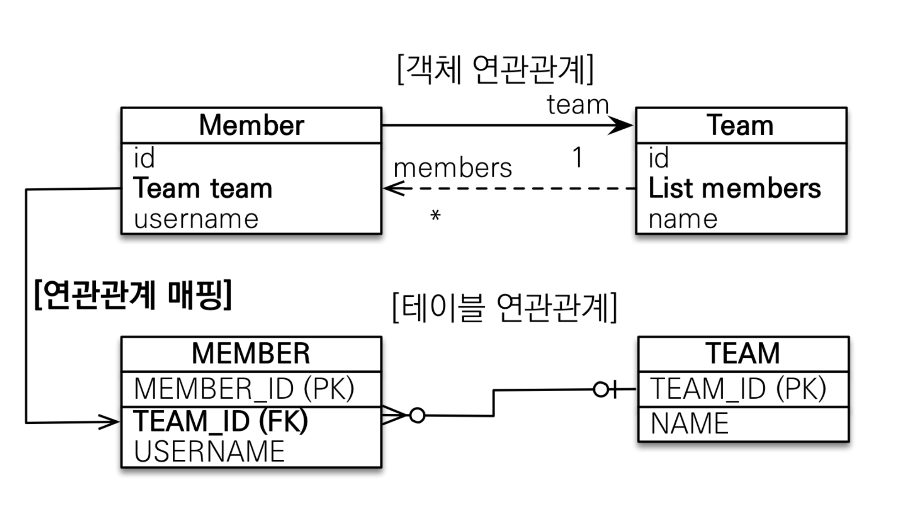
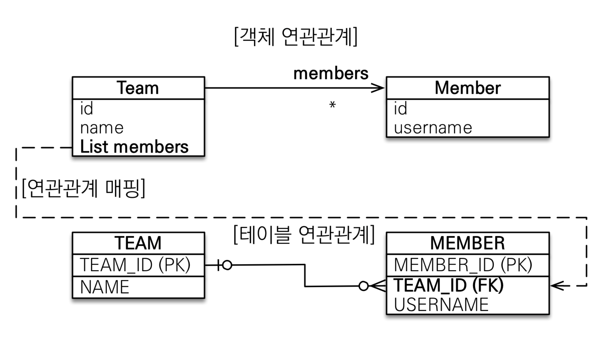
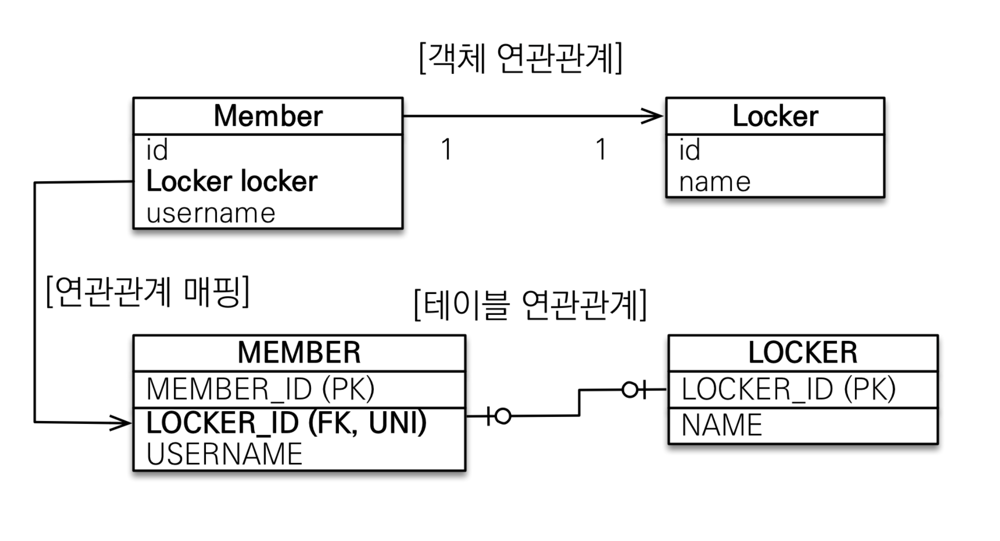
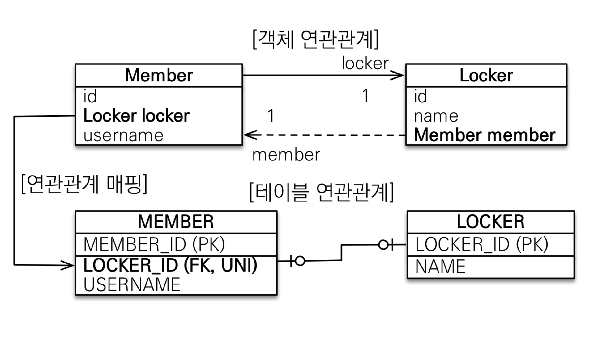
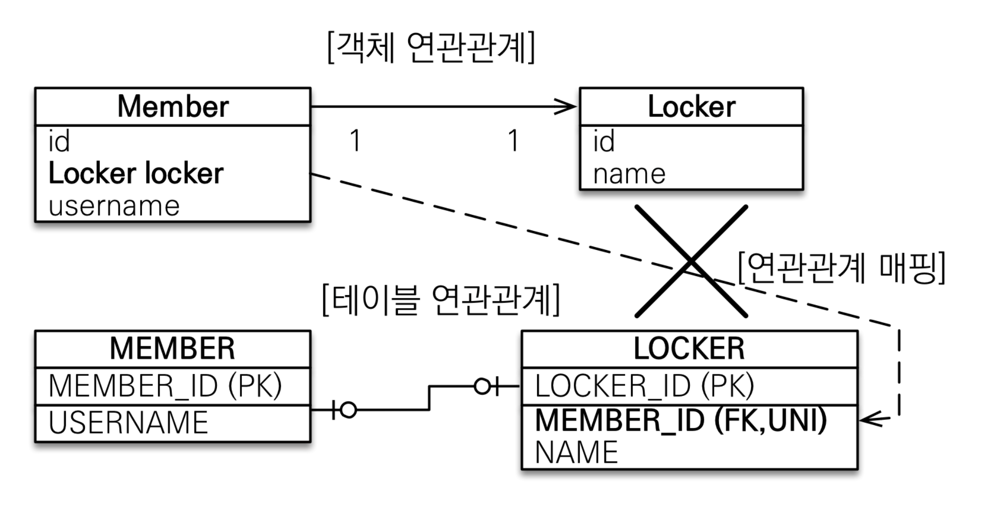
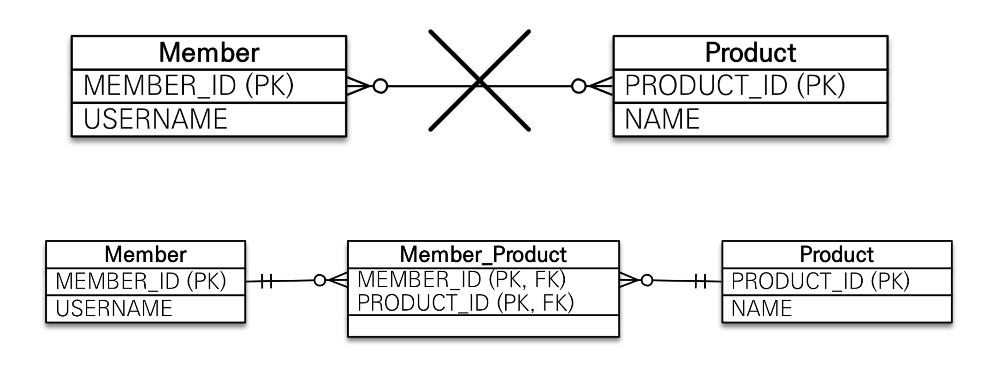
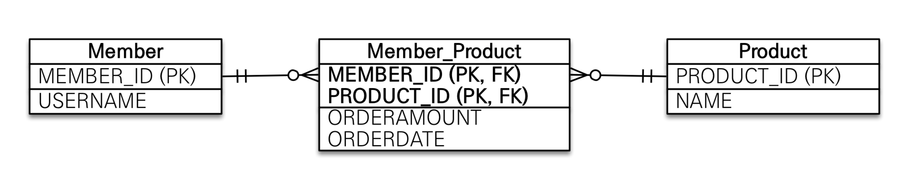
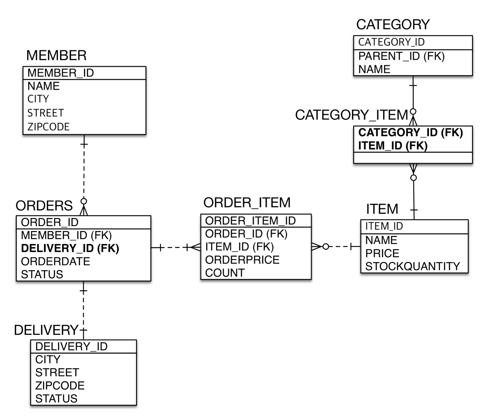

# 01. 다대일 N:1

## 연관관계 매핑 시 고려사항 3가지

* 다중성 - 다대일, 일대다, 일대일, 다대다
* 단방향, 양방향
  * 테이블은 외래 키 하나로 양쪽 조인이 가능하지만 객체는 참조용 필드가 있는 쪽으로만 참조 가능
  * 한쪽만 참조하면 단방향, 양쪽이 서로 참조하면 양방향
* 연관관계의 주인
  * 객체 양방향 관계는 참조가 2군데 있기 때문에 테이블의 외래 키를 관리할 곳을 지정해야함
  * 연관관계의 주인이라는 뜻은 외래 키를 관리하는 참조를 말함


## 다대일 N:1

### 다다일 단방향



``` java
@Entity
public class Member {
  @ManyToOne
  @JoinColumn(name = "TEAM_ID")
  private Team team;
}
```


### 다대일 양방향



``` java
@Entity
public class Member {
  @ManyToOne
  @JoinColumn(name = "TEAM_ID")
  private Team team;
}

@Entity
public class Team {
  @OneToMany(mappedBy = "team")
  private Liste<Member> members = new ArrayList<>();
}
```


# 02. 일대다 1:N

## 일대다 1:N

JPA에서 표준 스펙을 제공하긴 하지만 사용을 권장하지 않음

* MEMBER의 필드를 Team 객체에서 관리해야하기 때문에 혼란의 여지가 생김
* 연관관계 관리를 위해 추가로 UPDATE 쿼리가 발생

-> 일대다 단방향 매핑보다는 다대일 양방향 매핑을 사용하자.

### 일대다 단방향



```java
@Entity
public class Team {
  @OneToMany
  @JoinColumn(name = "TEAM_ID")
  private Liste<Member> members = new ArrayList<>();
}
```

* @JoinColumn을 사용하지 않으면 TEAM_MEMBER 테이블을 만들어 사용함


# 03. 일대일 1:1

## 일대일 관계

* 주 테이블이나 대상 테이블 중에 외래 키 선택 가능
  * 주 테이블에 외래 키
  * 대상 테이블에 외래 키
* 외래 키에 데이터베이스 유니크 제약조건 추가


## 일대일: 주 테이블에 외래 키 단방향



``` java
@Entity
public class Member {
  @OneToOne
  @JoinColumn(name = "LOCKER_ID")
  private Locker locker;
}
```


## 일대일: 주 테이블에 외래 키 양방향



``` java
@Entity
public class Member {
  @OneToOne
  @JoinColumn(name = "LOCKER_ID")
  private Locker locker;
}

@Entity
public class Locker {
  @OneToOne(mappedBy = "locker")
  private Member member;
}
```


## 일대일: 대상 테이블에 외래 키 단방향



* 단방향 관계는 JPA 지원 X
* 양방향 관계는 지원


## 일대일 정리

> 자주 참조하는 테이블 : 주 테이블

* 주 테이블에 외래 키

  * 주 객체가 대상 객체의 참조를 가지는 것 처럼 주 테이블에 외래 키를 두고 대상 테이블을 찾음
  * 객체 지향 개발자 선호
  * JPA 매핑 편리
  * 장점 : 주 테이블만 조회해도 대상 테이블에 데이터가 있는지 확인 가능
  * 단점 : 값이 없으면 외래 키에 null 허용

* 대상 테이블에 외래 키

  * 대상 테이블에 외래 키가 존재
  * 전통적인 데이터베이스 개발자 선호
  * 장점 : 주 테이블과 대상 테이블을 일대일에서 일대다 관계로 변경할 때 테이블 구조 유지
  * 단점 : 프록시 기능의 한계로 지연 로딩으로 설정해도 항상 즉시 로딩됨

  


# 04. 다대다 N:M

## 다대다 N:M

* 실무에서는 정규화된 테이블 2개로 다대다 관계를 표현할 수 없음
* 연결 테이블을 추가해서 일대다, 다대일 관계로 풀어내야함



* 객체는 컬렉션을 사용해서 객체 개로 다대다 관계 가능


## 다대다 매핑의 한계

* 편리해보이지만 실무에서 사용 X
* 연결 테이블이 단순히 연결만 하고 끝나지 않음




## 다대다 한계 극복

``` java
@Entity
public class Member {
  @OneToMany(mappedBy = "member")
  private List<MemberProduct> memberProducts = new ArraryList<>();
}

@Entity
public class MemberProduct {
  @ManyToOne
  @JoinColumn(name = "MEMBER_ID")
  private Member member;
  
  @ManyToOne
  @JoinColumn(name = "PRODUCT_ID")
  private Product product;
}

@Entity
public class Product {
  @OneToMany(mappedBy = "product")
  private List<MemberProduct> members = new ArrayList<>();
}
```


# 05. 실전 예제 3 - 다양한 연관관계 매핑

## 배송, 카테고리 추가 - ERD


