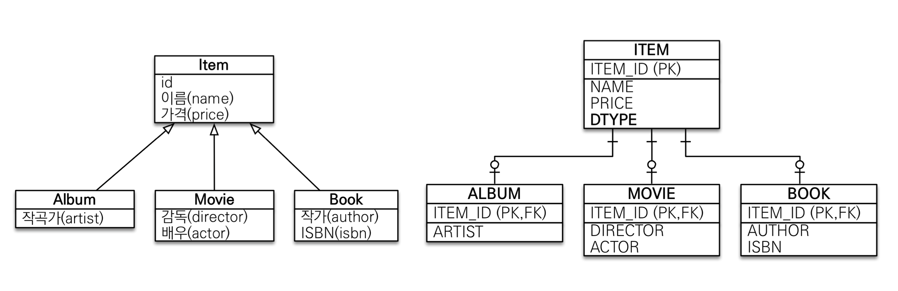
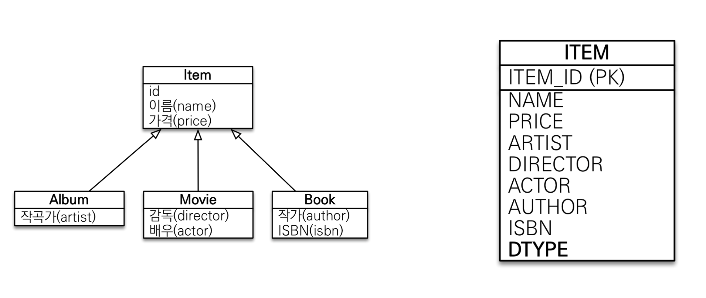
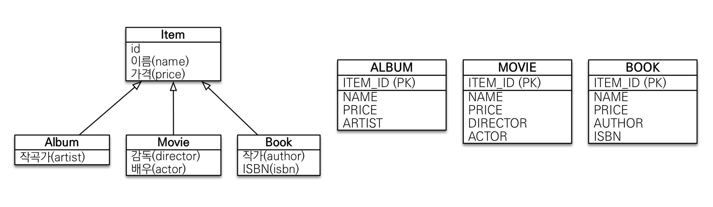
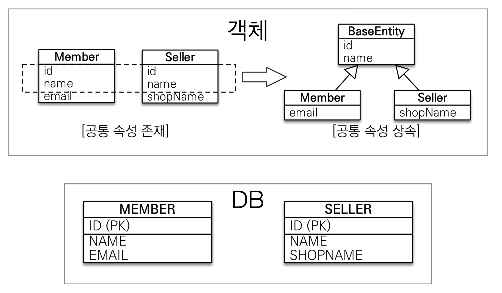
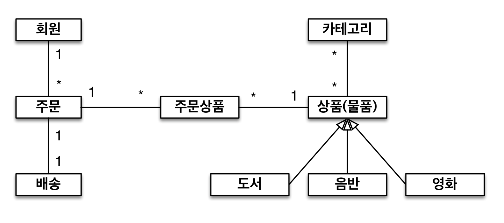
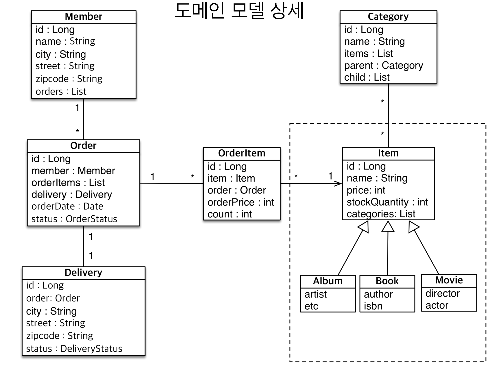
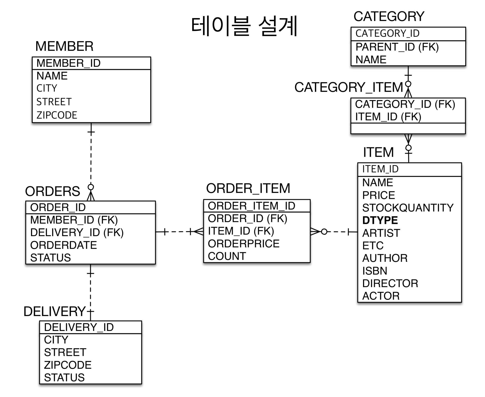

# 01. 상속관계 매핑

## 상속관계 매핑

* 관계형 데이터베이스는 상속 관계 X
* 슈퍼타입 서브타입 관계라는 모델링 기법이 객체 상속과 유사
* 상속관계 매핑 : 객체의 상속과 구조와 DB의 슈퍼타입 서브타입 관계를 매핑
* 슈퍼타입 서브타입 논리 모델을 실제 물리 모델로 구현하는 방법
  * 각각 테이블로 변환 -> 조인 전략
  * 통합 테이블로 변환 -> 단일 테이블 전략
  * 서브타입 테이블로 변환 -> 구현 클래스마다 테이블 전략


### 조인 전략



* 장점
  * 테이블 정규
  * 외래 키 참조 무결성 제약조건 활용가능
  * 저장공간 효율화
* 단점
  * 조회시 조인을 많이 사용, 성능 저하
  * 조회 쿼리가 복잡함
  * 데이터 저장시 INSERT SQL 2번 호출

``` java
@Entity
@Inheritance(strategy = InheritanceType.JOINED)
@DiscriminatorColumn
public class Item {
  @Id @GeneratedValue
  private Long id;
  
  private String name;
  private int price;
}

@Entity
public class Book extends Item {
  private String author;
  private String isbn;
}
```

* @Inheritance(strategy = InheritanceType.JOINED) : 상속 시 조인전략으로 테이블을 생성한다. default는 단일 테이블 전략이다.
* @DiscriminatorColumn : ITEM 테이블에 DTYPE이라는 필드로 어느 테이블과 관련된 테이블인지 저장한다.


### 단일 테이블 전략



* 장점

  - 조인이 필요 없으므로 일반적으로 조회 성능이 빠름

  - 조회 쿼리가 단순함

* 단점
  * 자식 엔티티가 매핑한 컬럼은 모두 null 허용
  * 단일 테이블에 모든 것을 저장하므로 테이블이 커질 수 있다.
  * 상황에 따라서 조회 성능이 오히려 느려질 수 있다.

``` java
@Entity
@Inheritance(strategy = InheritanceType.SINGLE_TABLE)
@DiscriminatorColumn
public class Item {
  ...
}
```

* @Inheritance(strategy = InheritanceType.SINGLE_TABLE) : 상속 시 단일 테이블로 생성한다.
* @DiscriminatorColumn : 여기선 해당 애노테이션이 없어도 DTYPE을 생성한다. 


### 구현 클래스마다 테이블 전략



* 이 전략은 데이터베이스 설계자와 ORM 전문가 둘 다 추천 X
*  장점
  * 서브 타입을 명확하게 구분해서 처리할 때 효과적
  * not null 제약조건 사용 가능
* 단점
  * 여러 자식 테이블을 함께 조회할 때 성능이 느림(UNION SQL 필요)
  * 자식 테이블을 통합해서 쿼리하기 어려움

``` java
@Entity
@Inheritance(strategy = InheritanceType.TABLE_PER_CLASS)
public abstract Item {
  ...
}
```


# 02. Mapped Superclass - 매핑 정보 상속

## @MappedSuperclass

* 공통 매핑 정보가 필요할 때 사용 (ex. id, name)



* 사용법

```java
@MappedSuperclass
public abstract class BaseEntity {
  private LocalDateTime createdDate;
  private LocalDateTime lastModifiedDate;
}

@Entity
public class Team extends BaseEntity {
  
}
```

* 상속관계 매핑 X
* 엔티티 X, 테이블과 매핑 X
* 부모 클래스를 상속 받는 자식 클래스에 매핑 정보만 제공
* 조회, 검색 불가
  * em.find(BaseEntity) 불가
* 직접 생성해서 사용할 일이 없으므로 추상 클래스 권장


# 03. 실전 예제 4 - 상속관계 매핑

## 요구사항 추가

* 상품의 종류는 음반, 도서, 영화가 있고 이후 더 확장될 수 있다.
* 모든 데이터는 등록일과 수정일이 필수다.






