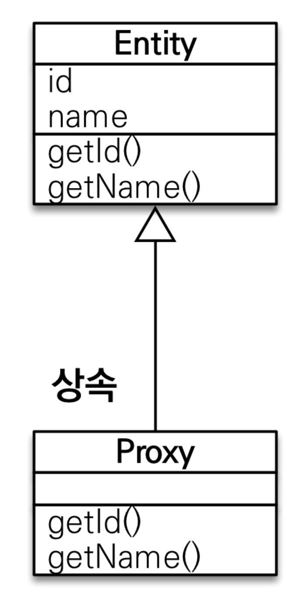
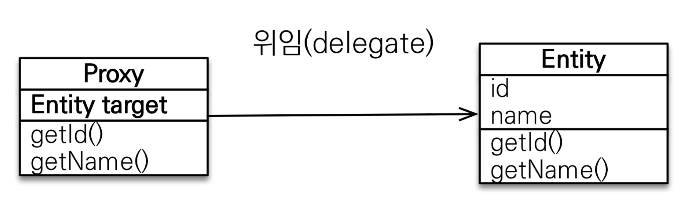
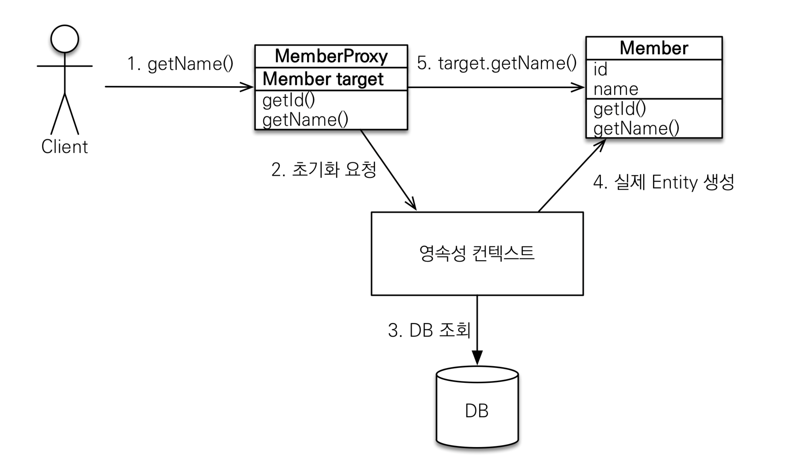
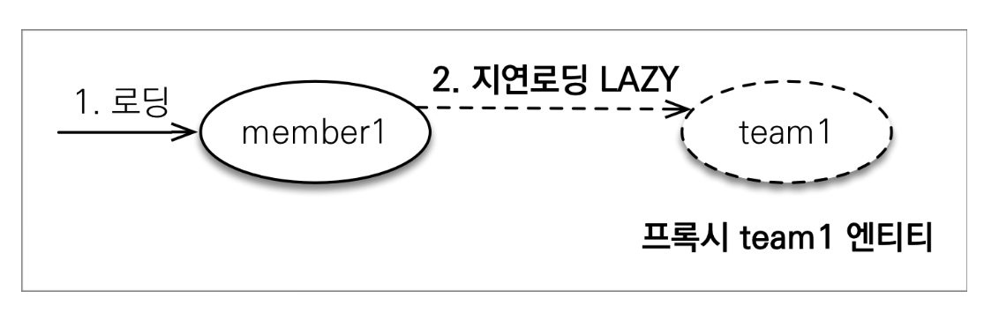
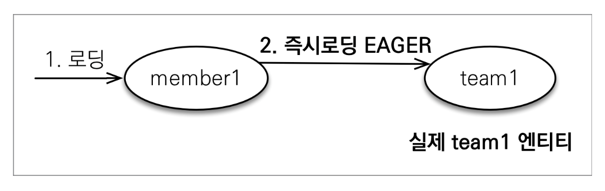
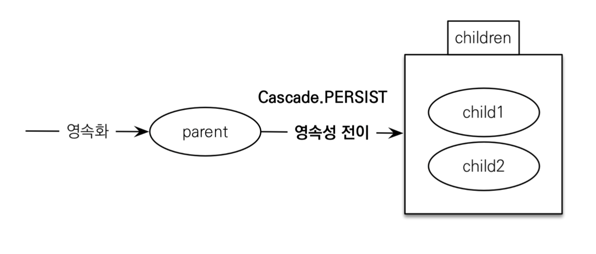

# 01. 프록시

## 문제점, Member를 조회할 때 Team도 함께 조회해야 할까?

### 회원과 팀 함께 출력

``` java
public void printUserAndTeam(String memberId) {
  Member member = em.find(Member.class, memberId);
  Team team = member.getTeam();
  System.out.println("회원 이름: " + member.getUsername());
  System.out.println("소속팀: " + team.getName());
}
```


### 회원만 출력

``` java
public void printUser(String memberId) {
  Member member = em.find(Member.class, memberId);
  Team team = member.getTeam();
  System.out.println("회원 이름: " + member.getUsername());
}
```


## 프록시

### 프록시 기초

* em.find() vs em.getReference()
  * em.find() : 데이터베이스를 통해서 실제 엔티티 객체 조회
  * em.getReference() : 데이터베이스 조회를 미루는 가짜(프록시) 엔티티 객체 조회


### 프록시 특징

* 실제 클래스를 상속 받아서 만들어짐
* 실제 클래스와 겉 모양이 같다
* 사용하는 입장에서는 진짜 객체인지 프록시 객체인지 구분하지 않고 사용하면 됨



* 프록시 객체는 실제 객체의 참조를 보관
* 프록시 객체를 호출하면 프록시 객체는 실제 객체의 메소드 호출




### 프록시 객체의 초기화

``` java
Member member = em.getReference(Member.class, "id1");
membergetName();
```




### 프록시의 특징

* 프록시 객체는 처음 사용할 때 한 번만 초기화
* 프록시 객체를 초기화 할 때 프록시 객체가 실제 엔티티로 바뀌는 것은 아님, 초기화되면 프록시 객체를 통해서 실제 엔티티에 접근 가능
* 프록시 객체는 원본 엔티티를 상속받음, 따라서 타입 체크시 주의해야함(==비교 대신 instance of 사용)
* 영속성 컨텍스트에 찾는 엔티티가 이미 있으면 em.getReference()를 호출해도 실제 엔티티 반환
* 영속성 컨텍스트의 도움을 받을 수 없는 준영속 상태일 때, 프록시를 초기화하면 문제 발생(하이버네이트는 org.hibernate.LazyInitializationException 예외를 터트림)


### 프록시 확인

* 프록시 인스턴스의 초기화 여부 확인 : PersistenceUnitUtil.isLoaded(Object entity)
* 프록시 클래스 확인 방법 : entity.getClass().getName() 출력
* 프록시 강제 초기화 : org.hibernate.Hibernate.initialize(entity)
* JPA 표준은 강제 초기화가 없기 때문에 member.getName()을 강제로 호출한다.


# 02. 즉시 로딩과 지연 로딩

## 지연 로딩

지연로딩 LAZY를 사용해서 프록시로 조회

``` java
@Entity
public class Member {
  @ManyToOne(fetch = FetchType.LAZY)
  @JoinColumn(name = "TEAM_ID")
  private Team team;
}
```




``` java
Member member = em.find(Member.class, 1L);
Team team = member.getTeam();
team.getName(); // 실제 team을 사용하는 시점에 초기화(DB 조회)
```


## 즉시 로딩

즉시로딩 EAGER를 사용해서 함께 조회

``` java
@Entity
public class Member {
  @ManyToOne(fetch = FetchType.EAGER)
  @JoinColumn(name = "TEAM_ID")
  private Team team;
}
```




## 프록시와 즉시로딩 주의

* 실무에서는 가급적 지연 로딩만 사용

* 즉시 로딩을 적용하면 예상하지 못한 SQL이 발생

* 즉시 로딩은 JPQL에서 N+1 문제를 일으킨다.

  * 이 경우, RAW SQL로 변환되어 MEMBER를 조회하는데 그 후 TEAM이 없으므로 각 MEMBER마다 TEAM을 조회하는 N번의 조회가 일어난다.

  ```java
  List<Member> members = em.createQuery("select m from Member m", Member.class).getResultList();
  ```

  

* @ManyToOne, @OneToOne은 기본이 즉시 로딩 -> LAZY로 설정해서 쓰자

* @OneToMany, @ManyToMany는 기본이 지연 로딩


## 지연 로딩 활용 

* 모든 연관관계에 지연 로딩을 사용해라!
* 실무에서 즉시 로딩을 사용하지 마라!
* JPQL fetch 조인이나, 엔티티 그래프 기능을 사용해라
* 즉시 로딩은 상상하지 못한 쿼리가 나간다


# 03. 영속성 전이(CASCADE)와 고아 객체

## 영속성 전이: CASCADE

* 특정 엔티티를 영속 상태로 만들 때 연관된 엔티티도 함께 영속 상태로 만들고 싶을 때
* 영속성 전이는 연관관계를 매핑하는 것과 아무 관련이 없음
* 엔티티를 영속화할 때 연관된 엔티티도 함께 영속화하는 편리함을 제공할 뿐
* children가 parent에 의해서만 관리되는 것이 아니라 여러 군데서 관리된다면 영속성 전이를 해서는 안된다.

```java
@OneToMany(mappedBy="parent", cascade=CascadeType.PERSIST)
```



### CASCADE의 종류

* ALL : 모두 적용
* PERSIST : 영속
* REMOVE : 삭제
* MERGE : 병합
* REFRESH 
* DETACH


## 고아 객체

* 부모 엔티티와 연관관계가 끊어진 자식 엔티티를 자동으로 삭제
* 참조하는 곳이 하나일 때 사용해야함
* @OneToMany, @OneToOne에서만 가능

``` java
@OneToMany(mappedBy="parent", cascade=CascadeType.PERSIST, orphanRemoval = true)
private List<Child> childList = new ArrayList<>();
```

childList에서 빠진 Child는 DB에서 삭제된다.


## 영속성 전이 + 고아 객체, 생명주기

* 스스로 생명주기를 관리하는 엔티티는 em.persist()로 영속화, em.remove()로 제거
* 아래와 같이 두 옵션을 활성화하면 부모 엔티티를 통해서 자식의 생명주기를 관리할 수 있음

``` java
@OneToMany(mappedBy="parent", cascade=CascadeType.ALL, orphanRemoval = true)
private List<Child> childList = new ArrayList<>();
```

* 도메인 주도 설계의 Aggregate Root 개념을 구현할 때 유용


# 04. 실전 예제 5 - 연관관계 관리

## 글로벌 페치 전략 설정

* 모든 연관관계를 지연 로딩으로
* @ManyToOne, @OneToOne은 기본이 즉시 로딩이므로 지연로딩으로 변경


## 영속성 전이 설정

* Order -> Delivery를 영속성 전이 ALL 설정
* Order -> OrderItem을 영속성 전이 ALL 설정
