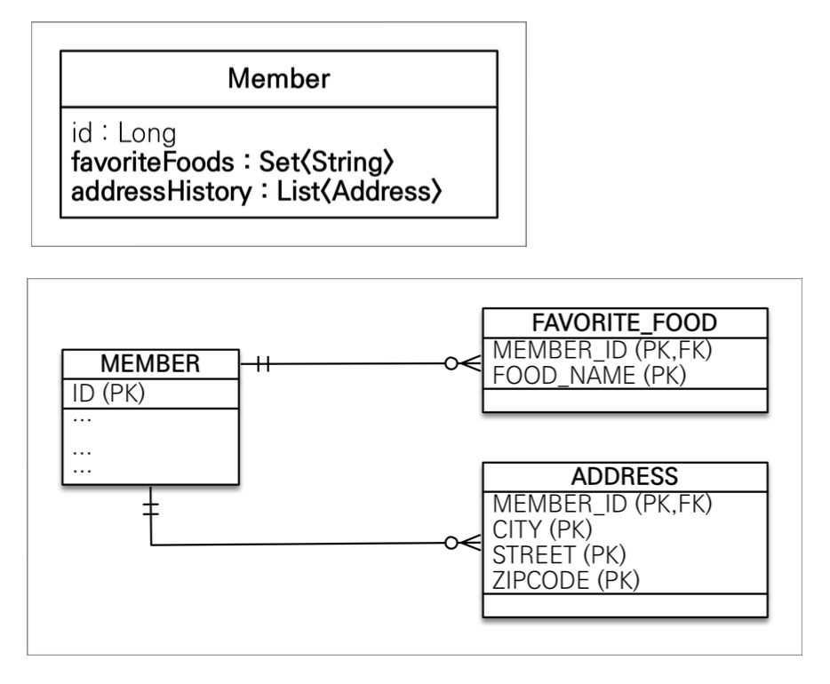

# 01. 기본값 타입

## JPA의 데이터 타입 분류

* 엔티티 타입
  * @Entity로 정의하는 객체
  * 데이터가 변해도 식별자로 지속해서 추적 가능
  * ex) 회원 엔티티의 키나 나이 값을 변경해도 식별자로 인식 가능
* 값 타입
  * int, Integer, String처럼 단순히 값으로 사용하는 자바 기본 타입이나 객체
  * 식별자가 없고 값만 있으므로 변경시 추적 불가
  * ex) 숫자 100을 200으로 변경하면 완전히 다른 값으로 대체


## 값 타입 분류

* 기본값 타입
  * 자바 기본 타입(int, double)
  * 래퍼 클래스(Integer, Long)
  * String
* 임베디드 타입(embedded type, 복합 값 타입)
* 컬렉션 값 타입(collection value type)


## 기본값 타입

* ex) String name, int age
* 생명주기를 엔티티의 의존 ex) 회원을 삭제하면 이름 나이 필드도 함께 삭제
* 값 타입은 공유하면 X

* 자바의 기본 타입은 항상 값을 복사함

  ``` java
  int a = 10;
  int b = a;
  
  b = 20;
  
  a // 10
  b // 20
  ```

* 래퍼 클래스나 String 클래스는 공유가능한 객체이지만 변경 X


# 02. 임베디드 타입 - 중요

## 임베디드 타입

* 새로운 값 타입을 직접 정의할 수 있음
* JPA는 임베디드 타입이라 함
* 주로 기본 값 타입을 모아서 만들어서 복합 값 타입이라고도 함
* int, String과 같은 값 타입


### 임베디드 타입 사용법

* @Embeddable : 값 타입을 정의하는 곳에 표시
* @Embedded : 값 타입을 사용하는 곳에 표시
* 기본 생성자 필수

```java
@Entity
public class Member {
  @Embedded
  private Period workPeriod;
}

@Embeddable
public class Period {
  private LocalDateTime startDate;
  private LocalDateTime endDate;
  
  public Period() {
  }
}
```

* 임베디드 타입의 값이 null이면 매핑한 컬럼 값은 모두 null


### 임베디드 타입 장점

* 재사용성
* 높은 응집도
* 해당 값 타입만 사용하는 의미있는 메소드를 만들 수 있음
* 임베디드 타입을 포함한 모든 값 타입은 값 타입을 소유한 엔티티에 생명주기를 의존함


### 임베디드 타입과 테이블 매핑

* 임베디드 타입을 사용하기 전과 후에 매핑하는 테이블은 같다
* 잘 설계된 ORM 애플리케이션은 매핑한 테이블의 수보다 클래스의 수가 더 많음


### @AttributeOverrides: 속성 재정의

* 한 엔티티에서 같은 값 타입을 사용하면 칼럼 명이 중복된다
* @AttributeOverrides를 사용하여 재정의해줘야한다.

``` java
@Entity
public class Member {
  @Embedded
  private Period workPeriod;
  
  @Embedded
  @AttributeOverrides({
    @AttributeOverride(name="startDate", column=@Column(name = "otherStartDate")),
    @AttributeOverride(name="endDate", column=@Column(name = "otherEndDate"))
  })
  private Period otherPeriod;
}
```


# 03. 값 타입과 불변 객체

값 타입은 복잡한 객체 세상을 조금이라도 단순화하려고 만든 개념이다. 따라서 값 타입은 단순하고 안전하게 다룰 수 있어야 한다.


## 값 타입 공유 참조

* 임베디드 타입 같은 값 타입을 여러 엔티티에서 공유하면 위험


* 대신에 값(인스턴스)를 복사해서 사용


## 객체 타입의 한계

* 항상 값을 복사해서 사용하면 공유 참조로 인해 발생하는 부작용을 피할 수 있다.
* 문제는 임베디드 타입처럼 직접 정의한 값 타입은 자바의 기본타입이 아니라 객체 타입이다.
* 자바 기본 타입에 값을 대입하면 값을 복사한다
* 객체 타입은 참조 값을 직접 대입하는 것을 막을 방법이 없다.
* 객체의 공유 참조는 피할 수 없다.


### 기본 타입

``` java
int a = 10;
int b = a; // 기본 타입은 값을 복사
b = 4;
```


### 객체 타입

``` Java
Address a = new Address("Old");
Address b = a; // 객체 타입은 참조를 전달
b.setCity("New");
```


## 불변 객체

* 객체 타입을 수정할 수 없게 만들면 부작용을 원천 차단
* 값 타입은 불변 객체로 설계해야함
* 생성자로만 값을 설정하고 수정자를 만들지 않으면 됨
* Integer, String은 자바가 제공하는 대표적인 불변 객체


# 04. 값 타입의 비교

## 값 타입의 비교

* 값 타입 : 인스턴스가 달라도 그 안에 값이 같으면 같은 것으로 봐야함
* 동일성 비교(identity) : 인스턴스의 참조 값을 비교, == 사용
* 동등성 비교(equivalence) : 인스턴스의 값을 비교, equals() 사용
* 값 타입은 a.equals(b)를 사용해서 동등성 비교를 해야함
* 값 타입의 equals() 메소드를 적절하게 재정의


# 05. 값 타입 컬렉션 - 중요

## 값 타입 컬렉션

* 값 타입을 하나 이상 저장할 때 사용
* @ElementCollection, @CollectionTable 사용
* 캅 타입 컬렉션도 지연 로딩 전략을 사용
* 값 타입 컬렉션은 영속성 전이(Cascade) + 고아 객체 제거 기능을 필수로 가짐
* 데이터베이스는 컬렉션을 같은 테이블에 저장할 수 없어 저장하기 위한 별도의 테이블이 필요함



``` java
public class Member {
  @ElementCollection
  @CollectionTable(name = "FAVORITE_FOOD", joinColumns = @JoinColumn(name = "MEMBER_ID"))
  @Column(name = "FOOD_NAME")
  private Set<String> favoriteFoods = new HastSet<>();
  
  @ElementCollection
  @CollectionTable(name = "ADDRESS", joinColumns = @JoinColumn(name = "MEMBER_ID"))
  private List<Address> addressHistory = new ArrayList<>();
}
```


## 값 타입 컬렉션 수정

* 값 타입 컬렉션을 수정할 때는 새롭게 만들어서 set해야 side effect를 최소화할 수 있다.

``` java
Member findMember = em.find(Member.class, member.getId());

findMember.getHomeAddress().setCity("newCity"); // X

Address a = findMember..getHomeAddress();
findMember.setHomeAddress(new Address("newCity", a.getStreet(), a.getZipcode())); // O
```

``` java
findMember.getFavoriteFoods().remove("치킨");
findMember.getFavoriteFoods().add("한식");
```
``` java
findMember.getAddressHistory().remove(new Address("old1", "street", "10000"));
findMember.getAddressHistory().remove(new Address("new1", "street", "10000"));
```

* 이 때 ADDRESS 테이블에 Member와 관련된 데이터를 모두 지우고 값 타입 컬렉션에 있는 현재 값을 모두 다시 insert하는 쿼리가 발생한다.


## 값 타입 컬렉션의 제약사항

* 값 타입은 엔티티와 다르게 식별자 개념이 없다.
* 값은 변경하면 추적이 어렵다.
* 값 타입 컬렉션에 변경 사항이 발생하면, 주인 엔티티와 연관된 모든 데이터를 삭제하고, 값 타입 컬렉션에 있는 현재 값을 모두 다시 저장한다. -> 성능 상의 이유로 사용하면 안된다.
* 값 타입 컬렉션을 매핑하는 테이블은 모든 칼럼을 묶어서 기본 키를 구성해야 함 : null 입력 X, 중복 저장 X


## 값 타입 컬렉션 대안

* 실무에서는 상황에 따라 값 타입 컬렉션 대신에 일대다 관계를 고려
* 일대다 관계를 위한 엔티티를 만들고, 여기에서 값 타입을 사용
* 영속성 전이 + 고아 객체 제거를 사용해서 값 타입 컬렉션 처럼 사용

``` java
@Entity
public class Member {
  @OneToMany(cascade = CascadeType.ALL, orphanRomoval = true)
  @JoinColumnn(name = "MEMBER_ID")
  private List<AddressEntity> addressHistory = new ArrayList<>();
}

@Entity
public class AddressEntity {
  private Address address;
  
  public AddressEntity(Address address) {
    this.address = address;
  }
}
```

* 값 타입 컬렉션은 정말 간단한 곳에서만 쓰고, 일반적으로는 엔티티를 사용하자


## 정리

* 엔티티 타입의 특징
  * 식별자 O
  * 생명 주기 관리
  * 공유
* 값 타입의 특징
  * 식별자 X
  * 생명 주기를 엔티티에 의존
  * 공유하지 않는 것이 안전(복사해서 사용)
  * 불변 객체로 만드는 것이 안전
