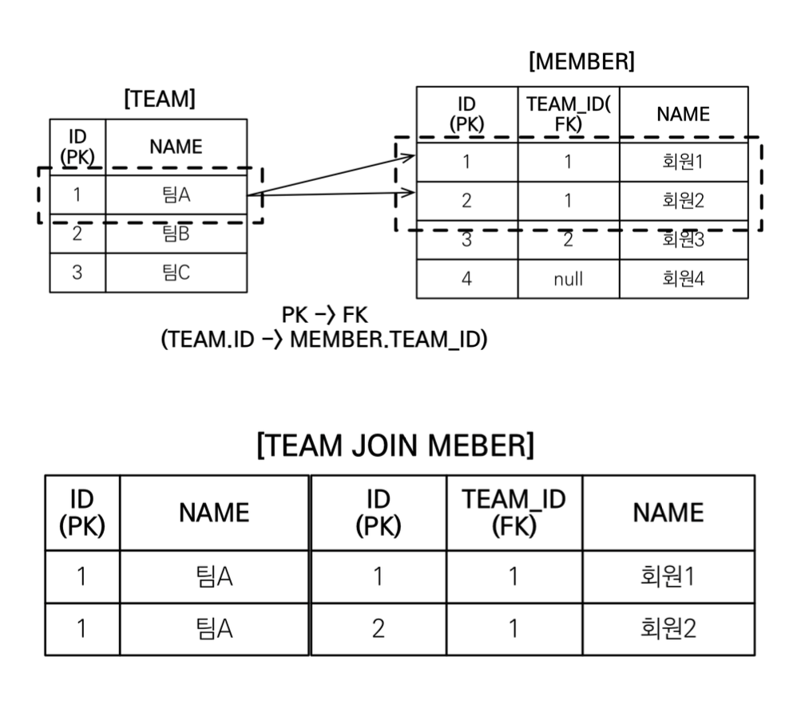
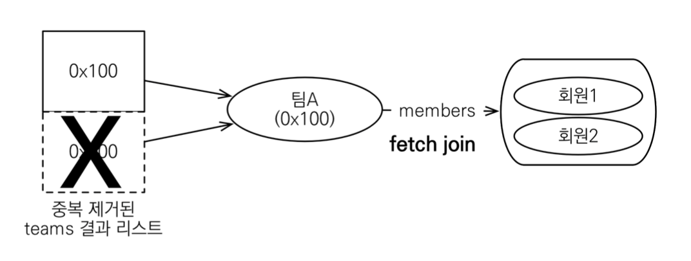
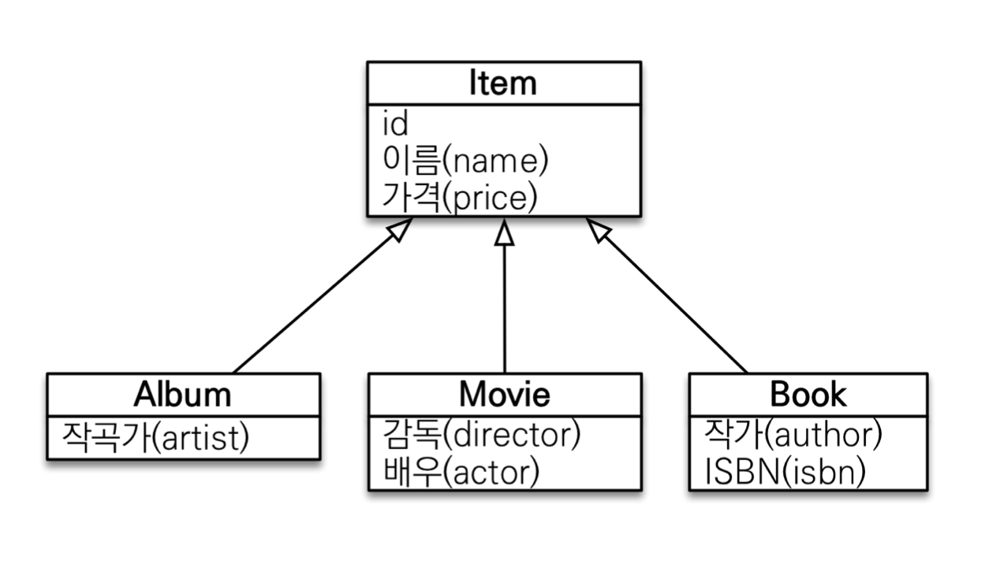

# 01. 경로 표현식

## 경로 표현식

* .을 찍어 객체 그래프를 탐색하는 것

``` java
select m.username -> 상태필드
  from Member m
  join m.team t -> 단일 값 연관 필드
  join m.orders o -> 컬렉션 값 연관 필드
where t.name = '팀A'
```


* 상태 필드 : 단순히 값을 저장하기 위한 필드
* 연관 필드 : 연관관계를 위한 필드
  * 단일 값 연관 필드 : @ManyToOne, @OneToOne, 대상이 엔티티
  * 컬렉션 값 연관 필드 : @OneToMany, @ManyToMany, 대상이 컬렉션


## 경로 표현식 특징

* 상태 필드 : 경로 탐색의 끝으로 더 이상 탐색 불가

* 단일 값 연관 경로 : 묵시적 내부 조인이 발생하고 추가 탐색 가능

  ``` java
  select m.team.name from Member m
  ```

* 컬렉션 값 연관 경로 : 묵시적 내부 조인이 발생하고 추가 탐색 불가능

  ``` java
  select t.members from Team t
  ```

  이 경우, 명시적 조인을 통해 해결가능

  ``` java
  select m.username from Team t join t.members m
  ```


묵시적 조인이 발생하면 쿼리가 예상하기 어렵기 때문에 되도록 명시적 조인을 사용하자


# 02. 페치 조인 1 - 기본

## 페치 조인(fetch join)

* JPQL에서 성능 최적화를 위해 제공하는 기능
* 연관된 엔티티나 컬렉션을 SQL 한 번에 함께 조회하는 기능
* join fetch 명령어 사용


## 엔티티 페치 조인

``` java
// JPQL
select m from Member m join fetch m.team
```

``` sql
-- SQL
select m.*, t.* 
from member m 
inner join t on m.team_id = t.id
```


## 컬렉션 페치 조인

``` java
// JPQL
select t from Team t join fetch t.members where t.name = '팀A' 
```

``` sql
-- SQL
select t.*, m.*
from team t
inner join member m.on t.id = m.team_id
where t.name = '팀A'
```


이 경우 아래와 같은 문제가 발생할 수 있다.

팀A가 두 번 출력된다.



## 페치 조인과 DISTINCT

* SQL의 DISTINCT는 중복된 결과를 제거하는 명령
* JPQL의 DISTINCT는 2가지 기능 제공
  * SQL에 DISTINCT를 추가
  * 애플리케이션에서 엔티티 중복 제거


### 예제

``` java
// JPQL
select distinct t from Team t join fetch t.members where t.name = '팀A' 
```


SQL에 DISTINCT를 추가하지만 데이터가 다르므로 SQL 결과에서 중복제거 실패


DISTINCT가 추가로 애플리케이션에서 중복 제거시도하여 같은 식별자를 가진 Team 엔티티 제거



## 페치 조인과 일반 조인의 차이

* 일반 조인 실행시 연관된 엔티티를 함께 조회하지 않음
* 아래 예제에서도 Team 엔티티만 조회

``` java
// JPQL
select t from Team t join t.members m where t.name = '팀A'
```

```sql
-- SQL
select T.* 
from team t 
inner join member m 
on t.id = m.team_id
where t.name = '팀A'
```


* 페치 조인을 사용할 때만 연관된 엔티티도 함께 조회(즉시 로딩)
* 페치 조인은 객체 그래프를 SQL 한 번에 조회하는 개념


# 03. 페치 조인 2 - 한계

## 페치 조인 한계

* 페치 조인 대상에는 별칭을 가급적 사용 X
* 둘 이상의 컬렉션은 페치 조인 할 수 없다.
* 컬렉션을 페치 조인하면 페이징 API를 사용할 수 없다.
  * 일대일, 다대일 같은 단일 값 연관 필드들은 페치 조인해도 페이징 가능
  * 하이버네이트는 경고 로그를 남기고 메모리에서 페이징


## 페치 조인 특징

* 연관된 엔티티들을 SQL 한 번으로 조회 - 성능 최적화
* 엔티티에 직접 적용하는 글로벌 로딩 전략보다 우선함
  * @OneToMany(fetch = FetchType.LAZY) 
* 실무에서 글로벌 로딩 전략은 모두 지연 로딩으로 하고 최적화가 필요한 곳은 페치 조인 적용


## 페치 조인 정리

* 페치 조인은 객체 그래프를 유지할 때 사용하면 효과적
* 여러 테이블을 조인해서 엔티티가 가진 모양이 아닌 전혀 다른 결과를 내야하면, 페치 조인 보다는 일반 조인을 사용하고 필요한 데이터들만 조회해서 DTO로 반환하는 것이 효과적


# 04. 다형성 쿼리



## TYPE

* 조회 대상을 특정 자식으로 한정
* Item 중에서 Book, Movie를 조회해라

``` java
// JPQL
select i from item i where type(i) in (Book, Movie)
```

``` sql
-- SQL
select i.*
from item i 
where i.DTYPE in ('B', 'M')
```


## TREAT (JPA 2.1)

* 자바의 타입 캐스팅과 유사
* 상속 구조에서 부모 타입을 특정 자식 타입으로 다룰 때 사용

``` java
// JPQL
select i from item i where treat(i as book).auther = 'kim'
```

``` java
// SQL
select i.* from item i where i.DTYPE = 'B' and i.auther = 'kim' 
```


# 05. 엔티티 직접 사용

## 엔티티 직접 사용 - 기본 키 값

* JPQL에서 엔티티를 직접 사용하면 SQL에서 해당 엔티티의 기본 키 값을 사용

``` java
// JPQL
select count(m.id) from Member m // 엔티티의 아이디를 사용
select count(m) from Member m // 엔티티를 직접 사용
```

``` sql
-- SQL
select count(m.id) as cnt from Member m
```


## 엔티티 직접 사용 - 외래 키 값

``` java
// JPQL
// (1)
Team team = em.find(Team.class, 1L);
String qlString = "select m from Member m where m.team = :team"; 
List resultList = em.createQuery(qlString)
  .setParameter("team", team)
  .getResultList();

// (2)
String qlString = "select m from Member m where m.team.id = :teamId"; 
List resultList = em.createQuery(qlString)
  .setParameter("teamId", teamId)
  .getResultList();
```

``` sql
-- SQL
select m.* from Member m where m.team_id = ?
```


# 06. Named 쿼리

## Named 쿼리 - 정적 쿼리

* 미리 정의해서 이름을 부여해두고 사용하는 JPQL
* 정적 쿼리
* 어노테이션, XML에 정의
* 애플리케이션 로딩 시점에 초기화 후 재사용
* 애플리케이션 로딩 시점에 쿼리를 검증 


## Named 쿼리 - 어노테이션

``` java
@Entity
@NamedQuery(
  name = "Member.findByUsername",
  query="select m from Member m where m.username = :username")
public class Member {
}

List<Member> resultList = em.createNamedQuery("Member.findByUsername", Member.class)
  .setParameter("username", "회원1")
  .getResultList();
```


# 07. 벌크 연산

## 벌크 연산 예제

* 쿼리 한 번으로 여러 테이블 로우 변경(엔티티)
* executeUpdate()의 결과는 영향받은 엔티티 수 반환
* UPDATE, DELETE 지원

``` java
String qlString = "update Product p " +
  "set p.price = p.price * 1.1 " +
  "where p.stockAmount < :stockAmount";

int resultCount = em.createQuery(qlString)
  .setParameter("stockAmount", 10)
  .executeUpdate();
```


## 벌크 연산 주의

* 벌크 연산은 영속성 컨텍스트를 무시하고 데이터베이스에 직접 쿼리
  * 벌크 연산을 먼저 실행
  * 벌크 연산 수행 후 영속성 컨텍스트 초기화해야한다.
