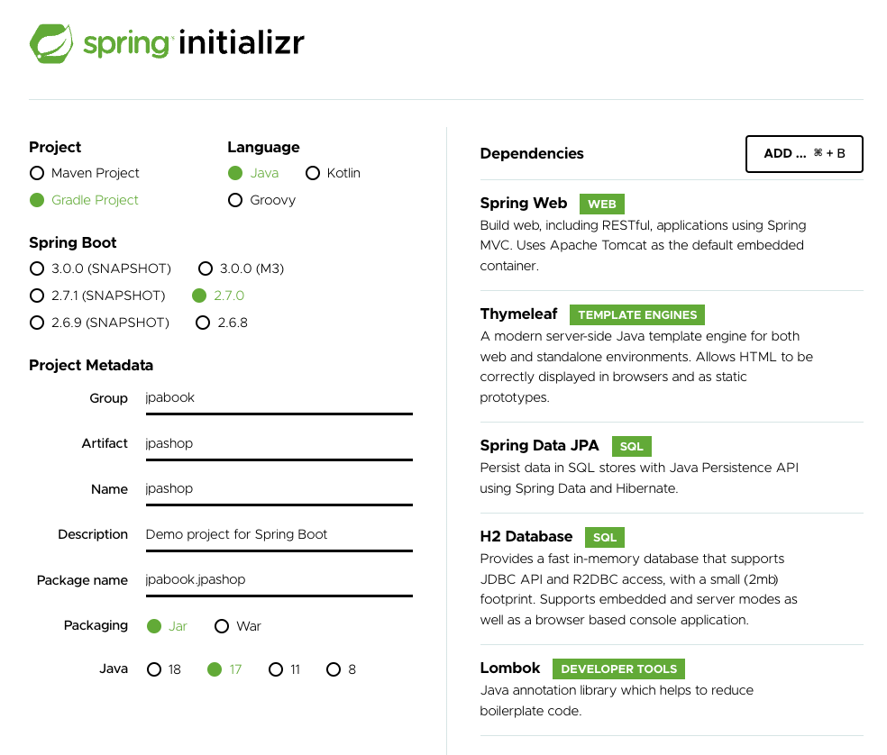
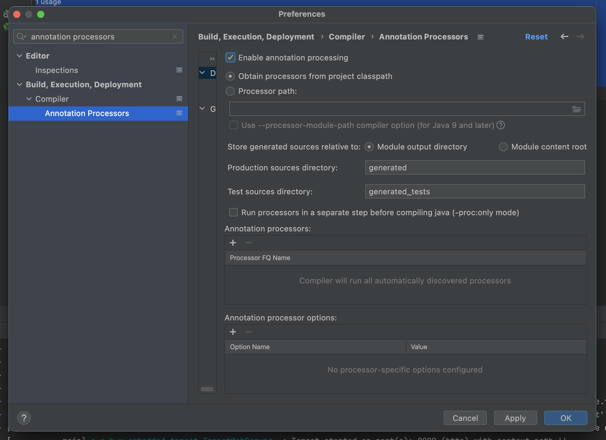

# 01. 프로젝트 생성

spring initializr를 통해 프로젝트 생성



lombok 사용을 위한 설정




# 02. 라이브러리 살펴보기

## **gradle** 의존관계 보기

``` 
./gradlew dependencies —configuration compileClasspath
```


## 스프링부트 라이브러리 살펴보기

* spring-boot-starter-web 
  * spring-boot-starter-tomcat: 톰캣 (웹서버) 
  * spring-webmvc: 스프링 웹 MVC
* spring-boot-starter-thymeleaf: 타임리프 템플릿 엔진(View) 
* spring-boot-starter-data-jpa
  * spring-boot-starter-aop
  * spring-boot-starter-jdbc
    * HikariCP 커넥션 풀 (부트 2.0 기본)
  * hibernate + JPA: 하이버네이트 + JPA
  * spring-data-jpa: 스프링 데이터 JPA 
* spring-boot-starter(공통): 스프링 부트 + 스프링 코어 + 로깅
  * spring-boot 
    * spring-core
  * spring-boot-starter-logging 
    * logback, slf4j


## 테스트 라이브러리

* spring-boot-starter-test
  * junit: 테스트 프레임워크
  * mockito: 목 라이브러리
  * assertj: 테스트 코드를 좀 더 편하게 작성하게 도와주는 라이브러리 
  * spring-test: 스프링 통합 테스트 지원


## 정리

* 핵심 라이브러리 
  * 스프링 MVC 
  * 스프링 ORM
  * JPA, 하이버네이트
  * 스프링 데이터 JPA 
* 기타 라이브러리
  * H2 데이터베이스 클라이언트 
  * 커넥션 풀: 부트 기본은 HikariCP 
  * WEB(thymeleaf)
  * 로깅 SLF4J & LogBack
  * 테스트


# 03. View 환경 설정

## 동적 페이지

``` java
package jpabook.jpashop;

import org.springframework.stereotype.Controller;
import org.springframework.ui.Model;
import org.springframework.web.bind.annotation.GetMapping;

@Controller
public class HelloController {

    @GetMapping("hello")
    public String hello(Model model) {
        model.addAttribute("data", "hello!!");
        return "hello";
    }
}
```


resources/templates/hello.html

``` html
<!DOCTYPE HTML>
  <html xmlns:th="http://www.thymeleaf.org">
  <head>
      <title>Hello</title>
      <meta http-equiv="Content-Type" content="text/html; charset=UTF-8" />
  </head>
<body>
<p th:text="'안녕하세요. ' + ${data}" >안녕하세요. 손님</p>
  </body>
  </html>
```


## 정적 페이지

static/index.html

``` html
<!DOCTYPE HTML>
<html xmlns:th="http://www.thymeleaf.org">

<head>
    <title>Hello</title>
    <meta http-equiv="Content-Type" content="text/html; charset=UTF-8" />
</head>
<body>
Hello
<a href="/hello">hello</a>
</body>
</html>
```


## spring-boot-devtools

html 수정 시 확인하기 위해서 서버 재시작이 필요하다.

spring-boot-devtools 라이브러리를 추가하면 html 파일을 컴파일만 해주면 서버 재시작 없이 View 파일 변경이 가능하다.

``` 
dependencies {
	implementation 'org.springframework.boot:spring-boot-devtools'
}
```


파일 수정 후 `Bulid - Recompile "{fileName}"` 


# 04. H2 데이터베이스 설치

## H2 DB

개발이나 테스트 용도로 가볍고 편리한 DB, 웹 화면 제공

https://www.h2database.com/

### 데이터베이스 파일 생성 방법

* jdbc:h2:~/jpashop (최소 한번)

* ~/jpashop.mv.db 파일 생성 확인
* 이후 부터는 jdbc:h2:tcp://localhost/~/jpashop 이렇게 접속


# 05. JPA와 DB설정, 동작확인

## JPA와 DB설정

application.yml

``` yml
spring:
  datasource:
    url: jdbc:h2:tcp://localhost/~/jpashop
    username: sa
    password:
    driver-class-name: org.h2.Driver

  jpa:
    hibernate:
      ddl-auto: create
    properties:
      hibernate:
#        show_sql: true
        format_sql: true

logging.level:
  org.hibernate.SQL: debug
```

* spring.jpa.hibernate.ddl-auto: create : 애플리케이션 실행 시점에 테이블을 drop하고 다시 생성
* show_sql : System.out에 하이버네이트 실행 SQL을 남긴다.
* org.hiberate.SQL : logger를 통해 하이버네이트 실행 SQL을 남긴다.


## 쿼리 파라미터 로그 남기기

### 방법 1

application.yml

``` yml
logging.level:
  org.hibernate.type: trace
```

SQL 실행 파라미터를 로그로 남긴다.


### 방법 2

외부 라이브러리를 사용한다.

```
implementation 'com.github.gavlyukovskiy:p6spy-spring-boot-starter:1.5.6'
```

> 쿼리 파라미터를 로그로 남기는 외부 라이브러리는 시스템 자원을 사용하므로, 개발 단계에서는 편하게 사용해도 된다. 하짐나 운영시스템에 적용하려면 꼭 성능테스트를 하고 사용하는 것이 좋다.

