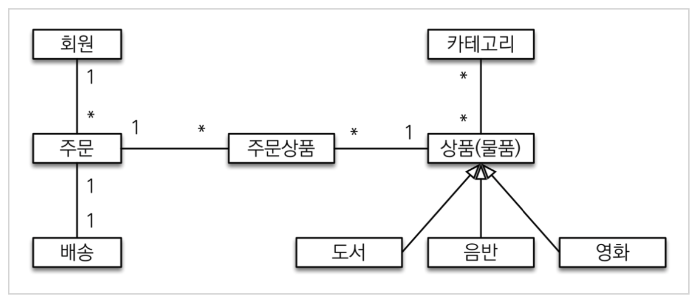
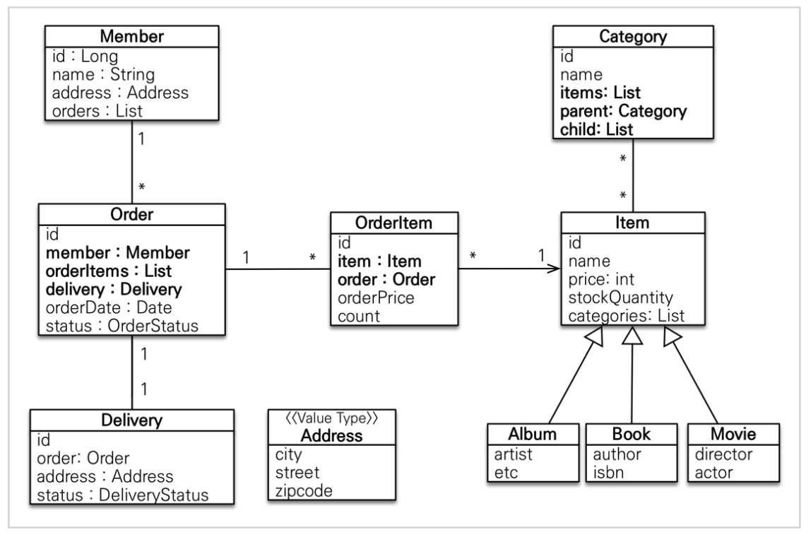
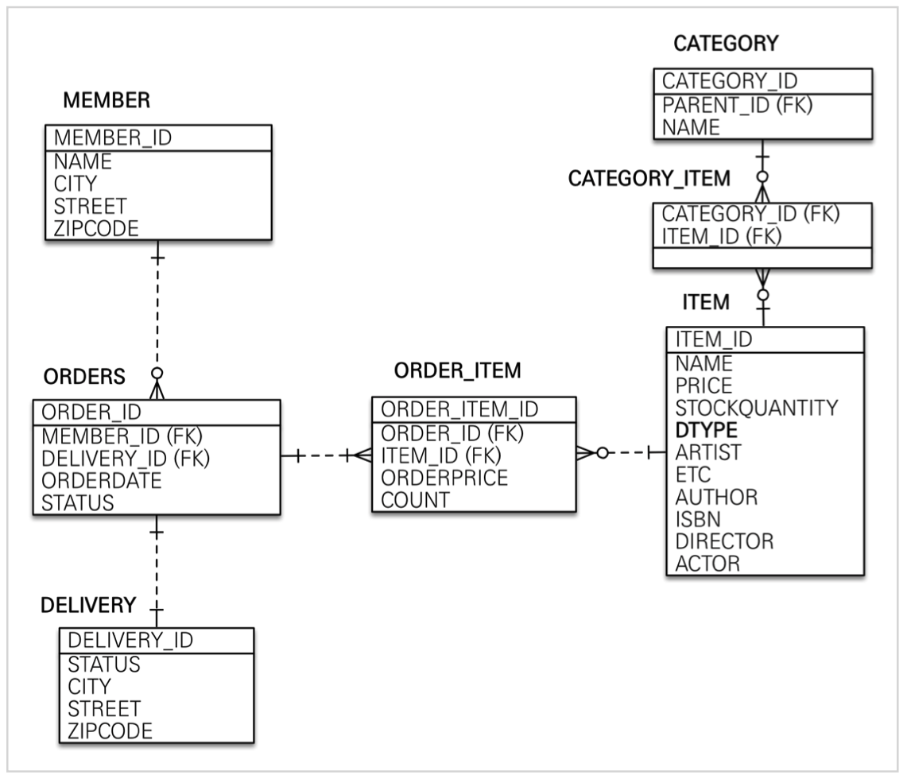

# 01. 요구사항 분석

## 기능 목록

* 회원 기능

  - 회원  등록

  - 회원  조회

* 상품 기능

  - 상품  등록

  - 상품  수정

  - 상품  조회

* 주문 기능 

  * 상품 주문

  - 주문  내역 조회

  - 주문  취소

* 기타 요구사항
  * 상품은 재고 관리가 필요하다.
  * 상품의 종류는 도서, 음반, 영화가 있다. 
  * 상품을 카테고리로 구분할 수 있다.
  * 상품 주문시 배송 정보를 입력할 수 있다.


# 02. 도메인 모델과 테이블 설계

## 도메인 모델




## 클래스 다이어그램




## ERD 다이어그램



> 데이터베이스 테이블명, 칼럼명에 대한 관례는 회사마다 다르다. 보통은 대문자 + _나 소문자 + _ 중 하나를 지정해서 일관성있게 사용한다. 


## 연관관계 매핑 분석

* 회원과 주문 : 일대다, 다대일 양방향 관계, 외래 키가 있는 주문을 연관관계의 주인으로 정한다.
* 주문상품과 주문 : 다대일 양방향 관계, 외래 키가 있는 주문 상품을 연관관계의 주인으로 정한다.
* 주문상품과 상품 : 다대일 단방향 관계
* 주문과 배송 : 일대일 양방향 관계
* 카테고리와 상품 : @ManyToMany를 사용해서 매핑 (실무에서는 사용 X)


# 03. 엔티티 클래스 개발1

> 엔티티 클래스 개발은 코드로 대체하고 주요 부분만 정리한다.

* 예제에서는 설명을 쉽게하기 위해 엔티티 클래스에 Getter, Setter를 모두 열고, 최대한 단순하게 설계하지만 실무에서는 Setter는 꼭 필요한 경우에만 사용하는 것을 추천한다.


# 04. 엔티티 클래스 개발2

``` java
package jpabook.jpashop.domain;

import lombok.Getter;

import javax.persistence.Embeddable;

@Embeddable
@Getter
public class Address {

    private String city;
    private String street;
    private String zipcode;

    protected Address() {
    }

    public Address(String city, String street, String zipcode) {
        this.city = city;
        this.street = street;
        this.zipcode = zipcode;
    }
}
```

값 타입은 변경 불가능하게 설계해야 한다.

@Setter를 제거하고, 생성자에서 값을 모두 초기화해서 변경 불가능한 클래스를 만들자. JPA 스펙상 엔티티나 임베디드 타입은 자바 기본 생성자를 public 또는 protected로 설정해야 한다. public보다 protected가 더 안전하다.

JPA가 이런 제약을 두는 이유는 JPA 구현 라이브러리가 객체를 생성할 때 리플렉션 같은 기술을 사용할 수 있도록 지원해야 하기 때문이다.


# 05. 엔티티 설계시 주의점

### 엔티티에 가급적 Setter를 사용하지 말자

* Setter가 모두 열려있다면 변경포인트가 너무 많아서 유지보수가 어렵다.


### 모든 연관관계는 지연로딩으로 설정

* 즉시로딩은 예측하기 어렵고 어떤 SQL이 실행될지 추적하기 어렵다. 특히 JPQL을 실행할 때 N+1문제가 자주 발생한다.
* 연관된 엔티티를 함께 DB에서 조회해야 하면 fetch join 또는 엔티티 그래프 기능을 사용한다.


### 컬렉션은 필드에서 초기화하자

* 컬렉션을 필드에서 바로 초기화하는 것이 안전하다.
* null 문제에서 안전하다.
* 하이버네이트는 엔티티를 영속화할 때, 컬렉션을 감싸서 하이버네이트가 제공하는 내장 컬렉션으로 변경한다. 만약 getOrders() 처럼 임의의 메서드에서 컬렉션을 잘못 생성하면 하이버네이트 내부 메커니즘에 문제가 발생할 수 있다. 따라서 필드레벨에서 생성하는 것이 가장 안전하고 코드도 간결하다.

```java
Member member = new Member();
System.out.println(member.getOrders().getClass());
em.persist(team);
System.out.println(member.getOrders().getClass());

//출력 결과
// class java.util.ArrayList
// class org.hibernate.collection.internal.PersistentBag
```


### 테이블, 컬럼명 생성 전략

* 하이버네이트 기존 구현은 엔티티의 필드명을 그대로 테이블의 칼럼명으로 사용한다.
  * SpringPhysicalNamingStrategy
* 스프링 부트는 몇 가지 규칙을 통해 변경하여 칼럼명에 사용한다.
  * 카멜케이스 -> 언더스코어
  * 점 -> 언더스코어
  * 대문자 -> 소문자