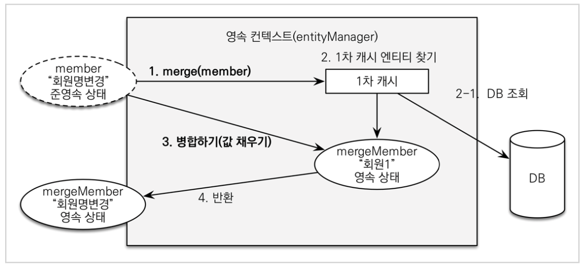

# 01. 홈 화면과 레이아웃

## 홈 컨트롤러

``` java
package jpabook.jpashop.controller;

import lombok.extern.slf4j.Slf4j;
import org.springframework.stereotype.Controller;
import org.springframework.web.bind.annotation.RequestMapping;

@Controller
@Slf4j
public class HomeController {

    @RequestMapping("/")
    public String home() {
        log.info("home controller");
        return "home";
    }
}
```


## html, css

화면 구성을 위한 html과 css 파일들은 코드로 대체한다.


# 02. 회원 등록

## 멤버 컨트롤러

``` java
package jpabook.jpashop.controller;

import jpabook.jpashop.domain.Address;
import jpabook.jpashop.domain.Member;
import jpabook.jpashop.service.MemberService;
import lombok.RequiredArgsConstructor;
import org.springframework.stereotype.Controller;
import org.springframework.ui.Model;
import org.springframework.validation.BindingResult;
import org.springframework.web.bind.annotation.GetMapping;
import org.springframework.web.bind.annotation.PostMapping;

import javax.validation.Valid;

@Controller
@RequiredArgsConstructor
public class MemberController {

    private final MemberService memberService;

    @GetMapping("/members/new")
    public String createForm(Model model) {
        model.addAttribute("memberForm", new MemberForm());
        return "members/createMemberForm";
    }

    @PostMapping("/members/new")
    public String create(@Valid MemberForm form, BindingResult result) {
        if (result.hasErrors()) {
            return "members/createMemberForm";
        }

        Address address = new Address(form.getCity(), form.getStreet(), form.getZipcode());
        Member member = new Member();
        member.setName(form.getName());
        member.setAddress(address);
        memberService.join(member);

        return "redirect:/";
    }
}
```


## 회원 등록 폼 객체

``` java
package jpabook.jpashop.controller;

import lombok.Getter;
import lombok.Setter;

import javax.validation.constraints.NotEmpty;

@Getter
@Setter
public class MemberForm {
    @NotEmpty(message = "회원 이름은 필수 입니다.")
    private String name;

    private String city;
    private String street;
    private String zipcode;

}
```


# 03. 회원 목록 조회

## 멤버 컨트롤러

``` java
package jpabook.jpashop.controller;

import jpabook.jpashop.domain.Address;
import jpabook.jpashop.domain.Member;
import jpabook.jpashop.service.MemberService;
import lombok.RequiredArgsConstructor;
import org.springframework.stereotype.Controller;
import org.springframework.ui.Model;
import org.springframework.validation.BindingResult;
import org.springframework.web.bind.annotation.GetMapping;
import org.springframework.web.bind.annotation.PostMapping;

import javax.validation.Valid;
import java.util.List;

@Controller
@RequiredArgsConstructor
public class MemberController {

    private final MemberService memberService;

    @GetMapping("/members")
    public String list(Model model) {
        List<Member> members = memberService.findMembers();
        model.addAttribute("members", members);
        return "members/memberList";
    }

}
```


## 폼 객체 vs  엔티티 직접 사용

요구사항이 정말 단순할 때는 폼 객체( MemberForm ) 없이 엔티티( Member )를 직접 등록과 수정 화면에서 사용해도 된다.하지만 화면 요구사항이 복잡해지기 시작하면, 엔티티에 화면을 처리하기 위한 기능이 점점 증가한다. 결과적으로 엔티티는 점점 화면에 종속적으로 변하고, 이렇게 화면 기능 때문에 지저분해진 엔티티는 결국 유지보수하기 어려워진다.

실무에서 **엔티티는 핵심 비즈니스 로직만 가지고 있고**, **화면을 위한 로직은 없어야 한다**. 화면이나 API에 맞 는 폼 객체나 DTO를 사용하자. 그래서 화면이나 API 요구사항을 이것들로 처리하고, 엔티티는 최대한 순수 하게 유지하자.


# 04. 상품 등록

## 상품 등록 및 목록 컨트롤러

``` java
package jpabook.jpashop.controller;

import jpabook.jpashop.domain.item.Book;
import jpabook.jpashop.domain.item.Item;
import jpabook.jpashop.service.ItemService;
import lombok.RequiredArgsConstructor;
import org.springframework.stereotype.Controller;
import org.springframework.ui.Model;
import org.springframework.web.bind.annotation.GetMapping;
import org.springframework.web.bind.annotation.PostMapping;

import java.util.List;

@Controller
@RequiredArgsConstructor
public class ItemController {

    private final ItemService itemService;

    @GetMapping(value = "/items/new")
    public String createForm(Model model) {
        model.addAttribute("form", new BookForm());
        return "items/createItemForm";
    }

    @PostMapping(value = "/items/new")
    public String create(BookForm form) {
        Book book = new Book();

        book.setName(form.getName());
        book.setPrice(form.getPrice());
        book.setStockQuantity(form.getStockQuantity());
        book.setAuthor(form.getAuthor());
        book.setIsbn(form.getIsbn());

        itemService.saveItem(book);
        return "redirect:/items";
    }

    @GetMapping("/items")
    public String list(Model model) {
        List<Item> items = itemService.findItems();
        model.addAttribute("items", items);
        return "items/itemList";
    }
}
```


# 05. 상품 수정

## 상품 수정 컨트롤러

``` java
package jpabook.jpashop.controller;

import jpabook.jpashop.domain.item.Book;
import jpabook.jpashop.domain.item.Item;
import jpabook.jpashop.service.ItemService;
import lombok.RequiredArgsConstructor;
import org.springframework.stereotype.Controller;
import org.springframework.ui.Model;
import org.springframework.web.bind.annotation.GetMapping;
import org.springframework.web.bind.annotation.ModelAttribute;
import org.springframework.web.bind.annotation.PathVariable;
import org.springframework.web.bind.annotation.PostMapping;

import java.util.List;

@Controller
@RequiredArgsConstructor
public class ItemController {

    private final ItemService itemService;

    @GetMapping(value = "/items/new")
    public String createForm(Model model) {
        model.addAttribute("form", new BookForm());
        return "items/createItemForm";
    }

    @PostMapping(value = "/items/new")
    public String create(BookForm form) {
        Book book = new Book();

        book.setName(form.getName());
        book.setPrice(form.getPrice());
        book.setStockQuantity(form.getStockQuantity());
        book.setAuthor(form.getAuthor());
        book.setIsbn(form.getIsbn());

        itemService.saveItem(book);
        return "redirect:/items";
    }

    @GetMapping("/items")
    public String list(Model model) {
        List<Item> items = itemService.findItems();
        model.addAttribute("items", items);
        return "items/itemList";
    }

    @GetMapping("items/{itemId}/edit")
    public String updateItemForm(@PathVariable("itemId") Long itemId, Model model) {
        Book item = (Book) itemService.findOne(itemId);

        BookForm form = new BookForm();
        form.setId(item.getId());
        form.setName(item.getName());
        form.setPrice(item.getPrice());
        form.setStockQuantity(item.getStockQuantity());
        form.setAuthor(item.getAuthor());
        form.setIsbn(item.getIsbn());

        model.addAttribute("form", form);
        return "items/updateItemForm";
    }

    @PostMapping(value = "/items/{itemId}/edit")
    public String updateItem(@ModelAttribute("form") BookForm form) {
        Book book = new Book();

        book.setId(form.getId());
        book.setName(form.getName());
        book.setPrice(form.getPrice());
        book.setStockQuantity(form.getStockQuantity());
        book.setAuthor(form.getAuthor());
        book.setIsbn(form.getIsbn());

        itemService.saveItem(book);
        return "redirect:/items";
    }
}
```


# 06. 변경 감지와 병합(merge)

## 준영속 엔티티

영속성 컨텍스트가 더는 관리하지 않는 엔티티를 말한다.

``` java
Book book = new Book();

book.setId(form.getId());
book.setName(form.getName());
book.setPrice(form.getPrice());
book.setStockQuantity(form.getStockQuantity());
book.setAuthor(form.getAuthor());
book.setIsbn(form.getIsbn());

itemService.saveItem(book);
```

위 경우 Book 객체는 이미 DB에 한 번 저장되어서 식별자가 존재한다. 이렇게 임의로 만들어낸 엔티티도 기존 식별자를 가지고 있으면 준영속 엔티티로 볼 수 있다.


준영속 엔티티를 수정하기 위해 두 가지 방법이 있다.

* 변경 감지 기능
* 병합(merge) 기능


## 변경 감지 기능, Dirty Checking

``` java
@Transactional
void update(Item itemParam) { //itemParam: 파리미터로 넘어온 준영속 상태의 엔티티
    Item findItem = em.find(Item.class, itemParam.getId()); //같은 엔티티를 조회한다.
    findItem.setPrice(itemParam.getPrice()); //데이터를 수정한다. 
}
```

영속성 컨텍스트에서 엔티티를 다시 조회한 후 데이터를 수정하는 방법이다.

트랜잭션 안에서 엔티티를 다시 조회, 변경할 값 선택하면 트랜잭션 커밋 시점에 변경 감지가 동작해서 데이터베이스 update sql을 실행한다.


## 병합, Merge

``` java
@Transactional
void update(Item itemParam) { //itemParam: 파리미터로 넘어온 준영속 상태의 엔티티 
    Item mergeItem = em.merge(itemParam);
}
```

준영속 상태의 엔티티를 영속 상태로 변경할 떄 사용한다. 

병합을 사용하면 모든 속성이 변경되어 값이 없으면 null로 업데이트할 위험도 있다.


### 병합의 동작 방식



1. merge() 실행
2. 파리미터로 넘어온 준영속 엔티티의 식별자 값으로 1차 캐시에서 엔티티를 조회
   1. 1차 캐시에 엔티티가 없으면 DB에서 엔티티를 조회하고, 1차 캐시에 저장
3. 조회한 영속 엔티티(mergeMember)에 member 엔티티의 값을 채워 넣는다. 이 때 엔티티의 모든 값이 변경된다.
4. 영속 상태인 mergeMember를 반환한다.
5. mergeMember는 영속 상태이므로 트랜잭션 커밋 시점에 변경 감지가 동작한다.


## 가장 좋은 방법

엔티티를 변경할 때는 항상 변경 감지를 사용해라

* 컨트롤러에서 어설프게 엔티티 생성 X
* 트랜잭션이 있는 서비스 계층에 식별자(id)와 변경할 데이터를 명확하게 전달 (파라미터 or DTO)
* 트랜잭션이 있는 서비스 계층에서 영속 상태 엔티티를 조회하고 엔티티의 데이터를 직접 변경
* 트랜잭션 커밋 시점에 변경 감지가 실행

``` java
@Controller
@RequiredArgsConstructor
public class ItemController {

    private final ItemService itemService;

    @PostMapping(value = "/items/{itemId}/edit")
    public String updateItem(@ModelAttribute("form") BookForm form) {
        itemService.updateItem(form.getId(), form.getName(), form.getPrice());
        return "redirect:/items";
    }
}
```

``` java
@Service
@Transactional(readOnly = true)
@RequiredArgsConstructor
public class ItemService {

    private final ItemRepository itemRepository;

    @Transactional
    public void updateItem(Long id, String name, int price) {
        Item item = itemRepository.findOne(id);
        item.setName(name);
        item.setPrice(price);
    }
}
```


# 07. 상품 주문

## 주문 컨트롤러

``` java
package jpabook.jpashop.controller;

import jpabook.jpashop.domain.Member;
import jpabook.jpashop.domain.item.Item;
import jpabook.jpashop.service.ItemService;
import jpabook.jpashop.service.MemberService;
import jpabook.jpashop.service.OrderService;
import lombok.RequiredArgsConstructor;
import org.springframework.stereotype.Controller;
import org.springframework.ui.Model;
import org.springframework.web.bind.annotation.GetMapping;
import org.springframework.web.bind.annotation.PostMapping;
import org.springframework.web.bind.annotation.RequestParam;

import javax.persistence.PreUpdate;
import java.util.List;

@Controller
@RequiredArgsConstructor
public class OrderController {

    private final OrderService orderService;
    private final MemberService memberService;
    private final ItemService itemService;

    @GetMapping("/order")
    public String createForm(Model model) {
        List<Member> members = memberService.findMembers();
        List<Item> items = itemService.findItems();

        model.addAttribute("members", members);
        model.addAttribute("items", items);

        return "order/orderForm";
    }

    @PostMapping("/order")
    public String order(@RequestParam("memberId") Long memberId,
                        @RequestParam("itemId") Long itemId,
                        @RequestParam("count") int count) {
        orderService.order(memberId, itemId, count);
        return "redirect:/orders";
    }
}
```


### Controller에서 엔티티가 아닌 id 값만 넘기는 이유

* controller가 간결해진다.
* service내 transaction 안에서 JPA가 동작할 때 깔끔하다.

``` java
@PostMapping("/order")
public String order(@RequestParam("memberId") Long memberId,
                    @RequestParam("itemId") Long itemId,
                    @RequestParam("count") int count) {

  Member member = memberRepository.findOne(memberId);
  Item item = itemRepository.findOne(itemId);
  item.setPrice(88888); //더티체킹이 일어나는 시점은 트랜잭션 종료 지점이라 해당 지점에서는 변경이랑 관련이 없다. 그래서 트랜잭션이 있는 서비스 메소드 부분을 주석쳐버리면 변경은 일어나지 않는다.


  //  persist / merge / flush 등을 호출시 에러를 터트려 트랜잭션 범위 밖에서는 값을 변경할 수 없다.
  //        entityManager.flush();
  //        memberRepository.save(member);
  //        itemRepository.save(item);
  orderService.order(member, item, count);

  return "redirect:/orders";
}
```


# 08. 주문 목록 검색, 취소

``` java
package jpabook.jpashop.controller;

import jpabook.jpashop.Repository.OrderSearch;
import jpabook.jpashop.domain.Member;
import jpabook.jpashop.domain.Order;
import jpabook.jpashop.domain.item.Item;
import jpabook.jpashop.service.ItemService;
import jpabook.jpashop.service.MemberService;
import jpabook.jpashop.service.OrderService;
import lombok.RequiredArgsConstructor;
import org.springframework.stereotype.Controller;
import org.springframework.ui.Model;
import org.springframework.web.bind.annotation.*;

import javax.persistence.PreUpdate;
import java.util.List;

@Controller
@RequiredArgsConstructor
public class OrderController {

    private final OrderService orderService;
    private final MemberService memberService;
    private final ItemService itemService;

    @GetMapping("/orders")
    public String orderList(@ModelAttribute("orderSearch") OrderSearch orderSearch, Model model) {
        List<Order> orders = orderService.findOrders(orderSearch);
        model.addAttribute("orders", orders);

        return "order/orderList";
    }

    @PostMapping("/orders/{orderId}/cancel")
    public String cancelOrder(@PathVariable("orderId") Long orderId) {
        orderService.cancelOrder(orderId);
        return "redirect:/orders";
    }
}

```

