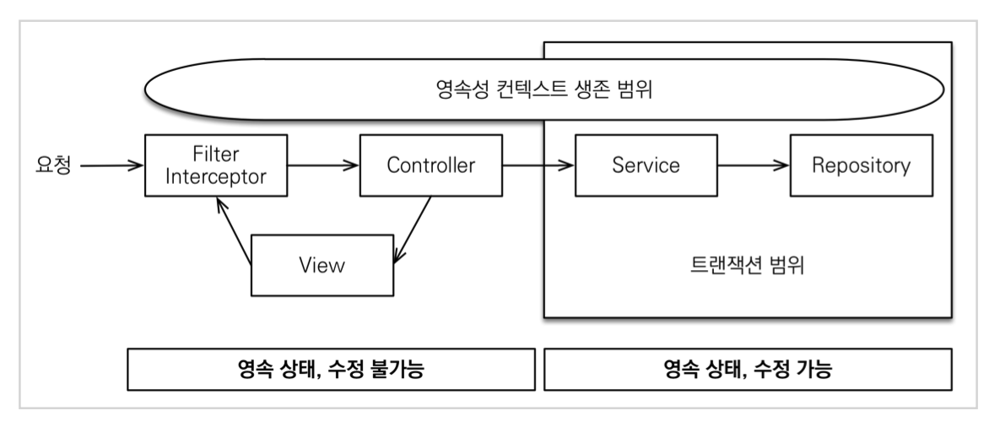
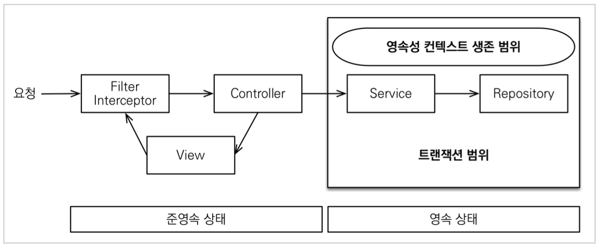

# 01. OSIV와 성능 최적화

하이버네이트에서는 Open Session In View라고 해서 OSIV이고, JPA에서는 Open EntityManager In View라고 해서 OEIV라고 하지만 관례상 OSIV를 더 많이 사용한다.

### OSIV ON

spring.jpa.open-in-view의 기본값은 true이다.

기본값 아용 시 애플리케이션 시작 시점에 warn 로그가 남는다.

OSIV 전략은 트랜잭션 시작처럼 최초 데이터베이스 커넥션 시작 시점부터 API 응답이 끝날 때 까지 영속성 컨텍스트와 데이터베이스 커넥션을 유지한다. 그래서 지금까지 API 컨트롤러에서 지연 로딩이 가능했다.

지연 로딩은 영속성 컨텍스트가 살아있어야 가능하고, 영속성 컨텍스트는 기본적으로 데이터베이스 커넥션을 유지한다. 

하지만 너무 오랜시간동안 데이터베이스 커넥션 리소스를 사용하기 때문에 실시간 트래픽이 중요한 애플리케이션에서는 커넥션이 모자랄 수 있다. 이것은 결국 장애로 이어진다.

### OSIV OFF

OSIV를 끄면 트랜잭션을 종료할 때 영속성 컨텍스트를 닫고, 데이터베이스 커넥션도 반환한다. 따라서 커넥션 리소스를 낭비하지 않는다.

OSIV를 끄면 모든 지연로딩을 트랜잭션 안에서 처리해야 한다. 결론적으로 트랜잭션이 끝나기 전에 지연 로딩을 강제로 호출해 두어야 한다.

### 커맨드와 쿼리 분리

실무에서 OSIV를 끈 상태로 복잡성을 관리하는 좋은 방법이 있다. 바로 Command와 Query를 분리하는 것이다. 

보통 비즈니스 로직은 특정 엔티티 몇 개를 등록하거나 수정하는 것이므로 성능이 크게 문제가 되지 않는다. 그런데 복잡한 화면을 출력하기 위한 쿼리는 화면에 맞추어 성능을 최적화 하는 것이 중요하다. 하지만 그 복잡성에 비해 핵심 비즈니스에 큰 영향을 주는 것은 아니다.

따라서 OrderService에는 핵심 비즈니스 로직을 넣고 OrderQueryService에는 화면이나 API에 맞춘 로직을 넣는다.

> 고객 서비스의 실시간 API는 OSIV를 끄고, ADMIN 처럼 커넥션을 많이 사용하지 않는 곳에서는 OSIV를 켠다.