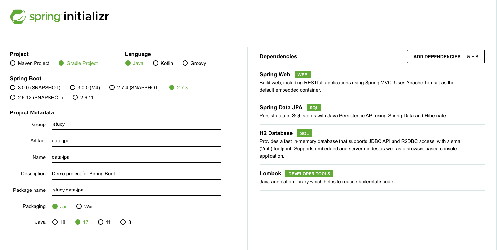
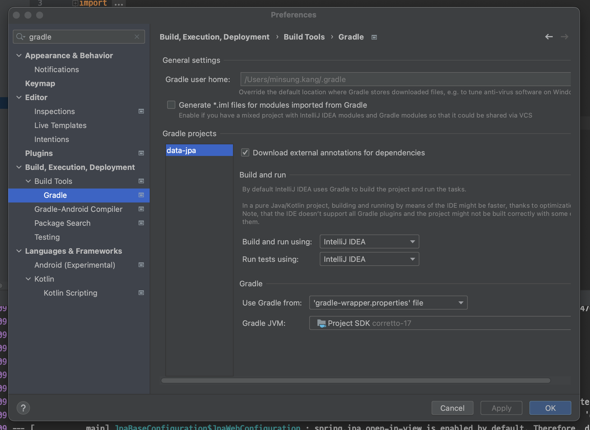
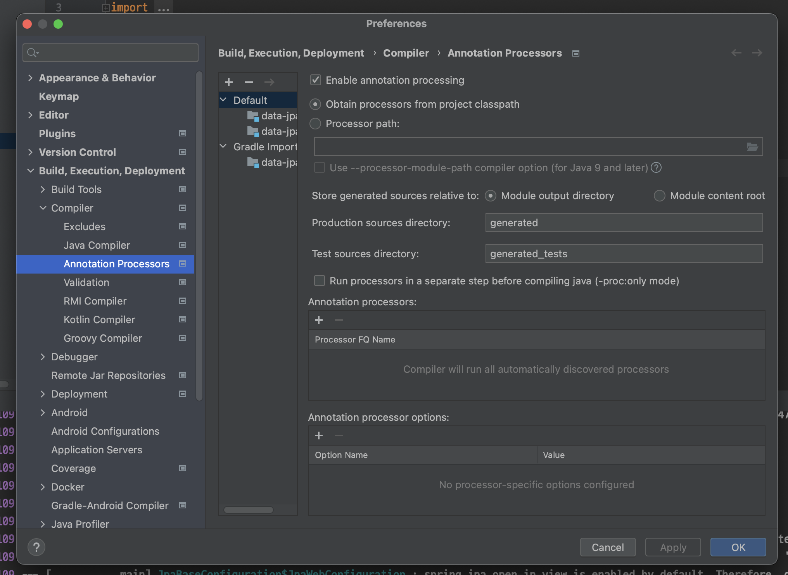
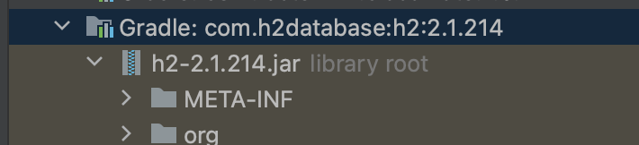

# 01. 프로젝트 생성

## 프로젝트 생성



## 추가 설정

### IntelliJ로 실행




### 롬복 적용




# 02. 라이브러리 살펴보기

``` 
./gradlew dependencies --configuration compileClasspath
```


# 03. H2 데이터베이스 설치

h2 database 설치 : https://www.h2database.com

설치 시 스프링 부트 버전과 맞춰야한다.

gradle에서 h2를 가져오면 스프링 부트 버전에 맞는 h2 버전으로 가져오므로 설치시에도 그 버전을 확인하여 설치한다.




설치 후 h2 database 실행

``` 
./h2/bin/h2.sh
```


실행되는 창에서 초기에 데이터베이스 파일을 한 번 만든 후, 이후부터는 tcp로 접속한다.

* jdbc:h2:~/datajpa(최초 한 번만)
* ~/datajpa.mv.db 파일 생성
* 이후 부터는 jdbc:h2:tcp://localhost/~/datajpa 이렇게 접속


# 04. 스프링 데이터 JPA와 DB 설정, 동작확인

## 설정

application.yml

``` yaml
spring:
  datasource:
    url: jdbc:h2:tcp://localhost/~/datajpa
    username: sa
    password:
    driver-class-name: org.h2.Driver

  jpa:
    hibernate:
      ddl-auto: create
    properties:
      hibernate:
        # show_sql: true
        format_sql: true

logging.level:
  org.hibernate.SQL: debug
# org.hibernate.type: trace
```

* ddl-auto : 애플리케이션 실행 시점에 테이블을 drop하고 다시 생성한다.
* 모든 로그 출력은 로거를 통해 남기는게 좋다.
  * show_sql : System.out에 하이버네이트 실행 SQL을 남긴다.
  * org.hiberate.SQL : logger를 통해 하이버네이트 실행 SQL을 남긴다.


## JPA 기반

``` java
package study.datajpa.entity;

import lombok.Getter;
import lombok.Setter;

import javax.persistence.Entity;
import javax.persistence.GeneratedValue;
import javax.persistence.Id;

@Entity
@Getter
@Setter
public class Member {
    @Id
    @GeneratedValue
    private Long id;
    private String username;


    public Member(String username) {
        this.username = username;
    }

    protected Member() {
    }
}
```

``` java
package study.datajpa.repository;

import org.springframework.stereotype.Repository;
import study.datajpa.entity.Member;

import javax.persistence.EntityManager;
import javax.persistence.PersistenceContext;

@Repository
public class MemberJpaRepository {
    @PersistenceContext
    private EntityManager em;

    public Member save(Member member) {
        em.persist(member);
        return member;
    }

    public Member find(Long id) {
        return em.find(Member.class, id);
    }
}
```

``` java
package study.datajpa.repository;

import org.junit.jupiter.api.Test;
import org.springframework.beans.factory.annotation.Autowired;
import org.springframework.boot.test.context.SpringBootTest;
import org.springframework.transaction.annotation.Transactional;
import study.datajpa.entity.Member;

import static org.assertj.core.api.Assertions.assertThat;

@SpringBootTest
@Transactional
class MemberJpaRepositoryTest {
    @Autowired
    MemberJpaRepository memberJpaRepository;

    @Test
    public void testMember() {
        Member member = new Member("memberA");
        Member savedMember = memberJpaRepository.save(member);

        Member findMember = memberJpaRepository.find(savedMember.getId());

        assertThat(findMember.getId()).isEqualTo(member.getId());
        assertThat(findMember.getUsername()).isEqualTo(member.getUsername());

        assertThat(findMember).isEqualTo(member);
    }
}
```


## 스프링 데이터 JPA 기반

``` java
package study.datajpa.repository;

import org.springframework.data.jpa.repository.JpaRepository;
import study.datajpa.entity.Member;

public interface MemberRepository extends JpaRepository<Member, Long> {
}
```

``` java
package study.datajpa.repository;

import org.junit.jupiter.api.Test;
import org.springframework.beans.factory.annotation.Autowired;
import org.springframework.boot.test.context.SpringBootTest;
import org.springframework.test.annotation.Rollback;
import org.springframework.transaction.annotation.Transactional;
import study.datajpa.entity.Member;

import static org.assertj.core.api.Assertions.assertThat;

@SpringBootTest
@Transactional
@Rollback(false)
class MemberRepositoryTest {
    @Autowired
    MemberRepository memberRepository;

    @Test
    public void testMember() {
        Member member = new Member("memberA");
        Member savedMember = memberRepository.save(member);

        Member findMember = memberRepository.findById(savedMember.getId()).get();

        assertThat(findMember.getId()).isEqualTo(member.getId());
        assertThat(findMember.getUsername()).isEqualTo(member.getUsername());

        assertThat(findMember).isEqualTo(member);
    }
}
```


## 쿼리 파라미터 로그 남기기

### 방법 1

``` yaml
logging.level:
	org.hibernate.type: trace
```

기본적으로 제공해주는 방법이지만 쿼리 파라미터를 한 눈에 보기 어려움


### 방법 2

외부라이브러리를 사용한다.

``` 
implementation 'com.github.gavlyukovskiy:p6spy-spring-boot-starter:1.5.7'
```


아래와 같이 쿼리 파라미터를 바로 보여준다.

``` sql
insert into member (username, id) values ('memberA', 1);
```


