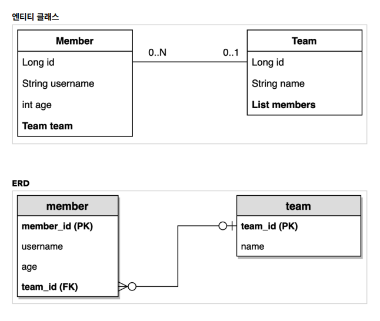

# 01. 예제 도메인 모델과 동작확인



## Member

``` java
package study.datajpa.entity;

import lombok.*;

import javax.persistence.*;

@Entity
@Getter
@Setter
@NoArgsConstructor(access = AccessLevel.PROTECTED)
@ToString(of = {"id", "username", "age"})
public class Member {
    @Id
    @GeneratedValue
    @Column(name = "member_id")
    private Long id;
    private String username;
    private int age;

    @ManyToOne(fetch = FetchType.LAZY)
    @JoinColumn(name = "team_id")
    private Team team;
    public Member(String username) {
        this(username, 0);
    }

    public Member(String username, int age) {
        this(username, age, null);
    }

    public Member(String username, int age, Team team) {
        this.username = username;
        this.age = age;
        if (team != null) {
            changeTeam(team);
        }
    }

    public void changeTeam(Team team) {
        this.team = team;
        team.getMembers().add(this);
    }
}
```


## Team


``` java
package study.datajpa.entity;

import lombok.*;

import javax.persistence.*;
import java.util.ArrayList;
import java.util.List;

@Entity
@Getter
@Setter
@NoArgsConstructor(access = AccessLevel.PROTECTED)
@ToString(of = {"id", "name"})
public class Team {

    @Id
    @GeneratedValue
    @Column(name = "team_id")
    private Long id;
    private String name;

    @OneToMany(mappedBy = "team")
    List<Member> members = new ArrayList<>();

    public Team(String name) {
        this.name = name;
    }
}
```

