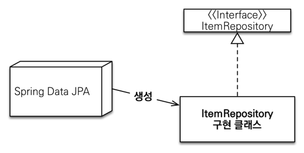

# 01. 순수 JPA 리포지토리 만들기

순수 JPA 리포지토리로 기본 CRUD를 구현한다.

* 저장
* 변경 -> 변경감지 사용
* 삭제
* 전체 조회
* 단건 조회
* 카운트


## MemberJpaRepository

``` java
package study.datajpa.repository;

import org.springframework.stereotype.Repository;
import study.datajpa.entity.Member;

import javax.persistence.EntityManager;
import javax.persistence.PersistenceContext;
import java.util.List;
import java.util.Optional;

@Repository
public class MemberJpaRepository {
    @PersistenceContext
    private EntityManager em;

    public Member save(Member member) {
        em.persist(member);
        return member;
    }

    public void delete(Member member) {
        em.remove(member);
    }

    public List<Member> findAll() {
        return em.createQuery("select m from Member m", Member.class)
                .getResultList();
    }

    public Optional<Member> findById(Long id) {
        Member member = em.find(Member.class, id);
        return Optional.ofNullable(member);
    }

    public long count() {
        return em.createQuery("select count(m) from Member m", Long.class)
                .getSingleResult();
    }

    public Member find(Long id) {
        return em.find(Member.class, id);
    }
}
```


## TeamJpaRepository

``` java
package study.datajpa.repository;

import org.springframework.stereotype.Repository;
import study.datajpa.entity.Team;

import javax.persistence.EntityManager;
import javax.persistence.PersistenceContext;
import java.util.List;
import java.util.Optional;

@Repository
public class TeamJpaRepository {

    @PersistenceContext
    private EntityManager em;

    public Team save(Team team) {
        em.persist(team);
        return team;
    }

    public void delete(Team team) {
        em.remove(team);
    }

    public List<Team> findAll() {
        return em.createQuery("select t from Team t", Team.class)
                .getResultList();
    }

    public Optional<Team> findById(Long id) {
        Team team = em.find(Team.class, id);
        return Optional.ofNullable(team);
    }

    public long count() {
        return em.createQuery("select count(t) from Team t", Long.class)
                .getSingleResult();
    }
}
```


## 테스트

``` java
package study.datajpa.repository;

import org.junit.jupiter.api.Test;
import org.springframework.beans.factory.annotation.Autowired;
import org.springframework.boot.test.context.SpringBootTest;
import org.springframework.transaction.annotation.Transactional;
import study.datajpa.entity.Member;

import java.util.List;

import static org.assertj.core.api.Assertions.assertThat;

@SpringBootTest
@Transactional
class MemberJpaRepositoryTest {
    @Autowired
    MemberJpaRepository memberJpaRepository;

    @Test
    public void testMember() {
        Member member = new Member("memberA");
        Member savedMember = memberJpaRepository.save(member);

        Member findMember = memberJpaRepository.find(savedMember.getId());

        assertThat(findMember.getId()).isEqualTo(member.getId());
        assertThat(findMember.getUsername()).isEqualTo(member.getUsername());

        assertThat(findMember).isEqualTo(member);
    }

    @Test
    public void basicCRUD() {
        Member member1 = new Member("member1");
        Member member2 = new Member("member2");
        memberJpaRepository.save(member1);
        memberJpaRepository.save(member2);

        // 단건 조회 검증
        Member findMember1 = memberJpaRepository.findById(member1.getId()).get();
        Member findMember2 = memberJpaRepository.findById(member2.getId()).get();
        assertThat(findMember1).isEqualTo(member1);
        assertThat(findMember2).isEqualTo(member2);

        // 리스트 조회 검증
        List<Member> all = memberJpaRepository.findAll();
        assertThat(all.size()).isEqualTo(2);

        // 카운트 검증
        long count = memberJpaRepository.count();
        assertThat(count).isEqualTo(2);

        // 삭제 검증
        memberJpaRepository.delete(member1);
        memberJpaRepository.delete(member2);

        long deletedCount = memberJpaRepository.count();
        assertThat(deletedCount).isEqualTo(0);
    }
}
```


# 02. 공통 인터페이스 설정

## JavaConfig 설정

스프링부트를 사용하지 않을 시, @EnableJpaRepositories을 지정해야한다.

``` java
@Configuration
@EnableJpaRepositories(basePackages = "jpabook.jpashop.repository")
public class AppConfig {}
```


스프링부트를 사용하면 @SpringBootApplication 패키지와 하위 패키지들을 인식한다.

만약 위치가 달라지면 스프링부트에서도 @EnableJpaRepositories가 필요하다.


## 구현 클래스 생성

Spring Data JPA는 인터페이스를 기반으로 구현 클래스를 생성해준다.




``` java
memberRepository.getClass() // class com.sun.proxy.$ProxyXXX
```


해당 인터페이스들은 @Repository 애노테이션을 생략가능하다.


# 03. 공통 인터페이스 적용

순수 JPA 리포지토리에서 사용한 테스트가 Spring Data JPA에서도 동작하는지 확인해보자.

## MemberRepositoryTest

``` java
package study.datajpa.repository;

import org.junit.jupiter.api.Test;
import org.springframework.beans.factory.annotation.Autowired;
import org.springframework.boot.test.context.SpringBootTest;
import org.springframework.test.annotation.Rollback;
import org.springframework.transaction.annotation.Transactional;
import study.datajpa.entity.Member;

import java.util.List;

import static org.assertj.core.api.Assertions.assertThat;

@SpringBootTest
@Transactional
@Rollback(false)
class MemberRepositoryTest {
    @Autowired
    MemberRepository memberRepository;

    @Test
    public void basicCRUD() {
        Member member1 = new Member("member1");
        Member member2 = new Member("member2");
        memberRepository.save(member1);
        memberRepository.save(member2);

        // 단건 조회 검증
        Member findMember1 = memberRepository.findById(member1.getId()).get();
        Member findMember2 = memberRepository.findById(member2.getId()).get();
        assertThat(findMember1).isEqualTo(member1);
        assertThat(findMember2).isEqualTo(member2);

        // 리스트 조회 검증
        List<Member> all = memberRepository.findAll();
        assertThat(all.size()).isEqualTo(2);

        // 카운트 검증
        long count = memberRepository.count();
        assertThat(count).isEqualTo(2);

        // 삭제 검증
        memberRepository.delete(member1);
        memberRepository.delete(member2);

        long deletedCount = memberRepository.count();
        assertThat(deletedCount).isEqualTo(0);
    }
}
```


# 04. 공통 인터페이스 분석

* JpaRepository 인터페이스: 공통 CRUD 제공
* 제너릭은 <엔티티 타입, 식별자 타입> 설정


``` java
public interface JpaRepository<T, ID extends Serializable>
 extends PagingAndSortingRepository<T, ID>
{
 ...
}

public interface MemberRepository extends JpaRepository<Member, Long> {
}
```


## 공통 인터페이스 구성


* T: 엔티티
* ID: 엔티티와 식별자 타입
* S: 엔티티와 그 자식 타입