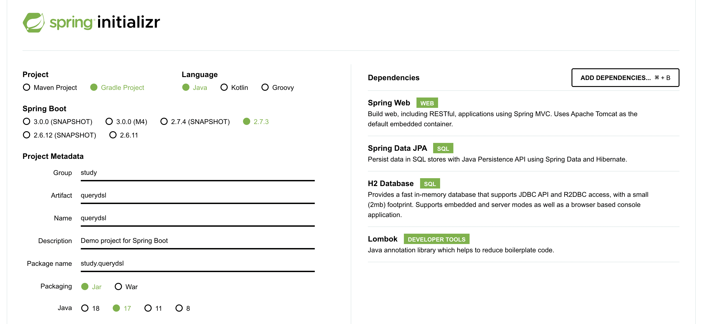
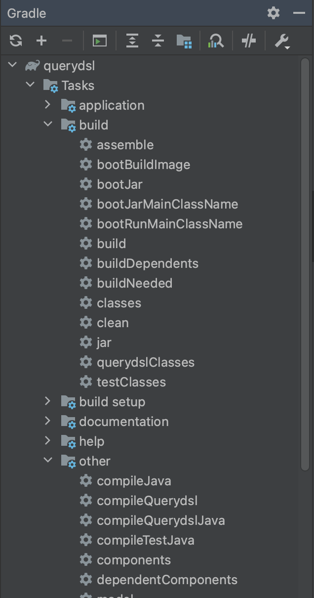

# 01. 프로젝트 생성




# 02. Querydsl 설정과 검증

## build.gradle 추가

``` groovy
buildscript {
	ext {
		queryDslVersion = "5.0.0"
	}
}

plugins {
	id 'org.springframework.boot' version '2.7.3'
	id 'io.spring.dependency-management' version '1.0.13.RELEASE'
	//querydsl 추가
	id "com.ewerk.gradle.plugins.querydsl" version "1.0.10"
	id 'java'
}

group = 'study'
version = '0.0.1-SNAPSHOT'
sourceCompatibility = '17'

configurations {
	compileOnly {
		extendsFrom annotationProcessor
	}
}

repositories {
	mavenCentral()
}

dependencies {
	implementation 'org.springframework.boot:spring-boot-starter-data-jpa'
	implementation 'org.springframework.boot:spring-boot-starter-web'
	//querydsl 추가
	implementation "com.querydsl:querydsl-jpa:${queryDslVersion}"
	annotationProcessor "com.querydsl:querydsl-apt:${queryDslVersion}"
	compileOnly 'org.projectlombok:lombok'
	runtimeOnly 'com.h2database:h2'
	annotationProcessor 'org.projectlombok:lombok'
	testImplementation 'org.springframework.boot:spring-boot-starter-test'
}

tasks.named('test') {
	useJUnitPlatform()
}

//querydsl 추가 시작
def querydslDir = "$buildDir/generated/querydsl"
querydsl {
	jpa = true
	querydslSourcesDir = querydslDir
}
sourceSets {
	main.java.srcDir querydslDir
}
configurations {
	querydsl.extendsFrom compileClasspath
}
compileQuerydsl {
	options.annotationProcessorPath = configurations.querydsl
}
//querydsl 추가 끝
```


## Querydsl 환경설정 검증

### 검증용 엔티티 생성

``` java
package study.querydsl.entity;

import lombok.Getter;
import lombok.Setter;

import javax.persistence.Entity;
import javax.persistence.GeneratedValue;
import javax.persistence.Id;

@Entity
@Getter
@Setter
public class Hello {
    @Id
    @GeneratedValue
    private Long id;
}
```


### 검증용 Q 타입 생성

#### Intellij 사용법

* Gradle -> Tasks -> build -> clean
* Gradle -> Tasks -> other -> compileQuerydsl




#### Gradle 콘솔 사용법

* ./gradlew clean compileQuerydsl


생성 결과, build -> generated -> querydsl 경로에 파일이 생성된다. 해당 파일들은 git을 통해 버전관리하지 않는다.


### 테스트 케이스로 검증

``` java
package study.querydsl;

import com.querydsl.jpa.impl.JPAQueryFactory;
import org.assertj.core.api.Assertions;
import org.junit.jupiter.api.Test;
import org.springframework.beans.factory.annotation.Autowired;
import org.springframework.boot.test.context.SpringBootTest;
import org.springframework.transaction.annotation.Transactional;
import study.querydsl.entity.Hello;
import study.querydsl.entity.QHello;

import javax.persistence.EntityManager;

import static org.assertj.core.api.Assertions.*;

@SpringBootTest
@Transactional
class QuerydslApplicationTests {

	@Autowired
	EntityManager em;

	@Test
	void contextLoads() {
		Hello hello = new Hello();
		em.persist(hello);

		JPAQueryFactory query = new JPAQueryFactory(em);
		QHello qHello = QHello.hello;

		Hello result = query
				.selectFrom(qHello)
				.fetchOne();

		assertThat(result).isEqualTo(hello);
		assertThat(result.getId()).isEqualTo(hello.getId());
	}
}
```


# 03. 라이브러리 살펴보기


# 04. H2 데이터베이스 설치

* 설치 링크 : https://www.h2database.com 
* h2 데이터베이스 버전은 스프링 부트 버전에 맞춘다. 
* 권한 주기: chmod 755 h2.sh 
* 데이터베이스 파일 생성 방법 
    * `jdbc:h2:~/querydsl` (최소 한번) 
    * `~/querydsl.mv.db` 파일 생성 확인 
    * 이후 부터는 `jdbc:h2:tcp://localhost/~/querydsl` 이렇게 접속


# 05. 스프링 부트 설정 - JPA, DB

## application.yml

``` yaml
spring:
  datasource:
    url: jdbc:h2:tcp://localhost/~/querydsl
    username: sa
    password:
    driver-class-name: org.h2.Driver
  jpa:
    hibernate:
      ddl-auto: create
    properties:
      hibernate:
        # show_sql: true
        format_sql: true

logging.level:
  org.hibernate.SQL: debug
# org.hibernate.type: trace
```

* 모든 로그 출력은 가급적 로거를 통해 남겨야 한다.
    * show_sql : 옵션은 System.out 에 하이버네이트 실행 SQL을 남긴다.
    * org.hibernate.SQL : 옵션은 logger를 통해 하이버네이트 실행 SQL을 남긴다.


## 쿼리 파라미터 로그 남기기

* 로그에 다음을 추가하기 
    * org.hibernate.type : SQL 실행 파라미터를 로그로 남긴다. 
* 외부 라이브러리 사용 : https://github.com/gavlyukovskiy/spring-boot-data-source-decorator

``` 
implementation 'com.github.gavlyukovskiy:p6spy-spring-boot-starter:1.5.8'
```

