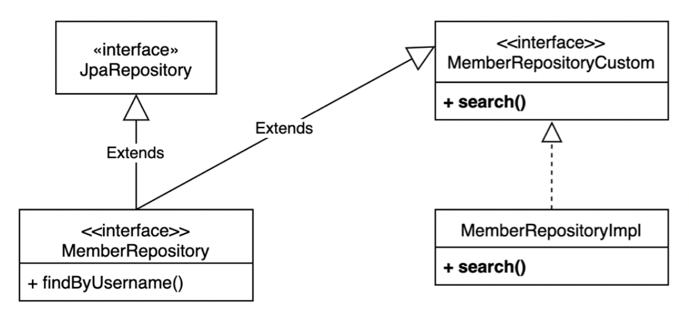

# 01. 스프링 데이터 JPA 리포지토리로 변경

### **스프링 데이터** **JPA - MemberRepository** **생성**

``` java
package study.querydsl.repository;

import org.springframework.data.jpa.repository.JpaRepository;
import study.querydsl.entity.Member;

import java.util.List;

public interface MemberRepository extends JpaRepository<Member, Long> {
    List<Member> findByUsername(String username);
}
```


### 스프링 데이터 JPA 테스트

``` java
package study.querydsl.repository;

import org.junit.jupiter.api.Test;
import org.springframework.beans.factory.annotation.Autowired;
import org.springframework.boot.test.context.SpringBootTest;
import org.springframework.transaction.annotation.Transactional;
import study.querydsl.entity.Member;

import javax.persistence.EntityManager;

import java.util.List;

import static org.assertj.core.api.Assertions.assertThat;
import static org.junit.jupiter.api.Assertions.*;

@SpringBootTest
@Transactional
class MemberRepositoryTest {
    @Autowired
    EntityManager em;

    @Autowired
    MemberRepository memberRepository;

    @Test
    public void basicTest() {
        Member member = new Member("member1", 10);
        memberRepository.save(member);

        Member findMember = memberRepository.findById(member.getId()).get();
        assertThat(findMember).isEqualTo(member);

        List<Member> result1 = memberRepository.findAll();
        assertThat(result1).containsExactly(member);

        List<Member> result2 = memberRepository.findByUsername("member1");
        assertThat(result2).containsExactly(member);
    }
}
```


# 02. 사용자 정의 리포지토리

### 사용자 정의 리포지토리 사용법

1. 사용자 정의 인터페이스 작성 ex) MemberRepositoryCustom
2. 사용자 정의 인터페이스 구현 ex) MemberRepositoryImpl
3. 스프링 데이터 리포지토리에 사용자 정의 인터페이스 상속




### 사용자 정의 인터페이스 작성

``` java
package study.querydsl.repository;

import study.querydsl.dto.MemberSearchCondition;
import study.querydsl.dto.MemberTeamDto;

import java.util.List;

public interface MemberRepositoryCustom {
    List<MemberTeamDto> search(MemberSearchCondition condition);
}

```


### 사용자 정의 인터페이스 구현

``` java
package study.querydsl.repository;

import com.querydsl.core.types.dsl.BooleanExpression;
import com.querydsl.jpa.impl.JPAQueryFactory;
import study.querydsl.dto.MemberSearchCondition;
import study.querydsl.dto.MemberTeamDto;
import study.querydsl.dto.QMemberTeamDto;

import javax.persistence.EntityManager;
import java.util.List;

import static org.springframework.util.ObjectUtils.isEmpty;
import static study.querydsl.entity.QMember.member;
import static study.querydsl.entity.QTeam.team;

public class MemberRepositoryImpl implements MemberRepositoryCustom {
    private final JPAQueryFactory queryFactory;

    public MemberRepositoryImpl(EntityManager em) {
        this.queryFactory = new JPAQueryFactory(em);
    }

    public List<MemberTeamDto> search(MemberSearchCondition condition) {
        return queryFactory
                .select(new QMemberTeamDto(
                        member.id,
                        member.username,
                        member.age,
                        team.id,
                        team.name))
                .from(member)
                .leftJoin(member.team, team)
                .where(usernameEq(condition.getUsername()),
                        teamNameEq(condition.getTeamName()),
                        ageGoe(condition.getAgeGoe()),
                        ageLoe(condition.getAgeLoe()))
                .fetch();
    }

    private BooleanExpression usernameEq(String username) {
        return isEmpty(username) ? null : member.username.eq(username);
    }

    private BooleanExpression teamNameEq(String teamName) {
        return isEmpty(teamName) ? null : team.name.eq(teamName);
    }

    private BooleanExpression ageGoe(Integer ageGoe) {
        return ageGoe == null ? null : member.age.goe(ageGoe);
    }

    private BooleanExpression ageLoe(Integer ageLoe) {
        return ageLoe == null ? null : member.age.loe(ageLoe);
    }
}
```


### 스프링 데이터 리포지토리에 사용자 정의 인터페이스 상속

``` java
package study.querydsl.repository;

import org.springframework.data.jpa.repository.JpaRepository;
import study.querydsl.entity.Member;

import java.util.List;

public interface MemberRepository extends JpaRepository<Member, Long>, MemberRepositoryCustom {
    List<Member> findByUsername(String username);
}
```


### 테스트

``` java
@Test
public void searchTest() {
    Team teamA = new Team("teamA");
    Team teamB = new Team("teamB");

    em.persist(teamA);
    em.persist(teamB);

    Member member1 = new Member("member1", 10, teamA);
    Member member2 = new Member("member2", 20, teamA);
    Member member3 = new Member("member3", 30, teamB);
    Member member4 = new Member("member4", 40, teamB);

    em.persist(member1);
    em.persist(member2);
    em.persist(member3);
    em.persist(member4);

    MemberSearchCondition condition = new MemberSearchCondition();
    condition.setAgeGoe(35);
    condition.setAgeLoe(40);
    condition.setTeamName("teamB");

    List<MemberTeamDto> result = memberRepository.search(condition);

    assertThat(result).extracting("username").containsExactly("member4");
}
```


# 03. 스프링 데이터 페이징 활용1 - Querydsl 페이징 연동

* 스프링 데이터 Page, Pageable을 활용해보자
* 전체 카운트를 한 번에 조회하는 단순한 방법
* 데이터 내용과 전체 카운트를 별도로 조회하는 방법


### 사용자 정의 인터페이스에 페이징 2가지 추가

``` java
package study.querydsl.repository;

import org.springframework.data.domain.Page;
import study.querydsl.dto.MemberSearchCondition;
import study.querydsl.dto.MemberTeamDto;

import java.awt.print.Pageable;
import java.util.List;

public interface MemberRepositoryCustom {
    List<MemberTeamDto> search(MemberSearchCondition condition);

    Page<MemberTeamDto> searchPageSimple(MemberSearchCondition condition, Pageable pageable);

    Page<MemberTeamDto> searchPageComplex(MemberSearchCondition condition, Pageable pageable);
}
```


### 전체 카운트를 한 번에 조회하는 단순한 방법

``` java
@Override
public Page<MemberTeamDto> searchPageSimple(MemberSearchCondition condition, Pageable pageable) {
    QueryResults<MemberTeamDto> results = queryFactory
            .select(new QMemberTeamDto(
                    member.id,
                    member.username,
                    member.age,
                    team.id,
                    team.name))
            .from(member)
            .leftJoin(member.team, team)
            .where(usernameEq(condition.getUsername()),
                    teamNameEq(condition.getTeamName()),
                    ageGoe(condition.getAgeGoe()),
                    ageLoe(condition.getAgeLoe()))
            .offset(pageable.getOffset())
            .limit(pageable.getPageSize())
            .fetchResults();

    List<MemberTeamDto> content = results.getResults();
    long total = results.getTotal();

    return new PageImpl<>(content, pageable, total);
}
```

* fetchResults은 deprecated 되었다.


### 데이터 내용과 전체 카운트를 별도로 조회하는 방법

``` java
@Override
public Page<MemberTeamDto> searchPageComplex(MemberSearchCondition condition, Pageable pageable) {
    List<MemberTeamDto> content = queryFactory
            .select(new QMemberTeamDto(
                    member.id,
                    member.username,
                    member.age,
                    team.id,
                    team.name))
            .from(member)
            .leftJoin(member.team, team)
            .where(usernameEq(condition.getUsername()),
                    teamNameEq(condition.getTeamName()),
                    ageGoe(condition.getAgeGoe()),
                    ageLoe(condition.getAgeLoe()))
            .offset(pageable.getOffset())
            .limit(pageable.getPageSize())
            .fetch();

    Long total = queryFactory
            .select(member.count())
            .from(member)
            .leftJoin(member.team, team)
            .where(usernameEq(condition.getUsername()),
                    teamNameEq(condition.getTeamName()),
                    ageGoe(condition.getAgeGoe()),
                    ageLoe(condition.getAgeLoe()))
            .fetchOne();

    return new PageImpl<>(content, pageable, total);
}
```

* 전체 카운트를 조회하는 방법을 최적화 할 수 있으면 이렇게 분리하는게 좋다.
* 코드를 리펙토링해서 내용 쿼리와 전체 카운트 쿼리를 읽기 좋게 분리하면 좋다.


# 04. 스프링 데이터 페이징 활용2 - CountQuery 최적화

* PageableExecutionUtils을 사용하여 최적화 할 수 있다.

``` java
@Override
public Page<MemberTeamDto> searchPageComplex(MemberSearchCondition condition, Pageable pageable) {
    List<MemberTeamDto> content = queryFactory
            .select(new QMemberTeamDto(
                    member.id,
                    member.username,
                    member.age,
                    team.id,
                    team.name))
            .from(member)
            .leftJoin(member.team, team)
            .where(usernameEq(condition.getUsername()),
                    teamNameEq(condition.getTeamName()),
                    ageGoe(condition.getAgeGoe()),
                    ageLoe(condition.getAgeLoe()))
            .offset(pageable.getOffset())
            .limit(pageable.getPageSize())
            .fetch();

    JPAQuery<Long> countQuery = queryFactory
            .select(member.count())
            .from(member)
            .leftJoin(member.team, team)
            .where(usernameEq(condition.getUsername()),
                    teamNameEq(condition.getTeamName()),
                    ageGoe(condition.getAgeGoe()),
                    ageLoe(condition.getAgeLoe()));

    return PageableExecutionUtils.getPage(content, pageable, countQuery::fetchOne);
}
```

* 스프링 데이터 라이브러리가 제공
* count 쿼리가 생략 가능한 경우 생략해서 처리
    * 페이지 시작이면서 컨텐츠 사이즈가 페이지 사이즈보다 작을 때
    * 마지막 페이지 일 때 (offset + 컨텐츠 사이즈를 더해서 전체 사이즈를 구함)


# 05. 스프링 데이터 페이징 활용3 - 컨트롤러 개발

### 컨트롤러

``` java
package study.querydsl.controller;

import lombok.RequiredArgsConstructor;
import org.springframework.data.domain.Page;
import org.springframework.data.domain.Pageable;
import org.springframework.web.bind.annotation.GetMapping;
import org.springframework.web.bind.annotation.RestController;
import study.querydsl.dto.MemberSearchCondition;
import study.querydsl.dto.MemberTeamDto;
import study.querydsl.repository.MemberJpaRepository;
import study.querydsl.repository.MemberRepository;

import java.util.List;

@RestController
@RequiredArgsConstructor

public class MemberController {
    private final MemberJpaRepository memberJpaRepository;
    private final MemberRepository memberRepository;

    @GetMapping("/v1/members")
    public List<MemberTeamDto> searchMemberV1(MemberSearchCondition condition) {
        return memberJpaRepository.search(condition);
    }

    @GetMapping("/v2/members")
    public Page<MemberTeamDto> searchMemberV2(MemberSearchCondition condition, Pageable pageable) {
        return memberRepository.searchPageSimple(condition, pageable);
    }

    @GetMapping("/v3/members")
    public Page<MemberTeamDto> searchMemberV3(MemberSearchCondition condition, Pageable pageable) {
        return memberRepository.searchPageComplex(condition, pageable);
    }
}
```