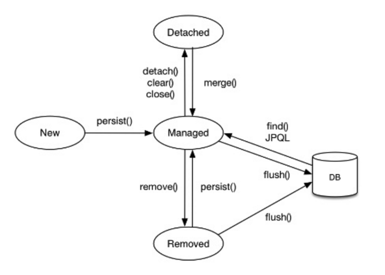

# 01. 엔티티 매니저 팩토리와 엔티티 매니저

## 엔티티 매니저 팩토리

데이터베이스를 하나만 사용하는 애플리케이션은 일반적으로 persistence.xml을 기반으로 EntityManagerFactory를 하나만 생성한다. 이 때는 비용이 아주 많이 든다.

앤티티 매니저 팩토리는 여러 스레드가 동시에 접근해도 안전하므로 서로 다른 스레드 간에 공유해도 된다.

하이버네이트를 포함한 JPA 구현체들은 EntityManagerFactory를 생성할 때 커넥션풀도 만든다.


## 엔티티 매니저

반면에 팩토리로부터 앤티티 매니저를 생성하면 비용이 거의 안 든다. 

엔티티 매니저는 여러 스레드가 동시에 접근하면 동시성 문제가 발생하므로 스레드 간에 절대 공유하면 안된다.

엔티티 매니저는 DB 연결이 꼭 필요한 시점까지 커넥션을 얻지 않는다.


# 02. 영속성 컨텍스트란

JPA를 이해하는 데 가장 중요한 용어는 **영속성 컨텍스트**이다. 엔티티 매니저로 엔티티를 저장하거나 조회하면 엔티티 매니저는 영속성 컨텍스트에 엔티티를 보관하고 관리한다.

persist() 메소드는 엔티티 매니저를 사용해서 회원 엔티티를 영속성 컨텍스트에 저장한다.

영속성 컨텍스트는 논리적인 개념에 가까워 눈에 보이지 않고 엔티티 매니저를 통해 접근, 관리 가능하다.


# 03. 엔티티의 생명주기

엔티티에는 4가지 상태가 존재한다.

* 비영속 : 영속성 컨텍스트와 전혀 관계가 없는 상태
* 영속 : 영속성 컨텍스트에 저장된 상태
* 준영속 : 영속성 컨텍스트에 저장되었다가 분리된 상태
* 삭제 : 삭제된 상태



## 비영속

엔티티 객체를 생성 후 아직 저장 전인 상태

``` java
Member member = new Member();
member.setId("member1");
member.setUsername("회원1");
```


## 영속

엔티티 매니저를 통해서 엔티티를 영속성 컨텍스트에 저장

``` java
em.persist(member);
```


em.find()나 JPQL을 사용해서 조회한 엔티티도 영속성 컨텍스트가 관리하는 영속 상태


## 준영속

영속성 컨텍스트가 관리하던 영속 상태의 엔티티를 영속성 컨텍스트가 관리하지 않으면 준영속 상태

특정 엔티티를 준영속 상태로 만들려면 em.detach()를 호출하면 된다.

em.close()를 호출해서 영속성 컨텍스트를 닫거나 em.clear()를 호출해서 영속성 컨텍스트를 초기화해도 영속성 컨텍스트가 관리하던 영속 상태의 엔티티는 준영속 상태가 된다.

``` java
em.detach(member);
```


## 삭제

엔티티를 영속성 컨텍스트와 데이터베이스에서 삭제한다.

``` java
em.remove(member);
```


# 04. 영속성 컨텍스트의 특징

## 영속성 컨텍스트의 특징

### 영속성 컨텍스트와 식별자 값

영속성 컨텍스트는 엔티티를 식별자 값으로 구분한다. 따라서 영속 상태는 식별자 값이 반드시 있어야 한다. 식별자 값이 없으면 예외가 발생한다.

> 식별자 값은 @Id로 테이블의 기본 키와 매핑한 값을 말한다.


### 영속성 컨텍스트와 데이터베이스 저장

JPA는 보통 트랜잭션을 커밋하는 순간 영속성 컨텍스트에 새로 저장된 엔티티를 데이터베이스에 반영하는데 이것을 플러시(flush)라 한다. 


### 영속성 컨텍스트가 엔티티를 관리하면 다음과 같은 장점이 있다

* 1차 캐시
* 동일성 보장
* 트랜잭션을 지원하는 쓰기 지연
* 변경 감지
* 지연 로딩


## 엔티티 조회 - 1차 캐시와 동일성 보장

### 1차 캐시

영속성 컨텍스트는 내부에 캐시를 가지고 있는데 이것을 1차 캐시라 한다. 영속 상태의 엔티티는 모두 이곳에 저장된다.

1차 캐시는 Map이며 @Id로 매핑한 식별자를 키로, 엔티티 인스턴스를 값으로 가진다.

em.find()를 호출하면 먼저 1차 캐시에서 엔티티를 찾고 만약 찾는 엔티티가 1차 캐시에 없으면 데이터베이스에서 조회한다.

데이터베이스에서 조회하면 1차 캐시에 저장한 후 영속 상태의 엔티티를 반환한다.


### 동일성 보장

식별자가 같은 엔티티 인스턴스를 조회해서 비교해보자

``` java
Member a = em.find(Member.class, "member1");
Member b = em.find(Member.class, "member1");

a == b
```


`em.find(Member.class, "member1")` 를 반복해서 호출해도 영속성 컨텍스트는 1차 캐시에 있는 같은 엔티티 인스턴스를 반환한다.

> JPA는 1차 캐시를 통해 반복 가능한 읽기 등급의 트랜잭션 격리 수준을 데이터베이스가 아닌 애플리케이션 차원에서 제공한다는 장점이 있다.


## 엔티티 등록 - 쓰기 지연

### 쓰기 지연

엔티티 매니저는 트랜잭션을 커밋하기 직전까지 데이터베이스에 엔티티를 저장하지 않고 내부 쿼리 저장소에 INSERT SQL을 차곡차곡 모아둔다. 그리고 트랜잭션을 커밋할 때 모아둔 쿼리를 데이터베이스에 보내는데 이것을 트랜잭션을 지원하는 쓰기 지연이라 한다.


데이터를 저장하는 즉시 INSERT 쿼리를 보내나 메모리에 모아둔 후 커밋 시점에 쿼리를 보내나 트랜잭션 범위 안에서 실행되므로 둘의 결과는 같다.


## 엔티티 수정 - 변경 감지

### SQL 수정 쿼리의 문제점

3개의 필드를 수정한다고 하면 실수로 일부 필드를 누락할 수 있다. 이 때문에 수정 쿼리를 상황에 따라 계속 추가해야 한다.

수정 쿼리가 많아질 뿐 아니라 비즈니스 로직을 분석하기 위해 SQL을 계속 확인해야 한다.

비즈니스 로직이 SQL에 의존하게 되는 문제가 있다.


### 변경 감지

JPA로 엔티티를 수정할 때는 단순히 엔티티를 조회해서 데이터만 변경하면 된다.

이렇게 엔티티의 변경사항을 데이터베이스에 자동으로 반영하는 기능을 변경 감지(dirty checking)이라 한다.

``` java
EntityManager em = emf.createEntityManager();
EntityTransaction transaction = em.getTransaction();
transaction.begin();

Member memberA = em.find(Member.class, "memberA");

memberA.setUsername("hi");
memberA.setAge("hi");

transaction.commit();
```


JPA는 엔티티를 영속성 컨텍스트에 보관할 때 최초 상태를 복사해서 저장해두는데 이것을 스냅샷이라고 한다.

그리고 플러시 시점에 스냅샷과 엔티티를 비교해서 변경된 엔티티를 찾는다.

따라서 변경 감지는 영속성 컨텍스트가 관리하는 영속 상태의 엔티티에만 적용된다.


### 변경 감지 Update SQL

변경 감지로 인해 실행된 Update SQL은 동적쿼리로 수정된 필드에 한해서만 update할 것이 예상된다.

하지만 JPA의 기본 전략은 모든 필드를 업데이트한다.

이렇게 모든 필드를 사용하면 데이터베이스에 보내는 데이터 전송량이 증가하는 단점이 있지만, 다음과 같은 장점이 있다.

* 모든 필드를 사용하면 바인딩되는 데이터를 제외하고는 수정 쿼리가 항상 같다. 따라서 애플리케이션 로딩 시점에 수정 쿼리를 미리 생성해두고 재사용할 수 있다.
* 데이터베이스에 동일한 쿼리를 보내면 데이터베이스는 이전에 한 번 파싱된 쿼리를 재사용할 수 있다.

> 칼럼이 30개 이상이 되면 기본 방법인 정적 수정 쿼리보다 @DynamicUpdate를 사용한 동적 수정 쿼리가 빠르다고 한다. 본인의 환경에서 테스트해보는게 정확하다. 일반적으로 기본 전략을 사용하고 튜닝이 필요할 때 전략을 수정하자.


## 엔티티 삭제

엔티티를 삭제하려면 먼저 삭제 대상 엔티티를 조회해야 한다.

``` java
Member memberA = em.find(Member.class, "memberA");
em.remove(memberA);
```


엔티티를 즉시 삭제하는 것이 아니라 엔티티 등록과 비슷하게 삭제 쿼리를 쓰기 지연 SQL 저장소에 등록한다. 이후 트랜잭션을 커밋해서 플러시를 호출하면 실제 데이터베이스에 삭제 쿼리를 전달한다. 


# 05. 플러시

플러시는 영속성 컨택스트의 변경 내용을 데이터베이스에 반영한다. 플러시를 실행하면 다음과 같은 일이 일어난다.

1. 변경 감지가 동작해서 영속성 컨텍스트에 있는 모든 엔티티를 스냅샷과 비교해서 수정된 엔티티를 찾는다. 수정된 엔티티는 수정 쿼리를 만들어 쓰기 지연 SQL 저장소에 등록한다. 
2. 쓰기 지연 SQL 저장소의 쿼리를 데이터베이스에 전송한다.


## 영속성 컨텍스트를 플러시하는 방법

### 직접 호출

엔티티 매니저의 flush() 메소드를 직접 호출해서 영속성 컨텍스트를 강제로 플러시한다. 테스트나 다른 프레임워크와 JPA를 함께 사용할 때를 제외하고 거의 사용하지 않는다.


### 트랜잭션 커밋 시 플러시 자동 호출

테이터베이스에 변경 내용을 SQL로 전달하지 않고 트랜잭션만 커밋하면 어떤 데이터도 데이터베이스에 반영되지 않는다. 

따라서 트랜잭션을 커밋하기 전에 꼭 플러시를 호출해서 영속성 컨텍스트의 변경 내용을 데이터베이스에 반영해야한다.

JPA는 이런 문제를 예방하기 위해 트랜잭션을 커밋할 때 플러시를 자동으로 호출한다.


### JPQL 쿼리 실행 시 플러시 자동 호출

JPQL이나 Criteria 같은 객체지향 쿼리를 호출할 때도 플러시가 실행된다.

이 때는 왜 플러시가 되야할까?
``` java
em.persist(memberA);
em.persist(memberB);
em.persist(memberC);

query = em.createQuery(:"select m from Member m", Member.class);
List<Member> members = query.getResultList();
```


위 예제에서 JPQL은 SQL로 변환되어 데이터베이스에서 엔티티를 조회한다. 

하지만 memberA, B, C는 아직 반영되지 않았으므로 조회되지 않는다.

이러한 문제를 막기 위해 JPQL을 실행할 때도 플러시를 자동 호출한다.


## 플러시 모드 옵션

엔티티 매니저에 플러시 모드를 직접 지정하려면 FlushModeType을 사용한다.

* FlushModeType.AUTO : 커밋이나 쿼리를 실행할 때 플러시
* FlushModeType.COMMIT : 커밋할 때만 플러시

``` java
em.setFlushMode(FlushModeType.COMMIT);
```


플러시는 영속성 컨텍스트에 보관된 엔티티를 지우는 것이 아니라 영속성 컨텍스트의 변경 내용을 데이터베이스에 동기화하는 것이다.


# 06. 준영속

영속성 컨텍스트가 관리하는 영속 상태의 엔티티가 영속성 컨텍스트에서 분리된 것을 준영속 상태라 한다. 

따라서 준영속 상태의 엔티티는 영속성 컨텍스트가 제공하는 기능을 사용할 수 없다.


## 준영속 상태로 만드는 방법

영속 상태의 엔티티를 준영속 상태로 만드는 방법은 크게 3가지이다.

1. em.detach(entity) : 특정 엔티티만 준영속 상태로 전환한다.
2. em.clear() : 영속성 컨텍스트를 완전히 초기화한다.
3. em.close() : 영속성 컨텍스트를 종료한다.


### 엔티티를 준영속 상태로 전환 : detach()

``` java
Member member = new Member();
member.setId("member1");
member.setUsername("회원1");

em.persist(member);

em.detach(member);
```

이렇게 영속 상태였다가 더는 영속성 컨텍스튿가 관리하지 않는 상태를 준영속 상태라 한다.


위와 같이 detach를 호출하면 영속성 컨텍스트에게 더는 해당 엔티티를 관리하지 말라는 것이다. 

1차 캐시부터 쓰기 지연 SQL 저장소까지 해당 엔티티를 관리하기 위한 모든 정보가 제거된다.


### 영속성 컨텍스트 초기화 : clear()

em.clear()는 영속성 컨텍스트를 초기화해서 해당 영속성 컨텍스트의 모든 엔티티를 준영속 상태로 만든다.


### 영속성 컨텍스트 종료 : close()

영속성 컨텍스트를 종료하면 해당 영속성 컨텍스트가 관리하던 영속 상태의 엔티티가 모두 준영속 상태가 된다.


## 준영속 상태의 특징

준영속 상태인 엔티티는 어떻게 되는 걸까?


### 거의 비영속 상태에 가깝다

영속성 컨텍스트가 관리하지 않으므로 1차 캐시, 쓰기 지연, 변경 감지, 지연 로딩을 포함한 영속성 컨텍스트가 제공하는 어떠한 기능도 동작하지 않는다.

### 식별자 값을 가지고 있다

비영속 상태는 식별자 값이 없을 수도 있지만 준영속 상태는 이미 한 번 영속 상태였으므로 반드시 식별자 값을 가지고 있다.

### 지연 로딩을 할 수 없다

지연 로딩은 실제 객체 대신 프록시 객체를 로딩해두고 해당 객체를 실제 사용할 때 영속성 컨텍스트를 통해 데이터를 불러오는 방법이다. 

하지만 준영속 상태는 영속성 컨텍스트가 더는 관리하지 않으므로 지연 로딩 시 문제가 발생한다.


## 병합: merge()

준영속 상태의 엔티티를 다시 영속 상태로 변경하려면 병합을 사용하면 된다.

merge() 메소드는 준영속 상태의 엔티티를 받아서 그 정보로 새로운 영속 상태의 엔티티를 반환한다.

``` java
Member mergeMember = em.merge(member);
```


### 준영속 병합

준영속 상태의 엔티티를 영속 상태로 변경할 때 merge를 사용한다.

이 때는 아래와 같이 동작한다.

1. merge()를 실행한다.
2. 파라미터로 넘어온 준영속 엔티티의 식별자 값으로 1차 캐시에서 엔티티를 조회한다.
   1. 만약 1차 캐시에 엔티티가 없으면 데이터베이스에서 엔티티를 조회하고 1차 캐시에 저장한다.
3. 조회한 영속 엔티티에 기존 엔티티의 값을 채워 넣는다.
4. 영속 엔티티를 반환한다.


### 비영속 병합

병합은 비영속 엔티티도 영속 상태로 만들 수 있다.

``` java
Member member = new Member();
Member newMember = em.merge(member);
tx.commit();
```


파라미터로 넘어온 엔티티의 식별자 값으로 영속성 컨텍스트를 조회하고 찾는 엔티티가 없으면 데이터베이스에서 조회한다.

만약 데이터베이스에서도 발견하지 못하면 새로운 엔티티를 생성해서 병합한다.

따라서 병합은 save or update 기능을 수행한다.