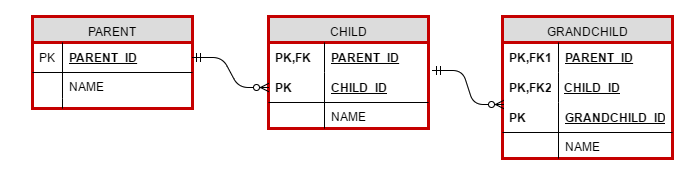
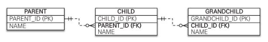
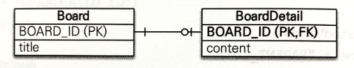
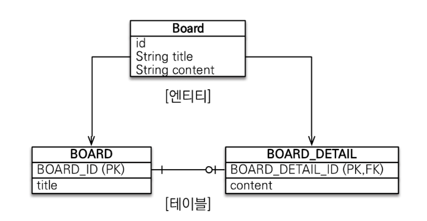

# 01. 상속 관계 매핑

관계형 테이터베이스에는 객체지향 언어에서 다루는 상속이라는 개념이 없다.

대신 슈퍼타입 서브타입 관계라는 모델링 기법이 객체의 상속 개념과 가장 유사하다.

슈퍼타입 서브타입 논리 모델을 실제 물리 모델인 테이블로 구현할 때는 3가지 방법을 선택할 수 있다.

* 각각의 테이블로 변환 : 각각 모두 테이블로 만들고 조회할 때는 조인을 사용한다. JPA에서는 조인 전략이라 한다.
* 통합 테이블로 변환 : 테이블을 하나만 사용해서 통합한다. JPA에서는 단일 테이블 전략이라고 한다.
* 서브타입 테이블로 변환 : 서브 타입마다 하나의 테이블을 만든다. JPA에서는 구현 클래스마다 테이블 전략이라 한다.


## 조인 전략

엔티티 각각을 모두 테이블로 만들고 자식 테이블이 부모 테이블의 기본 키를 받아서 기본 키 + 외래 키로 사용하는 전략이다.

객체는 타입으로 구분할 수 있지만 테이블은 타입 개념이 없으므로 타입을 구분하는 칼럼을 추가해야 한다.

``` java
@Entity
@Inheritance(stategy = InheriranceType.JOINED)
@DiscriminatorColumn(name = "DTYPE")
public abstract class Item {
  @Id @GeneratedValue
  @Column(name = "ITEM_ID")
  private Long id;
  
  private String name;
  private int price;
}

@Entity
@DiscriminatorValue("A")
public class Album extends Item {
  private String artist;
}

@Entity
@DiscriminatorValue("M")
public class Album extends Item {
  private String director;
  private String actor;
}
```

* @Inheritance(stategy = InheriranceType.JOINED) : 조인 전략 사용
* @DiscriminatorColumn(name = "DTYPE") : 부모 클래스에 구분 칼럼 지정
* @DiscriminatorValue("A") : 엔티티를 저장할 때 구분 칼럼에 입력할 값을 지정


기본값으로 자식 테이블은 부모 테이블의 ID 칼럼명을 그대로 사용하는데, 만약 자식 테이블의 기본 키 칼럼명을 변경하고 싶으면 @PrimaryKeyJoinColumn을 사용하면 된다.

``` java
@Entity
@DiscriminatorValue("B")
@PrimaryKeyJoinColumn(name = "BOOK_ID")
public class Book extends Item {
  private String author;
  private String isbn;
}
```


### 장점 

* 테이블이 정규화된다.
* 외래 키 참조 무결성 제약조건을 활용할 수 있다.
* 저장공간을 효율적으로 사용한다.


### 단점

* 조회할 때 조인이 많이 사용되므로 성능이 저하될 수 있다.
* 조회 쿼리가 복잡하다.
* 데이터를 등록할 INSERT SQL을 두 번 실행한다.


## 단일 테이블 전략

테이블을 하나만 사용하고 구분 칼럼으로 어떤 자식 데이터가 저장되었는지 구분한다.

``` java
@Entity
@Inheritance(stategy = InheriranceType.SINGLE_TABLE)
@DiscriminatorColumn(name = "DTYPE")
public abstract class Item {
  @Id @GeneratedValue
  @Column(name = "ITEM_ID")
  private Long id;
  private String name;
  private int price;
}

@Entity
@DiscriminatorValue("A")
public class Album extends Item {
  private String artist;
}

...
```


### 장점

* 조인이 필요 없으므로 일반적으로 조회 성능이 빠르다.
* 조회 쿼리가 단순하다.


### 단점

* 자식 엔티티가 매핑한 칼럼은 모두 null을 허용해야 한다.
* 단일 테이블에 모든 것을 저장하므로 테이블이 커질 수 있다. 그러므로 상황에 따라서는 조회 성능이 오히려 느려질 수 있다.


### 특징

* 구분 칼럼을 꼭 사용해야 한다. 따라서 @DiscriminatorColumn을 꼭 설정해야 한다.
* @DiscriminatorValue를 지정하지 않으면 기본으로 엔티티 이름을 사용한다.


## 구현 클래스마다 테이블 전략

자식 엔티티마다 테이블을 만든다.

일반적으로 추천하지 않는 전략이다.

``` java
@Entity
@Inheritance(stategy = InheriranceType.TABLE_PER_CLASS)
public abstract class Item {
  @Id @GeneratedValue
  @Column(name = "ITEM_ID")
  private Long id;
  private String name;
  private int price;
}

@Entity
public class Album extends Item {
  private String artist;
}

...
```


### 장점

* 서브 타입을 구분해서 처리할 때 효과적이다.
* not null 제약조건을 사용할 수 있다.


### 단점

* 여러 자식 테이블을 함께 조회할 때 성능이 느리다. (SQL에 UNION을 사용해야 한다.)
* 자식 테이블을 통합해서 쿼리하기 어렵다.


### 특징

* 구분 칼럼을 사용하지 않는다.


# 02. @MappedSuperclass

위에서 본 전략은 모두 부모 클래스와 자식 클래스를 모두 데이터베이스 테이블과 맾이했다.

부모 클래스는 테이블과 매핑하지 않고 부모 클래스를 상속 받는 자식 클래스에게 매핑 정보만 제공하고 싶으면 @MappedSuperclass를 사용하면 된다.

``` java
@MappedSuperclass
public abstract class BaseEntity {
  @Id @GenratedValue
  private Long id;
  private String name;
  ...
}

@Entity
public class Member extends BaseEntity {
  private String email;
  ...
}

@Entity
public class Seller extends BaseEntity {
  private String shopName;
  ...
}
```


부모로부터 물려받은 매핑 정보를 재정의하려면 아래와 같다.

``` java
@Entity
@AttributeOverride(name = "id", column = @Column(name = "MEMBER_ID"))
public class Member extends BaseEntity { ... }

@Entity
@AttributeOverride({
	@AttributeOverride(name = "id", column = @Column(name = "MEMBER_ID")),  
  @AttributeOverride(name = "name", column = @Column(name = "MEMBER_NAME")),
})

public class Member extends BaseEntity { ... }
```


### 특징

* 테이블과 매핑되지 않고 자식 클래스에 엔티티의 매핑 정보를 상속하기 위해 사용한다.
* @MappedSuperclass로 지정한 클래스는 엔티티가 아니므로 em.find()나 JPQL에서 사용할 수 없다.
* 이 클래스를 직접 생성해서 사용할 일은 거의 없으므로 추상 클래스로 만드는 것을 권장한다.


# 03. 복합 키와 식별 관계 매핑

복합 키를 매핑하는 방법과 식별 관계, 비식별 관계를 매핑하는 방법을 알아보자.


## 식별 관계 vs 비식별 관계

외래 키가 기본 키에 포함되는지 여부에 따라 식별 관계와 비식별 관계로 구분된다.

* 식별 관계 : identifying Relationship
* 비식별 관계 : Non-identifying Relationship


### 식별 관계

식별 관계는 부모 테이블의 기본 키를 내려받아서 자식 테이블의 기본 키 + 외래 키로 사용하는 관계다.


### 비식별 관계 

비식별 관계는 부모 테이블의 기본 키를 받아서 자식 테이블의 외래 키로만 사용하는 관계다.


## 복합 키: 비식별 관계 매핑

기본 키를 구성하는 칼럼이 하나면 다음처럼 단순하게 매핑한다.

``` java
@Entity
public class Hello {
  @Id
  private String id;
}
```


JPA에서 식별자를 둘 이상 사용하려면 별도의 식별자 클래스를 만들어야 한다.

JPA는 영속성 컨텍스트에 엔티티를 보관할 때 엔티티의 식별자를 키로 사용한다.

그리고 식별자를 구분하기 위해 equals와 hashCode를 사용해서 동등성 비교를 한다. 


JPA는 복합 키를 지원하기 위해 @IdClass와 @EmbeddedId 2가지 방법을 제공한다.


### @IdClass

PARENT 테이블은 기본 키를 PARENT_ID1, PARENT_ID2로 묶은 복합 키로 구성했다.

``` java
@Entity
@IdClass(ParentId.class)
public class Parent {
  @Id
  @Column(name = "PARENT_ID1")
  private String id1;
  
  @Id
  @Column(name = "PARENT_ID2")
  private String id2;
  
  private String name;
}
```

``` java
public class ParentId implements Serializable {
  private String id1;
  private String id2;
  
  public ParentId() {
  }
  
  public ParentId(String id1, String id2) {
    this.id1 = id1;
    this.id2 = id2;
  }
  
  @Override
  public boolean equals(Object o) {...}
  
  @Override
  public int hashCode() {...}
}
```

@IdClass를 사용할 때 식별자 클래스는 다음 조건을 만족해야 한다.

* 식별자 클래스의 속성명과 엔티티에서 사용하는 식별자의 속성명이 같아야 한다.
* Serializable 인터페이스를 구현해야 한다.
* equals, hashCode를 구현해야 한다.
* 기본 생성자가 있어야 한다.
* 식별자 클래스는 public이어야 한다.


자식 클래스에서는 @JoinColumns 어노테이션을 사용하여 복합키에 매핑해야 한다.

``` java
@Entity
public class Child {
  @Id
  private String id;
  
  @ManyToOne
  @JoinColumns({
    @JoinColumn(name = "PARENT_ID1", 
               referenceColumnName = "PARENT_ID1"),
    @JoinColumn(name = "PARENT_ID2", 
               referenceColumnName = "PARENT_ID2"),
  })
  private Parent parent;
}
```


### @EmbeddedId

@EmbeddedId는 좀 더 객체지향적인 방법이다.

``` java
@Entity
public class Parent {
  @EnbeddedId
  private ParentId id;
  
  private String name;
  ...
}
```

``` java
@Embeddable
public class ParentId implements Serializable {
  @Column(name = "PARENT_ID1")
  private String id1;
  
  @Column(name = "PARENT_ID2")
  private String id2;
  
  // equals and hashCode 구현
}
```


@EnbeddedId를 적용한 클래스는 다음 조건을 만족해야 한다.

* @Enbeddable 어노테이션을 붙여주어야 한다.
* Serializable 인터페이스를 구현해야 한다.
* equals, hashCode를 구현해야 한다.
* 기본 생성자가 있어야 한다.
* 식별자 클래스는 public이어야 한다.


### 복합 키와 equals(), hashCode()

복합 키는 equals()와 hashCode()를 필수로 구현해야 한다.

``` java
ParentId id1 = new parentId();
id1.setId1(:"myId1");
id1.setId2(:"myId2");

ParentId id2 = new parentId();
id2.setId1(:"myId1");
id2.setId2(:"myId2");

id1.equals(id2) // false
```


equals를 오버라이딩 안했다는 가정 하에 위 결과는 거짓이다.

왜냐하면 자바의 모든 클래스는 기본으로 Object 클래스를 상속받는데 이 클래스가 제공하느 기본 equals()는 인스턴스 참조 값 비교인 == 비교를 하기 때문이다.

영속성 컨텍스트는 엔티티의 식별자를 키로 사용해서 엔티티를 관리한다.

그리고 식별자를 비교할 때 equals()와 hashCode()를 사용한다. 

따라서 식별자 객체의 동등성이 지켜지지 않으면 예상과 다른 엔티티가 조회되거나 엔티티를 찾을 수 없는 등 영속성 컨텍스트가 엔티티를 관리하는 데 심각한 문제가 발생한다.

따라서 복합 키는 equals()와 hashCode()를 필수로 구현해야 한다.

식별자 클래스는 보통 equals()와 hashCode()를 구현할 때 모든 필드를 사용한다.


### @IdClass vs @EmbeddedId

@EmbeddedId가 @IdClass와 비교해서 더 객체지향적이고 중복도 없어서 좋아보이긴 하지만 특정 상황에 JPQL이 조금 더 길어질 수 있다.

``` java
em.createQuery("select p.id.id1, p.id.id2 from Parent p"); // @EmbeddedId
em.createQuery("select p.id1, p.id2 from Parent p"); // @IdClass
```


> 복합 키에는 @GenerateValue를 사용할 수 없다. 복합 키를 구성하는 여러 칼럼 중 하나에도 사용할 수 없다.


## 복합 키: 식별 관계 매핑

부모, 자식, 손자까지 계속 기본 키를 전달하는 식별 관계를 알아보자.



### @IdClass와 식별 관계

``` java
// 부모
@Entity
public class Parent {
  @Id @Column(name = "PARENT_ID")
  private String id;
  private String name;
}

// 자식
@Entity
@IdClass(ChildId.class)
public class Child {
  @Id
  @ManyToOne
  @JoinColumn(name = "PARENT_ID")
  public Parent parent;
  
  @Id @Column(name = "CHILD_ID")
  private String childId;
  
  private String name;
  ...
}

// 자식 ID
public class ChildId implements Serializable {
  private String parent;
  private String childId;
  
  // equals, hashCode
  ...
}

// 손자
@Entity
@IdClass(GrandChildId.class)
public class GrandChild {
  @Id
  @ManyToOne
  @JoinColumns({
    @JoinColumn(name = "PARENT_ID"),
    @JoinColumn(name = "CHILD_ID")
  })
  private Child child;
  
  @Id @Column(name = "GRANDCHILD_ID")
  private String id;
  
  private String name;
  ...
}

// 손자 ID
public class GrandChildId implements Serializable {
  private ChildId child;
  private String id;
  
  // equals, hashCode
}
```


### @EnbeddedId와 식별 관계

``` java
// 부모
@Entity
public class Parent {
  @Id @Column(name = "PARENT_ID")
  private String id;
  
  private String name;
  ...
}

// 자식
@Entity
public class Child {
  @EmbeddedId
  private ChildId id;
  
  @MapsId("parentId")
  @ManyToOne
  @JoinColumn(name = "PARENT_ID")
  public Parent parent;
  
  private String name;
  ...
}

// 자식 ID
@Embeddable
public class ChildId implements Serializable {
  private String parentId;
  
  @Column(name = "CHILD_ID")
  private String id;
  
  // equals, hashCode
  ...
}

// 손자
@Entity
public class GrandChild {
  @EmbeddedId
  private GrandChildId id;
  
  @MapsId("childId")
  @ManyToOne
  @JoinColumns({
    @JoinColumn(name = "PARENT_ID"),
    @JoinColumn(name = "CHILD_ID")
  })
  private Child child;
  
  private String name;
  ...
}

// 손자 ID
@Embeddable
public class GrandChildId implements Serializable {
  private ChildId childId;
  
  @Column(name = "GRANDCHILD_ID")
  private String id;
  
  // equals, hashCode
}
```


## 비식별 관계로 구현



``` java
// 부모
@Entity
public class Parent {
  @Id @GenerateValue
  @Column(name = "PARENT_ID")
  private Long id;
  private String name;
  ...
}

// 자식
@Entity
public class Child {
  @Id @GeneratedValue
  @Column(name = "CHILD_ID")
  private Long id;
  private String name;
  
  @ManyToOne
  @JoinColumn(name = "PARENT_ID")
  private Parent parent;
  ...
}

// 손자
@Entity
public class GrandChild {
  @Id @GenerateValue
  @Column(name = "GRANDCHILD_ID")
  private Long id;
  private String name;
  
  @ManyToOne
  @JoinColumn(name = "CHILD_ID")
  private Child child;
  ...
}
```


## 일대일 식별 관계



``` java
// 부모
@Entity
public class Board {
  @Id @GeneratedValue
  @Column(name = "BOARD_ID")
  private Long id;
  
  private String title;
  
  @OneToOne(mappedBy = "board")
  private BoardDetail boardDetail;
  ...
}

// 자식
@Entity
public class BoardDetail {
  @Id
  private Long boardId;
  
  @MapsId
  @OneToOne
  @JoinColumn(name="BOARD_ID")
  private Board board;
  
  private String content;
  ...
}
```


## 식별, 비식별 관계의 장단점

데이터베이스 설계 관점에서 보면 다음과 같은 이유로 식별 관계보다는 비식별 관계를 선호한다.

* 식별 관계는 부모 테이블의 기본 키를 자식 테이블로 전파하면서 자식 테이블의 기본 키 칼럼이 점점 늘어난다. 부모 테이블은 기본 키 칼럼이 하나였지만 자식 테이블은 기본 키 칼럼이 2개, 손자 테이블은 기본 키 칼럼이 3개로 점점 늘어난다. 결국 조인할 때 SQL이 복잡해지고 기본 키 인덱스가 불필요하게 커질 수 있다.
* 식별 관계는 2개 이상의 칼럼을 합해서 복합 기본 키를 만들어야 하는 경우가 많다.
* 식별 관계를 사용할 때 기본 키로 비즈니스 의미가 있는 자연 키 칼럼을 조합하는 경우가 많다. 반면에 비식별 관계의 기본 키는 비즈니스와 전혀 관계없는 대리 키를 주로 사용한다. 비즈니스 요구사항은 시간이 지남에 따라 언젠가는 변한다. 식별 관계의 자연 키 칼럼들이 자식에 손자까지 전파되면 변경하기 힘들다.
* 식별 관계는 부모 테이블의 기본 키를 자식 테이블의 기본 키로 사용하므로 비식별 관계보다 테이블 구조가 유연하지 못하다.


객체 관계 매핑의 관점에서 보면 다음과 같은 이유로 비식별 관계를 선호한다.

* 일대일 관계를 제외하고 식별 관계는 2개 이상의 칼럼을 묶는 복합 기본 키를 사용한다. JPA에서 복합 키는 별도의 복합 키 클래스를 만들어서 사용해야 한다. 따라서 칼럼이 하나인 기본 키를 매핑하는 것보다 많은 노력이 필요하다.
* 비식별 관계의 기본 키는 주로 대리 키를사용하는데 JPA는 @GenerateValue처럼 대리 키를 생성하기 위한 편리한 방법을 제공한다.


정리하면 비식별 관계를 사용하고 기본 키는 Long 타입의 대리 키를 사용하자.


# 04. 조인 테이블

데이터베이스 테이블의 연관관계를 설계하는 방법은 크게 2가지다.

* 조인 칼럼 사용(외래 키)
* 조인 테이블 사용(테이블 사용)


## 일대일 조인 테이블

일대일 관계를 만들려면 조인 테이블의 외래 키 칼럼 각각에 총 2개의 유니크 제약조건을 걸어야 한다.

``` java
// 부모
@Entity
public class Parent {
  @Id @GeneratedValue
  @Column(name = "PARENT_ID")
  private Long id;
  private String name;
  
  @OneToOne
  @JoinTable(name = "PARENT_CHILD",
            joinColumns = @JoinColumn(name = "PARENT_ID"),
            inverseJoinColumns = @JoinColumn(name = "CHILD_ID")
  )
  private Child child;
  ...
}

// 자식
@Entity
public class Child {
  @Id @GeneratedValue
  @Column(name = "CHILD_ID")
  private Long id;
  private String name;
  
  // 양방향으로 매핑 시 필요
  @OneToOne(mappedBy="child")
  private Parent parent;
  ...
}
```


## 일대다 조인 테이블

일대다 관계를 만들려면 조인 테이블의 칼럼 중 다와 관련된 칼럼인 CHILD_ID에 유니크 제약조건을 걸어야한다.

## 다대일 조인 테이블

## 다대다 조인 테이블

조인 테이블을 많이 안쓰일거 같아 생략


# 05. 엔티티 하나에 여러 테이블 매핑

잘 사용하지는 않지만 @SecondaryTable을 사용하면 한 엔티티에 여러 테이블을 매핑할 수 있다.



``` java
@Entity
@Table(name="BOARD")
@SecondaryTable(name = "BOARD_DETAIL", 
               pkJoinColumns = @PrimaryKeyJoinColumn(name = "BOARD_DETAIL_ID"))
public class Board {
  @Id @GeneratedValue
  @Column(name = "BOARD_ID")
  private Long id;
  
  private String title;
  
  @Column(table = "BOARD_DETAIL")
  private String content;
  ...
}
```

