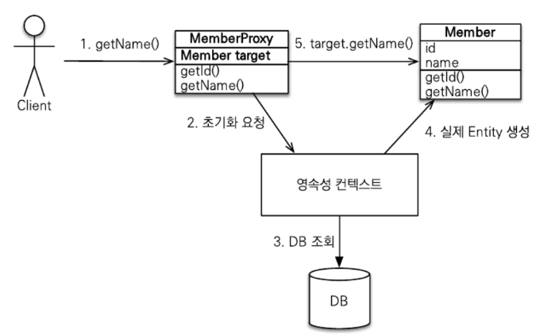

# 01. 프록시

엔티티를 조회할 때 연관된 엔티티들이 항상 사용되는 것은 아니다.

따라서 연관된 엔티티들을 데이터베이스에서 함께 조회해 두는 것은 효율적이지 않다.

JPA는 이런 문제를 해결하려고 엔티티가 실제 사용될 때까지 데이터베이스 조회를 지연하는 방법을 제공하는데 이것을 지연 로딩이라고 한다.

지연 로딩은 엔티티의 값을 실제 사용하는 시점에 데이터베이스에서 조회한다.


## 프록시 기초

JPA에서 식별자로 엔티티 하나를 조회할 때는 EntityManager.find()를 사용한다.

이 메소드는 영속성 컨텍스트에 엔티티가 없으면 데이터베이스를 조회한다.

``` java
Member member = em.find(Member.class, "member1");
```

이렇게 엔티티를 직접 조회하면 조회한 엔티티를 실제 사용하든 사용하지 않든 데이터베이스를 조회하게 된다.

엔티티를 실제 사용하는 시점까지 데이터베이스 조회를 미루고 싶으면 EntityManager.getReference() 메소드를 사용하면 된다.

``` java
Member member = em.getReference(Member.class, "member1");
```

이 메소드를 호출 할 때  JPA는 데이터베이스를 조회하지 않고 실제 엔티티 객체도 생성하지 않는다. 

대신에 데이터베이스 접근을 위임한 프록시 객체를 반환한다.


### 프록시 특징

프록시 클래스는 실제 클래스를 상속 받아서 만들어지므로 실제 클래스와 겉 모양이 같다. 

따라서 사용하는 입장에서는 이것이 진짜 객체인지 프록시 객체인지 구분하지 않고 사용하면 된다.

* 프록시 객체는 처음 사용할 때 한 번만 초기화된다.
* 프록시 객체를 초기화한다고 프록시 객체가 실제 엔티티로 바뀌는 것은 아니다. 프록시 객체가 초기화되면 프록시 객체를 통해서 실제 엔티티에 접근할 수 있다.
* 프록시 객체는 원본 엔티티를 상속받은 객체이므로 타입 체크 시에 주의해서 사용해야 한다. 
* 영속성 컨텍스트에 찾는 엔티티가 이미 있으면 데이터베이스를 조회할 필요가 없으므로 em.getReference()를 호출해도 프록시가 아닌 실제 엔티티를 반환한다. 
* 초기화는 영속성 컨텍스트의 도움을 받아야 가능하다. 따라서 영속성 컨텍스트의 도움을 받을 수 없는 준영속 상태의 프록시를 초기화하면 문제가 발생한다.


### 프록시 객체의 초기화

프록시 객체는 실제 사용될 때 데이터베이스를 조회해서 실제 엔티티 객체를 생성하는데 이것을 프록시 객체의 초기화라 한다.



1. 프록시 객체에 member.getName()을 호출해서 실제 데이터를 조회한다.
2. 프록시 객체는 실제 엔티티가 생성되어 있지 않으면 영속성 컨텍스트에 실제 엔티티 생성을 요청하는데 이것을 초기화라 한다.
3. 영속성 컨텍스트는 데이터베이스를 조회해서 실제 엔티티 객체를 생성한다.
4. 프록시 객체는 생성된 실제 엔티티 객체의 참조를 Member target 멤버변수에 보관한다.
5. 프록시 객체는 실제 엔티티 객체의 getName()을 호출해서 결과를 반환한다.


### 준영속 상태의 초기화

준영속 상태의 초기화에 관련된 코드는 다음과 같다.

``` java
// MemberProxy 반환
Member member = em.getReference(Member.class, "id1");
transaction.commit();
em.close();

// 예외 발생
member.getName(); 
```

em.close()로 영속성 컨텍스트를 종료해서 member는 준영속 상태이다.

이 때 member.getName()을 호출하면 프록시를 초기화해야 하는데 영속성 컨텍스트가 없으므로 실제 엔티티를 조회할 수 없다.


## 프록시와 식별자

엔티티를 식별자로 조회할 때 식별자 값을 파라미터로 전달하는데 프록시 객체는 이 식별자 값을 보관한다.


프록시 객체는 식별자 값을 가지고 있으므로 식별자 값을 조회하는 team.getId()를 호출해도 프록시를 초기화하지 않는다.

단 엔티티 접근 방식을 프로퍼티(@Access(AccessType.PROPERTY))로 설정한 경우에만 초기화하지 않는다.

``` java
Team team = em.getReference(Team.class, "team1");
team.getId();
```


### 프록시 확인

JPA가 제공하는 PersistenceUnit.isLoaded(Object entity) 메소드를 사용하면 프록시 인스턴스의 초기화 여부를 확인할 수 있다.

아직 초기화되지 않은 프록시 인스턴스는 false를 반환한다.

이미 초기화되었거나 프록시 인스턴스가 아니면 true를 반환한다.

```java
boolean isLoad = em.getEntityManagerFactory()
  .getPersistenceUnitUtil().isLoaded(entity);
```


# 02. 즉시 로딩과 지연 로딩

프록시 객체는 주로 연관된 엔티티를 지연 로딩할 때 사용한다.


## 즉시 로딩

즉시 로딩(EAGER LOADING)을 사용하려면 @ManyToOne의 fetch 속성을 FetchType.EAGER로 지정한다.

``` Java
@Entity
public class Member {
  @ManyToOne(fetch = FetchType.EAGER)
  @JoinColumn(name = "TEAM_ID")
  private Team team;
}
```


이 때 Member를 조회하면 join 쿼리가 실행된다.

회원 테이블의 TEAM_ID 외래 키가 NULL 값을 허용하고 있다면 LEFT OUTER JOIN을 통해 모든 회원을 가져오게 된다.

하지만 INNER JOIN이 성능과 최적화 면에서 더 유리하다.

따라서 null이 없다는 걸 명시해주면 내부 조인을 사용한다.

``` java
@Entity
public class Member {
  @ManyToOne(fetch = FetchType.EAGER)
  @JoinColumn(name = "TEAM_ID", nullalbe = false)
  private Team team;
}
```


## 지연 로딩

지연 로딩(LAZY LOADING)을 사용하려면 @ManyToOne의 fetch 속성을 FetchType.LAZY로 지정한다.

``` java
@Entity
public class Member {
  @ManyToOne(fetch = FetchType.LAZY)
  @JoinColumn(name = "TEAM_ID")
  private Team team;
}
```


지연 로딩 시 회원을 조회하면 회원만 조회하고 팀은 조회하지 않는다. 

대신 회원의 team 멤버변수에 프록시 객체를 넣어둔다.

이 프록시 객체는 실제 사용될 때까지 데이터 로딩을 미룬다.


# 03. 지연 로딩 활용

``` java
@Entity
public class Member {
  @Id
  private String id;
  private String username;
  private Integer age;
  
  @ManyToOne(fetch = FetchType.EAGER)
  private Team team;
  
  @OneToMany(mappedBy = "member", fetch = FetchType.LAZY)
  private List<Order> orders;
}
```


## 프록시와 컬렉션 래퍼

``` java
Member member = em.find(Member.class, "member1");
List<Order> orders = member.getOrders();
orders.getClass().getName(); // org.hiberate.collection.internal.PersistentBag
```

하이버네이트는 엔티티를 영속 상태로 만들 때 엔티티에 컬렉션이 있으면 컬렉션을 추적하고 관리할 목적으로 원본 컬렉션을 하이버네이트가 제공하는 내장 컬렉션으로 변경하는데 이것을 컬렉션 래퍼라 한다.

엔티티를 지연 로딩하면 프록시 객체를 사용해서 지연 로딩을 수행하지만 주문 내역 같은 컬렉션은 컬렉션 래퍼가 지연 로딩을 처리해준다. 

컬렉션 래퍼도 컬렉션에 대한 프록시 역할을 하므로 구분하지 않고 프록시라고 부르자.


## JPA 기본 페치 전략

fetch 속성의 기본 설정값은 다음과 같다.

* @ManyToOne, @OneToOne : 즉시 로딩(FetchType.EAGER)
* @OneToMany, @ManyToMany : 지연 로딩(FetchType.LAZY)

JPA의 기본 페치 전략은 연관된 엔티티가 하나면 즉시 로딩을, 컬렉션이면 지연 로딩을 사용한다.

**추천하는 방법은 모든 연관관계에 지연 로딩을 사용하는 것이다.**

그리고 개발 중 실제 사용하는 상황을 보고 꼭 필요한 것에만 즉시 로딩을 사용하도록 최적화하면 된다.


## 컬렉션에서 FetchType.EAGER 사용 시 주의점

* 컬렉션에 하나 이상 즉시 로딩하는 것은 권장하지 않는다. : A 테이블을 N,M 두 테이블과 일대다 조인하면 SQL 실행 결과가 N * M이 되면서 너무 많은 데이터가 반환된다.
* 컬렉션 즉시 로딩은 항상 외부 조인을 사용한다. : 팀 테이블에서 회원 테이블로 일대다 관계를 조인할 때 회원이 한 명도 없는 팀을 내부 조인하면 팀까지 조회되지 않는 문제가 발생한다. 따라서 JPA는 일대다 관계를 즉시 로딩할 때 항상 외부 조인을 사용한다.


@ManyToOne, @OneToOne

* optional = false : 내부 조인
* optional = true : 외부 조인

@OneToMany, @ManyToMany

* optional = false : 외부 조인
* optional = true : 외부 조인 


# 04. 영속성 전이: CASCADE

특정 엔티티를 영속 상태로 만들 때 연관된 엔티티도 함께 영속 상태로 만들고 싶으면 영속성 전이 기능을 사용하면 된다. 

JPA는 CASCADE 옵션으로 영속성 전이를 제공한다. 


만약 부모 1명에 자식 2명을 저장한다면 아래와 같다.

``` java
Parent parent = new Parent();
em.persist(parent);

Child child1 = new Child();
child1.setParent(parent);
parent.getChildren().add(child1);
em.persist(child1);

Child child2 = new Child();
child2.setParent(parent);
parent.getChildren().add(child2);
em.persist(child2);
```


JPA에서 엔티티를 저장할 때 연관된 모든 엔티티는 영속 상태여야 한다.

따라서 예제를 보면 부모 엔티티를 영속 상태로 만들고 자식 엔티티도 각각 영속 상태로 만든다. 

이럴 때 영속성 전이를 사용하면 부모만 영속 상태로 만들면 연관된 자식까지 한 번에 영속 상태로 만들 수 있다.


## 영속성 전이: 저장

``` java
@Entity
public class Parent {
  
  @OneToMany(mappedBy = "parent", cascade = CascadeType.PERSIST)
  private List<Child> children = new ArrayList<Child>();
}
```


이 관계를 추가하면 간편하게 부모와 자식 엔티티를 한 번에 영속화할 수 있다.

``` java
Child child1 = new Child();
Child child2 = new Child();

Parent parent = new Parent();
child1.setParent(parent);
child2.setParent(parent);
parent.getChildren().add(child1);
parent.getChildren().add(child2);

em.persist(parent);
```


## 영속성 전이: 삭제

부모와 자식 엔티티를 모두 제거하려면 다음 코드와 같이 각각의 엔티티를 하나씩 제거해야 한다.

``` java
Parent findParent = em.find(Parent.class, 1L);
Child findChild1 = em.find(Child.class, 1L);
Child findChild1 = em.find(Child.class, 2L);

em.remove(findChild1);
em.remove(findChild2);
em.remove(findParent);
```


CascadeType.REMOVE로 설정하고 다음 코드처럼 부모 엔티티만 삭제하면 연관된 자식 엔티티도 함께 삭제된다.

``` java
Parent findParent = em.find(Parent.class, 1L);
em.remove(findParent);
```


CascadeType.REMOVE를 설정하지 않고 이 코드를 실행하면 부모 엔티티만 삭제된다.

하지만 데이터베이스의 부모 로우를 삭제하는 순간 자식 테이블에 걸려 있는 외래 키 제약조건으로 인해, 데이터베이스에서 외래키 무결성 예외가 발생한다.


## CASCADE의 종류

``` java
public enum CascadeType {
  ALL,      // 모두 적용
  PERSIST,  // 영속
  MERGE,    // 병합
  REMOVE,   // 삭제
  REFRESH,  // REPRESH
  DETACH    // DETACH
}
```


# 05. 고아 객체

JPA는 부모 엔티티와 연관관계가 끊어진 자식 엔티티를 자동으로 삭제하는 기능을 제공하는 이것을 고아 객체(ORPHAN) 제거라 한다. 

이 기능을 사용해서 부모 엔티티의 컬렉션에서 자식 엔티티의 참조만 제거하면 자식 엔티티가 자동으로 삭제되도록 해보자.

``` java
@Entity
public class Parent {
  @Id @GeneratedValue
  private Long id;
  
  @OneToMany(mappedBy = "parent", orphanRemoval = true)
  private List<Child> chlidren = new ArrayList<Child>();
}
```


자식 엔티티를 컬렉션에서 제거해보자.

``` java
Parent parent1 = em.find(Parent.class, id);
parent1.getChildren().remove(0);
```


고아 객체 제거 기능은 영속성 컨텍스트를 플러시할 때 적용되므로 플러시 시점에 DELETE SQL이 실행된다.


## 고아 객체 정리

고아 객체 제거는 참조가 제거된 엔티티는 다른 곳에서 참조하지 않는 고아 객체로 보고 삭제하는 기능이다.

따라서 이 기능은 참조하는 곳이 하나일 때만 사용해야 한다. 

이런 이유로 orphanRemovel은 @OneToOne, @OneToMany에만 사용할 수 있다.

고아 객체 제거에는 기능이 하나 더 있는데 개념적으로 볼 때 부모를 제거하면 자식은 고아가 된다. 

따라서 부모를 제거하면 자식도 같이 제거된다.

이것은 CascadeType.REMOVE를 설정한 것과 같다.


# 06. 영속성 전이 + 고아 객체, 생명주기

CascadeType.ALL + orphanRemoval = true를 동시에 사용하면 어떻게 될까?

일반적으로 엔티티는 EntityManager.persist()를 통해 영속화되고 EntityManager.remove()를 통해 제거된다.

이것은 엔티티 스스로 생명주기를 관리한다는 뜻이다.

그런데 두 옵션을 모두 활성화하면 부모 엔티티를 통해서 자식의 생명주기를 관리할 수 있다. 


자식을 저장하려면 부모에 등록만 하면 된다.

``` java
Parent parent = em.find(Parent.class, parentId);
parent.addChild(child);
```


자식을 삭제하려면 부모에서 제거하면 된다.

``` java
Parent parent = em.find(Parent.class, parentId);
parent.getChildren().remove(removeObject);
```


