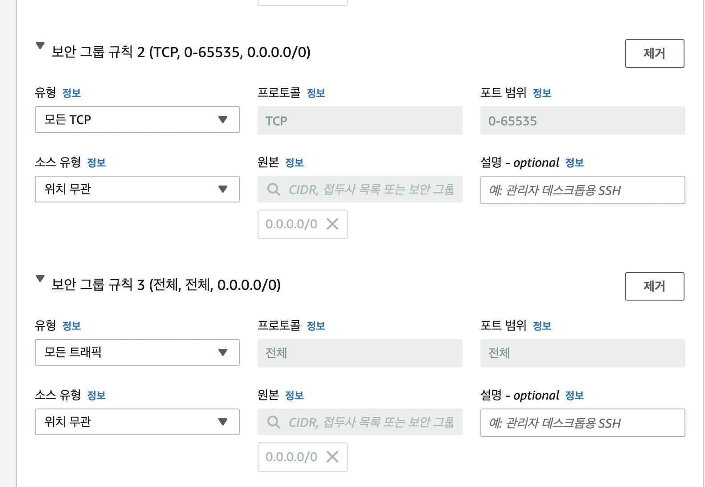
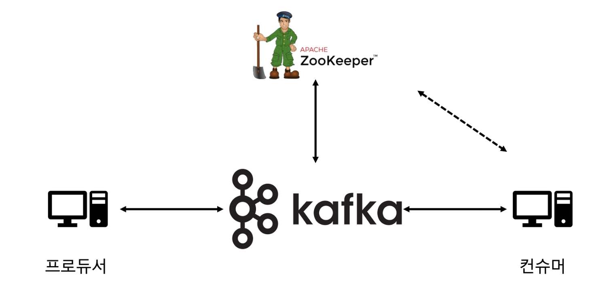

# 2.1 이 책의 실습 환경 구성

AWS 환경에서 카프카 클러스터를 구성하는 방법은 크게 EC2 인스턴스 기반에 구성하는 방법과 MSK라는 매니지드 서비스를 이용해 구성하는 방법으로 나뉩니다. 이 책에서는 EC2 인스턴스 기반에서 카프카 클러스터를 구성하는 방법을 설명합니다.

실제 운영 환경에서는 서비스의 안정성이 최우선이므로 단독 서버 형태로 운영하는 경우는 거의 없고, 대부분 이중화 또는 클러스터 형태로 구성합니다. 따라서 주키퍼의 경우 최소 수량인 EC2 인스턴스 3대로 구성하고, 카프카의 경우도 최소 수량인 EC2 인스턴스 3대로 구성했습니다.

일반적으로 운영환경에서는 애플리케이션 배포를 위해 별도의 배포 서버를 이용하는데, 배포 서버 1대를 포함했고 프라이빗 도메인을 위한 foo.bar의 도메인을 표시했습니다. AWS의 DNS 서비스인 Route53을 사용합니다.


## 2.1.1 AWS 환경에서 실습 환경 구성

### EC2 인스턴스 생성

* AMI (Amazon Machine Image) : Amazon Linux 2 AMI
* 인스턴스 타입 : t2.medium

* 인스턴스 개수 : 7

* 보안 그룹 규칙

    

    

* keypair 생성 및 다운로드
    * key 권한 설정 : `chmod 600 keypair.pem`


### EC2 인스턴스 확인

7개의 인스턴스가 모두 만들어졌으면 각각을 식별할 수 있도록 Name을 설정해줍니다.

* peter-ansible01
* peter-kafka01
* peter-kafka02
* peter-kafka03
* peter-zk01
* peter-zk02
* peter-zk03

> ansible : 여러 개의 서버를 효율적으로 관리하기 위해 고안된 환경 구성 자동화 도구


각 인스턴스의 상세 정보를 확인하면 퍼블릭 IPv4 주소와 프라이빗 IPv4 주소를 확인할 수 있습니다.

나의 로컬 PC에서 AWS 내의 배포 서버인 peter-ansible01 인스턴스로 접근하려면 인터넷 구간을 거쳐야 하므로 퍼블릭 IP 주소를 목적지 주소로 입력해야 합니다. 반면 AWS 내에 존재하는 배포 서버인 peter-ansible01은 카프카 또는 주키퍼 EC2 인스턴스와 서로 동일한 내부 네트워크 환경에 위치하고 있습니다. 따라서 프라이빗 IP 주소를 이용해 접근합니다.


로컬 환경에서는 keypair를 통해 EC2에 접근할 수 있습니다.

``` 
ssh -i keypair.pem -l ec2-user {퍼블릭 IP 주소}
ssh -i keypair.pem ec2-user@{퍼블릭 IP 주소}
```

> 퍼블릭 IP 주소는 인스턴스를 중지한 후 재시작 시 변경되고 프라이빗 IP 주소는 변경되지 않습니다. 퍼블릭 IP 주소를 유지하려면 Elastic IP를 사용해야 합니다.


### DNS 설정

AWS에는 Route53이라는 DNS 서비스가 존재합니다.

Route53의 대안으로 서버의 /etc/hosts 파일을 수정해 사용할 수 있습니다. 실제 운영 환경에서는 이 방법이 권장 되지는 않습니다.

/etc/hosts는 `IP주소 도메인이름 alias`의 형식으로 작성합니다.

여기서는 프라이빗 IP주소와 호스트네임을 입력하도록 합시다.

``` 
```


ping 명령어를 통해 도메인 질의가 잘 되는지 확인할 수 있습니다.

```
ping -c 2 peter-zk01.foo.bar
```


# 2.2 카프카 클러스터 구성

배포 자동화 도구 중 하나인 앤서블이라는 도구를 이용해 주키퍼와 카프카를 설치합니다. 앤서블은 오픈소스 소프트웨어로서 다수의 서버를 대상으로 설정 관리, 애플리케이션 배포 등을 코드로 관리할 수 있도록 도움을 주는 도구입니다. 

관리 도구 목적인 peter-ansible01에서 아래 명령어로 앤서블을 설치합니다.

``` 
sudo amazon-linux-extras install -y ansible2
```


그 후 해당 책에서 제공하는 소스 코드를 내려 받습니다.

``` 
sudo yum install -y git
git clone https://github.com/onlybooks/kafka2
```


keypair.pem 파일을 배포하는 서버에 복사해놓으면 배포하는 서버에서 앤서블을 이용해 다른 서버로 배포할 때 별다른 인증은 필요 없습니다. scp 명령어를 이용해 로컬에 내려받은 keypair.pem 파일을 배포 서버에 복사합니다.

``` 
scp -i keypair.pem ec2-user@{ip주소}:~
```

> ```
> scp 목적파일명(경로) 유저명@IP주소:목적디렉토리
> ```


key의 권한을 수정하고 등록합니다.

``` 
chmod 600 keypair.pem
ssh-agent bash
ssh-add keypair.pem
```


이러한 방법은 배포 서버에 로그아웃 후 재접속 할 경우 설정이 초기화된다는 문제가 있습니다. 이를 위해 다음과 같이 별도로 ssh 공개 키를 생성해 사용하는 방법도 있습니다.

1. 배포 서버에서 공개 키 생성
2. 공개 키 내용을 접속하고자 하는 서버에 복사
3. 배포 서버에서 다른 서버로 비밀번호 없이 접속

그 다음에는 ssh-keygen 명령어를 이용해 공개 키를 생성합니다.

``` 
ssh-keygen
```


그 결과 아래 경로에 파일이 생성됩니다.

``` 
cat /home/ec2-user/.ssh/id_rsa.pub
```


해당 파일의 내용을 perter-kafka01 서버로 옮깁니다.

```
vi /home/ec2-user/.ssh/authorized_keys
chmod 600 .ssh/authorized_keys
```


배포 서버로 이동한 후 peter-zk 서버들에 모두 주키퍼를 설치합니다.

``` 
cd kafka2/chapter2/ansible_playbook
ansible-playbook -i hosts zookeeper.yml
```


주키퍼가 제대로 실행되고 있는지 확인해보겠습니다.

```
sudo systemctl status zookeeper-server
```


출력 내용 중 Active: active (running)이 확인되면 정상적으로 실행되고 있는 상태입니다.

> 리눅스 환경에서 systemd 프로세스를 등록해 사용하면, 서버가 예기치 않게 재시작되더라도 자동으로 프로세스를 실행할 수 있으며 시스템 관리자가 프로세스를 관리하기도 매우 편리합니다. 
>
> * 프로세스 상태 확인 명령어 : systemctl status zookeeper-server
> * 프로세스 중지 명령어 : systemctl stop zookeeper-server
> * 프로세스 시작 명령어 : systemctl start zookeeper-server
> * 프로세스 재시작 명령어 : systemctl restart zookeeper-server
>
> https://access.redhat.com/articles/754933


다음으로는 kafka를 설치합니다.

``` 
ansible-playbook -i hosts kafka.yml
```


제대로 실행되고 있는지 확인해보겠습니다.

``` 
sudo systemctl status zookeeper-server
```


# 2.3 5분만에 카프카 맛보기

## 2.3.1 카프카의 기본 구성

카프카는 데이터를 받아서 전달하는 데이터 버스의 역할을 합니다. 카프카에 데이터를 만들어서 주는 쪽을 프로듀서라 부르며 카프카에서 데이터를 빼내서 소비하는 쪽을 컨슈머라 합니다. 그리고 주키퍼는 카프카의 정상 동작을 보장하기 위해 메타데이터를 관리하는 코디네이터라 할 수 있습니다.




카프카를 어려워하는 이유 중 하나는 바로 주키퍼 때문일 것입니다. 카프카 애플리케이션과 주키퍼 애플리케이션, 총 2개의 애플리케이션을 설치하고 운영하는 것의 부담이 큽니다. 하지만 2021년 4월 주키퍼 없이 구동될 수 있는 카프카가 처음으로 공개되었습니다. 

여기서는 카프카의 메타데이터 저장소로 주키퍼를 사용하며 브로커들의 노드 관리 등을 하고 있다 정도로 이해하면 됩니다.

> 브로커라는 용어가 헷갈릴 수 있습니다. 정확하게 정의하자면 카프카는 애플리케이션의 이름을 말하고, 브로커는 카프카 애플리케이션이 설치된 서버 또는 노드를 의미합니다. 


## 2.3.2 메시지 보내고 받기

카프카로 메시지를 전송하는 실습을 진행하기에 앞서 가장 먼저 해야 할 일은 토픽을 생성하는 것입니다. 프로듀서가 카프카로 메시지를 전송할 때 카프카의 특정 토픽으로 전송하게 됩니다. 카프카가 설치된 peter-kafka01 서버로 접속한 후 토픽을 생성해봅시다.

``` 
/usr/local/kafka/bin/kafka-topics.sh --bootstrap-server peter-kafka01.foo.bar:9092 --create --topic peter-overview01 --patitions 1 --replication-factor 3
```


프로듀서와 컨슈머를 동시에 실행하면서 메시지를 잘 전송하고 잘 가져오는지 확인하기 위해 2개의 cmd 창을 열어서 하나의 창에서는 컨슈머를 실행하고, 나머지 하나의 창에서는 프로듀서를 실행합니다.

먼저 컨슈머를 실행합니다.

```
/usr/local/kafka/bin/kafka-console-consumer.sh --bootstrap-server perter-kafka01.foo.bar:9092 --topic peter-overview01
```


다음으로 프로듀서를 실행해 메시지를 전송합니다.

```
/usr/local/kafka/bin/kafka-console.producer.sh --bootstrap-server perter-kafka01.foo.bar:9092 --topic peter-overview01
```

이 경우 명령 프롬프트가 > 로 변경되어 메시지를 입력할 수 있습니다.

메시지를 입력하면 컨슈머에서 메시지를 수신하는 것을 확인할 수 있습니다.


