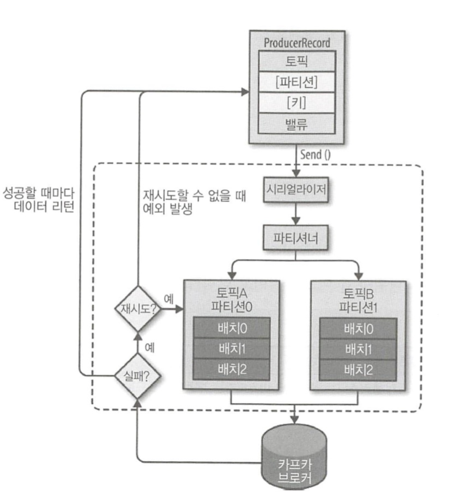

# 3.1 카프카 기초 다지기

카프카를 구성하는 주요 요소

* 주키퍼 : 카프카의 메타데이터 관리 및 브로커의의 정상상태 점검을 담당합니다.
* 카프카 or 카프카 클러스터 : 아파치 프로젝트 애플리케이션 이름입니다. 여러 대의 브로커를 구성한 클러스터를 의미합니다.
* 브로커 : 카프카 애플리케이션이 설치된 서버 또는 노드를 말합니다.
* 프로듀서 : 카프카로 메시지를 보내는 역할을 하는 클라이언트를 총칭합니다.
* 컨슈머 : 카프카에서 메시지를 꺼내가는 역할을 하는 클라이언트를 총칭합니다.
* 토픽 : 카프카는 메시지 피드들을 토픽으로 구분하고 각 토픽의 이름은 카프카 내에서 고유합니다.
* 파티션 : 병렬 처리 및 고성능을 얻기 위해 하나의 토픽을 여러 개로 나눈 것을 말합니다.
* 세그먼트 : 프로듀서가 전송한 실제 메시지가 브로커의 로컬 디스크에 저장되는 파일을 말합니다.
* 메시지 또는 레코드 : 프로듀서가 브로커로 전송하거나 컨슈머가 읽어가는 데이터 조각을 말합니다.


## 3.1.1 리플리케이션

카프카에서 리플리케이션이란 각 메시지들을 여러 개로 복제해서 카프카 클러스터 내 브로커들에 분산시키는 동작을 의미합니다. 이러한 리플리케이션 동작 덕분에 하나의 브로커가 종료되더라도 카프카는 안정성을 유지할 수 있습니다. 앞서 `--replication-factor` 옵션으로 리플리케이션 개수를 지정했습니다.

안정성을 목적으로 모든 토픽에 대해 각 3개의 리플리케이션으로 설정할 수 있습니다. 리플리케이션 팩터 수가 커지면 안정성은 높아지지만 그만큼 브로커 리소스를 많이 사용하게 됩니다. 토픽 생성 시 다음과 같이 기준을 세워두고 리플리케이션 팩터 수를 설정해 사용한다면 좀 더 효율적으로 카프카를 운영할 수 있을 것입니다.

* 테스트나 개발 환경: 리플리케이션 팩터 수를 1로 설정
* 운영 환경(로그성 메시지로서 약간의 유실 허용) : 리플리케이션 팩터 수를 2로 설정
* 운영 환경(유실 허용하지 않음) : 리플리케이션 팩터 수를 3으로 설정


## 3.1.2 파티션

하나의 토픽이 한 번에 처리할 수 있는 한계를 높이기 위해 토픽 하나를 여러 개로 나눠 병렬 처리가 가능하게 만든 것이 파티션이라고 합니다. 이렇게 하나를 여러 개로 나누면 분산 처리도 가능합니다. 이렇게 나뉜 파티션 수만큼 컨슈머를 연결할 수 있습니다. 

파티션 수도 토픽을 생성할 때 옵션으로 설정하게 되는데, 파티션 수를 정하는 기준은 다소 모호한 경우가 많습니다. 각 메시지 크기나 초당 메세지 건수 등에 따라 달라지므로 정확하게 예측하기는 어렵습니다. 파티션 수는 초기 생성 후 언제든지 늘릴 수 있지만, 반대로 한 번 늘린 파티션 수는 절대로 줄일 수 없다는 점을 명심해야 합니다. 따라서 초기에 토픽을 생성할 때 파티션 수를 작게, 즉 2 또는 4 정도로 생성한 후 메시지 처리량이나 컨슈머의 LAG 등을 모니터링하면서 조금씩 늘려가는 방법이 가장 좋습니다. 

> LAG란 프로듀서가 보낸 메시지 수(카프카에 남아있는 메시지 수) - 컨슈머가 가져간 메시지 수를 나타냅니다.


## 3.1.3 세그먼트

프로듀서에 의해 브로커로 전송된 메시지는 토픽의 파티션에 저장되며, 각 메시지들은 세그먼트라는 로그 파일의 형태로 브로커의 로컬 디스크에 저장됩니다. 각 파티션마다 N개의 세그먼트 로그 파일들이 존재합니다. 

실제로 전송했던 메시지가 세그먼트에 남아 있는지 확인해보겠습니다. peter-kafka01 서버로 접근한 후 아래 경로로 이동합니다.

``` 
cd /data/kafka-logs/
ls
```

```
__consumer_offsets-0   __consumer_offsets-26  __consumer_offsets-43
__consumer_offsets-1   __consumer_offsets-27  __consumer_offsets-44
__consumer_offsets-10  __consumer_offsets-28  __consumer_offsets-45
__consumer_offsets-11  __consumer_offsets-29  __consumer_offsets-46
__consumer_offsets-12  __consumer_offsets-3   __consumer_offsets-47
__consumer_offsets-13  __consumer_offsets-30  __consumer_offsets-48
__consumer_offsets-14  __consumer_offsets-31  __consumer_offsets-49
__consumer_offsets-15  __consumer_offsets-32  __consumer_offsets-5
__consumer_offsets-16  __consumer_offsets-33  __consumer_offsets-6
__consumer_offsets-17  __consumer_offsets-34  __consumer_offsets-7
__consumer_offsets-18  __consumer_offsets-35  __consumer_offsets-8
__consumer_offsets-19  __consumer_offsets-36  __consumer_offsets-9
__consumer_offsets-2   __consumer_offsets-37  cleaner-offset-checkpoint
__consumer_offsets-20  __consumer_offsets-38  log-start-offset-checkpoint
__consumer_offsets-21  __consumer_offsets-39  meta.properties
__consumer_offsets-22  __consumer_offsets-4   peter-overview01-0
__consumer_offsets-23  __consumer_offsets-40  recovery-point-offset-checkpoint
__consumer_offsets-24  __consumer_offsets-41  replication-offset-checkpoint
__consumer_offsets-25  __consumer_offsets-42
```


`peter-overview01-0` 파일을 찾을 수 있는데 이는 peter-overview01이라는 토픽의 0번 파티션 디렉토리를 의미합니다.


```
cd peter-overview01-0
ls
```

```
00000000000000000000.index  00000000000000000000.timeindex
00000000000000000000.log    leader-epoch-checkpoint
```


이 중 .log 파일을 hexdump를 보여주는 xxd 명령어로 확인해보면 전송한 메시지를 확인할 수 있습니다. 실제로 컨슈머도 해당 로그 파일에서 메시지를 가져갑니다.

``` 
xxd 00000000000000000000.log
```


# 3.2 카프카의 핵심 개념

## 3.2.1 분산 시스템

분산 시스템은 네트워크상에서 연결된 컴퓨터들의 그룹을 말하며, 단일 시스템이 갖지 못한 높은 성능을 목표로 합니다. 이러한 분산 시스템은 성능이 높다는 장점 이외에도 하나의 서버 또는 노드 등에 장애가 발생할 때 다른 서버 또는 노드가 대신 처리하므로 장애 대응이 탁월하며 부하가 높은 경우에도 시스템 확장이 용이하다는 장점도 있습니다. 카프카도 분산 시스템이므로 최소 구성한 클러스터의 리소스가 한계치에 도달해 더욱 높은 메시지 처리량이 필요한 경우, 브로커를 추가하는 방식으로 확장이 가능합니다. 이렇게 확장이 용이하다는 점은 카프카의 매우 큰 장점입니다.


## 3.2.2 페이지 캐시

카프카는 OS의 페이지 캐시를 활용하는 방식으로 설계되어 있습니다. 페이지 캐시는 직접 디스크에 읽고 쓰는 대신 물리 메모리 중 애플리케이션이 사용하지 않는 일부 잔여 메모리를 활용합니다. 이렇게 페이지 캐시를 이용하면 디스크 I/O에 대한 접근이 줄어들므로 성능을 높일 수 있습니다.


## 3.2.3 배치 전송 처리

카프카는 프로듀서, 컨슈머 클라이언트들과 서로 통신하며 수많은 메시지를 주고받습니다. 이 때 발생하는 수많은 통신을 묶어서 배치 처리하여 빠르고 효율적으로 처리할 수 있습니다.


## 3.2.4 압축 전송

카프카는 메시지 전송 시 좀 더 성능이 높은 압축 전송을 사용하는 것을 권장합니다. 카프카에서 지원하는 압축 타입은 gzip, snappy, lz4, zstd 등입니다. 일반적으로 높은 압축률이 필요한 경우라면 gzip이나 zstd를 권장하고, 빠른 응답 속도가 필요하다면 lz4, snappy를 권장합니다. 실제로 메시지를 전송해보면서 압축 타입별로 직접 테스트를 해보고 결정하는 것이 가장 좋습니다.


## 3.2.5 토픽, 파티션, 오프셋

카프카는 토픽이라는 곳에 데이터를 저장하는데, 이는 메일 전송 시스템에서 이메일 주소 정도의 개념으로 이해하면 쉽습니다. 토픽은 병렬 처리를 위해 여러 개의 파티션이라는 단위로 다시 나뉩니다. 카프카에서는 이와 같은 파티셔닝을 통해 단 하나의 토픽이라도 높은 처리량을 수행할 수 있습니다. 이 파티션의 메시지가 저장되는 위치를 오프셋이라고 부르며, 오프셋은 순차적으로 증가하는 수자(64비트 정수) 형태로 되어 있습니다.

각 파티션에서의 오프셋은 고유한 숫자로 카프카에서는 오프셋을 통해 메시지의 순서를 보장하고 컨슈머에서는 마지막까지 읽은 위치를 알 수도 있습니다.


## 3.2.6 고가용성 보장

카프카는 분산 시스템이기 때문에 하나의 서버나 노드가 다운되어도 다른 서버 또는 노드가 장애가 발생한 서버의 역할을 대신해 안정적인 서비스가 가능합니다. 고가용성을 보장하기 위해 카프카에서는 리플리케이션 기능을 제공합니다. 카프카에서 제공하는 리플리케이션 기능은 토픽 자체를 복제하는 것이 아니라 토픽의 파티션을 복제하는 것입니다. 토픽을 생성할 때 옵션으로 리플리케이션 팩터 수를 지정할 수 있으며, 이 숫자에 따라 리플리케이션들이 존재하게 됩니다. 원본과 리플리케이션을 구분하기 위해 흔히 마스터, 미러 같은 용어를 사용하는데 카프카에서는 리더와 팔로워라고 부릅니다.

| 리플리케이션 팩터 수 | 리더 수 | 팔로워 수 |
| -------------------- | ------- | --------- |
| 2                    | 1       | 1         |
| 3                    | 1       | 2         |
| 4                    | 1       | 3         |

팔로워 수가 많을수록 안정적이고 좋을 거라 생각할 수 있겠지만 팔로워의 수가 많다고 딱히 좋은 것은 아닙니다. 팔로위의 수만큼 결국 브로커의 디스크 공간도 소비되므로 이상적인 리플리케이션 팩터 수를 유지해야 하며, 따라서 일반적으로 카프카에서는 리플리케이션 팩터 수를 3으로 구성하도록 권장합니다.


## 3.2.7 주키퍼의 의존성

주키퍼는 하둡의 서브 프로젝트 중 하나로 출발해 2011년 아파치의 탑레벨 프로젝트로 승격됐습니다. 아파치 카프카를 비롯해 아파치 산하 프로젝트인 하둡, 나이파이, 에이치베이스 등 많은 분산 애플리케이션에서 코디네이터 역할을 하는 애플리케이션으로 사용되고 있습니다.

주키퍼는 여러 대의 서버를 앙상블로 구성하고 살아 있는 노드 수가 과반수 이상 유지된다면 지속적인 서비스가 가능한 구조입니다. 따라서 주키퍼는 반드시 홀수로 구성해야 하며, 2장의 실습 과정에서도 주키퍼는 홀수인 3개로 구성했습니다.

znode를 이용해 카프카의 메타 정보가 주키퍼에 기록되며, 주키퍼는 이러한 znode를 이용해 브로커의 노드 관리, 토픽 관리, 컨트롤러 관리 등 매우 중요한 역할을 하고 있습니다. 


# 3.3 프로듀서의 기본 동작과 예제 맛보기

프로듀서는 카프카의 토픽으로 메시지를 전송하는 역할을 담당합니다. 


## 3.3.1 프로듀서 디자인



ProducerRecord라고 표시된 부분은 카프카로 전송하기 위한 실제 데이터이며, 레코드는 토픽, 파티션, 키, 밸류로 구성됩니다. 프로듀서가 카프카로 레코드를 전송할 때, 카프카의 특정 토픽으로 메시지를 전송합니다. 따라서 레코드에서 토픽과 밸류는 필숫값이며, 특정 파티션을 지정하기 위한 레코드의 파티션과 특정 파티션에 레코드들을 정렬하기 위한 레코드의 키는 필숫값이 아닌 선택사항입니다.

 각 레코드들은 프로듀서의 send() 메소드를 통해 시리얼라이저, 파티셔너를 거치게 됩니다. 만약 프로듀서 레코드의 선택사항인 파티션을 지정했다면, 파티셔너는 아무 동작도 하지 않고 지정된 파티션으로 레코드를 전달합니다. 파티션을 지정하지 않은 경우에는 키를 가지고 파티션을 선택해 레코드를 전달하는데, 기본적으로는 라운드 로빈 방식으로 동작합니다. 프로듀서가 카프카로 전송하기 전, 파티션 별로 모아두다가 배치 전송을 하게 됩니다.


## 3.3.2 프로듀서의 주요 옵션

| 옵션                                 | 설명                                                         |
| ------------------------------------ | ------------------------------------------------------------ |
| bootstrap.servers                    | 카프카 클러스터는 클러스터 마스터라는 개념이 없으므로 클러스터 내 모든 서버가 클라이언트 요청을 받을 수 있습니다. 클라이언트가 카프카 클러스터에 처음 연결하기 위한 호스트와 포트 정보를 나타냅니다. |
| client.dns.lookup                    | 하나의 호스트에 여러 IP를 매핑해 사용하는 일부 환경에서 클라이언트가 하나의 IP와 연결하지 못할 경우에 다른 IP로 시도하는 설정입니다. |
| acks                                 | 프로듀서가 카프카 토픽의 리더 측에 메시지를 전송한 후 요청을 완료하기를 결정하는 옵션입니다.<br>0,1,all(-1)로 표현하며, 0은 리더 측에서 메시지를 받았는지 확인하지 않는다. 따라서 전송이 빠르지만, 일부 메시지가 유실될 가능성이 있다. 1은 리더가 메시지를 받았는지 확인하지만, 모든 팔로워 전부를 확인하진 않는다. 대부분 기본값으로 1을 사용한다. all은 팔로워가 메시지를 받았는지 여부를 확인한다. |
| buffer.memory                        | 카프카 서버로 데이터를 보내기 위해 잠시 대기(배치 전송이나 딜레이 등)할 수 있는 전체 메모리 바이트입니다. |
| compression.type                     | 프로듀서가 메시지 전송 시 선택할 수 있는 압축 타입입니다. (none, gzip, snappy, lz4, zstd) |
| enable.idempotence                   | 설정을 true로 하면 중복 없는 전송이 가능함(중복 없는 전송은 max.flight.requests.per.connection은 5이하, retries는 0이상, acks는 all로 설정해야함) |
| max.in.flight.request.per.connection | 하나의 커넥션에서 프로듀서가 최대한 ACK 없이 전송할 수 있는 요청 수. 메시지 순서가 중요하다면 1로 설정할 것을 권장하지만, 성능은 다소 떨어진다. |
| retries                              | 전송에 실패한 데이터를 다시 보내는 횟수                      |
| batch.size                           | 배치 전송할 배치 크기                                        |
| linger.ms                            | 배치 크기에 도달하지 못한 상황에서 linger.ms 제한 시간에 도달했을 때 메시지를 전송한다 |
| transactional.id                     | '정확히 한번 전송'을 위해 사용하는 옵션이며, 동일한 TransactionalId에 한해 정확히 한 번을 보장한다. 옵션을 사용하기 전 enable.idempotence를 true로 설정해야 함 |


## 3.3.3 프로듀서 예제

프로듀서의 전송 방법은 크게 세 가지 방식으로 나눌 수 있습니다.

* 메시지를 보내고 확인하지 않기 - 실제 운영 환경에서 사용하는 것을 추천하지 않음
* 동기 전송
* 비동기 전송


# 3.4 컨슈머의 기본 동작과 예제 맛보기

컨슈머는 카프카의 토픽에 저장되어 있는 메시지를 가져오는 역할을 합니다. 뿐만 아니라 내부적으로 컨슈머 그룹, 리밸런싱 등 여러 동작을 수행합니다. 프로듀서가 카프카로 메시지를 빠르게 전송하더라도 컨슈머가 카프카로부터 빠르게 메시지를 읽어오지 못한다면 지연이 발생합니다.


## 3.4.1 컨슈머의 기본 동작

프로듀서가 카프카의 토픽으로 메시지를 전송하면 해당 메시지들은 브로커들의 로컬 디스크에 저장됩니다. 그리고 컨슈머를 이용해 토픽에 저장된 메시지를 가져올 수 있습니다. 컨슈머 그룹은 하나 이상의 컨슈머들이 모여 있는 그룹을 의미하고 컨슈머는 반드시 컨슈머 그룹에 속하게 됩니다. 그리고 이 컨슈머 그룹은 각 파티션의 리더에게 카프카 토픽에 저장된 메시지를 가져오기 위한 요청을 보냅니다. 이 때 파티션 수와 컨슈머 수는 일대일로 매핑되는 것이 이상적입니다. 컨슈머 수가 파티션 수보다 많다면 속도가 빨라지지 않고 대기하는 컨슈머만 생겨납니다. 컨슈머 그룹내에서 리밸런싱 동작을 통해 장애가 발생한 컨슈머의 역할을 동일한 그룹에 있는 다른 컨슈머가 그 역할을 대신 수행하므로 굳이 장애 대비를 위한 추가 컨슈머 리소스를 할당하지 않아도 됩니다.


## 3.4.2 컨슈머의 주요 옵션

컨슈머를 사용하는 목적이 최대한 안정적이며 지연이 없도록 카프카로부터 메시지를 가져오는 것인데 이를 위한 옵션을 잘 이해하고 사용해야 합니다.

| 옵션                          | 설명                                                         |
| ----------------------------- | ------------------------------------------------------------ |
| bootstrap.servers             | 카프카 클러스터는 클러스터 마스터라는 개념이 없으므로 클러스터 내 모든 서버가 클라이언트 요청을 받을 수 있습니다. 클라이언트가 카프카 클러스터에 처음 연결하기 위한 호스트와 포트 정보를 나타냅니다. |
| fetch.min.bytes               | 한 번에 가져올 수 있는 최소 데이터 크기. 만약 지정한 크기보다 작은 경우, 요청에 응답하지 않고 데이터가 누적될 때까지 기다린다. |
| group.id                      | 컨슈머가 속한 컨슈머 그룹을 식별하는 식별자. 동일한 그룹 내의 컨슈머 정보는 모두 공유된다. |
| heartbeat.interval.ms         | 하트비트가 있다는 것은 컨슈머의 상태가 active임을 의미. session.timeout.ms보다 낮은 값으로 설정해야하며 일반적으로 session.timeout.ms의 1/3로 설정한다. |
| max.partition.fetch.bytes     | 파티션당 가져올 수 있는 최대 크기를 의미합니다.              |
| session.timeout.ms            | 이 시간을 이용해, 컨슈머가 종료된 것인지를 파악한다. 컨슈머는 주기적으로 하트비트를 보내야 하고, 만약 이 시간 전까지 하트비트를 보내지 않았다면 해당 컨슈머는 종료된 것으로 간주하고 컨슈머 그룹에서 제외하고 리밸런싱을 시작한다. |
| enable.auto.commit            | 백그라운드로 주기적으로 오프셋을 커밋한다.                   |
| auto.offset.reset             | 카프카에서 초기 오프셋이 없거나 현재 오프셋이 더 이상 존재하지 않는 경우에 다음 옵션으로 reset한다.<br/>\- earliest: 가장 초기의 오프셋값으로 설정<br/>\- latest: 가장 마지막의 오프셋값으로 설정.<br/>\- none: 이전 오프셋값을 찾지 못하면 에러 발생 |
| fetch.max.bytes               | 한 번의 가져오기 요청으로 가져올 수 있는 최대 크기           |
| group.instance.id             | 컨슈머의 고유한 식별자. 만약 설정한다면 static 멤버로 간주되어, 불필요한 리밸런싱을 하지 않는다 |
| isolation.level               | 트랜잭션 컨슈머에서 사용되는 옵션으로, read_uncommitted는 기본값으로 모든 메시지를 읽고, read_committed는 트랜잭션이 완료된 메시지만 읽는다. |
| max.poll.records              | 한 번의 `poll()` 요청으로 가져오는 최대 메시지의 수          |
| partition.assignment.strategy | 파티션 할당 전략이며, 기본값은 range                         |
| fetch.max.wait.ms             | fetch.min.bytes에 의해 설정된 데이터보다 적은 경우 요청에 대한 응답을 기다리는 최대 시간 |


## 3.4.3 컨슈머 예제

컨슈머에서 메시지를 가져오는 방법은 크게 세 가지 방식이 있습니다.

* 오토 커밋
* 동기 가져오기
* 비동기 가져오기


### 오토 커밋

* 컨슈머 애플리케이션들의 기본값으로 가장 많이 사용되고 있는 방법
* 장점
    * 오프셋을 주기적으로 커밋하므로 관리자가 오프셋을 따로 관리하지 않아도 된다.
    * 카프카가 안정적으로 잘 동작하고 컨슈머 역시 한 번 구동하고 나면 자주 변경되거나 종료되는 현상이 없으므로 많이 사용
* 단점
    * 컨슈머 종료 등이 빈번히 일어나면 일부 메시지를 못 가져오거나 중복으로 가져오는 경우가 존재


### 동기 가져오기

* 장점
    * 메시지 손실은 거의 발생하지 않습니다. 여기서 메시지 손실이란 실제로 토픽에는 메시지가 존재하지만 잘못된 오프셋 커밋으로 인한 위치 변경으로 컨슈머가 메시지를 가져오지 못하는 경우를 말합니다.
    * 메시지가 손실되면 안 되는 중요한 처리 작업들은 동기 방식으로 진행하는 것을 권장합니다.
* 단점
    * 속도가 느립니다.
    * 메시지의 중복 이슈는 피할 수 없습니다.


### 비동기 가져오기

비동기로 가져오는 방식에서는 오프셋을 커밋하기 위해 consumer.commitAsync()를 사용합니다. 이는 오프셋 커밋을 실패하더라도 재시도하지 않습니다. 왜 재시도를 하면 안되는지 예를 들어 봅시다. 총 10개의 메시지가 있고 오프셋 1번부터 10번까지 순차적으로 커밋을 한다고 가정해보겠습니다.

1. 1번 오프셋의 메시지를 읽은 뒤 1번 오프셋을 비동기 커밋합니다. (현재 마지막 오프셋1)
2. 2번 오프셋의 메시지를 읽은 뒤 2번 오프셋을 비동기 커밋하지만 실패했습니다. (현재 마지막 오프셋1)
3. 3번 오프셋의 메시지를 읽은 뒤 3번 오프셋을 비동기 커밋하지만 실패했습니다. (현재 마지막 오프셋1)
4. 4번 오프셋의 메시지를 읽은 뒤 4번 오프셋을 비동기 커밋하지만 실패했습니다. (현재 마지막 오프셋1)
5. 5번 오프셋의 메시지를 읽은 뒤 5번 오프셋을 비동기 커밋합니다. (현재 마지막 오프셋5)
6. 만약 비동기 커밋이 재시도가 있다면 2번 오프셋을 커밋을 재시도하고 성공하여 마지막 오프셋이 2로 변경될 수 있습니다.


## 3.4.4 컨슈머 그룹의 이해

컨슈머는 컨슈머 그룹 안에 속한 것이 일반적인 구조로, 하나의 컨슈머 그룹 안에 여러 개의 컨슈머가 구성될 수 있습니다. 그리고 컨슈머들은 토픽의 파티션과  일대일로 매핑되어 메시지를 가져오게 됩니다.

그룹 내의 컨슈머들은 서로의 정보를 공유합니다. 예를 들어 컨슈머01이 문제가 생겨 종료됐다면, 컨슈머02 또는 컨슈머03은 컨슈머01이 하던 일을 대신해 컨슈머01이 컨슘하던 파티션을 컨슘하게 됩니다.