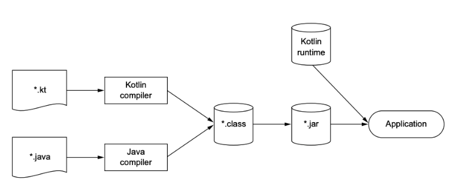

# 01. 코틀린 맛보기

``` kotlin
data class Person(val name: String, val age: Int? = null)

fun main(args: Array<String>) {
    val persons = listOf(Person("영희"), Person("철수", age = 29))
    val oldest = persons.maxByOrNull { it.age ?:0}
    println("나이가 가장 많은 사람: $oldest")
    // 나이가 가장 많은 사람: Person(name=철수, age=29)
}
```

* it : mayByOrNull 함수에 전달한 람다 식은 파라미터를 하나 받는다. it이라는 이름을 사용하면 람다 식의 유일한 인자를 사용할 수 있다.
* `?:` : 엘비스 연산자(Evis operator)라고 부르며 age가 null인 경우 이후의 값인 0을 반환한다.


# 02. 코틀린의 주요 특성

## 대상 플랫폼: 서버, 안드로이드 등 자바가 실행되는 모든 곳

코틀린의 주목적은 현재 자바가 사용되고 있는 모든 용도에 적합하면서도 더 간결하고 생산적이며 안전한 대체 언어를 제공하는 것이다.


## 정적 타입 지정 언어

자바와 마찬가지로 코틀린도 정적 타입 지정 언어다.

정적 타입 지정이라는 말은 모든 프로그램 구성 요소의 타입을 컴파일 시점에 알 수 있고 프로그램 안에서 객체의 필드나 메서드를 사용할 때마다 컴파일러가 타입을 검증해준다는 뜻이다.

자바와 달리 코틀린에서는 모든 변수의 타입을 프로그래머가 직접 명시할 필요가 없다.

대부분의 경우 코틀린 컴파일러가 문맥으로부터 변수 타입을 자동으로 유추할 수 있기 때문에 프로그래머는 타입 선언을 생략해도 된다.


아래와 같이 변수를 정의하면 정수 값으로 초기화되고 코틀린은 이 변수의 타입이 Int임을 자동으로 알아낸다.

컴파일러가 문맥을 고려해 변수 타입을 결정하는 이런 기능을 타입 추론(type inference)이라고 부른다.

``` kotlin
var x = 1
```


### 정적 타입 지정 장점

* 성능 : 실행 시점에 어떤 메서드를 호출할 지 알아내는 과정이 필요 없으므로 메서드 호출이 더 빠르다.
* 신뢰성 : 컴파일러가 프로그램의 정확성을 검증하기 때문에 실행 시 프로그램이 오류로 중단될 가능성이 더 적어진다.
* 유지 보수성 : 코드에서 다루는 객체가 어떤 타입에 속하는지 알 수 있기 때문에 처음 보는 코드를 다룰 때도 더 쉽다.
* 도구 지원 : 정적 타입 지정을 활용하면 더 안전하게 리팩토링할 수 있고 도구는 더 정확한 코드 완성 기능을 제공할 수 있으며,   IDE의 다른 지원 기능도 더 잘 만들 수 있다.


### nullable type

코틀린은 널이 될 수 있는 타입을 지원한다. 

컴파일 시점에 널 포인터 예외가 발생할 수 있는지 여부를 검사할 수 있어서 좀 더 프로그램의 신뢰성을 높일 수 있다.


### function type

코틀린은 함수 타입을 지원한다.

함수 타입이 무엇인가 알아보기 위해 함수형 프로그래밍이 어떤 개념인지, 코틀린이 어떻게 지원하는지 알아보자.


## 함수형 프로그래밍과 객체지향 프로그래밍

함수형 프로그래밍의 핵심 개념은 다음과 같다.

* 일급 시민(first-class)인 함수 : 함수를 일반 값처럼 다룰 수 있다. 함수를 변수에 저장할 수 있고, 함수를 인자로 다른 함수에 전달할 수 있으며, 함수에서 새로운 함수를 만들어서 반환할 수 있다.
* 불변성 : 함수형 프로그래밍에서는 일단 만들어지고 나면 내부 상태가 절대로 바뀌지 않는 불변 객체를 사용해 프로그램을 작성한다.
* 부수 효과(side effect) 없음 : 함수형 프로그래밍에서는 입력이 같으면 항상 같은 출력을 내놓고 다른 객체의 상태를 변경하지 않으며, 함수 외부나 다른 바깥 환경과 상호작용하지 않는 순수 함수(pure function)를 사용한다.


### 함수형 프로그래밍 장점1: 간결성

함수형 코드는 그에 상응하는 명령형 코드에 비해 더 간결하고 우아하다.

함수를 값처럼 활용할 수 있으면 더 강력한 추상화를 할 수 있고 강력한 추상화를 사용해 코드 중복을 막을 수 있다.

비슷하지만 조건이 조금 다른 두 상황이 있다고 가정하자.

이 로직에서 공통 부분을 따로 함수로 뽑아내고 서로 다른 세부 사항을 인자로 전달할 수 있다.

이런 인자는 그 자체가 함수다.

``` kotlin
fun findAlice() = findPerson { it.name == "Alice" }
fun findBob() = findPerson { it.name == "Bob" }
```


### 함수형 프로그래밍 장점2: safe multithreading

불변 데이터 구조를 사용하고 순수 함수를 그 데이터 구조에 적용한다면 다중 스레드 환경에서 같은 데이터를 여러 스레드가 변경할 수 없다.

따라서 복잡한 동기화를 적용하지 않아도 된다.


### 함수형 프로그래밍 장점3: 테스트하기 쉽다

부수 효과가 있는 함수는 그 함수를 실행할 때 필요한 전체 환경을 구성하는 준비 코드가 따로 필요하지만 순수함수는 그런 준비 코드 없이 독립적으로 테스트할 수 있다.


### 코틀린에서 지원하는 함수형 프로그래밍

자바 8 이전의 자바에는 함수형 프로그래밍을 지원할 수 있는 기능이 거의 없었다.

코틀린은 처음부터 함수형 프로그래밍을 풍부하게 지원해 왔다. 

* 함수 타입을 지원함에 따라 어떤 함수가 다른 함수를 파라미터로 받거나 함수가 새로운 함수를 반환할 수 있다.
* 람다 식을 지원함에 따라 번거로운 준비 코드를 작성하지 않아도 코드 블록을 쉽게 정의하고 여기저기 전달 할 수 있다.
* 데이터 클래스는 불변적인 값 객체를 간편하게 만들 수 있는 구문을 제공한다.
* 코틀린 표준 라이브러리는 객체와 컬렉션을 함수형 스타일로 다룰 수 있는 API를 제공한다.


## 무료 오픈 소스

코틀린 언어와 컴파일러, 라이브러리 및 코틀린과 관련된 모든 도구는 모두 오픈소스며 어떤 목적에든 무료로 사용할 수 있다.


# 03. 코틀린 응용

## 코틀린 서버 프로그래밍

코틀린은 새로운 컴포넌트를 작성하거나 기존 서비스 코드를 코틀린으로 이식해야 하는 경우에 모두 잘 들어맞는다.

자바 클래스를 코틀린으로 확장해도 아무 문제가 없으며 코틀린 클래스 안의 메서드나 필드에 특정 애노테이션을 붙어야 하는 경우에도 아무 문제 없다.

동시에, 코틀린을 사용하면 몇 가지 새로운 기술을 활용해 서버 시스템을 개발할 수 있다.

* 빌더 패턴
* DSL 기능을 활용할 수 있는 영속성 프레임워크


## 코틀린 안드로이드 프로그래밍

생략


# 04. 코틀린의 철학

코틀린이 자바와의 상호운용성에 초점을 맞춘 실용적이고 간결하며 안전한 언어라고 설명하는 경우가 자주 있다.


## 실용성

코틀린은 실제 문제를 해결하기 위해 만들어진 실용적인 언어다.

다른 프로그래밍 언어가 채택한 이미 성공적으로 검증된 해법과 기능에 의존한다.

어느 특정 프로그래밍 스타일이나 패러다임을 사용할 것을 강제로 요구하지 않는다.

코틀린의 다른 측면은 도구를 강조한다는 점이다.


## 간결성

개발자는 코드를 새로 작성하는 시간보다 기존 코드를 읽는 시간이 더 길다.

코드가 간단하고 간결할수록 내용을 파악하기가 더 쉽다.

여기서 간결하다는 말은 코드를 읽을 때 의도를 쉽게 파악할 수 있는 구문 구조를 제공하고, 그 의도를 달성하는 방법을 이해할 때 방해가 될 수 있는 부가적인 준비 코드가 적다는 뜻이다.

게터, 세터, 생성자 파라미터를 필드에 대입하기 위한 로직 등 자바에 존재하는 여러 가지 번거로운 준비 코드를 묵시적으로 제공한다.

다양한 표준 라이브러리를 제공한다.


## 안전성

프로그래밍 언어가 안전하다는 말은 프로그램에서 발생할 수 있는 오류 중에서 일부 유형의 오류를 프로그램 설계가 원천적으로 방지해준다는 뜻이다.

더 큰 안전성을 얻기 위해서는 프로그램에 더 많은 정보를 덧붙여야 하므로 생산성이 하락하는 것을 감수해야하며 안전성과 생산성 사이에는 트레이드오프 관계가 성립한다.

JVM에서 실행되기 때문에 메모리 안전성, 버퍼 오버플로우를 방지하며 동적으로 할당한 메모리를 잘못 사용함으로 인해 발생할 수 있는 다양한 문제를 예방할 수 있다.

코틀린 컴파일러가 타입을 자동으로 추론해주기 때문에 자바보다 적은 비용으로 타입 안전성을 사용할 수 있다.

코틀린은 더 나아가 실행 시점에 오류를 발생시키는 대신 컴파일 시점 검사를 통해 오류를 더 많이 방지해준다.

* NullPointerException : null이 될 수 없는 값을 추적하며 실행 시점에 NullPointerException이 발생할 수 있는 연산을 사용하는 코드를 금지한다.
* ClassCastException : 어떤 객체를 다른 타입으로 캐스트 하기 전에 타입을 미리 검사하지 않으면 ClassCastException이 발생할 수도 있다. 코틀린에서는 타입 검사와 캐스트가 한 연산자에 의해 이뤄진다.


## 상호운용성

기존 라이브러리를 코틀린에서 그대로 사용할 수 있다.

자바 코드에서 코틀린 코드를 호출할 때도 아무런 노력이 필요 없다.

코틀린은 자바와 코틀린 소스 파일이 임의로 섞여 있어도 제대로 프로그램을 컴파일할 수 있다.


# 05. 코틀린 도구 사용

자바와 마찬가지로 코틀린도 컴파일 언어이기 때문에 코틀린 코드를 실행하기 전에 먼저 코드를 컴파일해야만 한다.


## 코틀린 코드 컴파일

코틀린 소스코드를 저장할 때는 보통 .kt라는 확장자를 파일에 붙인다.

코틀린 컴파일러는 자바 컴파일러가 자바 소스코드를 컴파일할 때와 마찬가지로 코틀린 소스코드를 분석해서 .class 파일을 만들어낸다. 

``` bash
kotlinc <소스파일 또는 디렉터리> -include-runtime -d <jar 이름>
java -jar <jar 이름>
```



코틀린 컴파일러로 컴파일한 코드는 코틀린 런타임 라이브러리에 의존한다.

런타임 라이브러리에는 코틀린 자체 표준 라이브러리 클래스와 코틀린에서 자바 API의 기능을 확장한 내용이 들어있다.

코틀린으로 컴파일한 애플리케이션을 배포할 때는 런타임 라이브러리도 함께 배포해야 한다.


## 온라인 놀이터

http://try.kotl.in/ 

웹상에서 코틀린 코드를 작성하고 컴파일한 다음 실행할 수 있다. 


## 자바-코틀린 변환기

intellij IDE에서 변환기를 사용하기는 쉽다.

자바 코드 조각을 변환하고 싶을 떄는 자바 코드 조각을 복사해서 코틀린 파일에 붙여 넣는다.

자바 파일 하나를 통째로 코틀린으로 변환하고 싶으면 메뉴에서 Code -> Convert Java File to Kotlin File을 선택하면 된다.