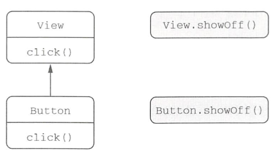
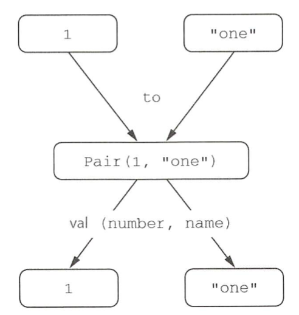

# 01. 코틀린에서 컬렉션 만들기

코틀린은 자신만의 컬렉션 기능을 제공하지 않는다.

자바 컬렉션을 그대로 쓰기 때문에 자바와 코틀린 컬렉션을 서로 변환할 필요가 없다.

``` kotlin
fun main(args: Array<String>) {
    val set = hashSetOf(1, 7, 53)
    val list = arrayListOf(1, 7, 53)
    val map = hashMapOf(1 to "one", 7 to "seven", 53 to "fifty-three")

    println(set.javaClass)
    println(list.javaClass)
    println(map.javaClass)
}
```

``` 
class java.util.HashSet
class java.util.ArrayList
class java.util.HashMap
```


하지만 코틀린에서는 마지막 원소를 가져오거나 최댓값을 찾는 등 자바보다 더 많은 기능을 쓸 수 있다.


# 02. 함수를 호출하기 쉽게 만들기

자바 컬렉션에는 디폴트 toString 구현이 들어있다. 

하지만 그 디폴트 toString의 출력 형식은 고정돼 있고 우리에게 필요한 형식이 아닐 수도 있다.

``` kotlin
val list = listOf(1, 2, 3)
println(list) // [1, 2, 3]
```


출력을 바꿔보자.

다음 리스트의 joinToString 함수는 컬렉션의 원소를 StringBuilder의 뒤에 덧붙인다. 

이 때 원소 사이에 구분자를 추가하고, StringBuilder의 맨 앞과 맨 뒤에는 접두사와 접미사를 추가한다.

``` kotlin
val list = listOf(1, 2, 3)
println(joinToString(list, "; ", "(", ")")) // (1; 2; 3)

fun <T> joinToString(
  collection: Collection<T>,
  separator: String,
  prefix: String,
  postfix: String
): String {
  val result = StringBuilder(prefix)

  for ((index, element) in collection.withIndex()) {
    if (index > 0) result.append(separator)
    result.append(element)
  }

  result.append(postfix)
  return result.toString()
}
```


어떻게 하면 이 함수를 호출하는 문장을 덜 번잡하게 만들 수 있을까?

함수를 호출할 때마다 매번 네 인자를 모두 전달하지 않을 수는 없을까? 


## 이름 붙인 인자

코틀린으로 작성한 함수를 호출할 때는 함수에 전달하는 인자 중 일부의 이름을 명시할 수 있다.

``` kotlin
joinToString(collection, separator=" ", prefix=" ", postfix=".")
```


## 디폴트 파라미터 값

자바에서는 일부 클래스에서 오버로딩한 메서드가 너무 많아진다는 문제가 있다.

코틀린에서는 함수 선언에서 파라미터의 디폴트 값을 지정할 수 있으므로 이런 오버로드 중 상당수를 피할 수 있다.

``` kotlin
val list = listOf(1, 2, 3)
println(joinToString(list, "; ", "(", ")"))
println(joinToString(list, "; "))

fun <T> joinToString(
  collection: Collection<T>,
  separator: String = ", ",
  prefix: String = "",
  postfix: String = ""
): String {
  val result = StringBuilder(prefix)

  for ((index, element) in collection.withIndex()) {
    if (index > 0) result.append(separator)
    result.append(element)
  }

  result.append(postfix)
  return result.toString()
}
```


## 정적인 유틸리티 클래스 없애기: 최상위 함수와 프로퍼티

자바에서는 다양한 정적 메서드를 모아두는 역할만 담당하며 특별한 상태나 인스턴스 메서드는 없는 클래스가 생겨난다.

JDK의 Collections 클래스가 전형적인 예다.


코틀린에서는 이런 무의미한 클래스가 필요 없다.

대신 함수를 직접 소스 파일의 최상위 수준, 모든 다른 클래스의 밖에 위치시키면 된다.

이런 함수들은 어떻게 실행될 수 있는 걸까?

JVM이 클래스 안에 들어있는 코드만을 실행할 수 있기 때문에 컴파일러는 이 파일을 컴파일할 때 새로운 클래스를 정의해준다.

코틀린만 사용하는 경우에는 그냥 그런 클래스가 생긴다는 사실만 기억하면 된다. 

하지만 이 함수를 자바 등의 다른 JVM 언어에서 호출하고 싶다면 코드가 어떻게 컴파일되는지 알아야 joinToString과 같은 최상위 함수를 사용할 수 있다. 

어떻게 코틀린이 join.kt를 컴파일하는지 보여주기 위해 join.kt를 컴파일한 결과와 같은 클래스를 자바 코드로 써보면 다음과 같다.

``` java
package strings;

public class JoinKt {
  public static String joinToString(...) { ... }
}
```

> JoinKt : join.kt 파일에 해당하는 클래스

코틀린 컴파일러가 생성하는 클래스의 이름은 최상위 함수가 들어있던 코틀린 소스 파일의 이름과 대응한다. 

코틀린 파일의 모든 최상위 함수는 이 클래스의 정적인 메서드가 된다.


### 최상위 프로퍼티

함수와 마찬가지로 프로퍼티도 파일의 최상위 수준에 놓을 수 있다.

``` kotlin
var opCount = 0

fun performOperation() {
  opCount++
}

fun reportOperationCount() {
  println("Operation performed $opCount times")
}
```


기본적으로 최상위 프로퍼티도 다른 모든 프로퍼티처럼 접근자 메서드를 통해 자바 코드에 노출된다.

val의 경우 게터, var의 경우 게터와 세터가 생긴다.

겉으론 상수처럼 보이는데, 실제로는 게터를 사용해야 한다면 자연스럽지 못하다.


const 변경자를 추가하면 프로퍼티를 public static final 필드로 컴파일하게 만들 수 있다. 

``` kotlin
const val UNIX_LINE_SEPARATOR = "\n"
```


# 03. 메서드를 다른 클래스에 추가: 확장 함수와 확장 프로퍼티

코틀린은 기존 자바 프로젝트에 통합하는 경우에는 코틀린으로 직접 변환할 수 없거나 미처 변환하지 않은 기존 자바 코드를 처리할 수 있어야 한다.

이런 기존 자바 API를 재작성하지 않고도 코틀린이 제공하는 여러 편리한 기능을 사용할 수 있다면 정말 좋은 일 아닐까?

바로 확장 함수가 그런 역할을 해줄 수 있다.


확장 함수는 어떤 클래스의 멤버 메서드인 것처럼 호출할 수 있지만 그 클래스의 밖에 선언된 함수다.

확장 함수를 보여주기 위해 어떤 문자열의 마지막 문자를 돌려주는 메서드를 추가해보자.

``` kotlin
fun String.lastChar(): Char = this.get(this.length - 1)
```


확장 함수를 만들려면 추가하려는 함수 이름 앞에 그 함수가 확장할 클래스의 이름을 덧붙이기만 하면 된다.

클래스 이름을 수신 객체 타입이라 부르며 확장 함수가 호출되는 대상이 되는 값을 수신 객체라고 부른다.

수신 객체 타입 : String

수신 객체 : this


이 함수를 호출하는 구문은 다른 일반 클래스 멤버를 호출하는 구문과 똑같다.

``` kotlin
"Kotlin".lastChar()
```


일반 메서드의 본문에서 this를 사용할 때와 마찬가지로 확장 함수 본문에도 this를 쓸 수 있다.

``` kotlin
package strings

fun String.lastChar(): Char = get(length - 1)
```


## 임포트와 확장 함수

확장 함수를 정의했다고 해도 자동으로 프로젝트 안의 모든 소스코드에서 그 함수를 사용할 수 있지는 않다.

확장 함수를 사용하기 위해서는 그 함수를 다른 클래스나 함수와 마찬가지로 임포트해야만 한다.


코틀린에서는 클래스를 임포트할 때와 동일한 구문을 사용해 개별 함수를 임포트할 수 있다.

``` kotlin
import strings.lastChar

val c = "Kotlin".lastChar()
```

``` kotlin
import strings.*

val c = "Kotlin".lastChar()
```

``` kotlin
import strings.lastChar as last

val c = "Kotlin".last()
```


## 자바에서 확장 함수 호출

내부적으로 확장 함수는 수신 객체를 첫 번째 인자로 받는 정적 메서드다.

그래서 확장 함수를 호출해도 다른 어댑터 객체나 실행 시점 부가 비용이 들지 않는다.

이런 설계로 인해 자바에서 확장 함수를 사용하기도 편하다.

단지 정적 메서드를 호출하면서 첫 번째 인자로 수신 객체를 넘기기만 하면 된다.

다른 최상위 함수와 마찬가지로 확장 함수가 들어있는 자바 클래스 이름도 확장 함수가 들어있는 파일 이름에 따라 결정된다.

따라서 확장 함수를 StringUtil.kt 파일에 정의했다면 다음과 같이 호출할 수 있다.

``` java
char c = StringUtilKt.lastChar("Java");
```


## 확장 함수로 유틸리티 함수 정의

``` kotlin

fun main(args: Array<String>) {
  val list = listOf(1, 2, 3)
  println(list.joinToString("; ", "(", ")"))
}

fun String.lastChar(): Char = this.get(this.length - 1)

fun <T> Collection<T>.joinToString(
  separator: String = ", ",
  prefix: String = "",
  postfix: String = ""
): String {
  val result = StringBuilder(prefix)

  for ((index, element) in this.withIndex()) {
    if (index > 0) result.append(separator)
    result.append(element)
  }

  result.append(postfix)
  return result.toString()
}
```

이제 joinToString을 마치 클래스의 멤버인 것처럼 호출할 수 있다.


## 확장 함수는 오버라이드할 수 없다

View와 그 하위 클래스인 Button이 있는데 Button이 상위 클래스의 click 함수를 오버라이드하는 경우를 생각해보자.

``` kotlin
open class View {
  open fun click() = println("View clicked")
}

class Button: View() {
  override fun click() = println("Button clicked")
}
```

``` kotlin
val view: View = Button()
view.click()
// Button clicked
```


하지만 확장은 이런 식으로 작동하지 않는다.

확장 함수는 클래스의 일부가 아니라 클래스 밖에 선언된다.

이름과 파라미터가 완전히 같은 확장 함수를 기반 클래스와 하위 클래스에 대해 정의해도 실제로는 확장 함수를 호출할 때 수신 객체로 지정한 변수의 정적 타입에 의해 어떤 확장 함수가 호출될지 결정되지, 그 변수에 저장된 객체의 동적인 타입에 의해 확장 함수가 결정되지 않는다.




확장 함수의 예시를 보자

``` kotlin
fun View.showOff() = println("I'm a view!")
fun Button.showOff() = println("I'm a button!")

val view: View = Button()
view.showOff()
// I'm a view!
```


view가 가리키는 객체의 실제 타입이 Button이지만 이 경우 view의 타입이 View이기 때문에 무조건 View의 확장 함수가 호출된다.

확장 함수를 첫 번째 인자가 수신 객체인 정벅 자바 메서드를 컴파일한다는 사실을 기억한다면 이런 동작을 쉽게 이해할 수 있다. 

자바도 호출할 정적 함수를 같은 방식으로 정적으로 결정한다.


## 확장 프로퍼티

확장 프로퍼티를 사용하면 기존 클래스 객체에 대한 프로퍼티 형식의 구문으로 사용할 수 있는 API를 추가할 수 있다. 

프로퍼티라는 이름으로 불리기는 하지만 상태를 저장할 적절한 방법이 없기 때문에 실제로 확장 프로퍼티는 아무 상태도 가질 수 없다.

하지만 프로퍼티 문법으로 더 짧게 코드를 작성할 수 있어서 편한 경우가 있다.

``` kotlin
val String.lastChar: Char
  get() = get(length-1)
```


뒷받침하는 필드가 없어서 기본 게터 구현을 제공할 수 없으므로 최소한 게터는 꼭 정의를 해야 한다.

마찬가지로 초기화 코드에서 계산한 값을 담을 장소가 전혀 없으므로 초기화 코드도 쓸 수 없다.


StringBuilder에 같은 프로퍼티를 정의한다면 StringBuilder의 맨 마지막 문자는 변경 가능하므로 프로퍼티를 var로 만들 수 있다.

``` kotlin
var StringBuilder.lastChar: Char
  get() = get(length - 1)
  set(value: Char) {
    this.setCharAt(length - 1, value)
  }
```


# 04. 컬렉션 처리: 가변 길이 인자, 중위 함수 호출, 라이브러리 지원

컬렉션을 처리할 때 쓸 수 있는 코틀린 표준 라이브러리 함수 몇 가지를 보여준다. 

그 과정에서 다음과 같은 코틀린 언어 특성을 설명한다.

* vararg 키워드를 사용하면 호출 시 인자 개수가 달라질 수 있는 함수를 정의할 수 있다.
* 중위 함수 호출 구문을 사용하면 인자가 하나뿐인 메서드를 간편하게 호출할 수 있다.
* 구조 분해 선언을 사용하면 복합적인 값을 분해서 여러 변수에 나눠 담을 수 있다.


## 자바 컬렉션 API 확장

어떻게 자바 라이브러리 클래스의 인스턴스의 컬렉션에 대해 코틀린이 새로운 기능을  추가할 수 있을까?

위에서 봤듯이 그 답은 확장 함수였던 것이다.


## 가변 인자 함수: 인자의 개수가 달라질 수 있는 함수 정의

리스트를 생성하는 함수를 호출 할 때 원하는 만큼 많이 원소를 전달할 수 있다.

``` kotlin
val list = listOf(2, 3, 5, 7, 11)
```


라이브러리에서 이 함수의 정의를 보면 다음과 같다.

``` kotlin
fun listOf<T>(vararg values: T): List<T> {...}
```


자바의 가변 길이 인자는 메서드를 호출할 때 원하는 개수만큼 값을 인자로 넘기면 자바 컴파일러가 배열에 그 값들을 넣어주는 기능이다. 

코틀린의 가변 길이 인자도 자바와 비슷하다.

타입 뒤에 ...를 붙이는 대신 코틀린에서는 파라미터 앞에 vararg 변경자를 붙인다.


이미 배열에 들어있는 원소를 가변 길이 인자로 넘길 때도 코틀린과 자바 구문이 다르다.

자바에서는 배열을 그냥 넘기면 되지만 코틀린에서는 배열을 명시적으로 풀어서 배열의 각 원소가 인자로 전달되게 해야 한다.

기술적으로는 스프레드 연산자가 그런 작업을 해준다. 

배열 앞에 *를 붙이면 된다.

``` kotlin
fun main(args: Array<String>) {
  val list = listOf("args: ", *args)
  println(list) 
}
```


## 값의 쌍 다루기: 중위 호출과 구조 분해 선언

맵을 만들려면 mapOf 함수를 사용한다.

``` kotlin
val map = mapOf(1 to "one", 7 to "seven", 53 to "fifty-three")
```

to는 코틀린 키워드가 아니라 중위 호출이라는 특별한 방식으로 to라는 일반 메서드를 호출한 것이다.

##### 중위 호출 시에는 수신 객체와 유일한 메서드 인자 사이에 메서드 이름을 넣는다.

이 때 객체, 메서드 이름, 유일한 인자 사이에는 공백이 들어가야 한다. 

``` kotlin
1.to("one")
1 to "one"
```


인자가 하나 뿐인 일반 메서드나 인자가 하나뿐인 확장 함수에 중위 호출을 사용할 수 있다.

함수를 중위 호출에 사용하게 허용하고 싶으면 infix 변경자를 함수 선언 앞에 추가해야 한다.

다음은 to 함수의 정의를 간략하게 줄인 코드다.

``` kotlin
infix fun Any.to(other: Any) = Pair(this, other)
```


to 함수는 Pair의 인스턴스를 반환한다. 

Pair는 두 원소로 이루어진 순서쌍을 표현한다.

```  kotlin
val (number, name) = 1 to "one"
```


이런 기능을 구조 분해 선언(destructuring declaration) 이라고 부른다.




# 05. 문자열과 정규식 다루기

코틀린 문자열은 자바 문자열과 같다.

코틀린 코드가 만들어낸 문자열을 아무 자바 메서드에 넘겨도 되며, 자바 코드에서 받은 문자열을 아무 코틀린 표준 라이브러리 함수에 전달해도 전혀 문제없다.

특별한 반환도 필요없고 자바 문자열을 감싸는 별도의 래퍼도 생기지 않는다.


## 문자열 나누기

자바에서 아래 식은 빈 배열을 반환한다.

``` java
"12.345-6.A".split(".")
```

split의 구분 문자열은 실제로는 정규식이기 때문이다. 

따라서 마침표는 모든 문자를 나타내는 정규식으로 해석된다.


코틀린에서는 자바의 split 대신에 여러 가지 다른 조합의 파라미터를 받는 split 확장 함수를 제공함으로써 혼동을 야기하는 메서드를 감춘다.

정규식을 파라미터로 받는 함수는 String이 아닌 Regex 타입의 값을 받는다.

따라서 코틀린에서는 split 함수에 전달하는 값의 타입에 따라 정규식이나 일반 텍스트 중 어느 것으로 문자열을 분리하는지 쉽게 알 수 있다. 


``` kotlin
println("12.345-6.A".split("\\.|-".toRegex()))
// [12, 345, 6, A]

println("12.345-6.A".split(".", "-")
// [12, 345, 6, A]
```


## 정규식과 3중 따옴표로 묶는 문자열

3중 따옴표 문자열에는 줄 바꿈을 표현하는 아무 문자열이나 그대로 들어간다.

따라서 3중 따옴표를 쓰면 줄 바꿈이 들어있는 프로그램 텍스트를 쉽게 문자열로 만들 수 있다.


# 06. 코드 다듬기: 로컬 함수와 확장

코틀린에서는 함수에서 추출한 함수를 원 함수 내부에 중첩시킬 수 있다.

사용자를 데이터베이스에 저장하는 함수가 있다. 

``` kotlin
class User(val id: Int, val name: String, val address: String)

fun saveUser(user: User) {
  if (user.name.isEmpty()) {
    throw IllegalArgumentException(
      "Can't save user ${user.id} : empty Name")
  }

  if (user.address.isEmpty()) {
    throw IllegalArgumentException(
      "Can't save user ${user.id} : empty Address")
  }

  // user를 db에 저장
}

fun main(args: Array<String>) {
  saveUser(User(1, "", ""))
  // Exception in thread "main" java.lang.IllegalArgumentException: Can't save user 1 : empty Name
}
```


클래스가 사용자의 필드를 검증할 때 필요한 여러 경우를 하나씩 처리하는 메서드로 넘쳐나기를 바라지는 않을 것이다.

이런 경우 검증 코드를 로컬 함수로 분리하면 중복을 없애는 동시에 코드 구조를 깔끔하게 유지할 수 있다.

``` kotlin
fun main(args: Array<String>) {
  saveUser(User(1, "", ""))
}

class User(val id: Int, val name: String, val address: String)

fun saveUser(user: User) {
  fun validate(user: User, value: String, fieldName: String) {
    if (value.isEmpty()) {
      throw IllegalArgumentException("Can't save user ${user.id}: empty $fieldName")
    }
  }

  validate(user, user.name, "Name")
  validate(user, user.address, "Address")

  // user를 db에 저장
}
```


로컬 함수는 자신이 속한 바깥 함수의 모든 파리미터와 변수를 사용할 수 있다.

``` kotlin
fun saveUser(user: User) {
  fun validate(value: String, fieldName: String) {
    if (value.isEmpty()) {
      throw IllegalArgumentException("Can't save user ${user.id}: empty $fieldName")
    }
  }

  validate(user.name, "Name")
  validate(user.address, "Address")

  // user를 db에 저장
}
```


검증 로직을 User 클래스를 확장한 함수로 만들 수도 있다.

``` kotlin
fun main(args: Array<String>) {
  saveUser(User(1, "", ""))
}

class User(val id: Int, val name: String, val address: String)

fun User.validateBeforeSave() {
  fun validate(value: String, fieldName: String) {
    if (value.isEmpty()) {
      throw java.lang.IllegalArgumentException(
        "Can't save user $id: empty $fieldName"
      )
    }
  }
  validate(name, "Name")
  validate(address, "Address")
}

fun saveUser(user: User) {
  user.validateBeforeSave()

  // user를 db에 저장
}
```

User의 확장 함수인 `validateBeforeSave`은 인자로 name, address를 받지 않아도 접근할 수 있다. 
