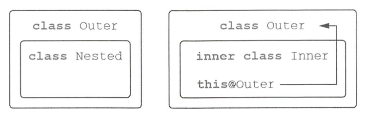
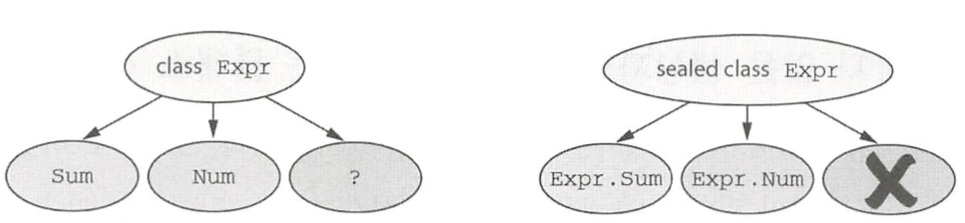
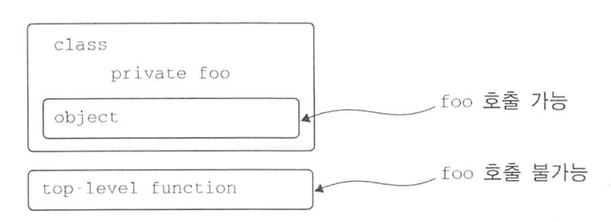

코틀린의 클래스와 인터페이스는 자바 클래스, 인터페이스와는 약간 다르다. 

예를 들어 인터페이스에 프로퍼티 선언이 들어갈 수 있다.

자바와 달리 코틀린 선언은 기본적으로 final이며 public이다.

게다가 중첩 클래스는 기본적으로는 내부 클래스가 아니다.

코틀린 중첩 클래스에는 외부 클래스에 대한 참조가 없다.


# 01. 클래스 계층 정의

## 코틀린 인터페이스

코틀린 인터페이스는 자바 8 인터페이스와 비슷하다.

코틀린 인터페이스 안에는 추상 메서드뿐 아니라 구현이 있는 메서드도 정의할 수 있다.

다만 인터페이스에는 아무런 상태도 들어갈 수 없다.

``` kotlin
interface Clickable {
  fun click()
}
```


이 인터페이스를 구현하는 모든 비추상 클래스는 click에 대한 구현을 제공해야 한다.

``` kotlin
class Button: Clickable {
  override fun click() = println("I was clicked")
}

Button().click()
// I was clicked
```


자바에서는 extends와 implements 키워드를 사용하지만, 코틀린에서는 클래스 이름 뒤에 콜론을 붙이고 인터페이스와 클래스 이름을 적는 것으로 클래스 확장과 인터페이스 구현을 모두 처리한다.

자바와 마찬가지로 클래스는 인터페이스를 원하는 만큼 개수 제한 없이 마음대로 구현할 수 있지만 클래스는 오지 하나만 확장할 수 있다.

자바의 @Override 애노테이션과 비슷한 override 변경자는 상위 클래스나 상위 인터페이스에 있는 프로퍼티나 메서드를 오버라이드한다는 표시다.

하지만 자바와 달리 코틀린에서는 override 변경자를 꼭 사용해야 한다. override 변경자는 실수로 상위 클래스의 메서드를 오버라이드하는 경우를 방지해준다.

상위 클래스에 있는 메서드와 시그니처가 같은 메서드를 우연히 하위 클래스에서 선언하는 경우 컴파일이 안 되기 때문에 override를 붙이거나 메서드 이름을 바꿔야만 한다.


인터페이스 메서드도 디폴트 구현을 제공할 수 있다. 

그런 경우 메서드 앞에 default를 붙여야 하는 자바 8과 달리 코틀린에서는 메서드를 특별한 키워드로 꾸밀 필요가 없다.

그냥 메서드 본문을 메서드 시그니처 뒤에 추가하면 된다. 

``` kotlin
interface Clickable {
  fun click()
  fun showOff() = println("I'm clickable!")
}
```


이제 showOff 메서드를 정의하는 다른 인터페이스가 다음과 같은 구현을  포함한다고 하자.

``` kotlin
interface Focusable {
  fun setFocus(b: Boolean) = println("I ${if (b) "got" else "lost"} focus.")
  fun showOff() = println("I'm focusable!")
}
```


한 클래스에서 이 두 인터페이스를 함께 구현하면 어떻게 될까?

두 인터페이스 모두 디폴트 구현이 들어있는 showOff 메서드가 있다. 

이 경우 어느 쪽 showOff도 선택되지 않는다.

클래스가 구현하는 두 상위 인터페이스에 정의된 showOff 구현을 대체할 오버라이딩 메서드를 직접 제공하지 않으면 다음과 같은 컴파일러 오류가 발생한다.

``` 
The class 'Button' must 
override public open fun showOff() because it inherits many implementations of it.
```


코틀린 컴파일러는 두 메서드를 아우르는 구현을 하위 클래스에 직접 구현하게 강제한다.

Button은 상속한 두 상위 타입의 showOff() 메서드를 호출하는 방식으로 showOff()를 구현한다.

``` kotlin
class Button : Clickable, Focusable {
  override fun click() = println("I was clicked")
  override fun showOff() {
    super<Clickable>.showOff()
    super<Focusable>.showOff()
  }
}
```

자바는 `Clickable.super.showOff()` 처럼 super 앞에 기반 타입을 적지만, 코틀린에서는 `super<Clickable>.showOff()` 처럼 꺾쇠 괄호 안에 기반 타입 이름을 지정한다.


상속한 구현 중 단 하나만 호출해도 된다면 다음과 같이 쓸 수도 있다.

``` kotlin
override fun showOff() = super<Clickable>.showOff()
```


## open, final, abstract 변경자 : 기본적으로 final

자바에서는 final로 명시적으로 상속을 금지하지 않는 모든 클래스를 다른 클래스가 상속할 수 있다.

이렇게 기본적으로 상속이 가능하면 편리한 경우도 많지만 문제가 생기는 경우도 많다.

`취약한 기반 클래스` 라는 문제는 하위 클래스가 기반 클래스에 대해 가졌던 가정이 기반 클래스를 변경함으로써 깨져버린 경우에 생긴다.

모든 하위 클래스를 분석하는 것은 불가능하므로 기반 클래스를 변경하는 경우 하위 클래스의 동작이 예기치 않게 바뀔 수도 있다는 면에서 기반 클래스는 취약하다.

이 문제를 해결하기 위해 Effective Java에서는 "상속을 위한 설계와 문서를 갖추거나 그럴 수 없다면 상속을 금지하라"라는 조언을 한다. 

이는 특별히 하위 클래스에서 오버라이드하게 의도된 클래스와 메서드가 아니라면 모두 final로 만들라는 뜻이다.


자바의 클래스와 메서드는 기본적으로 상속에 대해 열려있지만 코틀린의 클래스와 메서드는 기본적으로 final이다.

어떤 클래스의 상속을 허용하려면 클래스 앞에 open 변경자를 붙여야 한다.

그와 더불어 오버라이드를 허용하고 싶은 메서드나 프로퍼티의 앞에도 open 변경자를 붙여야 한다.

``` kotlin
// 다른 클래스가 이 클래스를 상속할 수 있다.
open class RichButton : Clickable {
  fun disable() {} // default가 final이기 때문에 하위 클래스가 이 메서드를 오버라이드할 수 없다.
  open fun animate() {} // 하위 클래스에서 이 메서드를 오버라이드할 수 있다.
  override fun click() {} // 이 함수는 열려있는 메서드를 오버라이드한다. 오버라이드한 메서드는 기본적으로 열려있다.
}
```


override한 메서드는 기본적으로 열려있기 때문에 오버라이드하지 못하게 금지하려면 오버라이드 앞에 final을 명시해야 한다.

``` kotlin
open class RichButton : Clickable {
  final override fun click() {}
}
```


자바처럼 코틀린에서도 클래스르 abstract로 선언할 수 있다.

abstract로 선언한 추상 클래스는 인스턴스화할 수 없다.

추상 클래스에는 구현이 없는 추상 멤버가 있기 때문에 하위 클래스에는 그 추상 멤버를 오버라이드해야만 하는 게 보통이다.

추상 멤버는 항상 열려있다. 따라서 추상 멤버 앞에 open 변경자를 명시할 필요가 없다.

``` kotlin
abstract class Animated {
  abstract fun animate() // 추상함수로 구현이 없다. 하위 클래스에서 이 함수를 반드시 오버라이드해야 한다.
  
  // 추상 클래스에 속했더라도 비추상 함수는 기본적으로 파이널이지만 원한다면 open으로 오버라이드를 허용할 수 있다.
  open fun stopAnimating() {} 
  fun animateTwice() {}
}
```


### 코틀린의 상속 제어 변경자

| 변경자   | 이 변경자가 붙은 멤버는                                | 설명                                                         |
| -------- | ------------------------------------------------------ | ------------------------------------------------------------ |
| final    | 오버라이드할 수 없음                                   | 클래스 멤버의 기본 변경자다                                  |
| open     | 오버라이드할 수 있음                                   | 반드시 open을 명시해야 오버라이드할 수 있다                  |
| abstract | 반드시 오버라이드해야 함                               | 추상 클래스의 멤버에만 이 변경자를 붙일 수 있다. <br />추상 멤버에는 구현이 있으면 안된다. |
| override | 상위 클래스나 상위 인스턴스의 멤버를 오버라이드하는 중 | 오버라이드하는 멤버는 기본적으로 열려있다. <br />하위 클래스의 오버라이드를 금지하려면 final을 명시해야 한다. |

인터페이스 멤버의 경우 final, open, abstract를 사용하지 않는다.

인터페이스 멤버는 항상 열려 있으며 final로 변경할 수 없다.


## 가시성 변경자: 기본적으로 공개

가시성 변경자는 코드 기반에 있는 선언에 대한 클래스 외부 접근을 제어한다.

어떤 클래스의 구현에 대한 접근을 제한함으로써 그 클래스에 의존하는 외부 코드를 깨지 않고도 클래스 내부 구현을 변경할 수 있다.


기본적으로 코틀린 가시성 변경자는 자바와 비슷하다.

자바와 같은 public, protected, private 변경자가 있다. 

하지만 코틀린의 기본 가시성은 자바와 다르다. 

아무 변경자도 없는 경우 선언은 모두 공개된다.


자바의 기본 가시성인 패키지 전용은 코틀린에 없다.

코틀린은 패키지를 네임스페이스를 관리하기 위한 용도로만 사용한다.

그래서 패키지를 가시성 제어에 사용하지 않는다.


패키지 전용 가시성에 대한 대안으로 코틀린에는 internal이라는 새로운 가시성 변경자를 도입했다.

internal은 모듈 내부에서만 볼 수 있음이라는 뜻이다.

모듈은 한 번에 한꺼번에 컴파일되는 코틀린 파일들을 의미한다.


모듈 내부 가시성은 여러분의 모듈의 구현에 대한 진정한 캡슐화를 제공하는 장점이 있다.

자바에서는 패키지가 같은 클래스를 선언하기만 하면 어떤 프로젝트의 외부에 있는 코드라도 패키지 내부에 있는 패키지 전용 선언에 쉽게 접근할 수 있다.

그래서 모듈의 캡슐화가 쉽게 깨진다.


다른 차이는 코틀린에서는 최상위 선언에 대해 private 가시성을 허용한다는 점이다.

그런 최상위 선언에는 클래스, 함수, 프로퍼티 등이 포함된다.

비공개 가시성은 최상위 선언은 그 선언이 들어있는 파일 내부에서만 사용할 수 있다.


### 코틀린의 가시성 변경자

| 변경자              | 클래스 멤버                     | 최상위 선언                    |
| ------------------- | ------------------------------- | ------------------------------ |
| public(기본 가시성) | 모든 곳에서 볼 수 있다          | 모든 곳에서 볼 수 있다         |
| internal            | 같은 모듈 안에서만 볼 수 있다   | 같은 모듈 안에서만 볼 수 있다  |
| protected           | 하위 클래스 안에서만 볼 수 있다 | (최상위 선언에 적용할 수 없음) |
| private             | 같은 클래스 안에서만 볼 수 있다 | 같은 파일 안에서만 볼 수 있다  |


예제를 살펴보자.

``` kotlin
internal open class TalkativeButton : Focusable {
  private fun yell() = println("Hey")
  protected fun whisper() = println("let's talk")
}

fun TalkativeButton.giveSpeech() { // (1) public 멤버가 자신의 internal 수신 타입인 TalkativeButton을 노출하므로 오류
  yell() // private이므로 오류
  whisper() // proteced이므로 오류 
}
```

(1) 코틀린은 public 함수인 giveSpeech 안에서 그보다 가시성이 더 낮은 타입인 TalkativeButton을 참조하지 못하게 한다. 여기서 컴파일 오류를 없애려면 giveSpeech 확장 함수의 가시성을 internal로 바꾸거나, TalkativeButton 클래스의 가시성을 public으로 바꿔야 한다.

자바에서는 같은 패키지 안에서 protected 멤버에 접근할 수 있지만 코틀린에서는 그렇지 않다는 점에서 자바와 코틀린의 protected가 다르다는 사실에 유의해라. 코틀린의 가시성 규칙은 단순하다. protected 멤버는 오직 어떤 클래스나 그 클래스를 상속한 클래스 안에서만 보인다.

클래스를 확장한 함수는 그 클래스의 private이나 protected 멤버에 접근할 수 없다.

코틀린과 자바 가시성 규칙의 또 다른 차이는 코틀린에서는 외부 클래스가 내부 클래스나 중첩된 클래스의 private 멤버에 접근할 수 없다는 점이다.


## 내부 클래스와 중첩된 클래스: 기본적으로 중첩 클래스

자바처럼 코틀린에서도 클래스 안에 다른 클래스를 선언할 수 있다.

자바와의 차이는 코틀린의 중첩 클래스는 명시적으로 요청하지 않는 한 바깥쪽 클래스 인스턴스에 대한 접근 권한이 없다는 점이다.


View 요소를 하나 만든다고 상상해보자.

View의 상태를 직렬화해야 한다.

``` kotlin
interface State: Serializable
interface View {
  fun getCurrentState(): State
  fun restoreState(state: State) {}
}
```


Button 클래스의 상태를 저장하는 클래스는 Button 클래스 내부에 선언하면 편하다.

자바에서는 아래와 같이 선언한다.

``` java
public class Button implements View {
  @Override
  public State getCurrentState() {
    return new ButtonState();
  }
  
  @Override
  public void restoreState(State state) { /*...*/ }
  
  public class ButtonState implements State { /*...*/ }
}
```

State 인터페이스를 구현한 ButtonState 클래스를 정의해서 Button에 대한 구체적인 정보를 저장한다.

getCurrentState 메서드 안에서는 ButtonState의 새 인스턴스를 만든다.

실제로는 ButtonState 안에 필요한 모든 정보를 추가해야 한다.


이 코드는 선언한 버튼의 상태를 직렬화하면 java.io.NotSerializableException이라는 오류가 발생한다.

자바에서 다른 클래스 안에 정의한 클래스는 자동으로 내부 클래스가 된다는 사실을 기억한다면 어디가 잘못된 건지 명확히 알 수 있다.

이 예제의 ButtonState 클래스는 바깥쪽 Button 클래스에 대한 참조를 묵시적으로 포함한다.

그 참조로 인해 ButtonState를 직렬화할 수 없다.

Button을 직렬화할 수 없으므로 버튼에 대한 참조가 ButtonState의 직렬화를 방해한다.


이 문제를 해결하려면 ButtonState를 static 클래스로 선언해야 한다.

자바에서 중첩 클래스를 static으로 선언하면 그 클래스를 둘러싼 바깥쪽 클래스에 대한 묵시적인 참조가 사라진다.

코틀린에서 중첩된 클래스가 기본적으로 동작하는 방식은 방금 설명한 것과 정반대다.

``` kotlin
class Button: View {
  override fun getCurrentState(): State = ButtonState()
  
  override fun restoreState(state: State) { /*...*/ }
  
  class ButtonState: State { /*...*/ }
}
```


코틀린 중첩 클래스에 아무런 변경자가 붙지 않으면 자바 static 중첩 클래스와 같다.

이를 내부 클래스로 변경해서 바깥쪽 클래스에 대한 참조를 포함하게 만들고 싶다면 inner 변경자를 붙여야 한다.

| 클래스 B 안에 정의된 클래스 A                           | 자바에서는     | 코틀린에서는  |
| ------------------------------------------------------- | -------------- | ------------- |
| 중첩 클래스 (바깥쪽 클래스에 대한 참조를 저장하지 않음) | static class A | class A       |
| 내부 클래스 (바깥쪽 클래스에 대한 참조를 저장함)        | class A        | inner class A |




코틀린에서 바깥쪽 클래스의 인스턴스를 가리키는 참조를 표기하는 방법도 자바와 다르다.

내부 클래스 안에서 바깥쪽 클래스의 참조에 접근하려면 this@Outer라고 써야 한다.

``` kotlin
class Outer {
  inner class Inner {
    fun getOuterReference(): Outer = this@Outer
  }
}
```


## 봉인된 클래스: 클래스 계층 정의 시 계층 확장 제한

상위 클래스인 Expr에는 숫자를 표현하는 Num과 덧셈을 표현하는 Sum이라는 두 하위 클래스가 있다.

when 식에서 이 모든 하위 클래스를 처리하면 편리하지만 when 식에서 Num과 Sum이 아닌 경우를 처리하는 else 분기를 반드시 넣어줘야만 한다.

``` kotlin
interface Expr
class Num(val value: Int) : Expr
class Sum(val left: Expr, val right: Expr) : Expr

fun eval(e: Expr): Int = 
  when (e) {
    is Num -> e.value
    is Sum -> eval(e.right) + eval(e.left)
    else -> throw IllegalArgumentException("Unknown expression")
  }
```


항상 디폴트 분기를 추가하는 게 편하지는 않다.

그리고 디폴트 분기가 있으면 이런 클래스 계층에 새로운 하위 클래스를 추가하더라도 컴파일러가 when이 모든 경우를 처리하는지 제대로 검사할 수 없다.

혹은 새로운 클래스 처리를 잊어버리면 디폴트 분기가 선택되기 때문에 심각한 버그가 발생할 수 있다.


코틀린은 sealed 클래스를 통해 이런 문제에 대한 해법을 제공한다.

상위 클래스에 sealed 변경자를 붙이면 그 상위 클래스를 상속한 하위 클래스 정의를 제한할 수 있다.

sealed 클래스의 하위 클래스를 정의할 때는 반드시 상위 클래스 안에 중첩시켜야 한다.

``` kotlin
sealed class Expr {
  class Num(val value: Int) : Expr()
  class Sum(val left: Expr, val right: Expr) : Expr()
}


fun eval(e: Expr): Int = 
  when (e) {
    is Expr.Num -> e.value
    is Expr.Sum -> eval(e.right) + eval(e.left)
  }
```


봉인된 클래스는 클래스 외부에 자신을 상속한 클래스를 둘 수 없다.




# 02. 뻔하지 않은 생성자와 프로퍼티를 갖는 클래스 선언

코틀린은 주 생성자와 부 생성자를 구분한다.

주 생성자 : 클래스를 초기화할 때 주로 사용하는 간략한 생성자로 클래스 본문 밖에서 정의한다. 

부 생성자 : 클래스 본문안에서 정의한다.


또한 코틀린에서는 초기화 블록을 통해 초기화 로직을 추가할 수 있다.


## 클래스 초기화: 주 생성자와 초기화 블록

보통 클래스의 모든 선언은 중괄호 사이에 들어간다.

하지만 아래는 괄호 사이에 val 선언만 존재한다.

이렇게 클래스 이름 뒤에 오는 괄호로 둘러싸인 코드를 주 생성자라고 부른다.

``` kotlin
class User(val nickname: String)
```


주 생성자는 생성자 파라미터를 지정하고 그 생성자 파리미터에 의해 초기화되는 프로퍼티를 정의하는 두 가지 목적에 쓰인다.

이제 이 선언을 같은 목적을 달성할 수 있는 가장 명시적인 선언으로 풀어서 실제로는 어떤 일이 벌어지는지 살펴보자.

``` kotlin
class User constructor(_nickname: String) {
  val nickname: String
  init {
    nickname = _nickname
  }
}
```

constructor : 주 생성자나 부 생성자 정의를 시작할 때 사용

init : 초기화 블록을 시작


초기화 블록에는 클래스의 객체가 만들어질 때 실행될 초기화 코드가 들어간다. 

초기화 블록은 주 생성자와 함께 사용된다.

주 생성자는 제한적이기 때문에 별도의 코드를 포함할 수 없으므로 초기화 블록이 필요하다.

생성자 파라미터 _nickname에서 맨 앞의 _은 프로퍼티와 생성자 파라미터를 구분해준다.


이 예제에서는 nickname 프로퍼티를 초기화하는 코드를 nickname 프로퍼티 선언에 포함시킬 수 있어서 초기화 코드를 초기화 블록에 넣을 필요가 없다.

또 주 생성자 앞에 별다른 애노테이션이나 가시성 변경자가 없다면 constructor를 생략해도 된다.


즉 아래와 같이 바꿀 수 있다.

``` kotlin
class User(_nickname: String) {
  val nickname = _nickname
}
```

프로퍼티를 초기화하는 식이나 초기화 블록 안에서만 주 생성자의 파라미터를 참조할 수 있다.


주 생성자의 파라미터로 프로퍼티를 초기화한다면 그 주 생성자 파라미터 이름 앞에 val을 추가하는 방식으로 프로퍼티 정의와 초기화를 간략히 쓸 수 있다.

``` kotlin
class User(val nickname: String)
```


함수 파라미터와 마찬가지로 생성자 파라미터에도 디폴트 값을 정의할 수 있다.

``` kotlin
class User(val nickname: String, val isSubscribed: Boolean = true)
```


클래스의 인스턴스를 만들려면 new 키워드 없이 생성자를 직접 호출하면 된다.

``` kotlin
val user = User("현석")
```


클래스에 기반 클래스가 있다면 주 생성자에서 기반 클래스의 생성자를 호출해야 할 필요가 있다.

``` kotlin
open class User(val nickname: String) {...}
class TwitterUser(nickname: String) : User(nickname) {...}
```


클래스를 정의할 때 별도로 생성자를 정의하지 않으면 컴파일러가 자동으로 아무 일도 하지 않는 인자가 없는 디폴트 생성자를 만들어준다.

``` kotlin
open class Button
```


Button의 생성자는 아무 인자도 받지 않지만 Button 클래스를 상속한 하위 클래스는 반드시 Button 클래스의 생성자를 호출해야 한다.

``` kotlin
class RadioButton: Button()
```

반면 인터페이스는 생성자가 없기 때문에 어떤 클래스가 인터페이스를 구현하는 경우 그 클래스의 상위 클래스 목록에 있는 인터페이스 이름 뒤에는 아무 괄호도 없다.


어떤 클래스를 클래스 외부에서 인스턴스화하지 못하게 막고 싶다면 모든 생성자를 private로 만들면 된다.

``` kotlin
class Secretive private constructor() {}
```

Secretive 클래스 안에는 주 생성자밖에 없고 그 주 생성자는 비공개이므로 외부에서는 Secretive를 인스턴스화할 수 없다.


## 부 생성자: 상위 클래스를 다른 방식으로 초기화

자바에서 오버로드한 생성자가 필요한 상황 중 상당수는 코틀린의 디폴트 파라미터 값과 이름 붙인 인자 문법을 사용해 해결할 수 있다.

그래도 생성자가 여럿 필요한 경우가 가끔 있다.

예를 들어 자바에서 선언된 생성자가 2개인 View 클래스가 있다고 하자.

그 클래스를 코틀린으로는 다음과 비슷하게 정의할 수 있다.

``` kotlin
open class View {
  constructor(ctx: Context) {
    
  }
  
  constructor(ctx: Context, attr: AttributeSet) {
    
  }
}
```


이 클래스는 주 생성자를 선언하지 않고 부 생성자만 2가지 선언한다.

부 생성자는 constructor 키워드로 시작한다.


여기서 두 부 생성자는 super() 키워드를 통해 자신에 대응하는 상위 클래스 생성자를 호출한다.

``` kotlin
class MyButton : View {
  constructor(ctx: Context)
    :super(ctx) {
      
    }
  
  constructor(ctx: Context, attr: AttributeSet)
    :super(ctx, attr) {
      
    }
}
```


자바와 마찬가지로 생성자에서 this()를 통해 클래스 자신의 다른 생성자를 호출할 수 있다.

``` kotlin
class MyButton : View {
  constructor(ctx: Context): this(ctx, MY_STYLE) {
    
  }
}
```


## 인터페이스에 선언된 프로퍼티 구현

코틀린에서는 인터페이스에 추상 프로퍼티 선언을 넣을 수 있다.

이는 User 인터페이스를 구현하는 클래스가 nickname의 값을 얻을 수 있는 방법을 제공해야 한다는 뜻이다.

``` kotlin
interface User {
  val nickname: String
}
```


PrivateUser는 별명을 저장하기만 하고 SubscribingUser는 이메일을 함께 저장한다.

FacebookUser는 페이스북 계정의 ID를 저장한다.

``` kotlin
class PrivateUser(override val nickname: String) : User

class SubscribingUser(val email: String) : User {
  override val nickname: String
    get() = email.substringBefore('@') // 커스텀 게터
}

class FacebookUser(val accountId: Int) : User {
  override val nickname = getFacebookName(accountId)
}
```

SubscribingUser의 nickname은 매번 호출될 때마다 substringBefore를 호출해 계산하는 커스텀 게터를 활용하고, FacebookUser의 nickname은 객체 초기화 시 계산한 데이터를 뒷받침하는 필드에 저장했다가 불러오는 방식을 활용한다.


인터페이스에는 추상 프로퍼티뿐 아니라 게터와 세터가 있는 프로퍼티를 선언할 수 도 있다.

물론 그런 게터와 세터는 뒷받침하는 필드를 참조할 수 없다.

``` kotlin
interface User {
  val email: String
  val nickname: String
    get() = email.substringBefore('@')
}
```

추상 프로퍼티인 email과 커스텀 게터가 있는 nickname 프로퍼티가 있다.

하위 클래스는 추상 프로퍼티인 email을 반드시 오버라이드해야 한다.

반면 nickname은 오버라이드하지 않고 상속할 수 있다.


## 게터와 세터에서 뒷받침하는 필드에 접근

어떤 값을 저장하되 그 값을 변경하거나 읽을 때마다 정해진 로직을 실행하는 유형의 프로퍼티를 만드는 방법을 살펴보자.

프로퍼티에 저장된 값의 변경 이력을 로그에 남기려는 경우를 생각해보자.

그런 경우 변경 가능한 프로퍼티를 정의하되 세터에서 프로퍼티 값을 바꿀 때마다 약간의 코드를 추가로 실행해야 한다.

``` kotlin
class User(val name: String) {
  var address: String = "unspecified"
    set(value: String) {
      println("""
        Address was changed for $name:
        "$field" -> "$value".""".trimIndent()) // 뒷받침하는 필드 값 읽기
      field = value // 뒷받침하는 필드 값 변경하기
    }
}
```


접근자의 본문에서는 field라는 특별한 식별자를 통해 뒷받침하는 필드에 접근할 수 있다.

게터에서는 field 값을 읽을 수만 있고, 세터에서는 field 값을 읽거나 쓸 수 있다.


## 접근자의 가시성 변경

접근자의 가시성은 기본적으로는 프로퍼티의 가시성과 같다.

하지만 원한다면 get이나 set 앞에 가기성 변경자를 추가해서 접근자의 가시성을 변경할 수 있다.

``` kotlin
class LengthCounter {
  var counter: Int = 0
    private set
  fun addWord(word: String) {
    counter += word.length
  }
}
```


# 03. 컴파일러가 생성한 메서드: 데이터 클래스와 클래스 위임

자바에서는 클래스가 equals, hashCode, toString 등의 메서드를 구현해야 한다.

코틀린 컴파일러는 한걸음 더 나가서 이런 메서드를 기계적으로 생성하는 작업을 보이지 않는 곳에서 해준다.


## 모든 클래스가 정의해야 하는 메서드

코틀린 클래스도 toString, equals, hashCode 등을 오버라이드할 수 있다.


``` kotlin
class Client(val name: String, val postalCode: Int)
```

### 문자열 표현: toString()

기본 제공되는 객체의 문자열 표현은 Client@5e9f23b4 같은 방식이다.

``` kotlin
class Client(val name: String, val postalCode: Int) {
  override fun toString() = "Client(name=$name, postalCode=$postalCode)"
}
```


### 객체의 동등성: equals()

두 객체가 내부에 동일한 데이터를 포함하는 경우 그 둘을 동등한 객체로 간주해야 할 수도 있다.

``` kotlin
class Client(val name: String, val postalCode: Int) {
  override fun equals(other: Any?): Boolean {
    if (other == null || other !is Client)
      return false
    return name == other.name && postalCode == other.postalCode
  }
}
```


### 해시 컨테이너: hashCode()

자바에서는 equals를 오버라이드할 때 반디스 hashCode도 함께 오버라이드해야 한다.


JVM 언어에서는 hashCode가 지켜야 하는 equals()가 true를 반환하는 두 객체는 반드시 같은 hashCode()를 반환해야 한다.

HashSet은 원소를 비교할 때 비용을 줄이기 위해 먼저 객체의 해시 코드를 비교하고 해시 코드가 같은 경우에만 실제 값을 비교한다.

따라서 아래는 제대로 동작할 수 없다.

``` kotlin
val processed = hashSetOf(Client("오현석", 4122))
processed.contains(Client("오현석", 4122)) // false
```


이를 위해선 hashCode를 구현해야 한다.

``` kotlin
class Client(val name: String, val postalCode: Int) {
  override fun hashCode(): Int = name.hashCode() * 31 + postalCode
}
```


## 데이터 클래스: 모든 클래스가 정의해야 하는 메서드 자동 생성

data라는 변경자를 클래스 앞에 붙이면 필요한 메서드를 컴파일러가 자동으로 만들어준다.

data 변경자가 붙은 클래스를 데이터 클래스라고 부른다.

``` kotlin
data class Client(val name: String, val postalCode: Int)
```

이제 equals, hashCode, toString이 모든 프로퍼티를 고려해 만들어진다.

그 외에도 몇 가지 유용한 메서드를 더 생성해준다.


### 데이터 클래스와 불변성: copy() 메서드

데이터 클래스의 프로퍼티가 꼭 val일 필요는 없다.

원한다면 var 프로퍼티를 써도 된다.

하지만 데이터 클래스의 모든 프로퍼티를 읽기 전용으로 만들어서 데이터 클래스를 불변 클래스로 만들라고 권장한다.

그 이유는 아래와 같다.

* HashMap 등의 컨테이너에 데이터 클래스 객체를 담는 경우엔 불변성이 필수적이다.
* 데이터 클래스 객체를 키로 하는 값을 컨테이너에 담은 다음에 키로 쓰인 데이터 객체의 프로퍼티를 변경하면 컨테이너 상태가 잘못될 수 있다.
* 다중스레드 프로그램의 경우, 불변 객체를 주로 사용하는 프로그램에서는 스레드가 사용 중인 데이터를 다른 스레드가 변경할 수 없으므로 스레드를 동기화해야 할 필요가 줄어든다.


데이터 클래스 인스턴스를 불변 객체로 더 쉽게 활용할 수 있게 코틀린 컴파일러는 한 가지 편의 메서드를 제공한다.

그 메서드는 객체를 복사하면서 일부 프로퍼티를 바꿀 수 있게 해주는 copy 메서드다.

객체를 메모리상에서 직접 바꾸는 대신 복사본을 만드는 편이 더 낫다.

``` kotlin
class Client(val name: String, val postalCode: Int) {
  fun copy(name: String = this.name, postalCode: Int = this.postalCode) = Client(name, postalCode)
}
```

``` kotlin
val lee = Client("이계영", 4122)
lee.copy(postalCode = 4000) // Client(name=이계영, postalCode=4000)
```


### 클래스 위임: by 키워드 사용

대규모 객체지향 시스템을 설계할 때 시스템을 취약하게 만드는 문제는 보통 구현 상속에 의해 발생한다.

하위 클래스가 상위 클래스의 메서드 중 일부를 오버라이드하면 하위 클래스는 상위 클래스의 세부 구현 사항에 의존하게 된다.

코틀린은 이런 문제를 인식하고 기본적으로 클래스를 final로 취급하고 상속을 염두에 둘 때만 open 변경자로 열어둔다.

종종 상속을 허용하지 않는 클래스에 새로운 동작을 추가해야 할 때가 있다.

이럴 때 사용하는 방법이 데코레이터 패턴이다. 

이 패턴의 핵심은 상속을 허용하지 않는 클래스 대신 사용할 수 있는 새로운 클래스를 만들되 기존 클래스와 같은 인터페이스를 데코레이터가 제공하게 만들고, 기존 클래스를 데코레이터 내부에 필드로 유지하는 것이다.

이 때 새로 정의해야 하는 기능은 데코레이터의 메서드에 새로 정의하고 기존 기능이 그대로 필요한 부분은 데코레이터의 메서드가 기존 클래스의 메서드에게 요청을 전달한다.

예를 들어 Collection 같이 비교적 단순한 인터페이스를 구현하면서 아무 동작도 변경하지 않는 데코레이터를 만들 때도 아래와 같다.

``` kotlin
class DelegatingCollection<T> : Collection<T> {
  private val innerList = arrayListOf<T>()
  override val size: Int get() = innerList.size
  ...
  override fun containAll(elements: Collection<T>): Boolean = innerList.containsAll(elements)
}
```


코틀린은 이런 위임을 언어가 제공하는 일급 시민 기능으로 지원한다.

인터페이스를 구현할 때 by 키워드를 통해 그 인터페이스에 대한 구현을 다른 객체에 위임 중이라는 사실을 명시할 수 있다.

``` kotlin
class DelegatingCollection<T> (
  innerList: Collection<T> = ArrayList<T>()
) : Collection<T> by innerList {}
```


메서드 중 일부의 동작을 변경하고 싶은 경우 메서드를 오버라이드하면 컴파일러가 생성한 메서드 대신 오버라이드한 메서드가 쓰인다.


# 04. object 키워드: 클래스 선언과 인스턴스 생성

코틀린에서는 object 키워드를 다양한 상황에서 사용하지만 모든 경우 클래스를 정의하면서 동시에 인스턴스를 생성한다는 공통점이 있다. 

object 키워드는 아래 상황에 사용한다.

* 객체 선언은 싱글턴을 정의하는 방법 중 하나다.
* 동반 객체는 인스턴스 메서드는 아니지만 어떤 클래스와 관련 있는 메서드와 팩토리 메서드를 담을 때 쓰인다.
* 객체 식은 자바의 무명 내부 클래스 대신 쓰인다.


## 객체 선언: 싱글톤을 쉽게 만들기

자바에서는 보통 클래스의 생성자를 private으로 제한하고 정적인 필드에 그 클래스의 유일한 객체를 저장하는 싱글톤 패턴을 사용한다.

코틀린은 객체 선언 기능을 통해 싱글톤을 언어에서 기본 지원한다. 객체 선언은 클래스 선언과 그 클래스에 속한 단일 인스턴스의 선언을 합친 선언이다.

``` kotlin
object Payroll {
  val allEmployees = arrayListOf<Person>()
  
  fun calculateSalary() {
    for (person in allEmployees) {
      ...
    }
  }
}
```

``` kotlin
Payroll.allEmployees.add(Person(...))
payroll.calculateSalary()
```


클래스와 마찬가지로 객체 선언 안에도 프로퍼티, 메서드, 초기화 블록 등이 들어갈 수 있다.

하지만 생성자는 객체 선언에 쓸 수 없다. 

일반 클래스 인스턴스와 달리 싱글톤 객체는 객체 선언문이 있는 위치에서 생성자 호출 없이 즉시 만들어지므로 생성자가 필요없다.


## 동반 객체: 팩토리 메서드와 정적 멤버가 들어갈 장소

코틀린 클래스 안에는 정적인 멤버가 없다. 

코틀린 언어는 자바 static 키워드를 지원하지 않는다. 

그 대신 코틀린에서는 패키지 수준의 최상위 함수와 객체 선언을 할용한다.

패키지 수준의 최상위 함수 : 자바의 정적 메서드 역할을 거의 대신 할 수 있다.

객체 선언 : 자바의 정적 메서드 역할 중 코틀린 최상위 함수가 대신할 수 없는 역할이나 정적 필드를 대신할 수 있다.


대부분의 경우 최상위 함수를 활용하는 편을 권장하지만 최상위 함수는 private로 표시된 클래스 비공개 멤버에 접근할 수 없다.




그래서 클래스의 인스턴스와 관계없이 호출해야 하지만, 클래스 내부 정보에 접근해야 하는 함수가 필요할 때는 클래스에 중첩된 객체 선언의 멤버 함수로 정의해야 한다. 

클래스 안에 정의된 객체 중 하나에 companion을 붙이면 그 클래스의 동반 객체로 만들 수 있다.

동반 객체의 프로퍼티나 메서드에 접근하려면 그 동반 객체가 정의된 클래스 이름을 사용한다.

이 때 객체의 이름을 따로 지정할 필요가 없다.

그 결과 동반 객체의 멤버를 사용하는 구문은 자바의 정적 메서드 호출이나 정적 필드 사용 구문과 같아진다.

``` kotlin
class A {
  companion object {
    fun bar() {
      println("Companion object called")
    }
  }
}
```

``` kotlin
A.bar()
// Companion object called
```


동반 객체는 자신을 둘러싼 클래스의 모든 private 멤버에 접근할 수 있어 바깥쪽 클래스의 pirvate 생성자도 호출할 수 있다.

따라서 동반 객체는 팩토리 패턴을 구현하기 가장 적합한 위치다.


## 동반 객체를 일반 객체처럼 사용

동반 객체는 클래스 안에 정의된 일반 객체다.

따라서 동반 객체에 이름을 붙이거나, 동반 객체가 인터페이스를 상속하거나, 동반 객체 안에 확장 함수와 프로퍼티를 정의할 수 있다.

``` kotlin
class Person(val name: String) {
  companion object Loader {
    fun fromJSON(jsonText: String) : Person = ...
  }
}

// 아래와 같이 두 가지 방식으로 사용 가능
person = Person.Loader.fromJSON("{name: 'Dmitry'}")
person2 = Person.fromJSON("{name: 'Brent'}")
person.name
person2.name
```


### 동반 객체에서 인터페이스 구현

인터페이스를 구현한 동반 객체를 참조할 때 객체를 둘로싼 클래스의 이름을 바로 사용할 수 있다.

JOSN을 역직렬화하는 JSONFactory 인터페이스가 존재한다.

``` kotlin
interface JSONFactory<T> {
  fun fromJSON(jsonText: String): T
}

class Person(val name: String) {
  companion object : JSONFactory<Person> {
    override fun fromJSON(jsonText: String): Person = ...
  }
}
```


### 동반 객체 확장

확장 함수를 사용하면 코드 기반의 다른 곳에서 정의된 클래스의 인스턴스에 대한 새로운 메서드를 정의할 수 있음을 보였다. 

그렇다면 자바의 정적 메서드나 코틀린의 동반 객체 메서드처럼 기존 클래스에 대해 호출할 수 있는 새로운 함수를 정의하고 싶다면 어떻게 해야 할까?

클래스에 동반 객체가 있으면 그 객체 안에 함수를 정의함으로써 클래스에 대해 호출할 수 있는 확장 함수를 만들 수 있다.

C라는 클래스 안에 동반 객체가 있고 그 동반 객체 안에 func를 정의하면 외부에서는 func()를 C.func()로 호출할 수 있다.


Person의 관심사를 좀 더 명확히 분리하고 싶다고 하자.

Person 클래스는 핵심 비즈니스 로직 모듈의 일부다.

하지만 그 비즈니스 모듈이 특정 데이터 타입에 의존하기를 원치는 않는다. 

따라서 역직렬화 함수를 비즈니스 모듈이 아니라 클라이언트/서버 통신을 담당하는 모듈 안에 포함시키고 싶다.

확장 함수를 사용하면 이렇게 구조를 잡을 수 있다.

``` kotlin
class Person(val firstName: String, val lastName: String) {
  // 비어있는 동반 객체를 선언한다.
  companion object {
  }
}

fun Person.Companion.fromJSON(json: String): Person {
  ...
}

val p = Person.fromJSON(json)
```


마치 동반 객체 안에서 fromJSON 함수를 정의한 것처럼 fromJSON을 호출할 수 있다.


### 객체 식 : 무명 내부 클래스를 다른 방식으로 작성

object 키워드를 싱글턴과 같은 객체를 정의하고 그 객체에 이름을 붙일 때만 사용하지는 않는다.

무명 객체를 정의할 때도 object 키워드를 쓴다.

무명 객체는 자바의 무명 내부 클래스를 대신한다.


자바의 무명 내부 클래스로 구현하는 이벤트 리스너를 코틀린에서 구현해보자.

``` kotlin
window.addMouseListener(
  object : MouseAdapter() {
    override fun mouseClicked(e: MouseEvent) {
      
    }
    
    override fun mouseEntered(e: MouseEvent) {
      
    }
  }
)
```


객체 식은 클래스를 정의하고 그 클래스에 속한 인스턴스를 생성하지만, 그 클래스나 인스턴스에 이름을 붙이지는 않는다.

객체에 이름을 붙여야 한다면 변수에 무명 객체를 대입하면 된다.

``` kotlin
val listener = object : MouseAdapter() {
  override fun mouseClicked(e: MouseEvent) {}
  override fun mouseEntered(e: MouseEvent) {}
}
```


객체 선언과 달리 무명 객체는 싱글턴이 아니다. 객체 식이 쓰일 때마다 새로운 인스턴스가 생성된다.