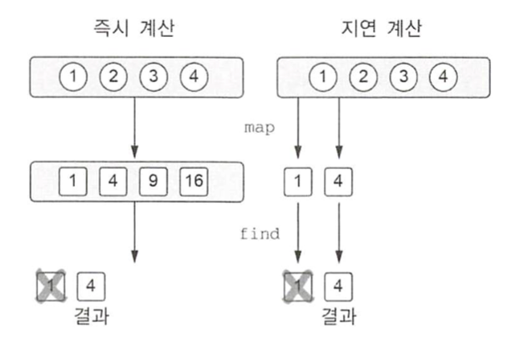

# 01. 람다 식과 멤버 참조

## 람다 소개: 코드 블록을 함수 인자로 넘기기

"이벤트가 발생하면 이 핸들러를 실행하자''나 "데이터 구조의 모든 원소에 이 연산을 적용하자"와 같은 생각을 코드로 표현하기 위해 일련의 동작을 변수에 저장하거나 다른 함수에 넘겨야 하는 경우가 자주 있다. 예전 자바에서는 무명 내부 클래스를 통해 이런 목적을 달성했다. 무명 내부 클래스를 사용하면 코드를 함수에 넘기거나 변수에 저장할 수 있기는 하지만 상당히 번거롭다.

함수형 프로그래밍에서는 함수를 값처럼 다루는 접근 방법을 택함으로써 이 문제를 해결한다. 


클릭 이벤트를 처리하는 리스너를 추가해보자.

``` kotlin
// 무명 내부 클래스로 리스너 구현하기
button.setOnClickListener(new OnClickListener() {
  @Override
  public void onClick(View view) {
    /* 클릭 시 수행할 동작 */
  }
})
```


``` kotlin
// 람다로 리스너 구현하기
button.setOnClickListener { /* 클릭 시 수행할 동작 */ }
```


## 람다와 컬렉션

컬렉션을 다룰 때 수행하는 대부분의 작업은 몇 가지 일반적인 패턴에 속한다. 따라서 그런 패턴은 라이브러리 안에 있어야 한다. 

사람의 이름과 나이를 저장하는 Person 클래스를 사용하자.

``` kotlin
data class Person(val name: String, val age: Int)
```


사람들로 이뤄진 리스트가 있고 그 중 가장 연장자를 구해보자.

``` kotlin
// 컬렉션을 직접 검색하기
fun findTheOldest(people: List<Person>) {
  var maxAge = 0
  var theOldest: Person? = null
  for (person in people) {
    if (person.age > maxAge) {
      maxAge = person.age
      theOldest = person
    }
  }
  println(theOldest)
}

val people = listOf(Person("Alice", 29), Person("Bob", 31))
findTheOldest(people)
```

``` kotlin
// 람다를 사용해 컬렉션 검색하기
val people = listOf(Person("Alice", 29), Person("Bob", 31))
people.maxBy { it.age }
```

maxBy는 가장 큰 원소를 찾기 위해 비교에 사용할 값을 돌려주는 함수를 인자로 받는다. { it.age }는 비교에 사용할 값을 돌려주는 함수다.

``` kotlin
// 멤버 참조를 사용해 컬렉션 검색하기
people.maxBy(Person:age)
```


## 람다 식의 문법

람다는 값처럼 여기저기 전달할 수 있는 동작의 모음이다. 람다를 따로 선언해서 변수에 저장할 수도 있다. 하지만 함수에 인자로 넘기면서 바로 람다를 정의하는 경우가 대부분이다.

``` 
{ x: Int, y: Int -> x + y }
```

코틀린 람다 식은 항상 중괄호로 둘려싸여 있다. 인자 목록 주변에는 괄호가 없다. 화살표가 인자 목록과 람다 본문을 구분해준다.

람다 식을 변수에 저장할 수 있다. 람다가 저장된 변수를 다른 일반 함수와 마찬가지로 다룰 수 있다.

``` kotlin
val sum = { x: Int, y: Int -> x + y }
sum(1, 2)
```


위에서 봤던 연장자를 찾는 예제에서 코틀린이 코드를 줄여 쓸 수 있게 제공했던 기능을 제거하고 정식으로 람다를 작성하면 다음과 같다. 

``` kotlin
people.maxBy({p: Person -> p.age })
```


이를 하나씩 개선해보자. 코틀린에는 함수 호출 시 맨 뒤에 있는 인자가 람다식이라면 그 람다를 괄호 밖으로 빼낼 수 있다는 문법 관습이 있다. 

``` kotlin
people.maxBy() { p: Person -> P.age }
```


람다가 어떤 함수의 유일한 인자이고 괄호 뒤에 람다를 썼다면 호출 시 빈 괄호를 없애도 된다.

``` kotlin
people.maxBy { p: Person -> p.age }
```


로컬 변수처럼 컴파일러는 람다 파라미터의 타입도 추론할 수 있다. maxBy 함수의 경우 파라미터의 타입은 항상 컬렉션 원소 타입과 같다.

``` kotlin
people.maxBy {p -> p.age}
```


람다의 파라미터 이름을 디폴트 이름인 it으로 바꾸면 람다 식을 더 간단하게 만들 수 있다. 람다의 파라미터가 하나뿐이고 그 타입을 컴파일러가 추론할 수 있는 경우 it을 바로 쓸 수 있다.

``` kotlin
people.maxBy { it.age }
```


## 현재 영역에 있는 변수에 접근

자바 메서드 안에서 무명 내부 클래스를 정의할 때 메서드의 로컬 변수를 무명 내부 클래스에서 사용할 수 있다. 람다 안에서도 같은 일을 할 수 있다. 람다를 함수 안에서 정의하면 함수의 파라미터뿐 아니라 람다 정의의 앞에 선언된 로컬 변수까지 람다에서 모두 사용할 수 있다.

forEach는 컬렉션의 모든 원소에 대해 람다를 호출해준다.

``` kotlin
fun printMessagesWithPrefix(messages: Collection<String>, prefix: String) {
  messages.forEach {
    println("$prefix $it")
  }
}
```


자바와 다른 점 중 중요한 한 가지는 코틀린 람다 안에서는 파이널 변수가 아닌 변수에 접근할 수 있다는 점이다. 또한 람다 안에서 바깥의 변수를 변경해도 된다. 

``` Kotlin
fun printProblemCounts(responses: Collection<String>) {
  var clientErrors = 0
  responses.forEach {
    if (it.startsWith("4")) {
      clientErrors++
    }
  }
}
```

이 예제의 clientErrors는 람다가 포획한 변수라고 부른다.


기본적으로 함수 안에 정의된 로컬 변수의 생명주기는 함수가 반환되면 끝난다. 하지만 어떤 함수가 자신의 로컬 변수를 포획한 람다를 반환하거나 다른 변수에 저장한다면 로컬 변수의 생명주기와 함수의 생명주기가 달라질 수 있다.


### 람다 사용 시 함정

람다를 이벤트 핸들러나 다른 비동기적으로 실행되는 코드로 활용하는 경우 함수 호출이 끝난 다음에 로컬 변수가 변경될 수도 있다. 다음 코드는 버튼 클릭 횟수를 제대로 셀 수 없다.

``` kotlin
fun tryToCountButtonClicks(button: Button): Int {
  var clicks = 0
  button.onClick { clicks++ }
  return clicks
}
```

이 함수는 항상 0을 반환한다. onClick 핸들러는 호출될 때마다 clicks의 값을 증가시키지만 그 값의 변경을 관찰할 수는 없다. 핸들러는 tryToCountButtonClicks가 clicks를 반환한 다음에 호출되기 때문이다.


## 멤버 참조

람다를 사용해 코드 블록을 다른 함수에게 인자로 넘기는 방법을 알아봤다. 하지만 넘기려는 코드가 이미 함수로 선언된 경우는 어떻게 해야 할까? 

이 때 ::을 사용한다.

``` kotlin
val getAge = Person::age
```

* Person : 클래스
* age : 멤버

::를 사용하는 식을 멤버 참조라고 부른다. 멤버 참조는 프로퍼티나 메서드를 단 하나만 호출하는 함수 값을 만들어준다. ::는 클래스 이름과 여러분이 참조하려는 멤버 이름 사이에 위치한다.

이는 다음 람다 식을 더 간략하게 표현한 것이다.

``` kotlin
val getAge = { person: Person -> person.age }
```


참조 대상이 함수인지 프로퍼티인지와는 관계없이 멤버 참조 뒤에는 괄호를 넣으면 안된다.

멤버 참조는 그 멤버를 호출하는 람다와 같은 타입이다. 따라서 다음 예처럼 그 둘을 자유롭게 바꿔 쓸 수 있다.

``` kotlin
people.maxBy(Person::age)
people.maxBy { p -> p.age }
people.maxBy { it.age }
```


최상위에 선언된 함수나 프로퍼티를 참조할 수도 있다.

``` kotlin
fun salute() = println("Salute!")
run(::salute) // Salute!
```


클래스 이름을 생략하고 ::로 참조를 바로 시작한다. ::salute라는 멤버 참조를 run 라이브러리 함수에 넘긴다.

람다가 인자가 여럿인 다른 함수한테 작업을 위임하는 경우 람다를 정의하지 않고 직접 위임 함수에 대한 참조를 제공하면 편리하다. 

``` kotlin
val action = { person: Person, message: String -> 
  sendEmail(person, message)
} // 이 람다는 sendEmail 함수에게 작업을 위임한다.
val nextAction = ::sendEmail // 람다 대신 멤버 참조를 쓸 수 있다.
```


생성자 참조를 사용하면 클래스 생성 작업을 연기하거나 저장해둘 수 있다. ::뒤에 클래스 이름을 넣으면 생성자 참조를 만들 수 있다.

``` kotlin
data class Person(val name: String, val age: Int)

val createPerson = ::Person
val p = createPerson("Alice", 29)
```


확장 함수도 멤버 함수와 똑같은 방식으로 참조할 수 있다는 점을 기억하라.

``` kotlin
fun Person.isAdult() = age >= 21
val predicate = Person::isAdult
```

isAdult는 Person 클래스의 멤버가 아니고 확장 함수다. 그렇지만 isAdult를 호출할 때 person.isAdult()로 인스턴스 멤버 호출 구문을 쓸 수 있는 것처럼 Person::isAdult로 멤버 참조 구문을 사용해 이 확장 함수에 대한 참조를 얻을 수 있다.


# 02. 컬렉션 함수형 API

함수형 프로그래밍 스타일을 사용하면 컬렉션을 다룰 때 편리하다. 대부분의 작업에 라이브러리 함수를 활용할 수 있고 그로 인해 코드를 아주 간결하게 만들 수 있다.

설명하는 함수 중에 코틀린을 설계한 사람이 발명한 함수는 전혀 없다. 


## 필수적인 함수: filter와 map

해당 함수를 설명하기 위해 Person 클래스를 사용한다.

``` kotlin
data class Person(val name: String, val age: Int)
```


filter 함수는 컬렉션을 이터레이션하면서 주어진 람다에 각 원소를 넘겨서 람다가 true를 반환하는 원소만 모은다.

``` kotlin
val list = listOf(1, 2, 3, 4)
list.filter { it % 2 == 0 }
```

``` kotlin
val people = listOf(Person("Alice", 29), Person("Bob", 31))
people.filter { it.age > 30 }
```


map 함수는 주어진 람다를 컬렉션의 각 원소에 적용한 결과를 모아서 새 컬렉션을 만든다.

``` kotlin
val list = listOf(1, 2, 3, 4)
list.map { it * it }
```


이런 호출은 쉽게 연쇄시킬 수 있다.

``` kotlin
people.filter { it.age > 30 }.map(Person::name)
```


최연장자를 구하는 로직은 아래와 같다.

``` kotlin
val maxAge = people.maxBy(Person::age)!!.age
people.filter { it.age == maxAge }
```


맵의 경우 키와 값을 처리하는 함수가 따로 존재한다. filterKeys와 mapKeys는 키를 걸러 내거나 변환하고 filterValues와 mapValues는 값을 걸러 내거나 변환한다.

``` kotlin
val numbers = mapOf(0 to "zero", 1 to "one")
numbers.mapValues { it.value.toUpperCase() } // {0=ZERO, 1=ONE}
```


## all, try, count, find: 컬렉션에 술어 적용

``` kotlin
val canBeInClub27 = { p: Person -> p.age <= 27 }
```


모든 원소가 이 술어를 만족하는지 궁금하다면 all 함수를 쓴다.

``` kotlin
val people = listOf(Person("Alice", 27), Person("Bob", 31))
people.all(canBeInClub27) // false
```


술어를 만족하는 원소가 하나라도 있는지 궁금하면 any를 쓴다.

``` kotlin
people.any(canBeInClub27) // true
```


어떤 조건에 대해 !all을 수행한 결과와 그 조건의 부정에 대해 any를 수행한 결과는 같다.

``` kotlin
!list.all { it == 3 }
list.any { it != 3 }
```


술어를 만족하는 원소의 개수를 구하려면 count를 사용한다.

``` kotlin
val people = listOf(Person("Alice", 27), Person("Bob", 31))
people.count(canBeInClub27)
```


count와 size의 차이를 살펴보자. 이렇게 처리하면 조건을 만족하는 모든 원소가 들어가는 중간 컬렉션이 생긴다. 반면 count는 조건을 만족하는 원소의 개수만을 추적하지 조건을 만족하는 원소를 따로 저장하지 않는다.

``` kotlin
people.filter(canBeInClub27).size
```


술어를 만족하는 원소를 하나 찾고 싶으면 find 함수를 사용한다. 조건을 만족하는 원소가 없으면 null이 나온다.

``` kotlin
val people = listOf(Person("Alice", 27), Person("Bob", 31))
people.find(canBeInClub27)
// Person("Alice", 27)
```


## groupBy: 리스트를 여러 그룹으로 이뤄진 맵으로 변경

사람을 나이에 따라 분류해보자. 특성을 파라미터로 전달하면 컬렉션을 자동으로 구분해주는 함수가 있으면 편리할 것이다.

``` kotlin
val people = listOf(Person("Alice", 31), Person("Bob", 29), Person("Carol", 31))
people.groupBy { it.age }
// {31=[Person(name=Alice, age=31), Person(name=Carol, age=31)], 29=[Person(name=Bob, age=29)]}
```


각 그룹은 리스트다. 따라서 groupBy의 결과 타입은 Map<Int, List<Person>>이다. 필요하면 이 맵을 mapKeys나 mapValues 등을 사용해 변경할 수 있다.

다른 예로 멤버 참조를 활용해 문자열을 첫 글자에 따라 분류하는 코드를 보자. first는 String의 멤버가 아니라 확장 함수지만 여전히 멤버 참조를 사용해 first에 접근할 수 있다.

``` kotlin
val list = listOf("a", "ab", "b")
list.groupBy(String::first)
// {a=[a, ab], b=[b]}
```


## flatMap과 flatten: 중첩된 컬렉션 안의 원소 처리

``` kotlin
class Book(val title: String. val authors: List<String>)
```


도서관에 있는 책의 저자를 모두 모은 집합을 다음과 같이 가져올 수 있다.

``` kotlin
books.flatMap { it.authors }.toSet()
```


flatMap 함수는 먼저 인자로 주어진 람다를 컬렉션의 모든 객체에 적용하고 람다를 적용한 결과 얻어지는 여러 리스트를 한 리스트로 한데 모은다.

``` kotlin
val strings = listOf("abc", "def")
strings.flatMap { it.toList() } 
// [a, b, c, d, e, f]
```


# 03. 지연 계산(lazy) 컬렉션 연산

앞에서 본 컬렉션 함수들은 결과 컬렉션을 즉시(eagerly) 생성한다. 이는 컬렉션 함수를 연쇄하면 매 단계마다 계산 중간 결과를 새로운 컬렉션에 임시로 담는다는 말이다. 시퀀스를 사용하면 중간 임시 컬렉션을 사용하지 않고도 컬렉션 연산을 연쇄할 수 있다.

``` kotlin
people.map(Person::name).filter { it.startsWith("A") }
```

이 연쇄 호출은 리스트를 2개 만든다. 한 리스트는 filter의 결과를 담고, 다른 하나는 map의 결과를 담는다.

이를 더 효율적으로 만들기 위해서는 각 연산이 컬렉션을 직접 사용하는 대신 시퀀스를 사용하게 만들어야 한다.

``` kotlin
People.asSequence()
  .map(Person::name)
  .filter { it.startsWith("A") }
  .toList()
```


Sequence 인터페이스의 강점은 그 인터페이스 위에 구현된 연산이 계산을 수행하는 방법 때문에 생긴다. 시퀀스의 원소는 필요할 때 비로소 계산된다. 따라서 중간 처리 결과를 저장하지 않고도 연산을 연쇄적으로 적용해서 효율적으로 계산을 수행할 수 있다.

asSequence 확장 함수를 호출하면 어떤 컬렉션이든 시퀀스로 바꿀 수 있다. 시퀀스를 리스트로 만들 때는 toList를 사용한다.

시퀀스의 원소를 차례로 이터레이션해야 한다면 시퀀스를 직접 써도 되지만 시퀀스 원소를 인덱스를 사용해 접근하는 등의 다른 API 메서드가 필요하다면 시퀀스를 리스트로 변환해야 한다.


## 시퀀스 연산 실행: 중간 연산과 최종 연산

시퀀스에 대한 연산은 중간 연산과 최종 연산으로 나뉜다. 중간 연산은 다른 시퀀스를 반환한다. 그 시퀀스는 최초 시퀀스의 원소를 변환하는 방법을 안다. 최종 연산은 결과를 반환한다. 

중간 연산은 항상 지연 계산된다. 최종 연산을 호출하면 연기됐던 모든 계산이 수행된다.

직접 연산을 구현한다면 map함수를 각 원소에 대해 먼저 수행해서 새 시퀀스를 얻고 그 시퀀스에 대해 다시 filter를 수행할 것이다.  시퀀스의 경우 모든 연산은 각 원소에 대해 순차적으로 적용된다. 즉 첫 번째 원소가 처리되고, 다시 두 번째 원소가 처리되며 이런 처리가 모든 원소에 대해 적용된다.

따라서 원소에 연산을 차례대로 적용하다가 결과가 얻어지면 그 이후의 원소에 대해서는 변환이 이뤄지지 않을 수도 있다.

``` kotlin
listOf(1, 2, 3, 4).asSequence().map { it * it }.find { it > 3}
```




## 시퀀스 만들기

컬렉션에 asSequence()를 호출해 시퀀스를 만들었다. 시퀀스를 만드는 다른 방법으로 generateSequence 함수를 사용할 수 있다. 이 함수는 이전의 원소를 인자로 받아 다음 원소를 계산한다. 

``` kotlin
val naturalNumbers = generateSequence(0) { it + 1 }
val numbersTo100 = naturalNumbers.takeWhile { it <= 100 }
numbersTo100.sum() // 5050
```


# 04. 자바 함수형 인터페이스 활용

코틀린 람다를 자바 API에 활용할 수 있는지 살펴보자.

아래 예제는 자바 메서드에 람다를 넘기고 있다.

``` kotlin
button.setOnClickListener { /* 클릭 시 수행할 동작 */ }
```


Button 클래스는 setOnClickListener 메서드를 사용해 버튼의 리스너를 설정한다. 이 때 인자의 타입은 OnClickListener이다.

``` java
public class Button {
  public void setOnClickListener(OnClickListener l) { ... }
}
```


OnClickListener 인터페이스는 onClick이라는 메서드만 선언된 인터페이스다.

``` java
public interface OnClickListener {
  void onClick(View v);
}
```


자바 8 이전의 자바에서는 setOnClickListener 메서드에게 인자로 넘기기 위해 무명 클래스의 인스턴스를 만들어야만 했다.

``` java
button.setOnClickListener(new OnClickListener() {
  @Override
  public void onClick(View v) {
    ...
  }
})
```


코틀린에서는 무명 클래스 인스턴스 대신 람다를 넘길 수 있다.

``` kotlin
button.setOnClickListener { view -> ... }
```


OnClickListener를 구현하기 위해 사용한 람다에는 view라는 파라미터가 있다. view의 타입은 View다. 이는 onClick 메서드의 인자 타입과 같다. 

이런 코드가 작동하는 이유는 OnClickListener에 추상 메서드가 단 하나만 있기 때문이다. 그런 인터페이스를 함수형 인터페이스 또는 SAM 인터페이스라고 한다. SAM은 단일 추상 메서드라는 뜻이다. 자바 API에는 Runnable이나 Callable과 같은 함수형 인터페이스와 그런 함수형 인터페이스를 활용하는 메서드가 많다. 코틀린은 함수형 인터페이스를 인자로 취하는 자바 메서드를 호출할 때 람다를 넘길 수 있게 해준다. 따라서 코틀린 코드는 무명 클래스 인스턴스를 정의하고 활용할 필요가 없어서 여전히 깔끔하며 코틀린다운 코드로 남아있을 수 있다. 


## 자바 메서드에 람다를 인자로 전달

함수형 인터페이스를 인자로 원하는 자바 메서드에 코틀린 람다를 전달할 수 있다. 예를 들어 다음 메서드는 Runnable 타입의 파라미터를 받는다.

``` Java
void postponeComputation(int delay, Runnable computation);
```


코틀린에서 람다를 이 함수에 넘길 수 있다. 컴파일러는 자동으로 람다를 Runnable 인스턴스로 변환해준다.

``` kotlin
postponeComputation(1000) { println(42) }
```


Runnable 인스턴스라는 말은 실제로는 Runnable을 구현한 무명 클래스의 인스턴스라는 뜻이다. 컴파일러는 자동으로 그런 무명 클래스와 인스턴스를 만들어준다. 이 때 그 무명 클래스에 있는 유일한 추상 메서드를 구현할 때 람다 본문을 메서드 본문으로 사용한다. 여기서는 Runnable의 run이 그런 추상 메서드다.

Runnable을 구현하는 무명 객체를 명시적으로 만들어서 사용할 수도 있다.

``` kotlin
postponeComputation(1000, object : Runnable {
  override fun run() {
    println(42)
  }
})
```


하지만 람다와 무명 객체 사이에는 차이가 있다. 객체를 명시적으로 선언하는 경우 메서드를 호출할 때마다 새로운 객체가 생성된다. 람다는 다르다. 정의가 들어있는 함수의 변수에 접근하지 않는 람다에 대응하는 무명 객체를 메서드를 호출할 때마다 반복 사용한다.

``` kotlin
postponeComputation(1000) { println(42) }
```


따라서 명시적인 object 선언을 사용하면서 람다와 동일한 코드는 다음과 같다. 이 경우 Runnable 인스턴스를 변수에 저장하고 메서드를 호출할 때마다 그 인스턴스를 사용한다.

``` kotlin
val runnable = Runnable { println(42) }
fun handleComputation() {
  postponeComputation(1000, runnable)
}
```


람다가 주변 영역의 변수를 포획한다면 매 호출마다 같은 인스턴스를 사용할 수 없다. 그런 경우 컴파일러는 매번 주변 영역의 변수를 포획한 새로운 인스턴스를 생성해준다.  예를 들어 다음 함수에서는 id를 필드로 저장하는 새로운 Runnable 인스턴스를 매번 새로 만들어 사용한다.

``` kotlin
fun handleComputation(id: String) {
  postponeComputation(1000) { println(id) }
}
```


## SAM 생성자: 람다를 함수형 인터페이스로 명시적으로 변경

SAM 생성자는 람다를 함수형 인터페이스의 인스턴스로 변환할 수 있게 컴파일러가 자동으로 생성한 함수다. 컴파일러가 자동으로 람다를 함수형 인터페이스 무명 클래스로 바꾸지 못하는 경우 SAM 생성자를 사용할 수 있다. 예를 들어 함수형 인터페이스의 인스턴스를 반환하는 메서드가 있다면 람다를 직접 반환할 수 없고, 반환하고픈 람다를 SAM 생성자로 감싸야 한다.

``` kotlin
fun createAllDoneRunnable(): Runnable {
  return Runnable { println("All done!") }
}

createAllDoneRunnable().run() // All done!
```


SAM 생성자의 이름은 사용하려는 함수형 인터페이스의 이름과 같다. SAM 생성자는 그 함수형 인터페이스의 유일한 추상 메서드의 본문에 사용할 람다만을 인자로 받아서 함수형 인터페이스를 구현하는 클래스의 인스턴스를 반환한다.


# 05. 수신 객체 지정 람다: with와 apply

자바의 람다에는 없는 코틀린 람다의 독특한 기능을 여러분이 이해할 수 있게 설명한다. 그 기능은 바로 수신 객체를 명시하지 않고 람다의 본문 안에서 다른 객체의 메서드를 호출할 수 있게 하는 것이다. 그런 람다를 수신 객체 지정 람다라고 부른다.


## with 함수

어떤 객체의 이름을 반복하지 않고도 그 객체에 대한 다양한 연산을 수행할 수 있다면 좋을 것이다. 코틀린은 언어 구성 요소로 제공하지 않고 with라는 라이브러리 함수를 통해 제공한다.

``` kotlin
// 알파벳 만들기
fun alphabet(): String {
  val result = StringBuilder()
  for (letter in 'A'..'Z') {
    result.append(letter)
  }
  result.append("\nNow I Konw the alphabet!")
  return result.toString()
}

alphabet()
// ABCDEFGHIJKLMNOPQRSTUVWXYZ
// Now I Konw the alphabet!
```

이 예제에서 result에 대해 다른 여러 메서드를 호출하면서 매번 result를 반복 사용했다.


``` kotlin
fun alphabet(): String {
  val stringBuilder = StringBuilder()
  return with(stringBuilder) {
    for (letter in 'A'..'Z') {
      this.append(letter)
    }
    append("\nNow I know the alphabet!")
    this.toString()
  }
}
```

with문은 파라미터가 2개 있는 함수다. 첫 번째 파라미터는 stringBuilder이고, 두 번째 파라미터는 람다다. 람다를 괄호 밖으로 빼내는 관례를 사용함에 따라 전체 함수 호출이 언어가 제공하는 특별 구문처럼 보인다. 물론 이 방식 대신 with(stringBuilder, {...})라고 쓸 수도 있지만 더 읽기 나빠진다.

with 함수는 첫 번째 인자로 받은 객체를 두 번째 인자로 받은 람다의 수신 객체로 만든다. 인자로 받은 람다 본문에서는 this를 사용해 그 수신 객체에 접근할 수 있다. 일반적인 this와 마찬가지로 this와 .을 사용하지 않고 프로퍼티나 메서드 이름만 사용해도 수신 객체의 멤버에 접근할 수 있다.


앞의 alphabet 함수를 더 리팩토링해서 불필요한 stringBuilder 변수를 없앨 수도 있다.

``` kotlin
fun alphabet() = with(StringBuilder()) {
  for (letter in 'A'..'Z') {
    append(letter)
  }
  append("\nNow I know the alphabet!")
  toString()
}
```


with가 반환하는 값은 람다 코드를 실행한 결과며, 그 결과는 람다 식의 본문에 있는 마지막 식의 값이다. 하지만 때로는 람다의 결과 대신 수신 객체가 필요한 경우도 있다. 그럴 때는 apply 라이브러리 함수를 사용할 수 있다.


## apply 함수

apply는 항상 자신에게 전달된 객체(수신 객체)를 반환한다.

``` kotlin
fun alphabet() = StringBuilder().apply {
  for (letter in 'A'..'Z') {
    append(letter)
  }
  append("\nNow I know the alphabet!")
}.toString()
```


apply 함수는 객체의 인스턴스를 만들면서 즉시 프로퍼티 중 일부를 초기화해야 하는 경우 유용하다.

``` kotlin
fun createViewWithCustomAttributes(context: Context) = 
  TextView(context).apply {
    text = "Sample Text"
    textSize = 20.0
    setPadding(10, 0, 0, 0)
  }
```


