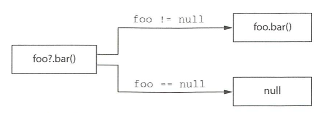

# 01. 널 가능성

널 가능성은 NullPointerException 오류를 피할 수 있게 돕기 위한 코틀린 타입 시스템의 특성이다.

코틀린을 비롯한 최신 언어에서 null에 대한 접근 방법은 가능한 한 이 문제를 실행 시점에서 컴파일 시점으로 옮기는 것이다.


## 널이 될 수 있는 타입

코틀린 타입 시스템은 널이 될 수 있는 타입을 명시적으로 지원한다는 점이다. 

자바 코드 예시를 보자. 이 함수에 null을 넘기면 NullPointerException이 발생한다.

``` java
int strLen(String s) {
  return s.length();
}
```


코틀린에서 이런 함수를 작성할 때 가장 먼저 답을 알아야 할 질문은 "이 함수가 널을 인자로 받을 수 있는가?"이다. 

널이 인자로 들어올 수 없다면 코틀린에서는 다음과 같이 함수를 정의할 수 있다.

``` kotlin
fun strLen(s: String) = s.length
```


strLen에 null이거나 널이 될 수 있는 인자를 넘기는 것은 금지되며, 혹시 그런 값을 넘기면 컴파일 시 오류가 발생한다. 따라서 strLen 함수가 실행 시점에 NPE을 발생시키지 않으리라 장담할 수 있다.

``` kotlin
strLen(null)
// ERROR: Null can not be a value of a non-null type String
```


이 함수가 널과 문자열을 인자로 받을 수 있게 하려면 타입 이름 뒤에 물음표를 명시해야 한다.

``` java
fun strLenSafe(s: String?) = ...
```


널이 될 수 있는 타입의 변수가 있다면 그에 대해 수행할 수 있는 연산이 제한된다.

* 널이 될 수 있는 타입인 변수에 대해 변수.메서드()처럼 메서드를 직접 호출할 수는 없다.
* 널이 될 수 있는 값을 널이 될 수 없는 타입의 변수에 대입할 수 없다.
* 널이 될 수 있는 타입의 값을 널이 될 수 없는 타입의 파라미터를 받는 함수에 전달할 수 없다.


제약이 많지만 null과 비교하고 나면 컴파일러는 그 사실을 기억하고 null이 아님이 확실한 영역에서는 해당 값을 널이 될 수 없는 타입의 값처럼 사용할 수 있다.

``` kotlin
fun strLenSafe(s: String?): Int = if (s != null) s.length else 0 
```


## 타입의 의미

"타입은 분류로... 타입은 어떤 값들이 가능한지와 그 타입에 대해 수행할 수 있는 연산의 종류를 결정한다."

자바의 String의 타입의 변수에는 String이나 null이라는 두 가지 종류의 값이 들어갈 수 있다. 두 가지 종류의 값은 완전히 다르고 심지어 자바 자체의 instanceof 연산자도 null이 String이 아니라고 답한다. 두 종류의 값에 대해 실행할 수 있는 연산도 완전히 다르다.

이는 자바의 타입 시스템이 널을 제대로 다루지 못한다는 뜻이다. 널 여부를 추가로 검사하기 전에는 그 변수에 대해 어떤 연산을 수행할 수 있을지 알 수 없다.

코틀린의 널이 될 수 있는 타입은 이런 문제에 대해 종합적인 해법을 제공한다. 널이 될 수 있는 타입과 널이 될 수 없는 타입을 구분하면 각 타입의 값에 대해 어떤 연산이 가능할지 명확히 이해할 수 있고, 실행 시점에 예외를 발생시킬 수 있는 연산을 판단할 수 있다.


## 안전한 호출 연산자: ?.

?.은 null 검사와 메서드 호출을 한 번의 연산으로 수행한다. 예를 들어 아래 두 연산은 같다.

```kotlin
s?.toUpperCase()
if (s != null) s.toUpperCase() else null
```


호출하려는 값이 null이 아니라면 ?.은 일반 메서드 호출처럼 작동한다. 호출하려는 값이 null이면 이 호출은 무시되고 null이 결과 값이 된다.




안전한 호출의 결과 타입도 널이 될 수 있는 타입이다. String.toUpperCase는 String 타입의 값을 반환하지만 s가 널이 될 수 있는 타입인 경우 s?.toUpperCase() 식의 결과 타입은 String?이다.


객체 그래프에서 널이 될 수 있는 중간 객체와 여럿 있다면 한 식 안에서 안전한 호출을 연쇄해서 함께 사용하면 편할 때가 자주 있다.

``` kotlin
fun Person.countryName(): String {
  val country = this.company?.address?.country
  return if (country != null) country else "Unknown"
}
```


## 엘비스 연산자: ?:

코틀린은 null 대신 사용할 디폴트 값을 지정할 때 편리하게 사용할 수 있는 연산자를 제공한다. 그 연산자를 엘비스 연산자라고 한다.

``` kotlin
fun foo(s: String?) {
  val t: String = s ?: ""
}
```


위 객체 그래프 예시도 엘비스 연산자를 통해 더 간략하게 표현할 수 있다.

``` kotlin
fun Person.countryName() = val country = this.company?.address?.country ?: "Unknown"
```


코틀린에서는 return이나 throw 등의 연산도 식이기 때문에 엘비스 연산자 우항에 사용가능하다.

``` kotlin
val address = person.company?.address ?: throw IllegalArgumentException("No address")
```


## 안전한 캐스트: as?

코틀린은 as를 통해 타입 캐스트를 수행한다. 자바 타입 캐스트와 마찬가지로 as로 지정한 타입으로 바꿀 수 없으면 ClassCastException이 발생한다. 

as? 연산자는 어떤 값을 지정한 타입으로 캐스트한다. as?는 값을 대상 타입으로 변환할 수 없으면 null을 반환한다. 


안전한 캐스트를 사용할 때 캐스트를 수행한 뒤에 엘비스 연산자를 사용하는 것이 일반적이다. equals를 구현할 때 이런 패턴이 유용하다.

``` kotlin
class Person(val firstName: String, val lastName: String) {
  override fun equals(o: Any?): Boolean {
    val otherPerson = o as? Person ?: return false
    // 생략
  }
}
```


## 널 아님 단언: !!

널 아님 단언은 코틀린에서 널이 될 수 있는 타입의 값을 다룰 때 사용할 수 있는 도구 중에서 가장 단순하면서도 무딘 도구다. 느낌표를 이중(!!)으로 사용하면 어떤 값이든 널이 될 수 없는 타입으로 바꿀 수 있다.


``` kotlin
fun ignoreNulls(s: String?) {
  val sNotNull: String = s!!
  println(sNotNull.length)
}

ignoreNulls(null)
// Exception in thread "main" kotlin.KotlinNullPointerException
```


!!를 널어 대해 사용해서 발생하는 예외의 스택 트레이스에는 어떤 파일의 몇 번째 줄인지에 대한 정보는 들어있지만 어떤 식에서 예외가 발생했는지에 대한 정보는 들어있지 않다. 따라서 아래와 같은 표현은 피하라.

``` kotlin
person.company!!.address!!.country
```


## let 함수

let 함수를 안전한 호출 연산자와 함께 사용하면 원하는 식을 평가해서 결과가 널인지 검사한 다음에 그 결과를 변수에 넣는 작업을 간단한 식을 사용해 한꺼번에 처리할 수 있다.

널이 될 수 있는 값을 널이 아닌 값만 인자로 받는 함수에 넘기는 경우에도 let을 사용한다.

``` kotlin
fun sendEmailTo(email: String) { /*...*/ }

val email: String? = ...
sendEmailTo(email)
// ERROR
```


위 경우에는 인자를 넘기기 전 주어진 값이 널인지 검사해야 한다.

``` kotlin
if (email != null) sendEmailTo(email)
```


하지만 let 함수를 통해 인자를 전달할 수도 있다. let 함수는 자신의 수신 객체를 인자로 전달받은 람다에게 넘긴다. 널이 될 수 있는 값에 대해 안전한 호출 구문을 사용해 let을 호출하되 널이 될 수 없는 타입을 인자로 받는 람다를 let에 전달한다. 이렇게 하면 널이 될 수 있는 타입의 값을 널이 될 수 없는 타입의 값으로 바꿔서 람다에 전달하게 된다.


``` kotlin
// 방법 1
email?.let { email -> sendEmailTO(email) }
// 방법 2
email?.let { sendEmailTo(it) }
```


## 나중에 초기화할 프로퍼티

객체 인스턴스를 일단 생성한 다음에 나중에 초기화하는 프레임워크가 많다. 

하지만 코틀린에서 클래스 안의 널이 될 수 없는 프로퍼티를 생성자 안에서 초기화하지 않고 특별한 메서드 안에서 초기화할 수 는 없다. 코틀린에서는 일반적으로 생성자에서 모든 프로퍼티를 초기화해야 한다. 게다가 프로퍼티 타입이 널이 될 수 없는 타입이라면 반드시 널이 아닌 값으로 그 프로퍼티를 초기화해야 한다. 그런 초기화 값을 제공할 수 없으면 널이 될수 있는 타입을 사용할 수 밖에 없다. 하지만 널이 될 수 있는 타입을 사용하면 모든 프로퍼티 접근에 널 검사를 넣거나 !! 연산자를 써야 한다.

``` kotlin
class MyService {
  fun performAction(): String = "foo"
}

class MyTest {
  private var myService: MyService? = null // null로 초기화하기 위해 널이 될 수 있는 타입인 프로퍼티를 선언한다.
  @Before fun setUp() {
    myService = MyService()
  }
  
  @Test fun testAction() {
    Assert.assertEquals("foo", myService!!.performAction())
  }
}
```


이 코드는 보기 나쁘기 때문에 myService 프로퍼티를 나중에 초기화(late-initialized)할 수 있다. lateinit 변경자를 붙이면 프로퍼티를 나중에 초기화할 수 있다.

``` kotlin
class MyService {
  fun performAction(): String = "foo"
}

class MyTest {
  private lateinit var myService: MyService

  @Before fun setUp() {
    myService = MyService()
  }
  
  @Test fun testAction() {
    Assert.assertEquals("foo", myService.performAction()) // 위와 다르게 널 검사를 수행하지 않고 프로퍼티를 사용한다.
  }
}
```

나중에 초기화하는 프로퍼티는 항상 var여야 한다. val 프로퍼티는 final 필드로 컴파일되며, 생성자 안에서 반드시 초기화해야 한다. 따라서 생성자 밖에서 초기화해야 하는 나중에 초기화하는 프로퍼티는 항상 var여야 한다.


## 널이 될 수 있는 타입 확장

널이 될 수 있는 타입에 대한 확장 함수를 정의하면  null 값을 다루는 강력한 도구로 활용할 수 있다. 어떤 메서드를 호출하기 전에 수신 객체 역할을 하는 변수가 널이 될 수 없다고 보장하는 대신, 직접 변수에 대해 메서드를 호출해도 확장 함수인 메서드가 알아서 널을 처리해준다. 이런 처리는 확장 함수에서만 가능하다. 일반 멤버 호출은 객체 인스턴스를 통해 디스패치되므로 그 인스턴스가 널인지 여부를 검사하지 않는다.

> 객체지향 언어에서 객체의 동적 타입에 따라 적절한 메서드를 호출해주는 방식을 동적 디스패치라고 부른다. 반대로 컴파일러가 컴파일 시점에 어떤 메서드가 호출될지 결정해서 코드를 생성하는 방식을 직접 디스패치라고 한다.


String? 타입의 수신 객체에 대해 호출할 수 있는 isNullOrEmpty이나 isNullOrBlank 메서드가 있다.

``` kotlin
fun verifyUserInput(input: String?) {
  if (input.isNullOrBlank()) {
    println("Please fill in the required fields")
  }
}

verifyUserInput(" ") // Please fill in the required fields
verifyUserInput(null) // Please fill in the required fields
```


## 타입 파라미터의 널 가능성

코틀린에서는 함수나 클래스의 모든 타입 파라미터는 기본적으로 널이 될 수 있다. 널이 될 수 있는 타입을 포함하는 어떤 타입이라도 타입 파라미터를 대신할 수 있다. 따라서 타입 파라미터 T를 클래스나 함수 안에서 타입 이름으로 사용하면 이름 끝에 물음표가 없더라도 T가 널이 될 수 있는 타입이다.

``` kotlin
fun <T> printHashCode(t: T) {
  println(t?.hashCode()) // t가 null이 될 수 있으므로 안전한 호출을 써야만 한다.
}

printHashCode(null) //null
```


타입 파라미터가 널이 아님을 확실히 하려면 널이 될 수 없는 타입 상한을 지정해야 한다. 이렇게 널이 될 수 없는 타입 상한을 지정하면 널이 될 수 있는 값을 거부하게 된다.

``` kotlin
fun <T: Any> printHashCode(t: T) {
  println(t.hashCode())
}

printHashCode(null) // Error
```


## 널 가능성과 자바

자바 타입 시트템은 널 가능성을 지원하지 않는다. 그렇다면 자바와 코틀린을 조합하면 어떤 일이 생길까?

자바 코드에도 애노테이션으로 표시된 널 가능성 정보가 있다. 이런 정보를 코틀린에서 활용한다. 따라서 자바의 @Nullable String은 코틀린 쪽에서 볼 때 String?와 같고, 자바의 @NotNull String은 코틀린 쪽에서 볼 때 String과 같다.


널 가능성 애노테이션이 소스코드에 없는 경우는 더 흥미롭다. 그런 경우 자바의 타입은 코틀린의 플랫폼 타입이 된다.


### 플랫폼 타입

플랫폼 타입은 코틀린이 널 관련 정보를 알 수 없는 타입을 말한다. 그 타입을 널이 될 수 있는 타입으로 처리해도 되고 널이 될 수 없는 타입으로 처리해도 된다. 컴파일러는 모든 연산을 허용하기에 책임은 개발자에게 있다.

아래는 널 가능성 애노테이션이 없는 자바 클래스다.

``` java
public class Person {
  private final String name;
  
  public Person(String name) {
    this.name = name;
  }
  
  public String getName() {
    return name;
  }
}
```


코틀린에서 널 검사 없이 자바 클래스에 접근할 수도 있다.

``` kotlin
fun yellAt(person: Person) {
  println(person.name.toUpperCase() + "!!!")
}

yellAt(Person(null)) // IllegalArgumentException
```


널 검사를 통해 자바 클래스에 접근할 수도 있다.

``` kotlin
fun yellAtSafe(person: Person) {
  println((person.name ?: "Anyone").toUpperCase() + "!!!")
}

yellAtSafe(Person(null)) // ANYONE!!!
```


코틀린에서 플랫폼 타입을 선언할 수는 없다. 자바 코드에서 가져온 타입만 플랫폼 타입이 된다.


### 상속

코틀린에서 자바 메서드를 오버라이드할 때 그 메서드의 파라미터와 반환 타입을 널이 될 수 있는 타입으로 선언할지 널이 될 수 없는 타입으로 선언할지 결정해야 한다.

자바로 구현된 인터페이스에 대해,

``` java
interface StringProcessor {
  void process(String value);
}
```


코틀린 컴파일러는 아래 두 구현을 모두 허용한다.

``` kotlin
class StringPrinter: StringProcessor {
  override fun process(value: String) {
    println(value)
  }
}

class NullableStringPrinter: StringProcessor {
  override fun process(value: String?) {
    if (value != null) {
      println(value)
    }
  }
```


# 02. 코틀린의 원시 타입

코틀린은 원시 타입과 래퍼 타입을 구분하지 않는다. 


## 원시 타입: Int, Boolean 등

자바는 원시 타입과 참조 타입을 구분한다. 원시 타입의 변수에는 그 값이 직접 들어가지만, 참조 타입의 변수에는 메모리상의 객체 위치가 들어간다.

자바는 참조 타입이 필요한 경우 특별한 래퍼 타입으로 원시 타입 값을 감싸서 사용한다. 따라서 정수의 컬렉션을 정의하려면 `Collection<int>`가 아니라 `Collection<Integer>` 를 사용해야 한다.

코틀린은 원시 타입과 래퍼 타입을 구분하지 않으므로 항상 같은 타입을 사용한다. 다음 예제는 정수를 표현하는 Int 타입을 사용한다.

``` kotlin
val i: Int = 1
val list: List<Int> = listOf(1, 2, 3)
```


실행 시점에 숫자 타입은 가능한 한 가장 효율적인 방식으로 표현된다. 대부분의 경우 코틀린의 Int 타입은 자바 int 타입으로 컴파일된다. 이런 컴파일이 불가능한 경우는 컬렉션과 같은 제네릭 클래스를 사용하는 경우 뿐이다. 예를 들어 Int 타입을 컬렉션의 타입 파라미터로 넘기면 그 컬렉션에는 Int의 래퍼 타입에 해당하는 java.lang.Integer 객체가 들어간다.

자바 원시 타입에 해당하는 타입은 다음과 같다.

* 정수 타입 : Byte, Short, Int, Long
* 부동소수점 수 타입 : Float, Bouble
* 문자 타입 : Char
* 불리언 타입 : Boolean


Int와 같은 코틀린 타입에는 널 참조가 들어갈 수 없기 때문에 쉽게 그에 상응하는 자바 원시 타입으로 컴파일 할 수 있다. 마찬가지로 반대로 자바 원시 타입의 값은 결코 널이 될 수 없으므로 자바 원시 타입을 코틀린에서 사용할 때도 플랫폼 타입이 아니라 널이 될 수 없는 타입으로 취급할 수 있다.


## 널이 될 수 있는 원시 타입: Int?, Boolean? 등

코틀린에서 널이 될 수 있는 원시 타입을 사용하면 그 타입은 자바의 래퍼 타입으로 컴파일된다.

널이 될 수 있는 원시 타입을 비교하려면 두 값이 모두 널이 아닌지 검사해야한다.

``` kotlin
data class Person(val name: String, val age: Int? = null) {
  fun isOlderThan(other: Person): Boolean? {
    if (age == null || other.age == null)
      return null
    return age > other.age
  }
}
```

Person 클래스에 선언된 age 프로퍼티의 값은 java.lang.Integer로 저장된다.


앞에서 이야기한 대로 제네릭 클래스의 경우 래퍼 타입을 사용한다. 어떤 클래스의 타입 인자로 원시 타입을 넘기면 코틀린은 그 타입에 대한 박스 타입을 사용한다. 예를 들어 다음 문장에서는 null 값이나 널이 될 수 있는 타입을 전혀 사용하지 않았지만 만들어지는 리스트는 래퍼인 Integer 타입으로 이뤄진 리스트다.

``` kotlin
val listOfInts = listOf(1, 2, 3)
```


이렇게 컴파일하는 이유는 자바 가상머신에서 제네릭을 구현하는 방법 때문이다. JVM은 타입 인자로 원시 타입을 허용하지 않는다. 따라서 자바나 코틀린 모두에서 제네릭 클래스는 항상 박스 타입을 사용해야 한다.


## 숫자 변환

코틀린과 자바의 가장 큰 차이점 중 하나는 숫자를 변환하는 방식이다. 코틀린은 한 타입의 숫자를 다른 타입의 숫자로 자동 변환하지 않는다. 결과 타입이 허용하는 숫자의 범위가 원래 타입의 범위보다 넓은 경우조차도 자동 변환은 불가능하다. 예를 들어 코틀린 컴파일러는 다음 코드를 거부한다.

``` kotlin
val i = 1
val l: Long = i // Error: type mismatch
```


대신 직접 변환 메서드를 호출해야 한다.

``` kotlin
val i = 1
val l: Long = i.toLong()
```


코틀린은 모든 원시 타입에 대한 변환 함수를 제공한다. 그런 변환 함수의 이름은 toByte(), toShort(), toChar() 등과 같다. 양방향 변환 함수가 모두 제공된다.

코틀린은 개발자의 혼란을 피하기 위해 타입 변환을 명시하기로 결정했다. 특히 박스 타입을 비교하는 경우 문제가 많다. 두 박스 타입 간의 equals 메서드는 그 안에 들어있는 값이 아니라 박스 타입 객체를 비교한다.

따라서 아래 값은 false다.

``` kotlin
new Integer(42).equals(new Long(42)) // false
```


코틀린에서 묵시적 변환을 허용한다면 다음과 같이 쓸 수 있을 것이다.

``` kotlin
val x = 1 // Int 타입인 변수
val list = listOf(1L, 2L, 3L) // Long 값으로 이뤄진 리스트
x in list // 묵시적 타입 변환으로 인해 false임
```


코틀린에서는 타입을 명시적으로 변환해서 같은 타입의 값으로 만든 후 비교해야 한다.

``` kotlin
val x = 1
println(x.toLong() in listOf(1L, 2L, 3L)) // true
```


숫자 리터럴을 사용할 때는 보통 변환 함수를 호출할 필요가 없다. 42L이나 42.0f처럼 상수 뒤에 타입을 표현하는 문자를 붙이면 변환이 필요 없다. 또한 여러분이 직접 변환하지 않아도 숫자 리터럴을 타입이 알려진 변수에 대입하거나 함수에게 인자로 넘기면 컴파일러가 필요한 변환을 자동으로 넣어준다.

``` kotlin
fun foo(l: Long) = println(l)

val b: Byte = 1 // 상수 값은 적절한 타입으로 해석된다.
val l = b + 1L // +는 Byte와 Long을 인자로 받을 수 있다.
foo(42) // 컴파일러는 42를 Long 값으로 해석한다.
```


코틀린 산술 연산자에서도 자바와 똑같이 숫자 연산 시 값 넘침이 발생할 수 있다. 코틀린은 값 넘침을 검사하느라 추가 비용을 들이지 않는다.


## Any, Any?: 최상위 타입

자바에서 Object가 클래스 계층의 최상위 타입이듯 코틀린에서는 Any 타입이 모든 널이 될 수 없는 타입의 조상 타입이다. 하지만 자바에서는 참조 타입만 Object를 정점으로 하는 타입 계층에 포함되며, 원시 타입은 그런 계층에 들어있지 않다. 이는 자바에서 Object 타입의 객체가 필요한 경우 int와 같은 원시 타입을 java.lang.Integer 같은 래퍼 타입으로 감싸야만 한다는 뜻이다. 하지만 코틀린에서는 Any가 Int 등의 원시 타입을 포함한 모든 타입의 조상 타입이다.

자바와 마찬가지로 코틀린에서도 원시 타입 값을 Any 타입의 변수에 대입하면 자동으로 값을 객체로 감싼다.

``` kotlin
val answer: Any = 42
```


모든 코틀린 클래스에는 toString, equals, hashCode라는 세 메서드가 들어있다. 이 세 메서드는 Any에 정의된 메서드를 상속한 것이다. 하지만 java.lang.Object에 있는 다른 메서드는 Any에서 사용할 수 없다. 따라서 그런 메서드를 호출하고 싶다면 java.lang.Object 타입으로 값을 캐스트해야 한다.


## Unit 타입: 코틀린의 void

코틀린 Unit 타입은 자바 void와 같은 기능을 한다.

``` kotlin
fun f(): Unit {...}
```


이는 반환 타입 선언 없이 정의한 블록이 본문인 함수와 같다.

``` kotlin
fun f() {...}
```


Unit 타입의 함수는 Unit 값을 묵시적으로 반환한다. 이 두 특성은 제네릭 파라미터를 반환하는 함수를 오버라이드하면서 반환 타입으로 Unit을 쓸 때 유용하다.

``` kotlin
interface Processor<T> {
  fun process(): T
}

class NoResultProcessor: Processor<Unit> {
  override fun process() {
    // 여기서 return을 명시할 필요가 없다.
  }
}
```


## Nothing 타입: 이 함수는 결코 정상적으로 끝나지 않는다

코틀린에서 결코 성공적으로 값을 돌려주는 일이 없으므로 '반환 값'이라는 개념 자체가 의미 없는 함수가 존재한다.

``` kotlin
fun fail(message: String): Nothing {
  throw IllegalStateException(message)
}

fail("Error occurred")
// java.lang.IllegalStateException: Error occurred
```


Nothing 타입은 아무 값도 포함하지 않기 때문에 함수의 반환 타입이나 반환 타입으로 쓰일 타입 파라미터로만 쓸 수 있다.


# 03. 컬렉션과 배열

## 널 가능성과 컬렉션

변수 타입 뒤에 ?를 붙이면 그 변수에 널을 저장할 수 있다는 뜻인 것처럼 타입 인자로 쓰인 타입에도 같은 표시를 사용할 수 있다.

``` kotlin
fun readNumbers(reader: BufferedReader): List<Int?> {
  val result = ArrayList<Int?>()
  
  for (line in reader.lineSequence()) {
    try {
      val number = line.toInt()
      result.add(number)
    }
    catch(e: NumberFormatException) {
      result.add(null)
    }
  }
  
  return result
}
```


널이 될 수 있는 값으로 이뤄진 컬렉션으로 널 값을 걸러내는 경우가 자주 있어서 코틀린 표준 라이브러리는 그런 일을 하는 filterNotNull이라는 함수를 제공한다.

``` kotlin
val validNumbers = numbers.filterNotNull()
```


numbers가 `List<Int?>` 타입이었더라도 filterNotNull를 통해 null이 없음을 보장해주기 때문에 validNumbers는 `List<Int>` 타입이다.


## 읽기 전용과 변경 가능한 컬렉션

코틀린에서는 컬렉션 안의 데이터에 접근하는 인터페이스와 컬렉션 안의 데이터를 변경하는 인터페이스를 분리했다는 점이다. 이런 구분은 코틀린 컬렉션을 다룰 때 사용하는 가장 기초적인 인터페이스인 kotlin.collections.Collection부터 시작한다. 이 Collection 인터페이스를 사용하면 컬렉션 안에 원소에 대해 이터레이션하고, 컬렉션의 크기를 얻고, 어떤 값이 컬렉션 안에 들어있는지 검사하고, 컬렉션에서 데이터를 읽는 여러 다른 연산을 수행할 수 있다. 하지만 Collection에는 원소를 추가하거나 제거하는 메서드가 없다.

컬렉션의 데이터를 수정하려면 kotlin.collections.MutableCollection 인터페이스를 사용하라. MutableCollection은 일반 인터페이스인 kotlin.collections.Collection을 확장하면서 원소를 추가하거나, 삭제하거나, 컬렉션 안의 원소를 모두 지우는 등의 메서드를 더 제공한다.


읽기 전용과 변경 가능한 컬렉션 인터페이스를 나누면서 내부의 동작을 예측할 수 있다. 변경 가능한 컬렉션을 인자로 받는 함수에 전달 할 때는 원본의 변경을 막기 위해 컬렉션을 복사해야 할 수도 있다.

``` kotlin
fun <T> copyElements(source: Collection<T>, target: MutableCollection<T>) {
  for (item in source) {
    target.add(item)
  }
}
```


아래 그림처럼 같은 인스턴스를 가리키는 변경 가능한 인터피에스 타입의 참조도 있을 수 있다.


이런 상황에서 이 컬렉션을 참조하는 다른 코드를 호출하거나 병렬 실행한다면 컬렉션을 사용하는 도중에 다른 컬렉션이 그 컬렉션의 내용을 변경하는 상황이 생길 수 있다. 즉 스레드 안전하지않다.


## 코틀린 컬렉션과 자바

모든 코틀린 컬렉션은 그에 상응하는 자바 컬렉션 인터페이스의 인스턴스이기 때문에 코틀린과 자바를 오갈 때 아무 변환도 필요 없다.


컬렉션과 마찬가지로 Map 클래스도 코틀린에서  Map과 MutableMap이라는 두 가지 버전으로 나타난다.


자바 메서드를 호출하되 컬렉션을 인자로 넘겨야 한다면 따로 변환하거나 복사하는 등의 추가 작업 없이 직접 컬렉션을 넘기면 된다. 예를 들어 java.util.Collection을 파라미터로 받는 자바 메서드가 있다면 아무 Collection이나 MutableCollection 값을 인자로 넘길 수 있다.

이런 성질로 인해 컬렉션의 변경 가능성과 관련해 중요한 문제가 생긴다. 자바는 읽기 전용 컬렉션과 변경 가능 컬렉션을 구분하지 않으므로, 코틀린에서 읽기 전용 Collection으로 선언된 객체라도 자바 코드에서는 그 컬렉션 객체의 내용을 변경할 수 있다.

이런 함정은 널이 아닌 원소로 이뤄진 컬렉션 타입에서도 발생한다. 널이 아닌 원소로 이뤄진 컬렉션을 자바 메서드로 넘겼는데 자바 메서드가 널을 컬렉션에 넣을 수도 있다.


## 컬렉션을 플랫폼 타입으로 다루기

자바 쪽에서 선언한 컬렉션 타입의 변수를 코틀린에서는 플랫폼 타입으로 본다. 플랫폼 타입인 컬렉션은 기본적으로 변경 가능성에 대해 알 수 없다. 따라서 코틀린 코드는 그 타입을 읽기 전용 컬렉션이나 변경 가능한 컬렉션 어느 쪽으로든 다룰 수 있다.

컬렉션 타입이 시그니처에 들어간 자바 메서드 구현을 오버라이드하려는 경우 읽기 전용 컬렉션과 변경 가능 컬렉션의 차이가 문제가 된다. 오버라이드하려는 메서드의 자바 컬렉션 타입을 어떤 코틀린 컬렉션 타입으로 표현할지 결정해야 한다.

이런 상황에서는 여러 가지를 선택해야 한다.

* 컬렉션이 널이 될 수 있는가
* 컬렉션의 원소가 널이 될 수 있는가
* 오버라이드하는 메서드가 컬렉션을 변경할 수 있는가


아래 코드는 자바 인터페이스가 파일에 들어있는 텍스트를 처리하는 객체를 표현한다.

``` java
interface FileContentProcessor {
  void processContents(File path,
                      byte[] binaryContents,
                      List<String> textContents);
}
```


이 인터페이스를 코틀린으로 구현하려면 다음을 선택해야 한다.

* 일부 파일은 이진 파일이며 이진 파일 안에 내용은 텍스트로 표현할 수 없는 경우가 있으므로 리스트는 널이 될 수 있다.
* 파일의 각 줄은 널일 수 없으므로 이 리스트의 원소는 널이 될 수 없다.
* 이 리스트는 파일의 내용을 표현하며 그 내용을 바꿀 필요가 없으므로 읽기 전용이다.

``` kotlin
class FileIndexer: FileContentProcessor {
  override fun processContents(path: File, binaryContents: ByteArray?, textContents: List<String>?) {}
}
```


## 객체의 배열과 원시 타입의 배열

자바 main 함수의 표준 시그니처에는 배열 파라미터가 들어있어서 코틀린 배열 타입을 이미 봤다.

``` kotlin
fun main(args: Array<String>) {
  for (i in args.indices) {
    println("Argument $i is: ${args[i]}")
  }
}
```


코틀린 배열은 타입 파라미터를 받는 클래스다. 배열의 원소 타입은 바로 그 타입 파라미터에 의해 정해진다.

코틀린에서 배열을 만드는 방법은 다양하다.

* arrayOf 함수에 원소를 넘기면 배열을 만들 수 있다.
* arrayOfNulls 함수에 정수 값을 인자로 넘기면 모든 원소가 null이고 인자로 넘긴 값과 크기가 같은 배열을 만들 수 있다. 물론 원소 타입이 널이 될 수 있는 타입인 경우에만 이 함수를 쓸 수 있다.
* Array 생성자는 배열 크기와 람다를 인자로 받아서 람다를 호출해서 각 배열 원소를 초기화해준다. arrayOf를 쓰지 않고 각 원소가 널이 아닌 배열을 만들어야 하는 경우 이 생성자를 사용한다.

``` kotlin
val letters = Array<String>(26) { i -> ('a' + i).toString() }
```


코틀린에서는 배열을 인자로 받는 자바 함수를 호출하거나  vararg 파라미터를 받는 코틀린 함수를 호출하기 위해 가장 자주 배열을 만든다. 하지만 이 때 데이터가 이미 컬렉션에 들어 있다면 컬렉션을 배열로 변환해야 한다.

``` kotlin
val strings = listOf("a", "b", "C")
"%s/%s/%s".format(*strings.toTypeedArray()) 
// a/b/c
```


배열 타입의 타입 인자도 항상 객체 타입이 된다. 따라서 `Array<Int>` 같은 타입을 선언하면 그 배열은 박싱된 정수의 배열이다. 박싱되지 않은 원시 타입의 배열이 필요하다면 그런 타입을 위한 특별한 배열 클래스를 사용해야 한다.

코틀린은 원시 타입의 배열을 표현하는 별도 클래스를 각 원시 타입마다 하나씩 제공한다. 예를 들어 Int 타입의 배열은 IntArray다. 이는 자바 원시 타입 배열인 int[] 등으로 컴파일된다.

원시 타입의 배열을 만드는 방법은 다음과 같다.

1. 각 배열 타입의 생성자는 size 인자를 받아서 해당 원시 타입의 디폴트 값으로 초기화된 size 크기의 배열을 반환한다.

2. 팩토리 함수는 여러 값을 가변 인자로 받아서 그런 값이 들어간 배열을 반환한다.

3. 크기와 람다를 인자로 받는 생성자를 사용한다.

``` kotlin
// 1
val fiveZeros = IntArray(5)

// 2
val fiveZerosToo = intArrayOf(0, 0, 0, 0, 0)

// 3
val squares = IntArray(5) { i -> (i+1) * (i+1) }
```


