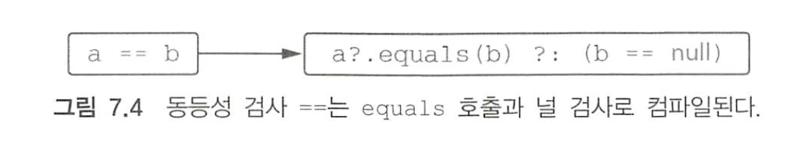
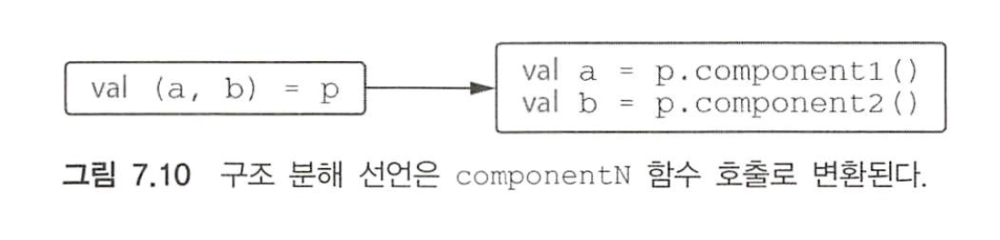

코트린에서 어떤 언어 기능이 정해진 사용자 작성 함수와 연결되는 경우가 몇 가지 있다. 코틀린에서는 이런 언어 기능이 어떤 타입과 연관되기보다는 특정 함수 이름과 연관된다. 예를 들어 어떤 클래스 안에 plus라는 이름의 특별한 메서드를 정의하면 그 클래스의 인스턴스에 대해 + 연산자를 사용할 수 있다. 이런 식으로 어떤 언어 기능과 미리 정해진 이름의 함수를 연결해주는 기법을 코틀린에서는 관례(convention)이라고 부른다.

언어 기능을 타입에 의존하는 자바와 달리 코틀린은 함수 이름을 통한 관례의 의존한다. 코틀린에서 이런 관례를 채택한 이유는 기존 자바 클래스를 코틀린 언어에 적용하기 위함이다. 기존 자바 클래스가 구현하는 인터페이스는 이미 고정돼 있고 코틀린 쪽에서 자바 클래스가 새로운 인터페이스를 구현하게 만들 수는 없다. 반면 확장 함수를 사용하면 기존 클래스에 새로운 메서드를 추가할 수 있다. 따라서 기존 자바 클래스에 대해 확장 함수를 구현하면서도 관례에 따라 이름을 붙이면 기존 자바 코드를 바꾸지 않아도 새로운 기능을 쉽게 부여할 수 있다.

7장에서는 Point 클래스를 예제로 사용한다.

``` kotlin
data class Point(val x: Int, val y: Int)
```


# 01. 산술 연산자 오버로딩

자바에서는 원시 타입에 대해서만 산술 연산자를 사용할 수 있고, 추가로 String에 대해 + 연산자를 사용할 수 있다. 

코틀린은 여러 타입에 대해 산술 연산자를 사용하도록 할 수 있다.


## 이항 산술 연산 오버로딩

``` kotlin
data class Point(val x: Int, val y: Int) {
  operator fun plus(other: Point): Point {
    return Point(x + other.x, y + other.y)
  }
}

val p1 = Point(10, 20)
val p2 = Point(30, 40)
p1 + p2
// Point(x=40, y=60)
```

연산자를 오버로딩하는 함수 앞에는 꼭 operator가 있어야 한다.

plus 함수를 선언하면 + 기호로 두 객체를 더할 시 plus 함수가 호출된다.


코틀린에서는 프로그래머가 직접 연산자를 만들어 사용할 수 없고 언어에서 미리 정해둔 연산자만 오버로딩할 수 있으며 관례에 따르기 위해 클래스에서 정의해야 하는 이름이 연산자별로 정해져 있다.

| 식    | 함수 이름        |
| ----- | ---------------- |
| a * b | times            |
| a / b | div              |
| a % b | mod(1.1부터 rem) |
| a + b | plus             |
| a - b | minus            |

직접 정의한 함수를 통해 구현하더라도 연산자 우선순위는 언제나 표준 숫자 타입에 대한 연산자 우선순위와 같다.

연산자를 정의할 때 두 피연산자가 같은 타입일 필요는 없다.

연산자 함수의 반환 타입이 꼭 두 피연산자 중 하나와 일치해야만 하는 것도 아니다.


## 복합 대입 연산자 오버로딩

plus와 같은 연산자를 오버로딩하면 코틀린은 + 뿐만 아니라 그와 관련 있는 연산자인 +=도 자동으로 함께 지원한다. +=, -= 등의 연산자는 복합 대입 연산자라 불린다.

``` kotlin
var point = Point(1, 2)
point += Point(3, 4)
point // Point(x=4, y=6)
```


경우에 따라 += 연산이 객체에 대한 참조를 다른 참조로 바꾸기보다 원래 객체의 내부 상태를 변경하게 만들고 싶을 때가 있다. 변경 가능한 컬렉션에 원소를 추가하는 경우가 대표적인 예다.

``` kotlin
val numbers = ArrayList<Int>()
number += 42
numbers[0] // 42
```


반환 타입이 Unit인 plusAssign 함수를 정의하면 코트린은 += 연산자에 그 함수를 사용한다. 

이론적으로는 코드에 있는 +=는 plus와 plusAssign 양쪽으로 컴파일할 수 있다. 어떤 클래스가 이 두 함수를 모두 정의하고 둘 다 +=에 사용 가능한 경우 컴파일러는 오류를 보고한다. 일반 연산자를 사용하면 이를 해결할 수 있다. 다른 방법으로 var를 val로 바꿔서 plusAssign 적용이 불가능하게 할 수 도 있다. plus와 plusAssign 연산을 동시에 정의하지 말라.

코틀린 표준 라이브러리는 컬렉션에 대해 두 가지 접근법을 함께 제공한다. +와 -는 항상 새로운 컬렉션을 반환하며, +=와 -= 연산자는 항상 변경 가능한 컬렉션에 적용해 메모리에 있는 객체 상태를 변화시킨다. 또한 읽기 전용 커렉션에서 +=와 -=는 변경을 적용한 복사본을 반환한다.


## 단항 연산자 오버로딩

단항 연산자를 오버로딩하는 절차도 이항 연산자와 마찬가지로 미리 정해진 이름의 함수를 선언하면서 operator로 표시하면 된다.

``` kotlin
operator fun Point.unaryMinus(): Point {
  return Point(-x, -y)
}

val p = Point(10, 20)
-p // Point(x=-10, y=-20)
```


코틀린에서 오버로딩할 수 있는 모든 단항 연산자는 아래와 같다.

| 식       | 함수 이름  |
| -------- | ---------- |
| +a       | unaryPlus  |
| -a       | unaryMinus |
| !a       | not        |
| ++a, a++ | inc        |
| --a, a-- | dec        |


# 02. 비교 연산자 오버로딩

코틀린에서는 모든 객체에 대해 비교 연산을 수행할 수 있다. equals나 compareTo를 호출해야 하는 자바와 달리 코틀린에서는 == 비교 연산자를 직접 사용할 수 있어서 비교 코드가 equals나 compareTo를 사용한 코드보다 더 간결하며 이해하기 쉽다.


## 동등성 연산자: equals

코틀린 == 연산자 호출은 equals 메서드 호출로 컴파일된다. != 연산자도 마찬가지다. 둘 모두 내부에서 인자가 널인지 검사하므로 다른 연산과 달리 널이 될 수 있는 값에도 적용할 수 있다.



``` kotlin
class Point(val x: Int, val y: Int) {
  override fun equals(obj: Any?): Boolean {
    if (obj === this) return true
    if (obj !is Point) return false
    return obj.x == x && obj.y == y
  }
}
```


우선 식별자 비교 연산자(===)를 사용해 파라미터가 수신 객체와 같은지 살펴본다. 식별자 비교 연산자는 자바 == 연산자와 같다.

equals 함수는 다른 연산자 오버로딩 관례와 달리 Any에 정의된 메서드이므로 override가 필요하다. Any의 equals에는 operator가 붙어있지만 그 메서드를 오버라이드하는 하위 클래스 메서드 앞에는 operator를 붙이지 않아도 적용된다.


## 순서 연산자: compareTo

코틀린도 자바와 마찬가지로 Comparable 인터페이스를 지원한다. 게다가 코틀린은 Comparable 인터페이스 안에 있는 compareTo 메서드를 호출하는 관례를 제공한다. 따라서 비교 연산자(<, >, <=, >=)는 compareTo 호출로 컴파일된다. compareTo가 반환하는 값은 Int다.

이름순서로 사람을 비교하는 Person 클래스를 정의해보자.

``` kotlin
class Person(val firstName: String, val lastName: String): Comparable<Person> {
  override fun compareTo(other: Person): Int {
    return compareValueBy(this, other, Person::lastName, Person::firstName)
  }
}

val p1 = Person("Alice", "Smith")
val p2 = Person("Bob", "Johnson")
p1 < p2 // false
```


equals와 마찬가지로 Comparable의 compareTo에도 operator 변경자가 붙어있으므로 하위 클래스의 오버라이딩 함수에 operator를 붙일 필요가 없다.


# 03. 컬렉션과 범위에 대해 쓸 수 있는 관례

## 인덱스로 원소에 접근: get과 set

코틀린에서 맵의 원소에 접근할 때나 자바에서 배열 원소에 접근할 때 [] 를 사용한다.

``` kotlin
val value = map[key]
mutableMap[key] = newValue
```


인덱스 연산자를 통해 원소를 읽는 연산은 get 연산자 메서드로 변환되고, 원소를 쓰는 연산은 set 연산자 메서드로 변환된다.

Point 클래스에 이런 메서드를 추가해보자.

``` kotlin
operator fun Point.get(index: Int): Int {
  return when(index) {
    0 -> x
    1 -> y
    else -> throw IndexOutOfBoundsException("Invalid coordinate $index")
  }
}

val p = Point(10, 20)
p[1] // 20
```


인덱스에 해당하는 컬렉션 원소를 쓰고 싶을 때는 set이라는 이름의 함수를정의하면 된다.

``` kotlin
data class MutablePoint(var x:Int, var y: Int)
operator fun MutablePoint.set(index: Int, value: Int) {
  when(index) {
    0 -> x = value
    1 -> y = value
    else -> throw IndexOutOfBoundsException("Invalid coordinate $index")
  }
}

val p = MutablePoint(10, 20)
p[1] = 42
p // MutablePoint(10, 42)
```


## in 관례

in은 객체가 컬렉션에 들어있는지 검사한다.

``` kotlin
data class Rectangle(val upperLeft: Point, val lowerRight: Point)

operator fun Rectangle.contains(p: Point): Boolean {
  return p.x in upperLeft.x until lowerRight.x && p.y in upperLeft.y until lowerRight.y
}

val rect = Rectangle(Point(10, 20), Point(50, 50))
Point(20, 30) in rect // true
```


## rangeTo 관례

범위를 만들려면 .. 구문을 사용해야 한다.

.. 연산자는 rangeTo 함수를 간략하게 표현하는 방법이다.

rangeTo 함수는 아무 클래스에나 정의할 수 있지만 어떤 클래스가 Comparable 인터페이스를 구현하면 rangeTo를 정의할 필요가 없다. 코틀린 표준 라이브러리에는 모든 Comparable 객체에 대한 적용 가능한 rangeTo 함수가 들어있다.

``` kotlin
operator fun <T: Comparable<T>> T.rangeTo(that: T): ClosedRange<T>
```


## for 루프를 위한 iterator 관례

코틀린의 for 루프는 범위 검사와 똑같이 in 연산자를 사용한다. 하지만 이 경우 in의 의미는 다르다.

``` kotlin
for (x in list) {...}
```

위와 같은 문장은 list.iterator()를 호출해서 이터레이터를 얻은 다음, 자바와 마찬가지로 그 이터레이터에 대해 hasNext와 next 호출을 반복하는 식으로 변환된다.

코틀린에서는 이 또한 관례이므로 iterator 메서드를 확장 함수로 정의할 수 있다. 코틀린 표준 라이브러리는 String의 상위 클래스인 CharSequence에 대한 iterator 확장 함수를 제공한다.

``` kotlin
operator fun CharSequence.iterator(): CharIterator

for (c in "abc") {}
```


날짜에 대해 이터레이션하는 다음 코드를 살펴보자.

``` kotlin
operator fun ClosedRange<LocalDate>.iterator(): Iterator<LocalDate> = object : Iterator<LocalDate> {
  var current = start 
  override fun hasNext() = current < endInclusive
  override fun next() = current.apply {
    current = plusDays(1)
  }
}
```


# 04. 구조 분해 선언와 component 함수

구조 분해 선언은 데이터 클래스의 특성 중 하나다. 구조 분해를 사용하면 복합적인 값을 분해해서 여러 다른 변수를 한꺼번에 초기화할 수 있다.

``` kotlin
val p = Point(10, 20)
val (x, y) = p
x // 10
y // 20
```


내부에서 구조 분해 선언은 다시 관례를 사용한다. 구조 분해 선언의 각 변수를 초기화하기 위해 componentN이라는 함수를 호출한다.




data 클래스의 주 생성자에 들어있는 프로퍼티에 대해서는 컴파일러가 자동으로 componentN 함수를 만들어준다. 데이터 타입이 아닌 클래스에서 이런 함수를 어떻게 구현하는지 보자.

``` kotlin
class Point(val x: Int, val y: Int) {
  operator fun component1() = x
  operator fun component2() = y
}
```


## 구조 분해 선언과 루프

함수 본문 내의 선언문뿐 아니라 변수 선언이 들어갈 수 있는 장소라면 어디든 구조 분해 선언을 사용할 수 있다.

맵의 원소에 대해 이터레이션할 때 구조 분해 선언이 유용하다.

``` kotlin
fun printEntries(map: Map<String, String>) {
  for ((key, value) in map) {
    println("$key -< $value")
  }
}
```


# 05. 프로퍼티 접근자 로직 재활용: 위임 프로퍼티

위임 프로퍼티를 사용하면 값을 뒷받침하는 필드에 단순히 저장하는 것보다 더 복잡한 방식으로 작동하는 프로퍼티를 쉽게 구현할 수 있다. 또한 그 과정에서 접근자 로직을 매번 재구현할 필요도 없다. 예를 들어 프로퍼티는 위임을 사용해 자신의 값을 필드가 아니라 데이터베이스 테이블이나 브라우저 세션, 맵 등에 저장할 수 있다.

이런 특성의 기반에는 위임이 있다. 위임은 객체가 직접 작업을 수행하지 않고 다른 도우미 객체가 그 작업을 처리하게 맡기는 디자인 패턴을 말한다. 이때 작업을 처리하는 도우미 객체를 위임 객체라고 부른다. 도우미 객체를 직접 작성할 수도 있지만 더 나은 방법은 코틀린 언어가 제공하는 기능을 활용하는 것이다.


## 위임 프로퍼티 소개

위임 프로퍼티의 일반적인 문법은 다음과 같다.

``` kotlin
class Foo {
  var p: Type by Delegate()
}
```

p 프로퍼티는 접근자 로직을 다른 객체에게 위임한다. 여기서는 Delegate 클래스의 인스턴스를 위임 객체로 사용한다. by 뒤에 있는 식을 계산해서 위임에 쓰일 객체를 얻는다. 프로퍼티 위임 객체가 따라야 하는 관례를 따르는 모든 객체를 위임에 사용할 수 있다.

다음과 같이 컴파일러가 숨겨진 도우미 프로퍼티를 만들고 그 프로퍼티를 위임 객체의 인스턴스로 초기화한다. p 프로퍼티는 바로 그 위임 객체에게 자신의 작업을 위임한다.

``` kotlin
class Foo {
  private val deltegate = Delegate()
  var p: Type
  set(value: Type) = delegate.setValue(..., value)
  get() = delegate.getValue()
}
```


프로퍼티 위임 관례를 따르는 Delegate 클래스는 getValue와 setValue 메서드를 제공해야 한다. 관례를 사용하는 다른 경우와 마찬가지로 getValue와 setValue는 멤버 메서드이거나 확장 함수일 수 있다. Delagate 클래스를 단순화하면 다음과 같다.

``` kotlin
class Delegate {
  operator fun getValue(...) {...}
  operator fun setValue(..., value: Type) {...}
}

class Foo {
  var p: Type by Delegate() // by 키워드는 프로퍼티와 위임 객체를 연결
}

val foo = Foo()
val oldValue = foo.p // 내부에서 delegate.getValue()를 호출
foo.p = newValue // 내부에서 delegate.setValue(..., newValue)를 호출
```


## 위임 프로퍼티 사용: by lazy()를 사용한 프로퍼티 초기화 지연

지연 초기화는 객체의 일부분을 초기화하지 않고 남겨뒀다가 실제로 그 부분의 값이 필요한 경우 초기화할 때 흔히 쓰이는 패턴이다. 초기화 과정에 자원을 많이 사용하거나 객체를 사용할 때마다 꼭 초기화하지 않아도 되는 프로퍼티에 대해 지연 초기화 패턴을 사용할 수 있다.

Person 클래스가 자신이 작성한 이메일의 목록을 제공한다. 이메일은 DB에 있고 불러오는데 시간이 오래 걸리기 때문에 이메일 프로퍼티의 값을 최초로 사용할 때 단 한 번만 이메일을 데이터베이스에서 가져오고 싶다.

``` kotlin
class Email { /*...*/ }
fun loadEmails(person: Person): List<Email> {
  println("${person.name}의 이메일을 가져옴")
  return listOf(...)
}
```


이메일을 불러오기 전에는 null을 저장하고, 불러온 다음에는 이메일 리스트를 저장하는 _emails 프로퍼티를 추가해서 지연 초기화를 구현한 클래스다.

``` kotlin
class Person(val name: String) {
  private var _emails: List<Email>? = null
  var emails: List<Email>
    get() {
      if (_emails == null) {
        _emails = loadEmails(this) // 최초 접근 시 이메일을 DB에서 가져온다.
      }
      return _emails!!
    }
}
```


여기서는 뒷받침하는 프로퍼티(backing property)라는 기법을 사용한다. _emails라는 프로퍼티는 값을 저장하고, 다른 프로퍼티인 emails는 _emails라는 프로퍼티에 대한 읽기 연산을 제공한다. _emails는 널이 될 수 있는 타입인 반면 emails는 널이 될 수 없는 타입이므로 프로퍼티 두 개를 사용해야 한다.

지연 초기화해야하는 프로퍼티가 많아지면 위 코드는 지저분해지며, 스레드에 안전하지 않다. 따라서 코틀린은 더 나은 해법을 제공한다.

위임 프로퍼티는 데이터를 저장할 때 쓰이는 뒷받침하는 프로퍼티와 값이 오직 한 번만 초기화됨을 보장하는 게터 로직을 함께 캡슐화해준다.

``` kotlin
class Person(val name: String) {
  val emails by lazy { loadEmails(this) }
}
```

lazy 함수는 코틀린 관례에 맞는 시그니처의 getValue 메서드가 들어있는 객체를 반환한다. 따라서 lazy를 by 키워드와 함께 사용해 위임 프로퍼티를 만들 수 있다. lazy 함수의 인자는 값을 초기화할 때 호출할 람다다. 


## 위임 프로퍼티 구현

어떤 객체의 프로퍼티가 바뀔 때마다 리스너에게 변경 통지를 보내고 싶다. 예를 들면 어떤 객체를 UI에 표시하는 경우 객체가 바뀌면 자동으로 UI도 바뀌어야 한다.

PorpertyChangeSupport 클래스는 리스너의 목록을 관리하고 PropertyChangeEvent 이벤트가 들어오면 목록의 모든 리스너에게 이벤트를 통지한다. 자바 빈 클래스의 필드에 PorpertyChangeSupport 인스턴스를 저장하고 프로퍼티 변경 시 그 인스턴스에게 처리를 위임하는 방식으로 이런 통지 기능을 주로 구현한다.

PorpertyChangeSupport를 사용하기 위한 도우미 클래스를 만들자.

``` kotlin
open class PropertyChangeAware {
  protected val changeSupport = PorpertyChangeSupport(this)
  
  fun addPorpertyChangeListener(listener: PorpertyChangeListener) {
    changeSupport.addPorpertyChangeListener(listener)
  }
  
    fun removePorpertyChangeListener(listener: PorpertyChangeListener) {
    changeSupport.removePorpertyChangeListener(listener)
  }
}
```


이하 내용 생략.
