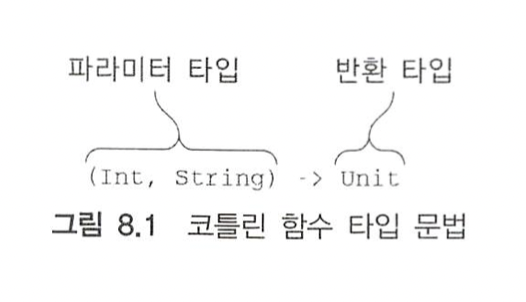
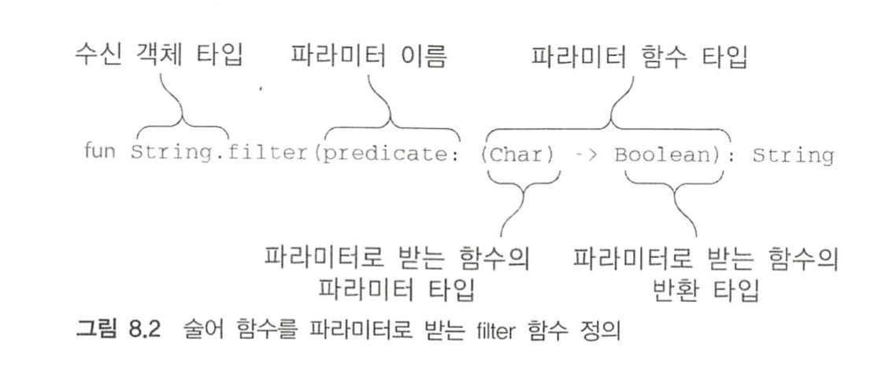
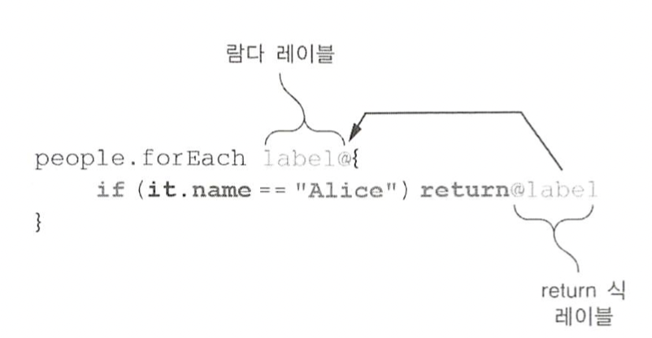
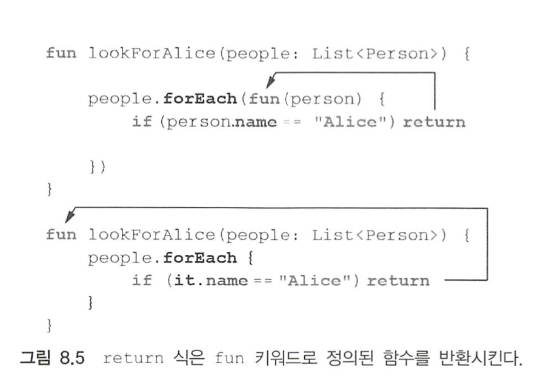

# 01. 고차 함수 정의

고차 함수는 다른 함수를 인자로 받거나 함수를 반환하는 함수다. 코틀린에서는 람다나 함수 참조를 사용해 함수를 값으로 표현할 수 있다. 

표준 라이브러리 함수인 filter는 술어 함수를 인자로 받으므로 고차 함수다.

``` kotlin
list.filter { x>0 }
```


## 함수 타입

람다를 인자로 받는 함수를 정의하려면 먼저 람다 인자의 타입을 어떻게 선언할 수 있는지 알아야 한다. 인자 타입을 정의하기 전에 더 단순한 경우로 람다를 로컬 변수에 대입하는 경우를 살펴보자. 코틀린의 타입 추론으로 인해 변수 타입을 지정하지 않아도 람다를 변수에 대입할 수 있다.

```kotlin
val sum = { x: Int, y: Int -> x + y }
val action = { println(42) }
```


이 경우 컴파일러는 sum과 action이 함수 타입임을 추론한다. 이제는 각 변수에 구체적인 타입 선언을 추가하면 어떻게 되는지 살펴보자.

``` kotlin
val sum: (Int, Int) -> Int = { x, y -> x + y }
val action: () -> Unit = { println(42) }
```





Unit 타입은 의미 있는 값을 반환하지 않는 함수 변환 타입에 쓰는 특별한 타입이다. 그냥 함수를 정의한다면 함수의 파라미터 목록 뒤에 오는 Unit 반환 타입 지정을 생략해도 되지만, 함수 타입을 선언할 때는 반환 타입을 반드시 명시해야 하므로 Unit을 빼먹어서는 안 된다.

다른 함수와 마찬가지로 함수 타입에서도 반환 타입을 널이 될 수 있는 타입으로 지정할 수 있다.

``` kotlin
var canReturnNull: (Int, Int) -> Int? = { x, y -> null }
```


함수의 반환 타입이 아니라 함수 타입 전체가 널이 될 수 있는 타입임을 선언하기 위해 함수 타입을 괄호로 감싸고 그 뒤에 물음표를 붙여야만 한다.

``` kotlin
var funOrNull: ((Int, Int) -> Int)? = null
```


## 인자로 받은 함수 호출

간단한 고차함수를 정의해보자.

``` kotlin
fun twoAndThree(operation: (Int, Int) -> Int) {
  val result = operation(2, 3)
  println("The result is $result")
}

twoAndThree { a, b -> a + b }
twoAndThree { a, b -> a * b }
```


filter 함수를 다시 구현해보자.



``` kotlin
fun String.filter(predicate: (Char) -> Boolean): String {
  val sb = StringBuilder()
  for (index in 0 until length) {
    val element = get(index)
    if (predicate(element)) sb.append(element)
  }
  return sb.toString()
}

println("ab1c".filter {it in 'a'..'z'}) // abc
```


## 자바에서 코틀린 함수 타입 사용

생략


## 디폴트 값을 지정한 함수 타입 파라미터나 널이 될 수 있는 함수 타입 파라미터

파라미터를 함수 타입으로 선언할 때도 디폴트 값을 정할 수 있다. 

3장에서 살펴본 joinToString을 다시 보자.

``` kotlin
fun main(args: Array<String>) {
  val list = listOf(1, 2, 3)
  println(list.joinToString("; ", "(", ")"))
}

fun String.lastChar(): Char = this.get(this.length - 1)

fun <T> Collection<T>.joinToString(
  separator: String = ", ",
  prefix: String = "",
  postfix: String = ""
): String {
  val result = StringBuilder(prefix)

  for ((index, element) in this.withIndex()) {
    if (index > 0) result.append(separator)
    result.append(element)
  }

  result.append(postfix)
  return result.toString()
}
```


이 구현은 유연하지만 핵심 요소 하나를 제어할 수 없다는 단점이 있다. 그 핵심 요소는 바로 컬렉션의 각 원소를 문자열로 변환하는 방법이다. 코드는 StringBuilder.append를 사용하는데 이 함수는 항상 객체를 toString 메서드를 통해 문자열로 바꾼다. 물론 toString으로 충분한 경우도 많지만 그렇지 않을 때도 있다. 이런 경우 원소를 문자열로 바꾸는 방법을 람다로 전달하면 된다는 사실을 배웠다. 하지만 joinToString을 호출할 때마다 매번 람다를 넘기게 만들면 기본 동작으로도 충분한 대부분의 경우 함수 호출을 오히려 더 불편하게 만든다는 문제가 있다. 이 땐 디폴트 값을 지정하면 해결할 수 있다.

``` kotlin
fun <T> Collection<T>.joinToString(
  separator: String = ", ",
  prefix: String = "",
  postfix: String = "",
  transform: (T) -> String = { it.toString() }
): String {
  val result = StringBuilder(prefix)

  for ((index, element) in this.withIndex()) {
    if (index > 0) result.append(separator)
    result.append(transform(element))
  }

  result.append(postfix)
  return result.toString()
}
```


## 함수를 함수에서 반환

사용자가 선택한 배송 수단에 따라 배송비를 계산하는 방법이 달라질 수 있다. 이럴 때 적절한 로직을 선택해서 함수로 반환하는 함수를 정의해 사용할 수 있다.

``` kotlin
enum class Delivery { STANDARD, EXPEDITED }
class Order(val itemCount: Int)
fun getShippingCostCalcurator(delivery: Delivery): (Order) -> Double {
  if (delivery == Delivery.EXPEDITED) {
    return { order -> 6 + 2.1 * order.itemCount }
  }
  return { order -> 1.2 * order.itemCount }
}
```

``` kotlin
val calculator = getShippingCostCalcurator(Delivery.EXPEDITED)
print("Shipping costs ${calculator(Order(3))}")

```


다른 함수를 반환하는 함수를 정의하려면 함수의 반환 타입으로 함수 타입을 지정해야 한다.


## 람다를 활용한 중복 제거

함수 타입과 람다 식은 재활용하기 좋은 코드를 만들 때 쓸 수 있는 휼륭한 도구다.

사이트 방문 기록을 분석하는 예를 살펴보자.

``` kotlin
data class SiteVisit(
  val path: String,
  val duration: Double,
  val os: OS
)

enum class OS { WINDOWS, LINUX, MAC, IOS, ANDROID }

var log = listOf(
  SiteVisit("/", 34.0, OS.WINDOWS),
  SiteVisit("/login", 22.0, OS.MAC),
)
```


일반 함수를 사용하면 아래와 같다.

``` kotlin
fun List<StiteVisit>.averageDurationFor(os: OS) = filter { it.os == os }.map(SiteVisit::duration).average()
```

하지만 복잡한 조건에 대한 처리를 하지 못한다.  여러 개의 디바이스의 평균을 구하고 싶으면 새로운 함수를 정의해야한다.


고차 함수를 사용해 중복을 제거해보자.

``` kotlin
fun List<StiteVisit>.averageDurationFor(predicate: (SiteVisit) -> Boolean) = filter(predicate).map(SiteVisit::duration).average()

log.averageDurationFor { it.os in setOf(OS.ANDROID, OS.IOS) }
```


# 02. 인라인 함수: 람다의 부가 비용 없애기

코틀린에서 람다를 함수 인자로 넘기는 구문이 if나 for와 같은 일반 문장과 비슷하다. 

5장에서는 코틀린이 보통 람다를 무명 클래스로 컴파일하지만 그렇다고 람다 식을 사용할 때마다 새로운 클래스가 만들어지지는 않는다는 사실을 설명했고, 람다가 변수를 포획하면 람다가 생성되는 시점마다 새로운 무명 클래스 객체가 생긴다는 사실도 설명했다. 이런 경우 실행 시점에 무명 클래스 생성에 따른 부가 비용이 든다. 따라서 람다를 사용하는 구현은 똑같은 작업을 수행하는 일반 함수를 사용한 구현보다 덜 효율적이다.


# 03. 고차 함수 안에서 흐름 제어

루프와 같은 명령형 코드를 람다로 바꾸기 시작한 독자는 곧 return 문제에 부딪칠 것이다. 


## 람다 안의 return 문: 람다를 둘러싼 함수로부터 반환

일반 루프에서는 결과가 명확하다.

``` kotlin
data class Person(val name: String , val age: Int)

val people = listOf(Person("Alice", 29), Person("Bob", 31))

fun lookForAlice(people: List<Person>) {
  for (person in people) {
    if (person.name == "Alice") {
      println("Found!")
      return
    }
  } 
  println("Alice is not found")
}

lookForAlice(people) // Found!
```


이 코드를 forEach로 바꿔서도 안전하다. 

람다 안에서 return을 사용하면 람다로부터만 반환되는 게 아니라 그 람다를 호출하는 함수가 실행을 끝내고 반환된다. 그렇게 자신을 둘러싸고 있는 블록보다 더 바깥에 있는 다른 블록을 반환하게 만드는 return문을 non-local return이라 부른다.

``` kotlin
fun lookForAlice(people: List<Person>) {
  people.forEach {
    if (it.name == "Alice") {
      println("Found!")
      return
    }
  }
  println("Alice is not found")
}
```


이 규칙 뒤에 숨어있는 로직을 이해하려면 자바 메서드 안에 있는 for 루프나 synchronized 블록 안에서 return 키워드가 어떻게 동작하는지 살펴보면 된다. 그런 경우 return은 for 루프나 synchronized 블록을 끝내지 않고 메서드를 반환시킨다. 코틀린에서는 언어가 제공하는 기본 구성 요소가 아니라 람다를 받는 함수로 for나 synchronized와 같은 기능을 구현한다. 

이렇게 return이 바깥쪽 함수를 반환시킬 수 있는 때는 람다를 인자로 받는 함수가 인라인 함수인 경우뿐이다. 위 예제에서 forEach는 인라인 함수이므로 람다 본문과 함께 인라이닝된다. 하지만 인라이닝되지 않는 함수는 람다를 변수에 저장할 수 있고, 바깥쪽 함수로부터 반환된 뒤에 저장해 둔 람다가 호출될 수도 있다. 그런 경우 람다 안의 return이 실행되는 시점이 바깥쪽 함수를 반환시키기엔 너무 늦은 시점일 수 있다.


## 람다로부터 반환: 레이블을 사용한 return

람다 식에서도 로컬 return을 사용할 수 있다. 람다 안에서 로컬 return은 for 루프의  break와 비슷한 역할을 한다. 로컬 return은 람다의 실행을 끝내고 람다를 호출했던 코드의 실행을 계속 이어간다. 로컬 return과 넌로컬 return을 구분하기 위해 레이블을 사용해야 한다. return으로 실행을 끝내고 싶은 람다 식 앞에 레이블을 붙이고, return 키워드 뒤에 그 레이블을 추가하면 된다.

``` kotlin
fun lookForAlice(people: List<Person>) {
  people.forEach label@{
    if (it.name == "Alice") return@label
  }
  println("Alice might be somewhere") // 이 줄은 항상 추력된다.
}
```

람다 식에 레이블을 붙이려면 레이블 이름 뒤에 @ 문자를 추가한 것을 람다를 여는 { 앞에 넣으면 된다. 람다로부터 반환하려면 return 키워드 뒤에 @문자와 레이블을 차례로 추가하면 된다.




람다에 레이블을 붙여서 사용하는 대신 람다를 인자로 받는 인라인 함수의 이름을 return 뒤에 레이블로 사용해도 된다.

``` kotlin
fun lookForAlice(people: List<Person>) {
  people.forEach {
    if (it.name == "Alice") return@forEach
  }
  println("Alice might be somewhere") // 이 줄은 항상 출력된다.
}
```


넌로컬 반환문은 장황하고 람다 안의 여러 위치에 return 식이 들어가야 하는 경우 사용하기 불편하다. 따라서 무명 함수를 사용하면 더 쉽게 작성할 수 있다.


## 무명 함수: 기본적으로 로컬 return

무명 함수는 코드 블록을 함수에 넘길 때 사용할 수 있는 다른 방법이다.

``` kotlin
fun lookForAlice(people: List<Person>) {
  people.forEach(fun (person) {
    if (it.name == "Alice") return
    println("${person.name} is not Alice")
  })
}
```


무명 함수는 일반 함수와 비슷해보인다. 차이는 함수 이름이나 파라미터 타입을 생략할 수 있다는 점이다.


무명 함수 안에서 레이블이 붙지 않은 return 식은 무명 함수 자체를 반환시킬 뿐 무명 함수를 둘러싼 다른 함수를 반환시키지 않는다. 사실 return에 적용되는 규칙은 단순히 return은 fun 키워드를 사용해 정의된 가장 안쪽 함수를 반환시킨다는 점이다. 람다식은 fun을 사용해 정의되지 않으므로 람다 본문의 return은 람다 밖의 함수를 반환시킨다. 

