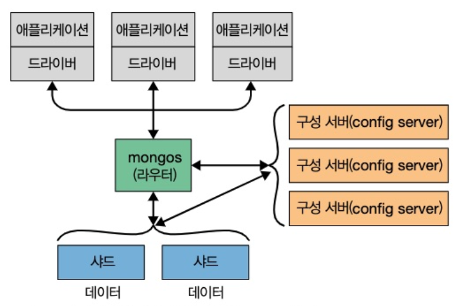

# 01. 몽고DB 소개

## 1.1 손쉬운 사용

몽고 DB는 관계형 데이터베이스가 아니라 도큐먼트 지향 데이터베이스이다. 관계형 모델을 사용하지 않는 주된 이유는 scale out을 쉽게 하기 위함이지만 다른 이점도 있다.

행 개념 대신 유연한 도큐먼트를 사용한다. 복잡한 계층 관계를 하나의 레코드로 표현할 수 있다. 이 방법은 객체 지향 언어를 사용하는 개발자의 관점에 매우 적합하다.

몽고DB에서는 도큐먼트의 키와 값을미리 정의하지 않는다. 고정된 스키마가 없기 때문에 필요할 때마다 쉽게 필드를 추가 제거할 수 있습니다.

## 1.2 확장 가능한 설계

애플리케이션 dataset의 크기는 놀라운 속도로 증가하고 있다.

저장할 데이터가 증가함에 따라 '데이터베이스를 어떻게 확장할 것인가'를 결정해야한다.

몽고DB는 scale out을 염두에 두고 설계됐다. 도큐먼트 지향 데이터 모델은 데이터를 여러 서버에 더 쉽게 분산하게 해준다. 아래 그림처럼 도큐먼트를 자동으로 재분배하고 사용자 요청을 올바른 장비에 라우팅함으로써 클러스터 내 데이터 양과 부하를 조절할 수 있다.

## 1.3 다양한 기능

### 인덱싱

몽고DB는 일반적인 보조 인덱스를 지원하며 unique, compound(복합), 공간 정보, full-text 인덱싱 기능도 제공한다. 중첩된 도큐먼트 및 배열과 같은 계층 구조의 보조 인덱스도 지원한다.

### 집계

몽고DB는 데이터 처리 파이프라인 개념을 기반으로 한 집계 프레임워크를 제공한다. 집계 파이프라인은 데이터베이스 최적화를 최대한 활용해 서버 측에서 비교적 간단한 일련의 단계로 데이터를 처리함으로써 복잡한 분석 엔진을 구축하게 해준다.

### 특수한 컬렉션 유형

몽고DB는 로그와 같은 최신 데이터를 유지하고자 세션이나 고정 크기 컬렉션과 같이 특정 시간에 만료해야 하는 데이터에 대해 유효 시간(TTL) 컬렉션을 지원한다. 또한 기준 필터와 일치하는 도큐먼트에 한정된 partial index를 지원함으로써 효율성을 높이고 필요한 저장 공간을 줄인다.

### 파일 스토리지

몽고DB는 큰 파일과 파일 메타데이터를 편리하게 저장하는 프로토콜을 지원한다.

관계형 데이터베이스에 공통적으로 사용되는 기능, 특히 복잡합 조인은 몽고DB에 존재하지 않는다. 3.2에 도입된 $lookup 집계 연산자를 사용함으로써 매우 제한된 방식으로 조인하도록 지원한다. 3.6 버전에서는 관련 없는 서브쿼리 뿐만 아니라 여러 조인 조건으로 보다 복잡한 조인도 할 수 있다.

## 1.4 고성능

몽고DB에서는 동시성과 처리량을 극대화하기 위해 WiredTiger storage engine에 opportunistic lock을 사용했다. 따라서 캐시처럼 제한된 용량의 램으로 쿼리에 알맞은 인덱스를 자동으로 선택할 수 있다. 

몽고DB는 강력한 성능을 제공하면서도 관계형 시스템의 많은 기능을 포함한다. 하지만 일부 기능의 경우 처리와 로직을 클라이언트 측에 오프로드한다. 이러한 간소한 설계 덕분에 몽고DB는 뛰어난 성능을 발휘한다.

## 1.5 몽고DB의 철학

몽고 DB 프로젝트의 주 관심사는 확장성이 높으며 유연하고 빠른, 즉 완전한 기능을 갖춘 데이터 스토리지를 만드는 일이다.