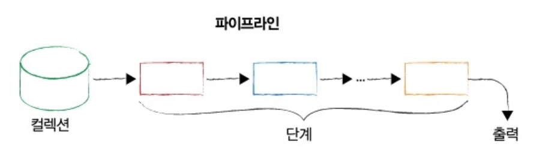
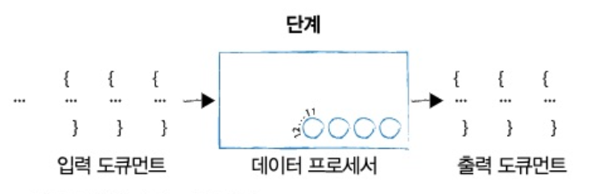
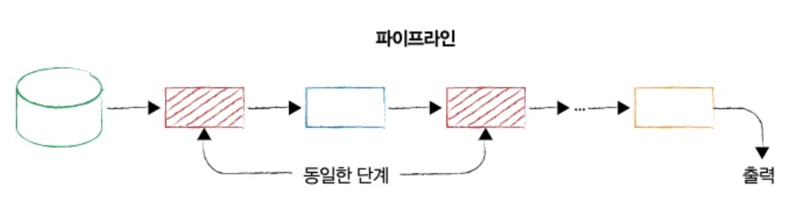

# 07. 집계 프레임워크

애플리케이션은 데이터 분석이 필요하다. 몽고DB는 분석을 실행하기 위한 강력한 지원을 제공한다.

* 집계 프레임워크
* 집계 단계
* 집계 표현식
* 집계 누산기


## 7.1 파이프라인, 단계 및 조정 가능 항목

집계 프레임워크는 몽고 DB 내 분석 도구 모음으로, 하나 이상의 컬렉션에 있는 도큐먼트에 대한 분석을 수행하게 해준다.

집계 프레임워크는 파이프라인 개념을 기반으로 한다.

각 단계는 전 단계에서 생산한 출력이 무엇이든 입력으로 받아들인다. 모든 단계의 입력과 출력은 도큐먼트(또는 도큐먼트 스트림)다.




집계 파이프라인의 개별 단계는 데이터 처리 단위이다. 한 번에 입력 도큐먼트 스트림을 하나씩 가져와서, 각 도큐먼트를 하나씩 처리하고, 출력 도큐먼트 스트림을 하나씩 생성한다.




각 단계는 knobs 또는 tunables 셋을 제공한다. 이 항목들을 조정해 각 단계를 매개변수로 지정함으로써 원하는 작업을 수행할 수 있다. 

이러한 tunables은 일반적으로 필드를 수정하거나, 산술 연산을 수행하거나, 도큐먼트를 재구성하거나, 일종의 누산 작업 등 여러 작업을 수행하는 연산자의 형태를 취한다.

파이프라인을 구성할 때 종종 동일한 유형의 단계를 단일 파이프라인에 여러 번 포함한다. 예를 들어 컬렉션 전체를 파이프라인에 전달하지 않도록 초기 필터를 수행한다.




## 7.2 단계 시작하기: 익숙한 작업들

일치, 선출, 정렬, 건너뛰기, 제한 단계를 살펴보자.

집계 예제에서는 회사 데이터 컬렉션을 사용한다. 컬렉션에는 회사 이름, 회사에 대한 간단한 설명, 회사 설립 시기 등 세부 정보를 지정하는 여러 필드가 있다.

### 일치

첫 번째 예제로 2004년 설립된 회사를 모두 찾는 간단한 필터를 수행해보자.

``` javascript
db.companies.aggregate([
    {$match: {founded_year: 2004}},
])
```


### 선출

선출 단계를 추가해 도큐먼트당 몇 개의 필드만 나타내도록 출력을 줄여보자.

``` javascript
db.companies.aggregate([
    {$match: {founded_year: 2004}},
    {$project: {
        _id: 0,
        name: 1,
        founded_year: 1
    }}
])
```


aggregate는 집계 쿼리를 실행할 때 호출하는 메서드다. 집계를 위해 집계 파이프라인을 전달하는데, 파이프라인은 도큐먼트를 요소로 포함하는 배열이다. 각 도큐먼트는 특정 단계 연산자를 규정해야 한다. 예제 파이프라인은 두 단계를 포함한다. 필터링을 위한 일치 단계와, 출력을 도큐먼트 당 두 개의 필드로 제한하는 선출 단계가 있다.

일치 단계는 컬렉션에 대해 필터링하고 결과 도큐먼트를 한 번에 하나씩 선출 단계로 전달한다. 선출 단계는 작업을 수행하고 도큐먼트 모양을 변경한 후 출력을 파이프라인에서 다시 우리에게 전달한다.


### 제한

동일한  쿼리로 일치를 수행하되 결과 셋을 4개로 제한한 후 원하는 필드를 선출한다.

``` javascript
db.companies.aggregate([
    {$match: {founded_year: 2004}},
    {$limit: 5},
    {$project: {
        _id: 0,
        name: 1,
        founded_year: 1
    }}
])
```


제한은 선출 단계 이전에 수행하도록 파이프라인을 구축했다. 선출 단계를 먼저 실행한 후 제한을 실행해도 동일한 결과를 얻는다. 하지만 이 경우 최종적으로 결과를 5개로 제한하기 전에 선출 단계를 통해 수백 개의 도큐먼트를 전달해야 한다.

파이프라인을 구축할 때 한 단계에서 다른 단계로 전달해야 하는 도큐먼트 수를 반드시 제한하자.


### 정렬

정렬 순서가 중요하다면 제한 단계 전에 정렬을 수행해야 한다. 

``` javascript
db.companies.aggregate([
    {$match: {founded_year: 2004}},
    {$sort: {name: 1}},
    {$limit: 5},
    {$project: {
        _id: 0,
        name: 1,
        founded_year: 1
    }}
])
```


### 건너뛰기

먼저 정렬을 하고 처음 10개의 도큐먼트를 건너뛴 후 결과 셋을 5개 도큐먼트로 제한하자.

```javascript
db.companies.aggregate([
    {$match: {founded_year: 2004}},
    {$sort: {name: 1}},
    {$skip: 10},
    {$limit: 5},
    {$project: {
        _id: 0,
        name: 1,
        founded_year: 1
    }}
])
```


## 7.3 표현식

집계 파이프라인을 구축할 때 사용할 수 있는 다양한 유형의 표현식을 이해하는 것이 중요하다.

* 불리언 표현식 : AND, OR, NOT 표현식을 쓸 수 있다.
* 집합 표현식 : 배열을 집합으로 사용할 수 있다.
* 비교 표현식 : 다양한 유형의 범위 필터를 표현할 수 있다.
* 산술 표현식 : 여러 산술 연산을 수행할 수 있다.
* 문자열 표현식 : concatenate, substring 검색, 대소문자 및 텍스트 검색과 관련된 작업을 수행할 수 있다.
* 배열 표현식 : 배열 요소를 필터링하거나, 배열을 분할하거나, 특정 배열에서 값의 범위를 가져오는 등 배열을 조작하는데 유용하다.
* 가변적 표현식 : 리터럴, 날짜 값 구문 분석을 위한 식, 조건식을 사용한다.
* 누산기 : 합계, 기술 통계 및 기타 여러 유형의 값을 계산하는 기능을 제공한다.


## 7.4 $project

