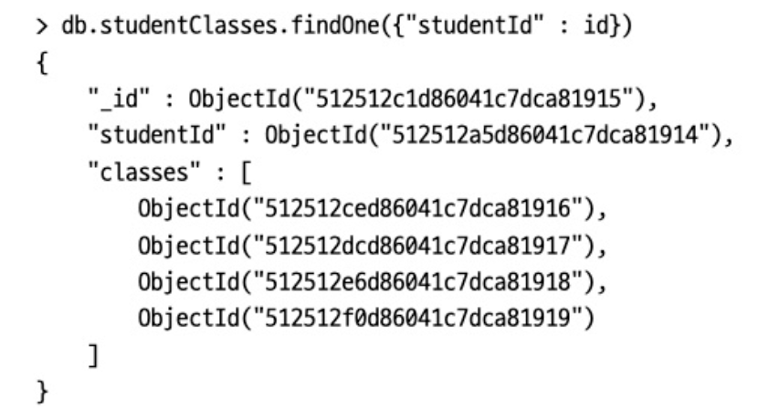
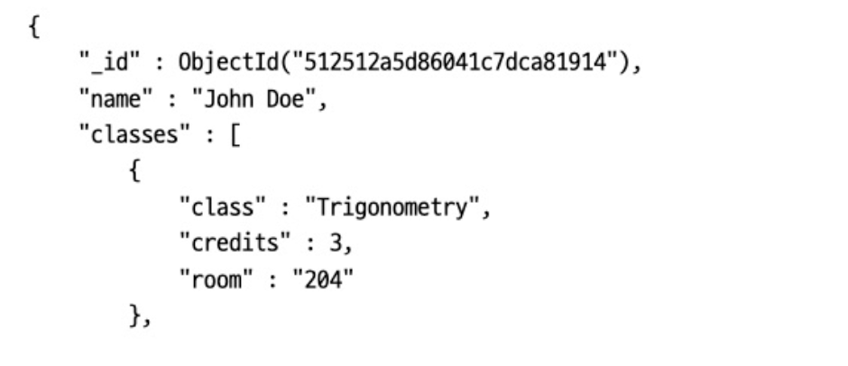
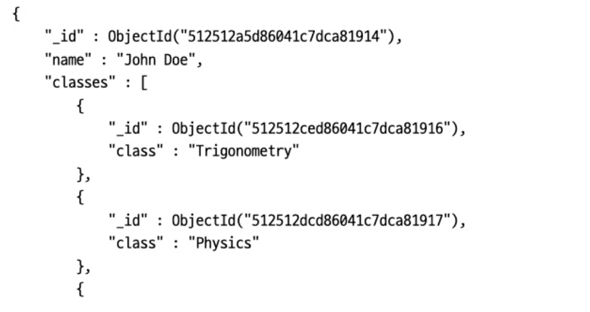
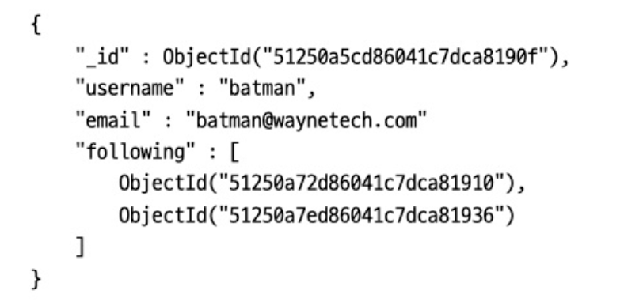
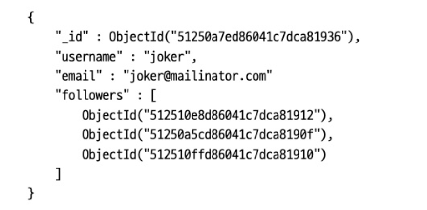
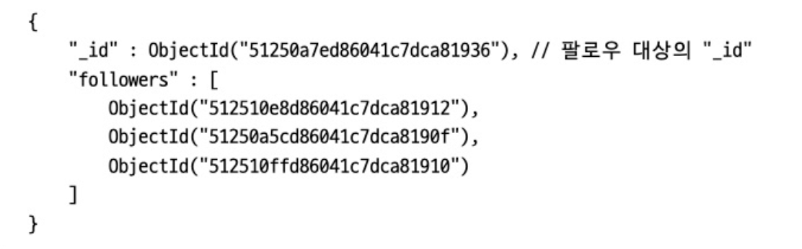
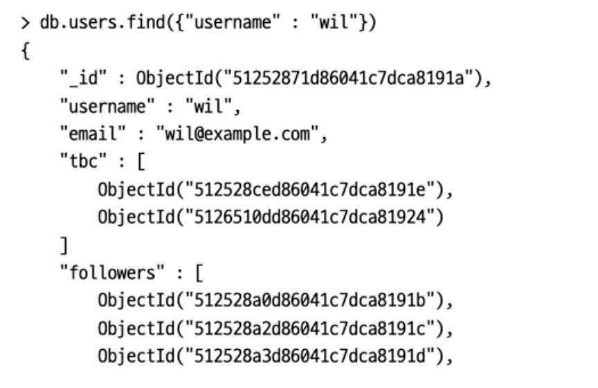
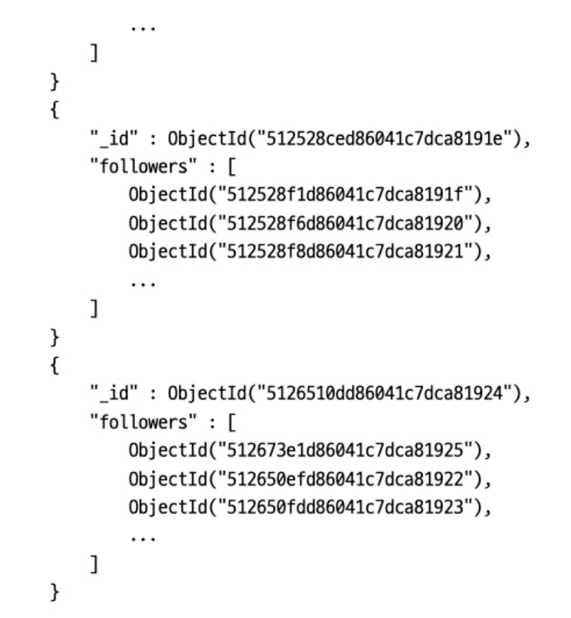

# 09. 애플리케이션 설계

애플리케이션을 몽고DB와 효율적으로 작동하도록 설계하는 방법을 다룬다.

* 스키마 설계 고려 사항
* 데이터 내장 방식과 참조 방식 중 결정하기
* 최적화를 위한 팁
* 일관성 고려 사항
* 스키마 마이그레이션 방법
* 스키마 관리 방법
* 몽고DB가 데이터 스토리지로 적합하지 않은 경우


## 9.1 스키마 설계 고려 사항

데이터 표현의 핵심 요소는 데이터가 도큐먼트에서 표현되는 방식인 스키마의 설계다. 가장 좋은 설계 접근 방식은 애플리케이션에서 원하는 방식으로 데이터를 표현하는 방법이다. 따라서 관계형 데이터베이스와 달리, 스키마를 모델링 하기 전에 먼저 쿼리 및 데이터 접근 패턴을 이해해야 한다.

다음은 스키마를 설계할 때 고려할 주요 요소다.

#### 제약 사항

데이터베이스와 하드웨어 제약 사항을 이해해야 한다. 또한 몽고DB의 특정 측면도 고려해야 한다. 도큐먼트의 최대 크기는 16메가바이트이며, 디스크에서 전체 도큐먼트를 읽고 쓴다. 갱신은 전체 도큐먼트를 다시 쓰며, 원자성 갱신은 도큐먼트 단위로 실행된다.

#### 쿼리 및 쓰기의 접근 패턴

애플리케이션 및 더 넓은 시스템의 워크로드를 식별하고 정량화해야 한다. 워크로드는 애플리케이션의 읽기와 쓰기를 모두 포함한다. 쿼리가 실행되는 시기와 빈도를 알면 가장 일반적인 쿼리를 식별할 수 있다. 이는 스키마를 설계하는 데 필요한 쿼리다. 쿼리를 식별한 후에는 쿼리 수를 최소화하고, 함께 쿼리되는 데이터가 동일한 도큐먼트에 저장되도록 설계를 확인해야 한다.

이러한 쿼리에 사용되지 않는 데이터는 다른 컬렉션에 넣어야 한다. 자주 사용하지 않는 데이터도 다른 컬렉션으로 이동하자. 

#### 관계 유형

애플리케이션 요구 사항 측면과 도큐먼트 간 관계 측면에서 어떤 데이터가 관련돼 있는지 고려해야 한다. 그런 다음 데이터나 도큐먼트를 내장하거나 참조할 방법을 결정한다. 추가로 쿼리하지 않고 도큐먼트를 참조하는 방법을 파악해야 하며, 관계가 변경될 때 갱신되는 도큐먼트 개수를 알아야 한다. 

#### 카디널리티

도큐먼트와 데이터가 어떻게 관련돼 있는지 확인한 후에는 관계의 카디널리티를 고려해야한다. 몽고DB 스키마에서 모델링에 최선의 형식을 사용하도록 관계의 카디널리티를 설정하는 것이 매우 중요하다. 또한 수백만 측면의 개체가 개별적으로 접근되는지 혹은 상위 개체의 컨텍스트에서만 접근되는지 고려해야 하며, 해당 데이터 필드에 대한 읽기 갱신 비율도 고려해야 한다. 이러한 문제에 대한 답은 도큐먼트 간에 데이터를 비정규화해야 하는지 여부와, 도큐먼트를 내장할지 혹은 참조할지 결정하는 데 도움이 된다.


### 9.1.1 스키마 설계 패턴

#### 다형성 패턴

컬렉션 내 모든 도큐먼트가 유사하지만 동일하지 않은 구조를 가질 때 적합하다. 도큐먼트나 서브도큐먼트의 특정 필드를 추적하면, 이러한 차이점을 관리하기 위해 애플리케이션에서 코딩할 수 있는 데이터와 다른 코드 경로 또는 클래스/서브클래스 간의 차이점을 식별하는 데 도움이 된다. 이를 통해 동일하지 않은 도큐먼트로 구성된 단일 컬렉션에서 간단한 쿼리를 사용해 쿼리 성능을 향상시킬 수 있다.

#### 속성 패턴

정렬하거나 쿼리하려는 도큐먼트에 필드의 서브셋이 있는 경우, 정렬하려는 필드가 도큐먼트의 서브셋에만 존재하는 경우 또는 두 조건이 모두 해당되는 경우에 적합하다. 여기에는 데이터를 키/값 쌍의 배열로 재구성하고 배열 요소에 인덱스를 만드는 작업이 포함된다. 이러한 키/값 쌍에 한정자를 부가 필드로 추가할 수 있다. 이 패턴은 도큐먼트 당 많은 유사한 필드를 대상으로 지정하기 때문에 필요한 인덱스가 적어지고 쿼리 작성이 더 간단해진다.

#### 버킷 패턴

데이터가 일정 기간 동안 스트림으로 유입되는 시계열 데이터에 적합하다. 이 데이터를 특정 시간 범위의 데이터를 각각 보유하는 도큐먼트 셋으로 버킷화하면 시간/데이터 포인트의 포인트당 도큐먼트를 만들 때보다 훨씬 효율적이다. 예를 들어 1시간 버킷을 사용해 해당 시간 동안의 모든 판독 값을 단일 도큐먼트 내 배열에 배치할 수 있다. 도큐먼트 자체에는 이 버킷이 다루는 기간을 나타내는 시작 및 종료 시간이 있다.

#### 이상치 패턴

드물게 도큐먼트의 쿼리가 애플리케이션의 정상적인 패턴을 벗어날 때 사용한다. 인기도가 중요한 상황을 위해 설계된 고급 스키마 패턴으로, 주요 영향 요인, 도서 판매, 영화 리뷰 등이 있는 소셜 네트워크에서 볼 수 있다. 플래그를 사용해 도큐먼트가 이상점임을 나타내며 추가 오버플로를 하나 이상의 도큐먼트에 저장한다. 플래그는 애플리케이션 코드에서 오버플로 도큐먼트를 검색하기 위한 추가 쿼리를 만드는 데 사용된다.

아래 예시의 도큐먼트는 customers_purchased가 너무 많아  has_extras 플래그가 true일 경우 이상이라 판단하여 애플리케이션에서 오버플로 도큐먼트를 검색하도록 한다.

``` javascript
{
    "_id": ObjectID("507f191e810c19729de860ea"),
    "title": "Harry Potter, the Next Chapter",
    "author": "J.K. Rowling",
    …,
   "customers_purchased": ["user00", "user01", "user02", …, "user999"],
   "has_extras": "true"
}
```

#### 계산된 패턴

데이터를 자주 계산해야 할 때나 데이터 접근 패턴이 읽기 집약적일 때 사용한다. 주요 도큐먼트가 주기적으로 갱신되는 백그라운드에서 계산을 수행하도록 권장한다. 이는 개별 쿼리에 대해 필드나 도큐먼트를 지속적으로 생성하지 않고도 계산된 필드 및 도큐먼트의 유효한 근사치를 제공한다. 읽기가 계산을 트리거하고 읽기-쓰기 비율이 높은 경우에 특히 동일한 계산의 반복을 방지함으로써 CPU에 가해지는 부담을 크게 줄일 수 있다.

#### 서브셋 패턴

장비의 램 용량을 초과하는 작업 셋이 있을 때 사용한다. 이는 애플리케이션에서 사용하지 않는 정보를 많이 포함하는 대용량 도큐먼트 때문에 발생할 수 있다. 서브셋 패턴은 자주 사용하는 데이터와 자주 사용하지 않는 데이터를 두 개의 개별 컬렉션으로 분할하도록 한다. 예를 들어 자주 접근하는 가장 최근 리뷰 10개를 컬렉션에 저장하고 나머지 리뷰는 다른 컬렉션에 저장한다.

#### 확장된 참조 패턴

각각 고유한 컬렉션이 있는 여러 논리 엔티티 또는 사물이 있고 특정 기능을 위해 엔티티들을 모을 때 사용한다. 일반적인 전자상거래 스키마에는 주문, 고객, 재고에 대한 별도의 컬렉션이 있을 수 있다. 그런데 개별 컬렉션에서 단일 주문에 대한 정보를 모두 수집하면 성능에 부정적인 영향을 미칠 수 있다. 이 때 자주 접근하는 필드를 식별하고 주문 도큐먼트로 복제하면 문제를 해결할 수 있다. 전자상거래 주문의 경우 자주 접근하는 필드는 상품을 보낼 고객의 이름과 주소가 된다. 확장된 참조 패턴은 데이터를 중복시키는 중복시키는 대신 정보를 조합하는 데 필요한 쿼리 수를 줄인다.

#### 근사 패턴

리소스가 많이 드는 계산이 필요하지만 높은 정확도가 반드시 필요하지 않은 상황에 유용하다. 이미지나 게시글의 추천 수 카운터 또는 페이지 조회 수 카운터를 예로 들 수 있다. 근사 패턴을 적용해 추천이나 조회 수가 1회가 아니라 100회가 될 때마다 카운터를 갱신하면 쓰기 횟수를 크게 줄일 수 있다.

#### 트리 패턴

쿼리가 많고 구조적으로 주로 계층적인 데이터가 있을 때 적용한다. 일반적으로 함께 쿼리되는 데이터를 한데 저장하는 방식을 따른다. 몽고DB에서는 동일한 도큐먼트 내 배열에 계층구조를 쉽게 저장할 수 있다. 제품 카탈로그에는 여러 범주에 속하거나 다른 범주의 하위 범주에 속하는 제품이 많다. 하드 드라이브는 그 자체가 범주이지만 기억장치 범주에 속하며 전자제품 범주의 하위 범주인 컴퓨터 부품 범주에 속한다. 이러한 경우 전체 계층구조를 추적하는 필드와 즉각적인 범주(하드 드라이브)를 포함하는 필드가 있다. 전체 계층구조 필드는 배열에 보관돼 해당 값에 다중키 인덱스를 사용하는 기능을 제공한다. 따라서 계층구조의 범주와 관련된 모든 항목을 쉽게 찾을 수 있다. 즉각적인 범주 필드를 사용하면 해당 범주와 직접 관련된 모든 항목을 찾을 수 있다.

#### 사전 할당 패턴

이 패턴은 빈 구조를 사전 할당한다. 예를 들어 예약 정보를 매일 관리하는 시스템에서 예약 가능 여부와 현재 예약 상태를 추적하는 데 적용된다. 리소스와 날짜의 2차원 구조를 사용해 쉽게 가용성을 확인하고 계산할 수 있다.

#### 도큐먼트 버전 관리 패턴

도큐먼트의 이전 버전을 유지하는 메커니즘을 제공한다. 메인 컬렉션의 도큐먼트 버전을 추적하려면 각 도큐먼트에 부가 필드를 추가해야 하며 도큐먼트의 모든 수정 사항을 포함하는 추가 컬렉션이 필요하다.


## 9.2 정규화 vs 비정규화

정규화는 컬렉션 간의 참조를 이용해 데이터를 여러 컬렉션으로 나누는 작업이다. 

비정규화는 모든 데이터를 하나의 도큐먼트에 내장하는 것으로, 정규화의 반대다.

일반적으로 정규화는 쓰기를 빠르게 만들고 비정규화는 읽기를 빠르게 만든다.


### 9.2.1 데이터 표현 예제

학생과 학생이 수강 중인 과목에 대한 정보를 저장한다고 하자.

방법 1은 아래와 같다.



학생이 수강하는 과목을 찾는다고 하면 students 컬렉션에서 학생을 쿼리하고, studentClasses 컬렉션에서 과목을 "_id"를 쿼리하고, classes 컬렉션에서 과목 정보를 쿼리한다.


방법 2는 아래와 같다.



데이터를 완전히 비정규화하면 하나의 쿼리로 모든 정보를 가져오게 할 수 있다. 하지만 더 많은 공간을 차지하고 동기화하기 어렵다. 예를 들어 물리학을 3학점에서 4학점으로 변경하기 위해서는 물리학을 수강하는 모든 학생의 도큐먼트를 갱신해야한다.


방법 3은 아래와 같다.



내장과 참조가 혼합된 확장 참조 패턴을 사용한다. 자주 사용하는 정보로 서브도큐먼트의 배열을 생성하고, 추가적인 정보는 실제 도큐먼트를 참조하는 방식이다.

정보가 읽히는 빈도에 비해 얼마나 자주 변경되는지도 중요하게 고려해야 한다. 정보가 정기적으로 갱신돼야 한다면 정규화하는 것이 좋다.

갱신 연산자 측면에서 $set은 멱등이지만 $inc는 그렇지 않다. 멱등 연산은 한 번 시도하든 여러 번 시도하든 동일한 결과를 나타낸다. 멱등이 아닌 연산자의 경우 작업을 두 개로, 즉 개별적으로 멱등이며 재시도해도 안전한 작업으로 분리해야 한다. 첫 번째 작업에 고유한 보류 토큰(pending token)을 포함하고, 두 번째 작업에서 고유한 키와 고유한 보류  토큰을 모두 사용하게 하면 된다. 


#### 내장 방식과 참조 방식 비교

| 내장 방식이 좋은 이유                         | 참조 방식이 좋은 이유         |
| --------------------------------------------- | ----------------------------- |
| 작은 서브도큐먼트                             | 큰 서브도큐먼트               |
| 주기적으로 변하지 않는 데이터                 | 자주 변하는 데이터            |
| 결과적인 일관성이 허용될 때                   | 즉각적인 일관성이 필요할 때   |
| 증가량이 적은 도큐먼트                        | 증가량이 많은 도큐먼트        |
| 두 번째 쿼리를 수행하는 데 자주 필요한 데이터 | 결과에서 자주 제외되는 데이터 |
| 빠른 읽기                                     | 빠른 쓰기                     |


### 9.2.2 카디널리티

카디널리티는 컬렉션이 다른 컬렉션을 얼마나 참조하는지 나타내는 개념이다. 일반적인 관계는 일대일, 일대다 혹은 다대다다.

몽고DB를 사용할 때는 다수라는 개념을 많음과 적음이라는 하위 범주로 나누면 개념상 도움이 된다. 예를 들어 각 작성자가 게시물을 조금만 작성하면 작성자와 게시물은 일대소 관계다. 태크보다 게시물이 더 많으면 블로그 게시물과 태그는 다대소 관계다. 

많고 적음의 관계를 결정하면 무엇을 내장할지 결정하는 데 도움이 된다. 일반적으로 적음 관계는 내장이 적합하고 많음 관계는 참조가 더 적합하다.


### 9.2.3 친구, 팔로워 그리고 불편한 관계

소셜 그래프 데이터에 대한 고려 사항을 다룬다. 많은 애플리케이션에서는 사람, 내용, 팔로워, 친구 등을 연결한다. 이렇게 긴밀하게 연결된 정보를 내장할지 혹은 참조할지 적절히 결정하는 방법은 파악하기 까다로울 수 있다. 일반적으로 팔로우하고, 친구 맺고, 찜하는 동작은, 한 사용자가 다른 사람의 알림을 구독하는 발행-구독 시스템으로 단순화 할 수 있다. 따라서 구독자를 저장하는 작업과 이벤트와 관련된 모든 사람에게 알림을 보내는 작업은 능률적이어야 한다.

구독을 구현하는 전형적인 방법은 세 가지가 있다. 첫 번째 방법은 producer를 subscriber의 도큐먼트에 넣는 방법이다.



이 경우 다음처럼 쿼리해서 사용자가 관심 가질 수 있는 활동을 모두 찾을 수 있다.

```javascript
db.activities.find({"user": {"$in": user["following"]}})
```


새로 게시된 활동에 관심 있는 사람을 모두 찾으려면 모든 사용자에 걸쳐 "following" 필드를 쿼리해야 한다. 그 대신 다음처럼 게시자 도큐먼트에 팔로워를 추가할 수 있다.



이 사용자는 뭔가를 할 때마다 알림 보내야 할 모든 사용자를 바로 알 수 있다. 하지만 팔로우하는 사람을 모두 찾으려면 users 컬렉션 전체를 쿼리해야 한다는 단점이 있다.

두 방법 모두 추가적인 단점이 따르는데, 사용자 도큐먼트를 더욱 크고 자주 바꾸도록 만든다. following이나 followers 필드는 반환될 필요가 없을 때가 많다. 


따라서 좀 더 정규화하고 구독을 다른 컬렉션에 저장함으로써 이러한 단점을 완화한다. 이렇게까지 정규화하면 지나칠 때가 많지만, 자주 반환되지 않으면서 매우 자주 변하는 필드에 유용하다. "followers"는 이런 방버으로 정규화하는 데 적합한 필드다.




#### 유명인 사용자로 인한 영향에 대처하기

어떤 전략을 사용하든 내장이 작동하는 서브도큐먼트와 참조의 수는 제한된다. 유명인 사용자의 팔로워를 저장하는 도큐먼트는 넘칠 수 있다. 이 경우 이상치 패턴을 사용하고 필요하다면 연속 도큐먼트를 사용해 해결할 수 있다.






## 9.3 데이터 조작을 위한 최적화

애플리케이션을 최적화하려면 읽기와 쓰기 성능을 분석해 어느 것이 병목 현상을 일으키는지 우선적으로 알아야 한다. 읽기 최적화는 일반적으로 올바른 인덱스를 사용해 하나의 도큐먼트에서 가능한 한 많은 정보를 반환하는 것과 관련 있다. 쓰기 최적화는 보통 갖고 있는 인덱스 개수를 최소화하고 갱신을 가능한 한 효율적으로 수행하는 것과 관련 있다.

빠른 쓰기에 최적화된 스키마와 빠른 읽기에 최적화된 스키마 사이에는 종종 트레이드오프가 존재하므로, 어느 것이 애플리케이션에 더 중요한지 결정해야 한다.


### 9.3.1 오래된 데이터 제거

오래된 데이터를 제거하는 데는 일반적으로 세 가지 방법을 사용한다. 

* 제한 컬렉션
* TTL 컬렉션
* 주기마다 컬렉션 삭제


제한 컬렉션을 사용하는 방법이 가장 쉽다. 제한 컬렉션 크기를 크게 설정하고 오래된 데이터가 끝으로 밀려나게 하면 된다. 그러나 제한 컬렉션을 사용하면 사용자의 작업에 어느 정도 제약이 생기며 컬렉션이 유지되는 시간을 일시적으로 줄이기 떄문에 급격히 증가하는 트래픽에 취약하다.

TTL 컬렉션을 사용하면 도큐먼트가 제거될 때 미세하게 조절할 수 있다. 그러나 쓰기를 많이 수행하는 컬렉션에 사용하기에는 충분히 빠르지 않다. 이는 사용자 요청 제거와 같은 방식으로 TTL 인덱스를 탐색해 도큐먼트를 제거한다. 그럼에도 TTL 컬렉션이 속도를 따라갈 수 있다면 아마 가장 쉬운 방법일 수 있다.

마지막은 여러 개의 컬렉션을 사용하는 방법이다. 예를 들어 한 달에 하나의 컬렉션을 사용할 수 있다. 달이 바뀔때마다 애플리케이션은 달 컬렉션을 사용하고, 현재와 이전 달의 컬렉션에서 데이터를 찾기 시작한다. 이 방법을 사용하면 어떠한 양의 트래픽에도 대부분 버틸 수 있지만, 동적 컬렉션 이름을 사용해 여러 데이터베이스를 조회하므로 애플리케이션 구축이 좀 더 복잡하다.


## 9.4 데이터베이스와 컬렉션 구상

도큐먼트 형태를 구상하고 나면 어떤 컬렉션 또는 데이터베이스에 넣을지 결정해야 한다. 이 과정은 상당히 직관적일 때가 많지만 몇 가지 지침을 염두에 둬야 한다.

일반적으로 스키마가 유사한 도큐먼트는 같은 컬렉션에 보관해야 한다. 몽고DB는 보통 서로 다른 컬렉션에 있는 데이터의 결합을 허용하지 않는다. 따라서 함께 쿼리하거나 집계해야 하는 도큐먼트는 하나의 큰 컬렉션에 넣는 것이 좋다.

컬렉션에서는 락과 저장을 중요하게 고려해야 한다. 일반적으로 쓰기 워크로드가 높다면 여러 물리적 볼륨을 사용해 병목 현상을 줄일 수 있다. --directoryperdb 옵션을 사용하면 데이터베이스는 각자의 디렉터리에 있으므로 서로 다른 데이터베이스를 서로 다른 볼륨에 마운트 할 수 있다. 그러므로 데이터베이스 내 모든 항목이 비슷한 품질, 비슷한 접근 패턴, 비슷한 트래픽 수준을 갖는 것이 좋다.

예를 들어 애플리케이션에 몇 가지 구성 요소, 즉 그리 중요하지 않은 데이터를 매우 많이 생성하는 로깅 컴포넌트, 사용자 컬렉션, 사용자가 생성한 데이터를 위한 몇몇 컬렉션이 있다고 하자. 사용자 데이터는 안전해야 하므로 이 컬렉션들은 중요하다. 또한 소셜 활동을 위한 컬렉션은 중요도가 다소 떨어지지만 로그보다는 중요하다. 주요 사용자 알림에 사용되므로 거의 추가 전용 컬렉션이다.

구성 요소를 중요도에 따라 세 개의 데이터베이스(log, activities, users)로 나눌 수 있다. 이렇게 세 개로 분리하면 가장 중요한 데이터가 가장 적은 데이터라는 장점이 있다. 전체 데이터셋을 위해 SSD를 사용할 여유가 없을 수도 있지만 하나 정도 마련해 사용자에 사용하거나, RAID10은 사용자에, RAID0은 로그와 활동에 사용하자.


## 9.5 일관성 관리

애플리케이션의 읽기에 필요한 일관성이 어느 정도인지 파악해야 한다. 몽고DB는 직접 쓴 데이터를 읽는 것부터 알려지지 않은 오래된 데이터를 읽는 것까지, 상당히 다양한 수준의 일관성을 제공한다. 

이러한 다양한 수준의 일관성을 얻는 방법을 이해하려면 몽고DB가 내부에서 무엇을 수행하는지 이해해야 한다. 서버는 각 연결에 대한 요청 큐를 보관한다. 클라이언트가 요청을 보내면 요청은 연결 큐의 가장 마지막에 위치하게 된다. 이후의 요청은 이전에 큐에 추가된 작업이 진행된 후에 발생한다. 따라서 각 연결은 데이터베이스에 대해 일관적인 관점을 가지며 자신의 쓰기를 항상 읽을 수 있다.

지금까지 큐는 하나의 연결에 대한 큐였다. 셸을 두 개 열면 데이터베이스에 대한 연결이 두 개가 된다. 하나의 셸에서 삽입을 수행하면 이후에 다른 셸에서 발생하는 쿼리는 삽입된 도큐먼트를 반환하지 못한다. 그러나 단일 셸에서 삽입 작업 후에 쿼리하면 삽입된 도큐먼트가 반환된다. 이 동작은 손으로 복제하기 어려울 수 있지만 분주한 서버에서는 교차 삽입과 쿼리가 발생할 수 있다. 이러한 현상은 한 스레드에서 데이터를 삽입한 후 다른 스레드에서 해당 삽입의 성공 여부를 확인할 때 일어난다. 잠시 동안은 데이터가 삽입되지 않은 것처럼 보였다가 갑자기 데이터가 나타난다.

이러한 동작은 루비, 파이썬, 자바 드라이버를 사용할 때 염두에 둘 만한데, 세 언어 모두 커넥션 풀링을 사용하기 때문이다. 드라이버는 효율성을 위해 서버에 대한 여러 연결(풀)을 열고 요청을 분산한다. 하지만 세 드라이버 모두 일련의 요청이 하나의 연결에 의해 처리되도록 보장하는 메커니즘을 가진다. 

읽기 요청을 복제 셋의 세컨더리로 보낼 때 이는 큰 문제가 될 수 있다. 세컨더리는 과거의 데이터를 읽으므로 프라이머리에 뒤처질 수 있다. 해결 방법은 여러 가지가 있으며, 데이터가 오래돼 쓸 수 없게 될까 걱정된다면 모든 읽기 요청을 프라이머리에 보냄으로써 쉽게 해결할 수 있다.

몽고DB는 읽을 데이터의 일관성과 격리 속성을 제어하는 readConcern 옵션을 제공한다. writeConcern과 결합하면 애플리케이션에 대한 일관성과 가용성 보장을 제어할 수 있다. local, available, majority, linearizable, snapshot 이라는 5개의 수준이 있다. 애플리케이션에 따라 읽기 부실을 방지하려면 majority를 사용한다. majority는 대부분의 복제 셋 멤버에서 확인된 내구성 있는 데이터만 반환하며 롤백되지 않는다. linearizable는 읽기 작업을 시작하기 전에 완료된 (다수 승인된) 쓰기를 모두 반영하는 데이터를 반환한다. 몽고DB는 linearizable readConcern으로 결과를 반환하기 전에 동시 실행되는 쓰기가 완료될 때까지 기다린다.


## 9.6 스키마 마이그레이션

애플리케이션의 규모가 커지고 요구 사항이 변할수록 스키마 또한 커지고 변화해야 한다. 이상적으로는 도큐먼트 버전 관리 패턴을 적용할 수 있지는지 고려해야 한다.

가장 간단한 방법은 스키마를 애플리케이션의 요구에 맞춰 변화시키는 방법이다. 이 때 애플리케이션이 구 버전 스키마를 모두 지원하는지 확인한다. 하지만 이 기법을 사용하면 코드가 복잡해질 수 있는데 예를 들어 스키마 버전이 서로 충돌하는 경우 매우 지저분해진다.

변화하는 요구 사항을 더 구조화된 방식으로 처리할 수 있다. 각 도큐먼트에 version 필드를 추가해 애플리케이션이 도큐먼트 구조를 위해 무엇을 받아들일지 판단하는 데 사용한다. 이렇게 하면 스키마를 더욱 엄격하게 적용하게 된다. 만약 도큐먼트가 현재 버전이 아니라면 스키마의 다른 버전에서 유효해야 한다. 그러가 여전히 구 버전에 대한 지원이 필요하다.

마지막으로 스키마가 변경될 때 모든 데이터를 마이그레이션하는 방법이 있다. 하지만 일반적으로 이 방법은 바람직하지 않다. 몽고DB는 시스템에 많은 부하를 주는 마이그레이션을 피하기 위해 동적 스키마를 갖도록 허용한다. 그러나 모든 도큐먼트를 바꾸기로 결심하면 모든 도큐먼트가 성공적으로 갱신됐는지 확인해야 한다. 몽고DB는 이러한 마이그레이션을 지원하는 트랜잭션을 지원한다. 


## 9.7 스키마 관리

몽고DB 버전 3.2에서 스키마 유효성 검사를 도입해 갱신 및 삽입 중에 유효성 검사를 허용한다. 버전 3.6에는 $jsonSchema 연산자를 사용하는 JSON 스키마 유효성 검사가 추가됐으며, 이 방법은 이제 몽고DB의 모든 스키마 유효성 검사에 권장된다. 

유효성 검사는 기존 도큐먼트가 수정되기 전에는 확인하지 않으며 컬렉션별로 구성된다. 기존 컬렉션에 유효성 검사를 추가하려면 validator 옵션과 함께 collMod 명령을 사용한다. 새 컬렉션에 유효성 검사를 추가하려면 db.createCollection()을 사용할 때 validator 옵션을 지정한다. 또한 몽고DB는 validationLevel, validationAction이라는 두 개의 추가 옵션을 제공한다. validationLevel은 기존 도큐먼트 갱신 중에 유효성 검사 규칙을 얼마나 엄격하게 적용할지 결정한다. validationAction은 불법 도큐먼트를 오류와 함께 거절할지 혹은 경고와 함께 허용할지 결정한다.


## 9.8 몽고DB를 사용하지 않는 경우

* 다양한 유형의 데이터를 여러 차원에 걸쳐 조인하는 작업은 RDB에 적합하다. 몽고DB는 이러한 작업을 잘 처리하지 못하며 거의 다룰 일이 없다.
* 몽고DB보다 관계형 데이터베이스를 사용하는 가장 큰 이유는 몽고DB를 지원하지 않는 도구를 사용할 수 있기 때문이다. SQL Alchemy에서 워드프레스까지, 몽고DB를 지원하지 않는 도구는 수천 개가 있다. 지원하는 도구가 늘고 있긴 하지만 아직 관계형 데이터베이스 생태계를 따라가지 못한다.


