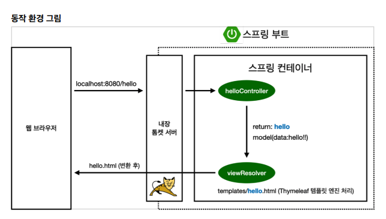

# 1.3 view 환경설정

## welcome page 만들기

아래 경로에 index.html 이라는 이름으로 파일을 만들어주면 welcome page로서 기능을 한다.

/hello-spring/src/main/resources/static/index.html

```
<!DOCTYPE HTML>
<html>
<head>
    <title>Hello</title>
    <meta http-equiv="Content-Type" content="text/html; charset=UTF-8" />
</head>
<body>
Hello
<a href="/hello">hello</a>
</body>
</html>
```


## thymeleaf



컨트롤러에서 리턴 값으로 문자를 반환하면 뷰 리졸버( viewResolver )가 화면을 찾아서 처리한다. 

스프링 부트 템플릿엔진 기본 viewName 매핑 `resources/templates/ +{ViewName}+ .html`

```java
package hello.hellospring.controller;

import org.springframework.stereotype.Controller;
import org.springframework.ui.Model;
import org.springframework.web.bind.annotation.GetMapping;

@Controller
public class HelloController {
    @GetMapping("hello")
    public String hello(Model model){
        model.addAttribute("data", "hello!");
        return "hello";
    }
}
```


spring-boot-devtools 라이브러리를 추가하면 html 파일을 컴파일만 할 시 서버 재시작 없이 View 파일을 변경 가능하다.

build -> Recompile
