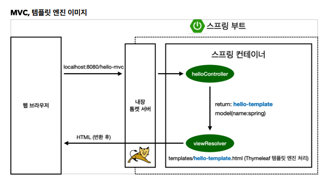

# 2.2 MVC와 템플릿 엔진

### Controller

```java
package hello.hellospring.controller;

import org.springframework.stereotype.Controller;
import org.springframework.ui.Model;
import org.springframework.web.bind.annotation.GetMapping;
import org.springframework.web.bind.annotation.RequestParam;

@Controller
public class HelloController {
    @GetMapping("hello-mvc")
    public String helloMvc(@RequestParam("name") String name, Model model) {
        model.addAttribute("name", name);
        return "hello-template";
    }
}

```


### View

```html
<html xmlns:th="http://www.thymeleaf.org">
<body>
<p th:text="'hello ' + ${name}">hello! empty</p>
</body>
</html>
```


http://localhost:8080/hello-mvc?name=spring 으로 접속 시 name으로 spring 값이 넘어간다.



