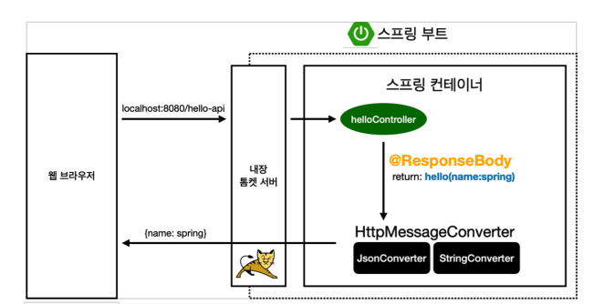

# 2.3 API

### 문자열 반환

```java
package hello.hellospring.controller;

import org.springframework.stereotype.Controller;
import org.springframework.ui.Model;
import org.springframework.web.bind.annotation.GetMapping;
import org.springframework.web.bind.annotation.RequestParam;
import org.springframework.web.bind.annotation.ResponseBody;

@Controller
public class HelloController {
    @GetMapping("hello-string")
    @ResponseBody
    public String helloString(@RequestParam("name") String name) {
        return "hello " + name;
    }
}
```

* @ResponseBody : response body에 return 값을 직접 넣어주겠다는 의미이다


이 결과 hello-string/으로 접근 시 문자열이 반환된다.


### Json 반환

``` java
@GetMapping("hello-api")
@ResponseBody
public Hello helloApi(@RequestParam("name") String name) {
  Hello hello = new Hello();
  hello.setName(name);
  return hello;
}

static class Hello {
  private String name;

  public String getName() {
    return name;
  }

  public void setName(String name) {
    this.name = name;
  }
}
```

객체를 만들어서 반환하면 json으로 serializing 해준다.




@ResponseBody를 사용했기 때문에 viewResolver 대신 HttpMessageConverter가 동작한다.
