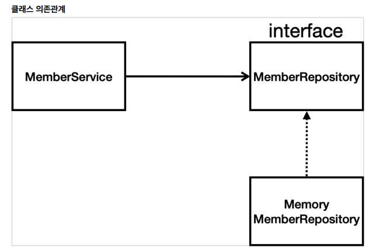

# 3.1 비즈니스 요구사항 정리

* 데이터: 회원ID, 이름 
* 기능: 회원 등록, 조회 
* 아직 데이터 저장소가 선정되지 않음(가상의 시나리오)

* 아직 데이터 저장소가 선정되지 않아서, 우선 인터페이스로 구현 클래스를 변경할 수 있도록 설계 
* 데이터 저장소는 RDB, NoSQL 등등 다양한 저장소를 고민중인 상황으로 가정 
* 개발을 진행하기 위해서 초기 개발 단계에서는 구현체로 가벼운 메모리 기반의 데이터 저장소 사용
