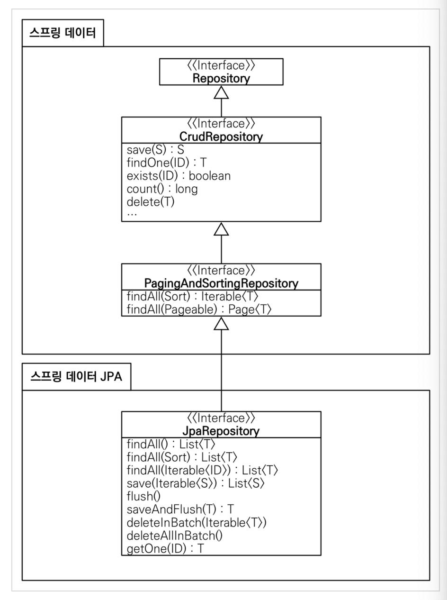

# 6.6 스프링 데이터 JPA

스프링 데이터 JPA를 사용하면 리포지토리에 구현 클래스 없이 인터페이스 만으로 개발을 완료할 수 있습니다.

기본 CRUD 기능도 스프링 데이터 JPA가 모두 제공합니다.


### 스프링 데이터 JPA 회원 리포지토리

hello-spring/src/main/java/hello/hellospring/repository/SpringDataJpaMemberRepository.java

```java
package hello.hellospring.repository;

import hello.hellospring.domain.Member;
import org.springframework.data.jpa.repository.JpaRepository;

import java.util.Optional;

public interface SpringDataJpaMemberRepository extends JpaRepository<Member, Long>, MemberRepository {
    Optional<Member> findByName(String name);
}
```

* `findBy{field}`를 통해 field를 select 할 수 있다.


### 스프링 설정 변경

```java
package hello.hellospring;

import hello.hellospring.domain.Member;
import hello.hellospring.repository.*;
import hello.hellospring.service.MemberService;
import org.springframework.context.annotation.Bean;
import org.springframework.context.annotation.Configuration;

import javax.persistence.EntityManager;
import javax.sql.DataSource;

@Configuration
public class SpringConfig {

    private final MemberRepository memberRepository;

    public SpringConfig(MemberRepository memberRepository) {
        this.memberRepository = memberRepository;
    }

    @Bean
    public MemberService memberService() {
        return new MemberService(memberRepository);
    }
}
```

* 스프링 데이터 JPA가 `SpringDataJpaMemberRepository`를 스프링 빈으로 자동 등록해준다.


### 스프링 데이터 JPA 제공 클래스



* 기본적인 CURD 제공
* findByName(), findByEmail() 처럼 메서드 이름 만으로 조회 기능 제공

