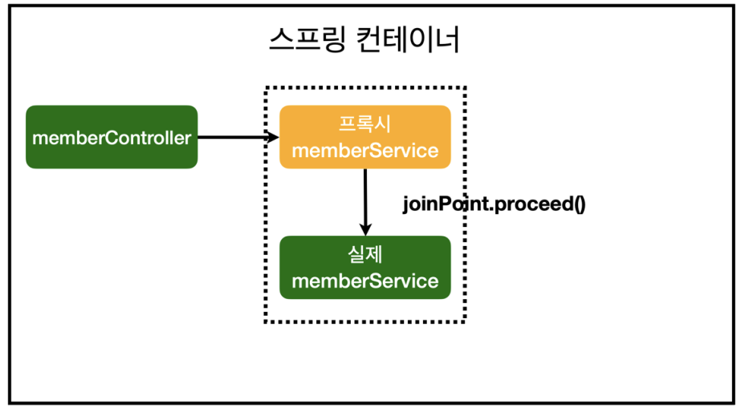

# 7.2 AOP 적용

AOP는 Aspect Oriented Programming의 약자로 관점 지향 프로그래밍이라고 한다.

공통 관심 사항과 핵심 관심 사항을 분리하는 것을 말한다.


시간 측정같은 공통 관심을 비즈니스 로직과 같은 핵심 관심 사항과 분리한다.


### 시간 측정 AOP 등록

```java
package hello.hellospring.aop;

import org.aspectj.lang.ProceedingJoinPoint;
import org.aspectj.lang.annotation.Around;
import org.aspectj.lang.annotation.Aspect;
import org.springframework.stereotype.Component;

@Component
@Aspect
public class TimeTraceAop {

    @Around("execution(* hello.hellospring..*(..))")
    public Object execute(ProceedingJoinPoint joinPoint) throws Throwable {
        long start = System.currentTimeMillis();

        System.out.println("START: " + joinPoint.toString());

        try {
            return joinPoint.proceed();
        } finally {
            long finish = System.currentTimeMillis();
            long timeMs = finish - start;

            System.out.println("END: " + joinPoint.toString() + " " + timeMs + "ms");
        }
    }
}
```

* @Component : 스프링 빈으로 등록을 해야한다. 
* @Aspect : AOP로 등록하기 위해서는 해당 애노테이션이 필요하다.
* @Around : hello.hellospring 하위의 모든 메서드, 모든 파리미터에 대해 AOP를 적용한다.


### AOP 적용 후 의존관계



위와 같이 프록시가 생성되어 실행되고 그 내부에서 joinPoint.proceed()가 실행될 때 실제 빈을 실행한다.

프록시인지 확인을 해보자.

```java
    @Autowired
    public MemberController(MemberService memberService) {
        this.memberService = memberService;
        System.out.println("memberService.getClass() = " + memberService.getClass());
        // memberService.getClass() = class 		         hello.hellospring.service.MemberService$$EnhancerBySpringCGLIB$$f1244070
    }

```


