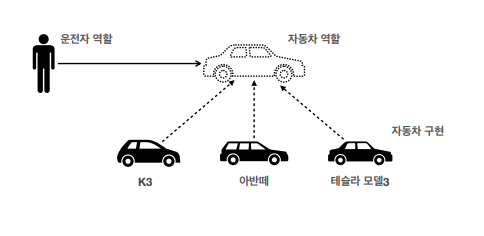
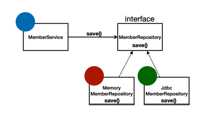

# 03. 좋은 객체 지향 프로그래밍이란?

### 객체 지향 특징

* 추상화
* 캡슐화
* 상속
* 다형성

### 객체 지향 프로그래밍

* 컴퓨터 프로그램을 명령어의 목록으로 보는 시각에서 벗어나 여러 개의 독립된 단위인 객체들의 모임으로 파악하고자 하는 것이다.
  각각의 객체는 메시지를 주고 받고 데이터를 처리할 수 있다. (협력)
* 프로그램을 유연하고 변경이 용이하게 만들기 때문에 대규모 소프트웨어 개발에 많이 사용된다.

### 다형성

실세계와 객체 지향을 1:1로 매칭하는 것은 옳지 않지만 실세계에 비유하면 **역할과 구현**으로 세상을 구분할 수 있다.

### 역할과 구현을 분리

* 역할과 구현으로 구분하면 단순해지고 유연해지며 변경도 편리해진다.
* 클라이언트는 대상의 역할만 알면 된다.
* 클라이언트는 구현 대상의 내부 구조를 몰라도 된다.
* 클라이언트는 구현 대상의 내부 구조가 변경되어도 영향을 받지 않는다.
* 클라이언트는 구현 대상 자체를 변경해도 영향을 받지 않는다.

### 자바 언어

자바 언어에서 역할은 인터페이스가 되고, 구현은 인터페이스를 구현한 클래스가 된다.

인터페이스의 save 메서드가 각 클래스에 오버라이딩되어 있는 상황.

다형성으로 인터페이스를 구현한 객체를 실행 시점에 유연하게 변경할 수 있다.

### 다형성의 본질

* 인터페이스를 구현한 객체 인스턴스를 실행 시점에 유연하게 변경할 수 있다.
* 다형성의 본질을 이해하려면 협력이라는 객체사이의 관계에서 시작해야한다.
* 클라이언트를 변경하지 않고, 서버의 구현 기능을 유연하게 변경할 수 있다.

### 역할과 구현

* 실세계의 역할과 구현이라는 편리한 컨셉을 다형성을 통해 객체 세상으로 가져올 수 있다.
* 유연하고, 변경이 용이
* 확장 가능한 설계
* 클라이언트에 영향을 주지 않는 변경 가능
* 인터페이스를 안정적으로 잘 설계하는 것이 중요

단, 역할(인터페이스) 자체가 변하면 클라이언트, 서버 모두에 큰 변경이 발생한다.

### 스프링과 객체 지향

스프링은 다형성을 극대화해서 이용할 수 있게 도와준다.

ex) 제어의 역전(IoC), 의존관계 주입(DI)
