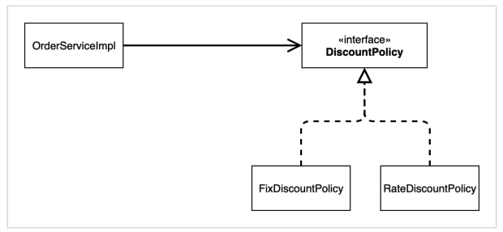

# 02. 새로운 할인 정책과 문제점

할인 정책을 변경하려면 클라이언트인 `OrderServiceImpl` 코드를 고쳐야 한다.

``` java
public class OrderServiceImpl implements OrderService{

    // private final DiscountPolicy discountPolicy = new FixDiscountPolicy();
    private final DiscountPolicy discountPolicy = new RateDiscountPolicy();
  
}
```


역할과 구현을 분리했고, 다형성을 활용하여 인터페이스과 구현 객체도 분리했다.

하지만 아래와 같은 문제가 남는다.

* 클라이언트(OrderServiceImpl)는 추상(DiscountPolicy) 뿐만 아니라 구현 클래스(FixDiscountPolicy)에도 의존을 하고 있다. -> DIP 위배
* 기능을 확장해서 변경하면 클라이언트 코드에 영향을 준다. -> OCP 위배


### 어떻게 문제를 해결할 수 있을까

인터페이스에만 의존하도록 설계를 변경한다.



``` java
public class OrderServiceImpl implements OrderService{
    private DiscountPolicy discountPolicy;
}
```


하지만 구현체가 없기 때문에 코드가 실행되지 않는다.

실행하면 Null Point Exception이 발생한다.

이를 해결하기 위해서는 누군가가 클라이언트인 OrderServiceImpl에 DiscountPolicy의 구현 객체를 대신 생성하고 주입해주어야 한다.
