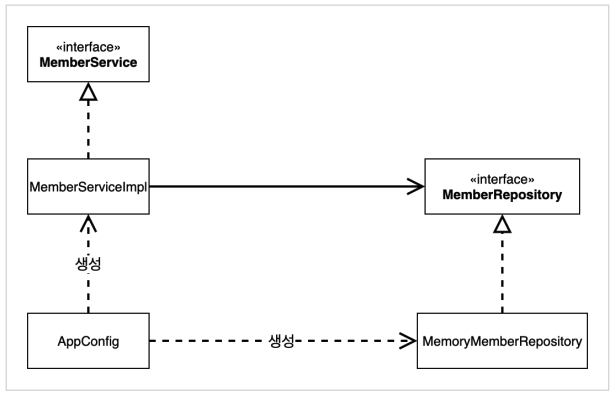

# 03. 관심사의 분리

### 공연의 예

애플리케이션을 하나의 공연이라 생각해보자. 

공연 : 애플리케이션

배역 : 인터페이스

배우 : 구현체

배역에 맞는 배우를 선택하는 것은 배우들이 할 일이 아니다.

이전 코드에서 OrderServiceImpl이 어떤 DiscountPolicy를 사용할 지 선택하는 것은 배우가 상대 배우를 정하는 것과 유사하다.

이러면 배우는 공연도 해야하고 상대 배우도 정해야하는 다양한 책임을 지게 된다.

따라서 배우를 섭외하는 책임만을 가진 공연 기획자가 필요하다.


### AppConfig 등장

애플리케이션의 전체 동작 방식을 구성(config)하기 위해 구현 객체를 생성하고 연결하는 책임을 가지는 별도의 설정 클래스를 만든다.

core/src/main/java/hello/core/AppConfig.java

```java
package hello.core;

import hello.core.discount.FixDiscountPolicy;
import hello.core.member.MemberService;
import hello.core.member.MemberServiceImpl;
import hello.core.member.MemoryMemberRepository;
import hello.core.order.OrderService;
import hello.core.order.OrderServiceImpl;

public class AppConfig {

    public MemberService memberService() {
        return new MemberServiceImpl(new MemoryMemberRepository());
    }


    public OrderService orderService() {
        return new OrderServiceImpl(
                new MemoryMemberRepository(),
                new FixDiscountPolicy());
    }
}
```


### MemberServiceImpl 생성자 주입

```java
package hello.core.member;

public class MemberServiceImpl implements MemberService {

    private final MemberRepository memberRepository;

    public MemberServiceImpl(MemberRepository memberRepository) {
        this.memberRepository = memberRepository;
    }

    @Override
    public void join(Member member) {
        memberRepository.save(member);
    }

    @Override
    public Member findMember(Long memberId) {
        return memberRepository.findById(memberId);
    }

}
```



* DIP : MemberServiceImpl은 MemberRepository인 추상에만 의존하고 구체 클래스는 몰라도 된다.
* 관심사의 분리 : 객체를 생성하고 연결하는 역할과 실행하는 역할이 명확히 분리된다.
* DI : 클라이언트 입장에서는 의존 관계가 외부에서 주입된다. 따라서 이를 Dependency Injection, 의존성 주입이라고 한다.


### OrderServiceImpl 생성자 주입

```java
package hello.core.order;

import hello.core.discount.DiscountPolicy;
import hello.core.member.Member;
import hello.core.member.MemberRepository;

public class OrderServiceImpl implements OrderService{

    private final MemberRepository memberRepository;
    private final DiscountPolicy discountPolicy;

    public OrderServiceImpl(MemberRepository MemberRepository, DiscountPolicy discountPolicy) {
        this.memberRepository = MemberRepository;
        this.discountPolicy = discountPolicy;
    }

    @Override
    public Order createOrder(Long memberId, String itemName, int itemPrice) {
        Member member = memberRepository.findById(memberId);
        int discountPrice = discountPolicy.discount(member, itemPrice);

        return new Order(memberId, itemName, itemPrice, discountPrice);
    }
}
```


### 테스트 코드 변경

``` java
public class MemberServiceTest {

    MemberService memberService;

    @BeforeEach
    public void beforeEach() {
        AppConfig appConfig = new AppConfig();
        memberService = appConfig.memberService();
    }
```

```java
public class OrderServiceTest {
    MemberService memberService;
    OrderService orderService;

    @BeforeEach
    public void beforeEach() {
        AppConfig appConfig = new AppConfig();
        memberService = appConfig.memberService();
        orderService = appConfig.orderService();
    }
}
```

