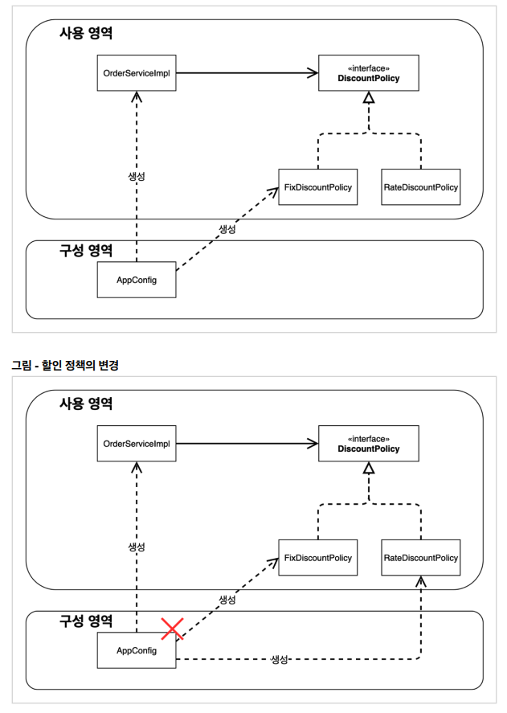

# 05. 새로운 구조와 할인 정책 적용

정액 할인 정책을 정률 할인 정책으로 변경해보자.

이를 위해서 AppConfig만 변경하면 된다.

``` java
package hello.core;

import hello.core.discount.DiscountPolicy;
import hello.core.discount.RateDiscountPolicy;
import hello.core.member.MemberRepository;
import hello.core.member.MemberService;
import hello.core.member.MemberServiceImpl;
import hello.core.member.MemoryMemberRepository;
import hello.core.order.OrderService;
import hello.core.order.OrderServiceImpl;

public class AppConfig {

    public MemberService memberService() {
        return new MemberServiceImpl(memberRepository());
    }

    private MemberRepository memberRepository() {
        return new MemoryMemberRepository();
    }

    public OrderService orderService() {
        return new OrderServiceImpl(
                memberRepository(),
                discountPolicy());
    }

    public DiscountPolicy discountPolicy() {
        //return new FixDiscountPolicy();
        return new RateDiscountPolicy();
    }
}
```


