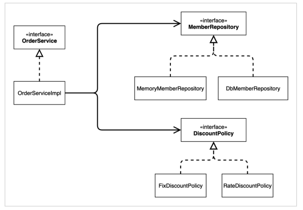

# 07. IoC, DI, 그리고 컨테이너

### 제어의 역전 IoC(Inversion of Control)

* 기존 프로그램은 클라이언트 구현 객체가 스스로 필요한 서버 구현 객체를 생성하고, 연결하고, 실행했다.
  한마디로 구현 객체가 프로그램의 제어 흐름을 스스로 조종했다.
* 반면에 AppConfig가 등장한 이후에 구현 객체는 자신의 로직을 실행하는 역할만 담당한다.
  프로그램의 제어 흐름은 이제 AppConfig가 가져간다.
  OrderServiceImpl은 필요한 인터페이스들을 호출하지만 어떤 구현 객체들이 실행될 지 모른다.
* 이렇듯 프로그램의 제어 흐름을 직접 제어하는 것이 아니라 외부에서 관리하는 것을 제어의 역전(IoC)이라 한다.

#### 프레임워크 VS 라이브러리

* 프레임워크가 내가 작성한 코드를 제어하고, 대신 실행하면 그것은 프레임워크
* 내가 작성한 코드가 직접 제어의 흐름을 담당한다면 그것은 라이브러리

### 의존관계 주입 DI(Dependency Injection)

* 의존관계는 정적인 클래스 의존 관계와 실행 시점에 결정되는 동적인 객체 의 관계 둘을 분리해서 생각해야 한다.

#### 정적인 클래스 의존관계

클래스가 사용하는 import 코드만 보고 의존관계를 쉽게 판단할 수 있다.

하지만 클래스 의존관계 만으로는 실제 어떤 객체가 주입되는지 알 수 없다.

#### 동적인 객체 인스턴스 의존 관계

애플리케이션 실행 시점에 실제 생성된 객체 인스턴스의 참조가 연결된 의존 관계다.

애플리케이션 실행 시점에 외부에서 실제 구현 객체를 생성하고 클라이언트에 전달해서 클라이언트와 서버의 실제 의존관계가 연결 되는 것을 의존관계 주입이라 한다.

### IoC 컨테이너, DI 컨테이너

AppConfig 처럼 객체를 생성하고 관리하면서 의존관계를 연결해 주는 것을 IoC 컨테이너 또는 DI 컨테이너라고 한다.

의존관계 주입에 초점을 맞추어 최근에는 주로 DI 컨테이너라 한다.
