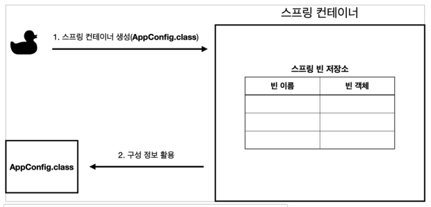
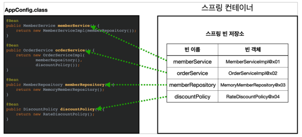
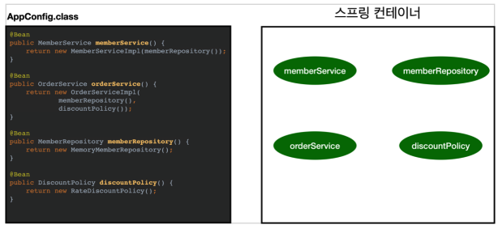
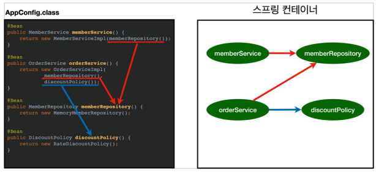

# 01. 스프링 컨테이너 생성

### 스프링 컨테이너 생성 하기

스프링 컨테이너는 아래와 같이 만들 수 있다.

```java
ApplicationContext applicationContext = new AnnotationConfigApplicationContext(AppConfig.class);
```

* `ApplicationContext` 는 스프링 컨테이너로 인터페이스이다.
* 스프링 컨테이너는 여러 방식으로 만들 수 있는데 위 방식은 애노테이션 기반의 자바 설정 클래스로 스프링 컨테이너를 만든 것으로 `AnnotationConfigApplicationContext` 은 인터페이스의 구현체이다.


### 스프링 컨테이너 생성 과정

#### 생성



* `new AnnotationConfigApplicationContext(AppConfig.class)` 할 시 위와 같은 과정이 일어난다.
* 스프링 컨테이너를 생성할 때는 구성 정보를 지정해주어야 한다.


#### 빈 등록



* 스프링 컨테이너는 파라미터로 넘어온 설정 클래스 정보를 사용해서 스프링 빈을 등록한다.
* 빈 이름은 default로 메서드 이름을 사용하며 직접 부여할 수 도 있다.
  * 직접 부여 : `@Bean(name="memberService2")`
* 빈 이름은 항상 다른 이름을 부여해야 한다. 같은 이름을 부여하면 다른 빈이 무시되거나 기존 빈을 덮어버리거나 설정에 따라 오류가 발생한다.


#### 의존관계 설정 준비




#### 의존관계 설정 완료




스프링은 빈을 생성하고 의존관계를 주입하는 단계가 나누어져 있다. 

그런데 이렇게 자바 코드로 스프링 빈을 등록하면 생성자를 호출하면서 의존관계 주입도 한 번에 처리된다.
