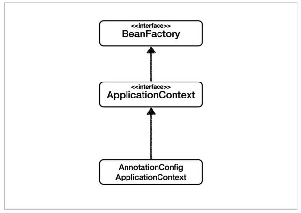
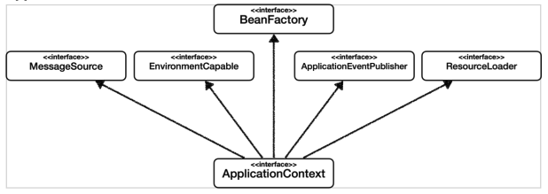

# 06. BeanFactory와 ApplicationContext

### BeanFactory와 ApplicationContext

* BeanFactory
  * 스프링 컨테이너의 최상위 인터페이스이다.
  * 스프링 빈을 관리하고 조회하는 역할을 담당한다.
  * `getBean()` 제공한다.
* ApplicationContext
  * BeanFactory 기능을 모두 상속받아서 제공한다.

### ApplicationContext

`ApplicationContext` 은 BeanFactory 외에도 여러 interface로 부터 상속을 받는다.

* 국제화 기능 
* 환경변수
* 애플리케이션 이벤트 
* 편리한 리소스 조회

따라서 BeanFactory를 직접 사용하는 일은 거의 없고 부가기능이 포함된 ApplicationContext을 사용한다.

둘 모두 스프링 컨테이너라고 불러도 무방하다.
