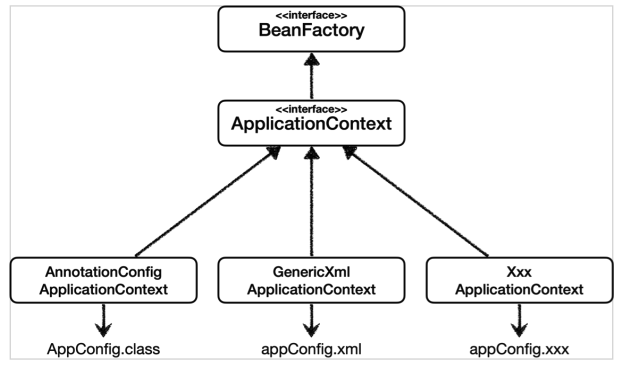

# 07. 다양한 설정 형식 지원 - 자바코드, XML

스프링 컨테이너는 다양한 형식의 설정 정보를 받아드릴 수 있게 유연하게 설계되어 있다.




### 애노테이션 기반 자바 코드 설정 사용

지금까지 봐왔던 방식으로 AnnotationConfigApplicationContext 클래스를 사용하여 자바 코드로 된 설정 정보를 넘기면 된다.

```java
new AnnotationConfigApplicationContext(AppConfig.class) 
```


### XML 설정 사용

* 최근에는 스프링 부트를 많이 사용하면서 XML기반의 설정은 잘 사용하지 않는다.
* 많은 레거시 프로젝트 들이 XML로 되어 있다.
* 컴파일 없이 빈 설정 정보를 변경할 수 있는 장점이 있다.


core/src/main/resources/appConfig.xml

```xml
<?xml version="1.0" encoding="UTF-8"?>
<beans xmlns="http://www.springframework.org/schema/beans"
       xmlns:xsi="http://www.w3.org/2001/XMLSchema-instance"
       xsi:schemaLocation="http://www.springframework.org/schema/beans http://www.springframework.org/schema/beans/spring-beans.xsd">
    <bean id="memberService" class="hello.core.member.MemberServiceImpl">
        <constructor-arg name="memberRepository" ref="memberRepository" />
    </bean>
    <bean id="memberRepository" class="hello.core.member.MemoryMemberRepository" />
    <bean id="orderService" class="hello.core.order.OrderServiceImpl">
        <constructor-arg name="memberRepository" ref="memberRepository" />
        <constructor-arg name="discountPolicy" ref="discountPolicy" />
    </bean>
    <bean id="discountPolicy" class="hello.core.discount.RateDiscountPolicy" />
</beans>
```


core/src/test/java/hello/core/xml/xmlAppContext.java

```java
package hello.core.xml;

import hello.core.member.MemberService;
import org.junit.jupiter.api.Test;
import org.springframework.context.ApplicationContext;
import org.springframework.context.support.GenericXmlApplicationContext;

import static org.assertj.core.api.Assertions.assertThat;

public class xmlAppContext {
    @Test
    void xmlAppContext() {
        ApplicationContext ac = new GenericXmlApplicationContext("appConfig.xml");

        MemberService memberService = ac.getBean("memberService", MemberService.class);
        assertThat(memberService).isInstanceOf(MemberService.class);
    }
}
```

