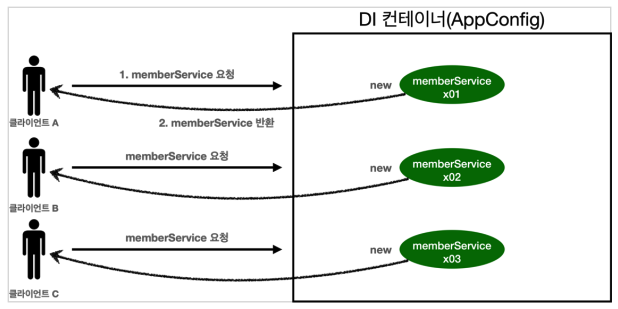

# 01. 웹 애플리케이션과 싱글톤

### 배경

대부분의 스프링 애플리케이션은 웹 애플리케이션이다. 웹 애플리케이션은 보통 여러 고객이 동시에 요청을 한다.




### 스프링 없는 순수한 DI 컨테이너 테스트

core/singleton/SingletonTest.java

``` java
package hello.core.singleton;

import hello.core.AppConfig;
import hello.core.member.MemberService;
import org.junit.jupiter.api.DisplayName;
import org.junit.jupiter.api.Test;

import static org.assertj.core.api.Assertions.assertThat;

public class SingletonTest {
    @Test
    @DisplayName("스프링 없는 순수한 DI 컨테이너")
    void pureContainer() {
        AppConfig appConfig = new AppConfig();

        MemberService memberService1 = appConfig.memberService();
        MemberService memberService2 = appConfig.memberService();

        assertThat(memberService1).isNotSameAs(memberService2);
    }
}
```

* 우리가 만든 스프링 없는 순수한 DI 컨테이너인 AppConfig는 요청을 할 때마다 객체를 새로 생성하기 때문에 메모리 낭비가 심하다.
* 따라서 해당 객체가 딱 1개만 생성되고 공유하도록 설계해야 한다.
