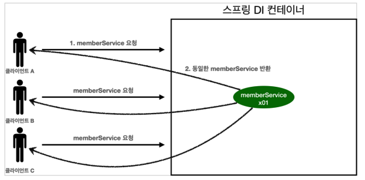

# 03. 싱글톤 컨테이너

### 싱글톤 컨테이너

스프링 컨테이너는 싱글톤 패턴의 문제점을 해결하면서 객체 인스턴스를 싱글톤(1개만 생성)으로 관리한다.

스프링 컨테이너는 싱글톤 컨테이너 역할을 한다. 이렇게 싱글톤 객체를 생성하고 관리하는 기능을 싱글톤 레지스트리라 한다.

스프링 컨테이너의 이런 기능 덕분에 싱글턴 패턴의 모든 단점을 해결하면서 객체를 싱글톤으로 유지할 수 있다.

* 싱글톤 패턴을 위한 지저분한 코드가 들어가지 않아도 된다.
* DIP, OCP, 테스트, private 생성자로 부터 자유롭게 싱글톤을 사용할 수 있다.


### 스프링 컨테이너를 사용하는 테스트 코드

``` java
@Test
@DisplayName("스프링 컨테이너과 싱글톤")
void springContainer() {
    ApplicationContext ac = new AnnotationConfigApplicationContext(AppConfig.class);

    MemberService memberService1 = ac.getBean("memberService", MemberService.class);
    MemberService memberService2 = ac.getBean("memberService", MemberService.class);

    assertThat(memberService1).isSameAs(memberService2);
}
```


### 싱글톤 컨테이너 적용 후



스프링 컨테이너 덕분에 고객의 요청이 올 때마다 객체를 생성하는 것이 아니라, 이미 만들어진 객체를 공유해서 효율적으로 재사용할 수 있다.

